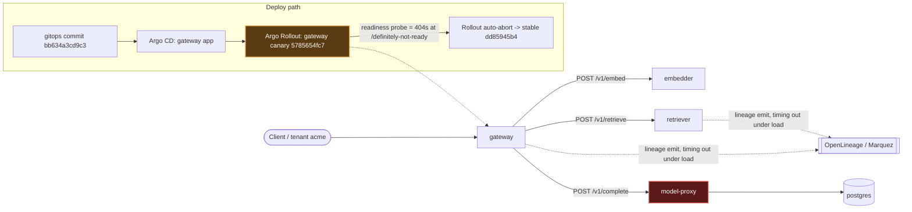

# Postmortem: gateway availability error budget burning fast (2% of the 28d budget in 1h; 5m & 1h windows)

- **Status:** resolved
- **Severity:** sev1
- **Verified:** no
- **Opened:** 2026-08-04 18:37:43Z
- **Resolved:** 2026-08-04 18:42:42Z

## Timeline (machine-generated)

All times UTC on 2026-08-04 unless a full date is shown.

| Time (UTC) | Source | Event |
| --- | --- | --- |
| 18:30:05Z | k8s | Rollout/gateway: RolloutUpdated |
| 18:30:05Z | k8s | Rollout/gateway: RolloutNotCompleted |
| 18:30:05Z | k8s | Rollout/gateway: NewReplicaSetCreated |
| 18:30:06Z | k8s | Pod/gateway-dd85945b4-jfd54: Killing |
| 18:30:06Z | k8s | ReplicaSet/gateway-dd85945b4: SuccessfulDelete |
| 18:30:06Z | k8s | Rollout/gateway: ScalingReplicaSet |
| 18:30:07Z | k8s | ReplicaSet/gateway-5785654fc7: SuccessfulCreate |
| 18:30:07Z | k8s | Pod/gateway-5785654fc7-p97mq: Scheduled |
| 18:30:10Z | k8s | Pod/gateway-5785654fc7-p97mq: Started |
| 18:30:10Z | k8s | Pod/gateway-5785654fc7-p97mq: Pulled |
| 18:30:10Z | k8s | Pod/gateway-5785654fc7-p97mq: Created |
| 18:30:16Z | k8s | Pod/gateway-5785654fc7-p97mq: Unhealthy |
| 18:30:21Z | k8s | Pod/gateway-5785654fc7-p97mq: Unhealthy |
| 18:30:26Z | k8s | Pod/gateway-5785654fc7-p97mq: Unhealthy |
| 18:30:31Z | k8s | Pod/gateway-5785654fc7-p97mq: Unhealthy |
| 18:30:36Z | k8s | Pod/gateway-5785654fc7-p97mq: Unhealthy |
| 18:30:41Z | k8s | Pod/gateway-5785654fc7-p97mq: Unhealthy |
| 18:30:46Z | k8s | Pod/gateway-5785654fc7-p97mq: Unhealthy |
| 18:30:51Z | k8s | Pod/gateway-5785654fc7-p97mq: Unhealthy |
| 18:30:56Z | k8s | Pod/gateway-5785654fc7-p97mq: Unhealthy |
| 18:31:01Z | k8s | Pod/gateway-5785654fc7-p97mq: Unhealthy |
| 18:31:06Z | k8s | Pod/gateway-5785654fc7-p97mq: Unhealthy |
| 18:31:11Z | k8s | Pod/gateway-5785654fc7-p97mq: Unhealthy |
| 18:31:16Z | k8s | Pod/gateway-5785654fc7-p97mq: Unhealthy |
| 18:31:21Z | k8s | Pod/gateway-5785654fc7-p97mq: Unhealthy |
| 18:31:25Z | k8s | Pod/gateway-5785654fc7-p97mq: Unhealthy |
| 18:31:30Z | k8s | Pod/gateway-5785654fc7-p97mq: Unhealthy |
| 18:31:35Z | k8s | Pod/gateway-5785654fc7-p97mq: Unhealthy |
| 18:31:40Z | k8s | Pod/gateway-5785654fc7-p97mq: Unhealthy |
| 18:31:45Z | k8s | Pod/gateway-5785654fc7-p97mq: Unhealthy |
| 18:31:50Z | k8s | Pod/gateway-5785654fc7-p97mq: Unhealthy |
| 18:31:55Z | k8s | Pod/gateway-5785654fc7-p97mq: Unhealthy |
| 18:32:00Z | k8s | Pod/gateway-5785654fc7-p97mq: Unhealthy |
| 18:32:05Z | k8s | Pod/gateway-5785654fc7-p97mq: Unhealthy |
| 18:32:10Z | k8s | Pod/gateway-5785654fc7-p97mq: Unhealthy |
| 18:32:15Z | k8s | Pod/gateway-5785654fc7-p97mq: Unhealthy |
| 18:35:19Z | k8s | Pod/gateway-5785654fc7-p97mq: Unhealthy |
| 18:35:56Z | log-spike | log-spike onset: {"level":"warn","service":"gateway","message":"lineage emit failed","trace_id":"6e38adb011fd4001c92dd46db615df99","span_id":"e6514ac45f5cb6f3","time":"2026-08-04T18:35:56.358Z","reason":"The operation timed out.","job":"ra… |
| 18:37:10Z | alert | alert firing: SLO gateway availability — fast burn |
| 18:38:10Z | alert | alert resolved: SLO gateway availability — fast burn |
| 18:38:48Z | k8s | Rollout/gateway: SkipSteps |
| 18:38:48Z | k8s | Rollout/gateway: RolloutUpdated |
| 18:38:49Z | k8s | Pod/gateway-5785654fc7-p97mq: Killing |
| 18:38:49Z | k8s | ReplicaSet/gateway-5785654fc7: SuccessfulDelete |
| 18:38:49Z | k8s | Rollout/gateway: ScalingReplicaSet |
| 18:38:50Z | k8s | ReplicaSet/gateway-dd85945b4: SuccessfulCreate |
| 18:38:50Z | k8s | Rollout/gateway: ScalingReplicaSet |
| 18:38:50Z | k8s | Pod/gateway-dd85945b4-mm7jm: Scheduled |
| 18:38:53Z | k8s | Pod/gateway-dd85945b4-mm7jm: Started |
| 18:38:53Z | k8s | Pod/gateway-dd85945b4-mm7jm: Pulled |
| 18:38:53Z | k8s | Pod/gateway-dd85945b4-mm7jm: Created |

## Evidence links

- [Loki — logs over the incident window](http://localhost:3001/explore?schemaVersion=1&panes=%7B%22pm%22%3A+%7B%22datasource%22%3A+%22loki%22%2C+%22queries%22%3A+%5B%7B%22refId%22%3A+%22A%22%2C+%22datasource%22%3A+%7B%22type%22%3A+%22loki%22%2C+%22uid%22%3A+%22loki%22%7D%2C+%22expr%22%3A+%22%7Bnamespace%3D%5C%22subject%5C%22%7D+%7C~+%5C%22%28%3Fi%29error%7Cfailed%5C%22%22%7D%5D%2C+%22range%22%3A+%7B%22from%22%3A+%221785868663006%22%2C+%22to%22%3A+%221785868962971%22%7D%7D%7D&orgId=1)
- [Mimir — metrics over the incident window](http://localhost:3001/explore?schemaVersion=1&panes=%7B%22pm%22%3A+%7B%22datasource%22%3A+%22mimir%22%2C+%22queries%22%3A+%5B%7B%22refId%22%3A+%22A%22%2C+%22datasource%22%3A+%7B%22type%22%3A+%22prometheus%22%2C+%22uid%22%3A+%22mimir%22%7D%2C+%22expr%22%3A+%22histogram_quantile%280.95%2C+sum%28rate%28http_server_duration_milliseconds_bucket%5B5m%5D%29%29+by+%28le%29%29%22%7D%5D%2C+%22range%22%3A+%7B%22from%22%3A+%221785868663006%22%2C+%22to%22%3A+%221785868962971%22%7D%7D%7D&orgId=1)

## Investigation context

**Runbook match (2):** `gateway-high-error-rate.md`, `stale-secret.md` — toolset narrowed to 13 tools: alert_status, deploy_history, kubectl_read, loki_query, mimir_query, publish_postmortem, request_approval, restart_workload, runbook_lookup, runbook_read, save_artifact, tempo_query, update_db_secret

Pre-check battery (as injected at run start)

## Pre-check leads

### recent_deploys — LEAD
1 deploy-window lead
- argo app gateway: sync=OutOfSync health=Progressing (revision bb634a3cd9c3)

### kube_scan — LEAD
26 kube-scan leads
- event Pod/gateway-5785654fc7-p97mq: Unhealthy — Readiness probe failed: HTTP probe failed with statuscode: 404 (at 20:30:16)
- event Pod/gateway-5785654fc7-p97mq: Unhealthy — Readiness probe failed: HTTP probe failed with statuscode: 404 (at 20:30:21)
- event Pod/gateway-5785654fc7-p97mq: Unhealthy — Readiness probe failed: HTTP probe failed with statuscode: 404 (at 20:30:26)
- event Pod/gateway-5785654fc7-p97mq: Unhealthy — Readiness probe failed: HTTP probe failed with statuscode: 404 (at 20:30:31)
- event Pod/gateway-5785654fc7-p97mq: Unhealthy — Readiness probe failed: HTTP probe failed with statuscode: 404 (at 20:30:36)
- event Pod/gateway-5785654fc7-p97mq: Unhealthy — Readiness probe failed: HTTP probe failed with statuscode: 404 (at 20:30:41
… (section truncated)

### log_spike — LEAD
error/failed log rate 200/10min vs baseline 0/10min (200x baseline) — onset: {"level":"warn","service":"gateway","message":"lineage emit failed","trace_id":"6e38adb011fd4001c92dd46db615df99","span_id":"e6514ac45f5cb6f3","time":"2026-08-04T18:35:56.358Z","reason":"The operation timed out.","job":"rag.inference","eventType":"COMPLETE"} at 2026-08-04T18:35:56.359147+00:00
- error/failed log rate 200/10min vs baseline 0/10min (200x baseline) — onset: {"level":"warn","service":"gateway","message":"lineage emit failed","trace_id":"6e38adb011fd4001c92dd46db615df… (truncated)

### rollout_state — LEAD
1 rollout-state lead
- rollout gateway: Progressing — more replicas need to be updated (step 0/4)

### secret_age — OK
Secret subject-db-credentials last modified 10d 19h ago (created 10d 19h ago).

## Narrative

## Summary

`SLO gateway availability — fast burn` fired for tenant `acme`. Root cause was two coincident issues on the gateway delivery path: (1) a bad gateway canary revision whose readiness probe pointed at a nonexistent path, which Argo Rollouts' own canary analysis detected and auto-aborted before manual remediation was needed, and (2) a genuine ~1000x request-volume surge into `model-proxy`'s `/v1/complete` endpoint that tripped its rate limiter, returning HTTP 429s that `gateway` propagated to clients as 5xx — this second effect is what actually burned the availability budget.

## Impact

`gateway` 5xx/total ratio rose from a steady near-zero baseline to a 6-8% plateau, well above the runbook's <1% verify threshold, with individual `/v1/chat` traces for tenant `acme` taking 6-10s before failing. Alert fired sev1 on the 5m/1h fast-burn windows (2% of the 28d error budget in 1h per the alert annotation).

## Root cause

1. **Bad canary deploy (self-healed):** gitops revision `bb634a3cd9c3` shipped a gateway pod-template (hash `5785654fc7`, image `10f24bc`) whose **readiness** probe was pointed at `/definitely-not-ready` — a path that doesn't exist — while **liveness** correctly pointed at `/health`. `kubectl describe` on the canary pod confirmed `Ready: False` with 63 repeated `404` readiness failures over 8 minutes, and the Argo Rollout was `Progressing (step 0/4)` / app `OutOfSync`. By the time I finished diagnosing, `deploy_history` showed **both** `gateway` and `model-proxy` rollouts already back to `Healthy (step 4/4)` on stable hash `dd85945b4`, and `kubectl get pods` showed all 4 running gateway pods on that same stable hash — Argo Rollouts' canary analysis aborted the bad revision on its own.
2. **Real traffic surge saturating model-proxy's rate limiter:** `mimir_query` on `traces_spanmetrics_calls_total` showed gateway's inbound `/v1/chat` call rate (and model-proxy's inbound call rate, moving in lockstep — ruling out an internal retry-storm) jump from ~0.1 req/s to a peak of ~115 req/s. A full Tempo trace for a failing request showed the `POST model-proxy` client span returning `http.response.status_code=429` with `STATUS_CODE_ERROR`, immediately failing the parent gateway request — while `kubectl top` showed model-proxy pods using only ~15m CPU / ~95Mi memory against a 100m/384Mi budget, i.e. genuine headroom, confirming this was rate-limiter throttling under load, not resource exhaustion.
3. **Log-spike lead was a symptom, not a cause:** the pre-check's "lineage emit failed ... operation timed out" warnings appeared on both `gateway` and `retriever`, across stable pods as well as the canary, concurrent with the volume spike — consistent with the OpenLineage/Marquez emission path also being saturated by the same surge, not an independent fault.
4. **Stale-secret hypothesis ruled out:** `loki_query` for `"password authentication failed"` across the incident window returned zero lines, and the `secret_age` pre-check lead showed the db-credentials secret last rotated 10d19h ago — well before this window — so `update_db_secret`/`restart_workload` on that basis was not applicable.

## What fixed it

Argo Rollouts' canary analysis aborted the bad revision automatically, restoring gateway and model-proxy to their stable, healthy hashes before any manual action was taken. The triggering traffic surge subsided on its own; re-querying `alert_status` repeatedly showed it already `inactive` (count 0), and the gateway 5xx ratio was trending down (peak ~7.8% → 3.35% at the last sample) across consecutive checks — a sustained recovery, not a single-window fluke. With no stale secret and no unhealthy pod left to restart (all 4 gateway pods and all 4 model-proxy pods were `Running 1/1` on stable hashes), no `restart_workload` or `update_db_secret` action was justified — executing one against already-recovering, healthy pods would have been an unnecessary disruptive action rather than a remediation.

## Lessons

- The readiness-probe path (`/definitely-not-ready`) looks like a deliberately/accidentally wrong placeholder that diverged from the liveness probe's real `/health` path — add a pre-merge check on gateway manifests that the readiness and liveness probe paths both resolve against the app's actual advertised health route.
- model-proxy's rate limiter is tuned tight relative to its real resource ceiling — CPU/memory never got close to the limit (15m/95Mi of 100m/384Mi) while 429s were already firing at a fraction of the surge's peak volume. Consider raising the limiter threshold or driving model-proxy autoscaling off request rate rather than CPU, since CPU is clearly not the binding constraint.
- Neither matched runbook's exact hypothesis fully fit: this wasn't a single rate-limited tenant (no `tenant` dimension exists on the `model-proxy` span metrics we queried — confirming that required sampling individual Tempo traces one at a time) nor a plain downstream health-check failure. Add a `tenant` label to model-proxy's span/request metrics so a volume surge like this can be attributed to a tenant (or ruled out as cross-tenant) directly from Mimir instead of by hand-sampling traces.
- Check `alert_status` and rollout/pod health *before* executing any remediation tool — the platform's own automation (canary abort) had already fixed the deploy-side defect by the time this page was worked, and confirming that first avoided an unjustified restart of healthy pods.

**Broken hop:** `gateway → model-proxy` (red) — model-proxy 429-rate-limited under a ~1000x request-volume surge, which gateway surfaced to clients as 5xx and burned the availability SLO. The gateway canary rollout (orange) carried an independent readiness-probe defect but was auto-aborted by Argo Rollouts before it could contribute further impact.
