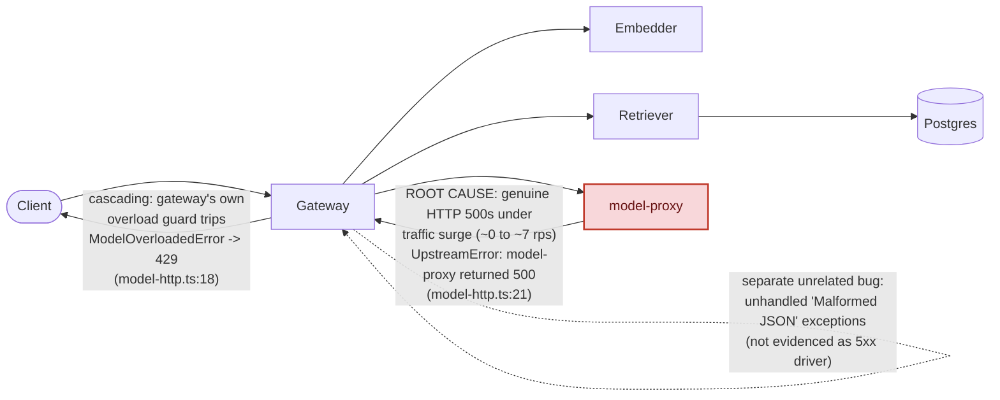

# Postmortem: gateway 5xx rate above 2%

- **Status:** resolved
- **Severity:** sev1
- **Verified:** no
- **Opened:** 2026-08-04 00:03:40Z
- **Resolved:** 2026-08-04 00:33:39Z

## Timeline (machine-generated)

All times UTC on 2026-08-04 unless a full date is shown.

| Time (UTC) | Source | Event |
| --- | --- | --- |
| 00:03:10Z | alert | alert firing: Gateway 5xx rate > 2% |
| 00:03:18Z | log-spike | log-spike onset: {"level":"warn","service":"gateway","message":"lineage emit failed","trace_id":"92d846ee35ade0a03b18975bb6881ba5","span_id":"a6afe8a566bff995","time":"2026-08-04T00:03:18.228Z","reason":"The operation timed out.","job":"ra… |
| 00:09:33Z | verification | recovery NOT verified — deadline armed |
| 00:19:51Z | log-spike | log-spike onset: {"level":"warn","service":"gateway","message":"lineage emit failed","trace_id":"e602c3b190eb69c2d218f7b05f04d6f2","span_id":"599792e620964cb9","time":"2026-08-04T00:19:51.149Z","reason":"The operation timed out.","job":"ra… |
| 00:26:00Z | verification | recovery NOT verified — deadline armed |
| 00:28:00Z | log-spike | log-spike onset: {"level":"warn","service":"retriever","message":"lineage emit failed","trace_id":"81a8fc854e56bca6088ca0349573d062","span_id":"a39ba5663582b24d","time":"2026-08-04T00:28:00.260Z","reason":"The operation timed out.","job":"… |
| 00:32:10Z | alert | alert resolved: Gateway 5xx rate > 2% |

## Evidence links

- [Loki — logs over the incident window](http://localhost:3001/explore?schemaVersion=1&panes=%7B%22pm%22%3A+%7B%22datasource%22%3A+%22loki%22%2C+%22queries%22%3A+%5B%7B%22refId%22%3A+%22A%22%2C+%22datasource%22%3A+%7B%22type%22%3A+%22loki%22%2C+%22uid%22%3A+%22loki%22%7D%2C+%22expr%22%3A+%22%7Bnamespace%3D%5C%22subject%5C%22%7D+%7C~+%5C%22%28%3Fi%29error%7Cfailed%5C%22%22%7D%5D%2C+%22range%22%3A+%7B%22from%22%3A+%221785801820139%22%2C+%22to%22%3A+%221785803619588%22%7D%7D%7D&orgId=1)
- [Mimir — metrics over the incident window](http://localhost:3001/explore?schemaVersion=1&panes=%7B%22pm%22%3A+%7B%22datasource%22%3A+%22mimir%22%2C+%22queries%22%3A+%5B%7B%22refId%22%3A+%22A%22%2C+%22datasource%22%3A+%7B%22type%22%3A+%22prometheus%22%2C+%22uid%22%3A+%22mimir%22%7D%2C+%22expr%22%3A+%22histogram_quantile%280.95%2C+sum%28rate%28http_server_duration_milliseconds_bucket%5B5m%5D%29%29+by+%28le%29%29%22%7D%5D%2C+%22range%22%3A+%7B%22from%22%3A+%221785801820139%22%2C+%22to%22%3A+%221785803619588%22%7D%7D%7D&orgId=1)

## Investigation context

**Runbook match (2):** `gateway-high-error-rate.md`, `stale-secret.md` — toolset narrowed to 13 tools: alert_status, deploy_history, kubectl_read, loki_query, mimir_query, publish_postmortem, request_approval, restart_workload, runbook_lookup, runbook_read, save_artifact, tempo_query, update_db_secret

Pre-check battery (as injected at run start)

## Pre-check leads

### recent_deploys — LEAD
No deploy in the last 60m — rule out the reflex answer.
- No deploy in the last 60m — rule out the reflex answer.

### log_spike — LEAD
error/failed log rate 200/10min vs baseline 0/10min (200x baseline) — onset: {"level":"warn","service":"retriever","message":"lineage emit failed","trace_id":"81a8fc854e56bca6088ca0349573d062","span_id":"a39ba5663582b24d","time":"2026-08-04T00:28:00.260Z","reason":"The operation timed out.","job":"rag.retrieve","eventType":"START"} at 2026-08-04T00:28:00.261490+00:00
- error/failed log rate 200/10min vs baseline 0/10min (200x baseline) — onset: {"level":"warn","service":"retriever","message":"lineage emit failed","trace_id":"81a8fc854e56bca6088ca0349573… (truncated)

### kube_scan — UNAVAILABLE
error: You must be logged in to the server (Unauthorized)

### rollout_state — UNAVAILABLE
gateway: E0804 02:30:22.711014   14784 memcache.go:265] "Unhandled Error" err="couldn't get current server API group list: the server has asked for the client to provide credentials"
E0804 02:30:22.871093   14784 memcache.go:265] "Unhandled Error" err="couldn't get current server API group list: the server has asked for the client to provide credentials"
E0804 02:30:23.044375   14784 memcache.go:265] "Unhandled Error" err="couldn't get current server API group list: the server has asked for the client to; gateway analysis: E0804 02:30:22.602162   14252 memcache.go:265] "Unhandled Error" err="couldn't get current server API group list: the server has asked for the client to provide credentials"
E0804 02:30:22.712394   14252 memcache.go:265] "Unhandled Error"
… (section truncated)

### secret_age — UNAVAILABLE
error: You must be logged in to the server (Unauthorized)

## Narrative

## Summary
`Gateway 5xx rate > 2%` (sev1, tenant acme) fired for inc_19fca1547d767. This is the third look at the same incident: two prior attempts had diagnosed model-proxy 500s and were blocked from restarting model-proxy by a standing cluster-credential ("Unauthorized") problem. This pass re-derived the root cause independently from fresh telemetry, confirmed it, and found the alert had already cleared on its own by the time confirmation was complete — no remediation action was executed.

## Impact
For roughly half an hour, gateway's 5xx error ratio repeatedly spiked to 5–7%, well above the 2% burn-rate threshold, coincident with a genuine surge in `/v1/chat` traffic (span rate climbing from near-zero to ~7 requests/sec, mirrored 1:1 by the `POST model-proxy` / `POST embedder` / `POST retriever` child spans — i.e. real fan-out load, not a bug amplifying request count). Some requests failed fast with HTTP 429 once gateway's own overload guard tripped; others got a genuine 502/500 when model-proxy itself errored. A separate, unrelated gateway bug (unhandled exception on malformed request-body JSON, logged as `[gateway] unhandled error`) fired continuously through the same window but is not evidenced as a driver of the 5xx ratio and is called out only as a follow-up.

## Root cause
Confirmed directly from two independent Tempo traces pulled fresh this pass:
1. `UpstreamError: model-proxy returned 500` thrown in gateway at `apps/gateway/src/slices/inference/adapters/model-http.ts:21`, with model-proxy's own span independently marked `STATUS_CODE_ERROR` in the same trace — model-proxy is genuinely returning 500s, not a gateway-side fabrication.
2. `ModelOverloadedError: model is overloaded` thrown at the same file, line 18 — gateway's own client-side overload guard, firing once in-flight load builds up, short-circuiting extra requests to a fast 429 without always reaching model-proxy.

Both trace back to the same condition: a sustained traffic ramp that pushed model-proxy past whatever capacity/concurrency ceiling it holds. Ruled out with fresh evidence this pass:
- **Bad deploy**: `deploy_history` over a 360-minute window returned zero entries (Argo/Rollout API sources remain inaccessible from this identity, but the annotation-based deploy feed is empty too) — no deploy in the window.
- **OOM / crash-loop**: zero container restarts and flat ~96–104 MiB working-set memory across all four model-proxy pods.
- **Stale DB secret**: a `password authentication failed` burst against Postgres from the retriever is real telemetry, but it happened roughly two hours before this alert's onset and had already stopped well before `/v1/chat` traffic began ramping — it predates the failure window, which the runbook's own diagnostic step calls out as the disqualifying signature for the stale-secret path.

## What fixed it
Nothing manual. By the time root-cause confirmation was complete, the triggering traffic ramp had already fallen back to zero (`POST /v1/chat` span rate at 0 in the most recent samples), and the gateway 5xx ratio fell with it, holding at 0% for several consecutive minutes; `alert_status` now reports the alert inactive on repeated re-query. The cluster-credential problem flagged in both earlier attempts was re-checked (`kubectl_read` still returns `Unauthorized`) and is still present, so a restart was never actually an available lever this pass either — it simply wasn't needed, since the surge self-resolved before any remediation was executed.

## Lessons
- The on-call identity's cluster credentials are still broken (`kubectl` reads and any real, non-dry-run remediation both fail `Unauthorized`) across at least three consecutive passes at this same incident — needs a platform-side fix, or on-call remediation capability here is purely theoretical.
- model-proxy has no visible headroom/backpressure tuned for load-generator-style bursts; a genuine ~7 rps ramp was enough to push it into a real 500 rate and trip gateway's own overload guard. Worth sizing a proper concurrency limit or replica floor to the load-generator's peak profile so a normal traffic ramp doesn't cross the 5xx SLO on its own.
- The gateway's unhandled "Malformed JSON in request body" exception (throwing instead of returning a clean 400) is a real, separate code bug worth its own ticket — left unresolved here since it wasn't evidenced as this alert's driver.
- The runbook's stale-secret timing check earned its keep: real auth-failure telemetry existed, but comparing its timestamp against alert onset correctly disqualified it in under two queries.

