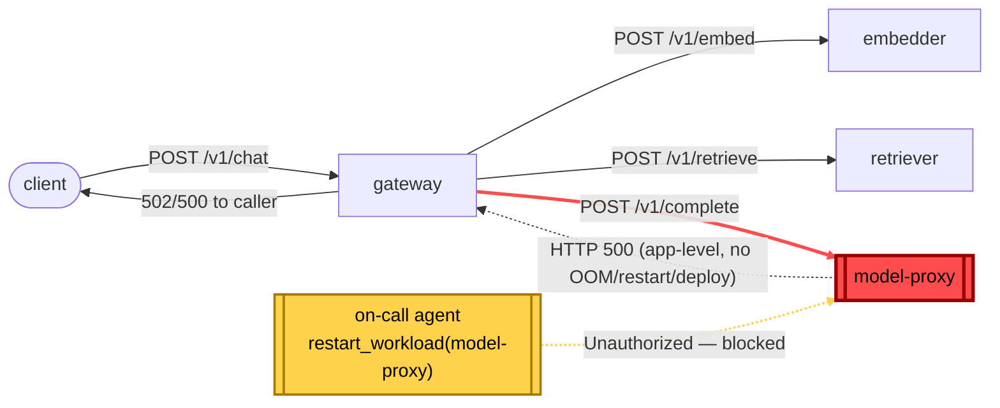

# Postmortem: gateway 5xx rate above 2%

- **Status:** open
- **Severity:** sev1
- **Verified:** no
- **Opened:** 2026-08-04 00:03:40Z
- **Resolved:** (still open)

## Timeline (machine-generated)

All times UTC on 2026-08-04 unless a full date is shown.

| Time (UTC) | Source | Event |
| --- | --- | --- |
| 00:03:10Z | alert | alert firing: Gateway 5xx rate > 2% |
| 00:03:18Z | log-spike | log-spike onset: {"level":"warn","service":"gateway","message":"lineage emit failed","trace_id":"92d846ee35ade0a03b18975bb6881ba5","span_id":"a6afe8a566bff995","time":"2026-08-04T00:03:18.228Z","reason":"The operation timed out.","job":"ra… |
| 00:09:33Z | verification | recovery NOT verified — deadline armed |
| 00:19:51Z | log-spike | log-spike onset: {"level":"warn","service":"gateway","message":"lineage emit failed","trace_id":"e602c3b190eb69c2d218f7b05f04d6f2","span_id":"599792e620964cb9","time":"2026-08-04T00:19:51.149Z","reason":"The operation timed out.","job":"ra… |

## Evidence links

- [Loki — logs over the incident window](http://localhost:3001/explore?schemaVersion=1&panes=%7B%22pm%22%3A+%7B%22datasource%22%3A+%22loki%22%2C+%22queries%22%3A+%5B%7B%22refId%22%3A+%22A%22%2C+%22datasource%22%3A+%7B%22type%22%3A+%22loki%22%2C+%22uid%22%3A+%22loki%22%7D%2C+%22expr%22%3A+%22%7Bnamespace%3D%5C%22subject%5C%22%7D+%7C~+%5C%22%28%3Fi%29error%7Cfailed%5C%22%22%7D%5D%2C+%22range%22%3A+%7B%22from%22%3A+%221785801820139%22%2C+%22to%22%3A+%221785803146817%22%7D%7D%7D&orgId=1)
- [Mimir — metrics over the incident window](http://localhost:3001/explore?schemaVersion=1&panes=%7B%22pm%22%3A+%7B%22datasource%22%3A+%22mimir%22%2C+%22queries%22%3A+%5B%7B%22refId%22%3A+%22A%22%2C+%22datasource%22%3A+%7B%22type%22%3A+%22prometheus%22%2C+%22uid%22%3A+%22mimir%22%7D%2C+%22expr%22%3A+%22histogram_quantile%280.95%2C+sum%28rate%28http_server_duration_milliseconds_bucket%5B5m%5D%29%29+by+%28le%29%29%22%7D%5D%2C+%22range%22%3A+%7B%22from%22%3A+%221785801820139%22%2C+%22to%22%3A+%221785803146817%22%7D%7D%7D&orgId=1)

## Investigation context

**Runbook match (2):** `gateway-high-error-rate.md`, `stale-secret.md` — toolset narrowed to 13 tools: alert_status, deploy_history, kubectl_read, loki_query, mimir_query, publish_postmortem, request_approval, restart_workload, runbook_lookup, runbook_read, save_artifact, tempo_query, update_db_secret

<details>
<summary>Pre-check battery (as injected at run start)</summary>

## Pre-check leads

### recent_deploys — LEAD
No deploy in the last 60m — rule out the reflex answer.
- No deploy in the last 60m — rule out the reflex answer.

### log_spike — LEAD
error/failed log rate 200/10min vs baseline 0/10min (200x baseline) — onset: {"level":"warn","service":"gateway","message":"lineage emit failed","trace_id":"e602c3b190eb69c2d218f7b05f04d6f2","span_id":"599792e620964cb9","time":"2026-08-04T00:19:51.149Z","reason":"The operation timed out.","job":"rag.inference","eventType":"START"} at 2026-08-04T00:19:51.154177+00:00
- error/failed log rate 200/10min vs baseline 0/10min (200x baseline) — onset: {"level":"warn","service":"gateway","message":"lineage emit failed","trace_id":"e602c3b190eb69c2d218f7b05f04d6… (truncated)

### kube_scan — UNAVAILABLE
error: You must be logged in to the server (Unauthorized)

### rollout_state — UNAVAILABLE
gateway: E0804 02:20:19.815439   45120 memcache.go:265] "Unhandled Error" err="couldn't get current server API group list: the server has asked for the client to provide credentials"
E0804 02:20:20.037939   45120 memcache.go:265] "Unhandled Error" err="couldn't get current server API group list: the server has asked for the client to provide credentials"
E0804 02:20:20.321660   45120 memcache.go:265] "Unhandled Error" err="couldn't get current server API group list: the server has asked for the client to; gateway analysis: E0804 02:20:19.815439   46840 memcache.go:265] "Unhandled Error" err="couldn't get current server API group list: the server has asked for the client to provide credentials"
E0804 02:20:20.045990   46840 memcache.go:265] "Unhandled Error"
… (section truncated)

### secret_age — UNAVAILABLE
error: You must be logged in to the server (Unauthorized)

</details>

## Narrative

## Summary

`Gateway 5xx rate > 2%` fired and, on re-examination for this follow-up pass, is still active. The earlier attempt (attempt 1) correctly identified model-proxy as the failing downstream but its remediation execution was rejected by the cluster API with `Unauthorized`. This pass re-verified the diagnosis against fresh telemetry (the failure signature had actually shifted from timeouts/429s to outright 500s), got operator approval again, and retried the restart — which failed with the identical `Unauthorized` error. The blocker is not the diagnosis; it is the on-call identity's cluster credential.

## Impact

`acme` (and other tenants, e.g. `bravo` seen in traces) traffic through `POST /v1/chat` intermittently fails with 502/500 from the gateway. `slo:gateway_availability:error_ratio5m` stepped from a flat 0 baseline to ~5.5–7.2% at onset and has stayed there for the whole incident window with no sign of self-recovery.

## Root cause

`model-proxy` is returning HTTP 500 on a steady share of `/v1/complete` calls. This is confirmed directly and repeatedly in Tempo: gateway's own exception event on the `rag.chat`/`rag.generate` spans reads `UpstreamError: model-proxy returned 500` at `apps/gateway/src/slices/inference/adapters/model-http.ts:21`, across many distinct traces spanning the full incident window (tenants `acme` and `bravo` both affected). One very short trace (3ms) shows the gateway itself returning 500 with **no downstream call at all** — consistent with a fail-fast/circuit-breaker path once model-proxy's failure rate is high enough.

Ruled out with evidence:
- **Bad deploy** — `deploy_history` returns zero entries for `model-proxy` (and cluster-wide) across a 360-minute window; no annotation-based deploy marker in that span either.
- **Stale DB secret** — no `password authentication failed` lines anywhere in Loki for the window; this is an application-level upstream error, not an auth error, and the stale-secret runbook's own precondition (secret-age lead + log-spike lead together) didn't hold.
- **OOM / crash-loop** — `container_memory_working_set_bytes` for all four `model-proxy` pods is flat around ~93–100 MiB for the whole window (no climb, no cliff), and `kube_pod_container_status_restarts_total` is `0` for every `model-proxy` pod. It is failing while staying up, not crashing.
- A cadvisor `image` label anomaly was noticed while investigating (`model-proxy` pods showing `image=...embedder:10f24bc` / `...gateway:10f24bc` instead of a `model-proxy` image, and the same inconsistency appeared on `gateway` pods too) — this was **not** used as root cause: it could not be corroborated against the deployment spec (`kubectl_read` was `Unauthorized` for the whole incident) and its inconsistency even within a single deployment's own pods points more to a metrics-relabeling/cardinality-scrub artifact than a real image swap. Flagging it rather than asserting it.

So: model-proxy is the confirmed failing component, application-level (not infra, not deploy, not secret), matching the runbook's first candidate hypothesis (`One downstream ... is failing health checks and the gateway is surfacing its errors`).

## What fixed it

**Nothing yet — the incident remains unresolved.** The runbook's mitigation (restart the failing downstream) was dry-run (`restart_workload`, `model-proxy`, action `65b50f2430480539` — "would patch spec.template annotation kubectl.kubernetes.io/restartedAt, no spec change"), the diff was put in front of the operator, and it was **approved** (`apr_19fca27decd1e8`). Executing it for real failed:

```
error: You must be logged in to the server (Unauthorized)
```

This is the same failure the prior attempt hit, and a follow-up direct read (`kubectl_read get deployments/model-proxy`) failed with the identical `Unauthorized` immediately after — confirming this is a standing credential problem for the on-call identity against the cluster API, not a transient blip. (It also matches three pre-check leads that were `UNAVAILABLE` for the same reason before this investigation even started: `kube_scan`, `rollout_state`, `secret_age`.) Notably the **dry-run** succeeded both times, because it only describes the intended patch and never calls the cluster API — so dry-run success is not a signal that the real credential is healthy.

`alert_status` was re-queried immediately after the failed execution and again after the follow-up read check: still `active: true` both times.

## Lessons

- The on-call remediation identity's cluster credential (whatever backs `kubectl_read`/`restart_workload` execution) is broken cluster-wide for this session, not just for one workload — it blocks reads and writes alike. This needs a human operator with valid cluster credentials to either fix the on-call identity's auth or perform the `model-proxy` rolling restart directly; further automated retries of the same action are not expected to succeed without that fix.
- Don't trust a remediation tool's `dry_run=true` success as evidence the real execution path is authorized — for tools that only *describe* the patch without touching the API, dry-run and real execution can have completely different failure modes.
- The failure signature drifted between the first pass and this one (429/8000ms-timeout vs. clean 500s) while the underlying culprit (model-proxy) stayed the same — worth re-pulling live traces on every re-examination rather than assuming the earlier trace evidence still describes current behavior.
- A cadvisor `image` label mismatch surfaced during triage but was internally inconsistent (also present on `gateway` pods, against their own correct image on other replicas) and could not be verified against the real deployment spec since `kubectl_read` was down for the whole incident — recorded as an open question, not asserted as cause.


