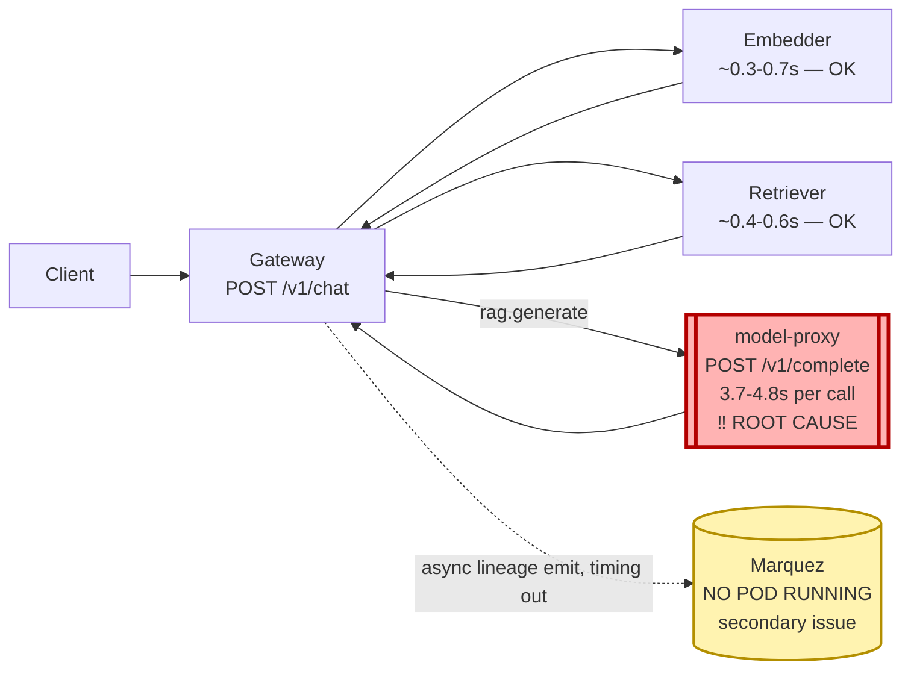

# Postmortem: gateway latency error budget burning fast (2% of the 28d budget in 1h; 5m & 1h windows)

- **Status:** open
- **Severity:** sev1
- **Verified:** no
- **Opened:** 2026-08-04 12:58:45Z
- **Resolved:** (still open)

## Timeline (machine-generated)

All times UTC on 2026-08-04 unless a full date is shown.

| Time (UTC) | Source | Event |
| --- | --- | --- |
| 12:27:06Z | k8s | ReplicaSet/retriever-8454db56c: SuccessfulCreate |
| 12:27:06Z | k8s | Deployment/retriever: ScalingReplicaSet |
| 12:27:06Z | k8s | Pod/retriever-8454db56c-q2b86: Scheduled |
| 12:27:08Z | k8s | Pod/retriever-8454db56c-q2b86: Pulled |
| 12:27:09Z | k8s | Pod/retriever-8454db56c-q2b86: Started |
| 12:27:09Z | k8s | Pod/retriever-8454db56c-q2b86: Created |
| 12:27:11Z | k8s | Pod/retriever-8454db56c-q2b86: Started |
| 12:27:11Z | k8s | Pod/retriever-8454db56c-q2b86: Pulled |
| 12:27:11Z | k8s | Pod/retriever-8454db56c-q2b86: Created |
| 12:27:13Z | k8s | Pod/retriever-8454db56c-q2b86: BackOff |
| 12:27:14Z | k8s | Pod/retriever-8454db56c-q2b86: BackOff |
| 12:27:16Z | k8s | Pod/retriever-8454db56c-q2b86: BackOff |
| 12:27:24Z | k8s | Pod/retriever-8454db56c-q2b86: Started |
| 12:27:24Z | k8s | Pod/retriever-8454db56c-q2b86: Pulled |
| 12:27:24Z | k8s | Pod/retriever-8454db56c-q2b86: Created |
| 12:27:27Z | k8s | Pod/retriever-8454db56c-q2b86: BackOff |
| 12:27:36Z | k8s | Pod/retriever-8454db56c-q2b86: BackOff |
| 12:27:47Z | k8s | Pod/retriever-8454db56c-q2b86: Started |
| 12:27:47Z | k8s | Pod/retriever-8454db56c-q2b86: Pulled |
| 12:27:47Z | k8s | Pod/retriever-8454db56c-q2b86: Created |
| 12:27:49Z | k8s | Pod/retriever-8454db56c-q2b86: BackOff |
| 12:27:50Z | k8s | Pod/retriever-8454db56c-q2b86: BackOff |
| 12:27:56Z | k8s | Pod/retriever-8454db56c-q2b86: BackOff |
| 12:28:43Z | k8s | Pod/retriever-8454db56c-q2b86: Started |
| 12:28:43Z | k8s | Pod/retriever-8454db56c-q2b86: Pulled |
| 12:28:43Z | k8s | Pod/retriever-8454db56c-q2b86: Created |
| 12:28:46Z | k8s | Pod/retriever-8454db56c-q2b86: BackOff |
| 12:28:47Z | k8s | Pod/retriever-8454db56c-q2b86: BackOff |
| 12:29:48Z | k8s | Pod/retriever-8454db56c-q2b86: BackOff |
| 12:30:10Z | k8s | Pod/retriever-8454db56c-q2b86: Started |
| 12:30:10Z | k8s | Pod/retriever-8454db56c-q2b86: Pulled |
| 12:30:10Z | k8s | Pod/retriever-8454db56c-q2b86: Created |
| 12:30:13Z | k8s | Pod/retriever-8454db56c-q2b86: BackOff |
| 12:30:16Z | k8s | Pod/retriever-8454db56c-q2b86: BackOff |
| 12:31:26Z | k8s | Pod/retriever-8454db56c-q2b86: BackOff |
| 12:32:37Z | k8s | Pod/retriever-8454db56c-q2b86: BackOff |
| 12:32:57Z | k8s | Pod/retriever-8454db56c-q2b86: Started |
| 12:32:57Z | k8s | Pod/retriever-8454db56c-q2b86: Pulled |
| 12:32:57Z | k8s | Pod/retriever-8454db56c-q2b86: Created |
| 12:32:59Z | k8s | Pod/retriever-8454db56c-q2b86: BackOff |
| 12:33:03Z | k8s | Pod/retriever-8454db56c-q2b86: BackOff |
| 12:33:06Z | k8s | Pod/retriever-8454db56c-q2b86: BackOff |
| 12:34:15Z | k8s | Pod/retriever-8454db56c-q2b86: BackOff |
| 12:35:16Z | k8s | Pod/retriever-8454db56c-q2b86: BackOff |
| 12:36:08Z | k8s | ReplicaSet/retriever-8454db56c: SuccessfulDelete |
| 12:36:08Z | k8s | Deployment/retriever: ScalingReplicaSet |
| 12:54:16Z | log-spike | log-spike onset: {"level":"warn","service":"gateway","message":"lineage emit failed","trace_id":"0333928a5754a2139018ee8c50db9b11","span_id":"1c8c31f7565bf446","time":"2026-08-04T12:54:16.877Z","reason":"The operation timed out.","job":"ra… |
| 12:58:10Z | alert | alert firing: SLO gateway latency — fast burn |

## Evidence links

- [Loki — logs over the incident window](http://localhost:3001/explore?schemaVersion=1&panes=%7B%22pm%22%3A+%7B%22datasource%22%3A+%22loki%22%2C+%22queries%22%3A+%5B%7B%22refId%22%3A+%22A%22%2C+%22datasource%22%3A+%7B%22type%22%3A+%22loki%22%2C+%22uid%22%3A+%22loki%22%7D%2C+%22expr%22%3A+%22%7Bnamespace%3D%5C%22subject%5C%22%7D+%7C~+%5C%22%28%3Fi%29error%7Cfailed%5C%22%22%7D%5D%2C+%22range%22%3A+%7B%22from%22%3A+%221785848325769%22%2C+%22to%22%3A+%221785848776656%22%7D%7D%7D&orgId=1)
- [Mimir — metrics over the incident window](http://localhost:3001/explore?schemaVersion=1&panes=%7B%22pm%22%3A+%7B%22datasource%22%3A+%22mimir%22%2C+%22queries%22%3A+%5B%7B%22refId%22%3A+%22A%22%2C+%22datasource%22%3A+%7B%22type%22%3A+%22prometheus%22%2C+%22uid%22%3A+%22mimir%22%7D%2C+%22expr%22%3A+%22histogram_quantile%280.95%2C+sum%28rate%28http_server_duration_milliseconds_bucket%5B5m%5D%29%29+by+%28le%29%29%22%7D%5D%2C+%22range%22%3A+%7B%22from%22%3A+%221785848325769%22%2C+%22to%22%3A+%221785848776656%22%7D%7D%7D&orgId=1)

## Investigation context

**Runbook match:** none — no tool narrowing applied for this alert. Available runbooks: README.md, canary-abort.md, ci-pipeline-red.md, dq-freshness-stall.md, gateway-high-error-rate.md, k8s-crashloop.md, k8s-node-failure.md, snapshot-agent-audit.md, stale-secret.md

Pre-check battery (as injected at run start)

## Pre-check leads

### recent_deploys — LEAD
No deploy in the last 60m — rule out the reflex answer.
- No deploy in the last 60m — rule out the reflex answer.

### log_spike — LEAD
error/failed log rate 200/10min vs baseline 0/10min (200x baseline) — onset: {"level":"warn","service":"gateway","message":"lineage emit failed","trace_id":"0333928a5754a2139018ee8c50db9b11","span_id":"1c8c31f7565bf446","time":"2026-08-04T12:54:16.877Z","reason":"The operation timed out.","job":"rag.inference","eventType":"START"} at 2026-08-04T12:54:16.878139+00:00
- error/failed log rate 200/10min vs baseline 0/10min (200x baseline) — onset: {"level":"warn","service":"gateway","message":"lineage emit failed","trace_id":"0333928a5754a2139018ee8c50db9b… (truncated)

### kube_scan — UNAVAILABLE
error: You must be logged in to the server (Unauthorized)

### rollout_state — UNAVAILABLE
gateway: E0804 14:58:46.865362   41620 memcache.go:265] "Unhandled Error" err="couldn't get current server API group list: the server has asked for the client to provide credentials"
E0804 14:58:46.975887   41620 memcache.go:265] "Unhandled Error" err="couldn't get current server API group list: the server has asked for the client to provide credentials"
E0804 14:58:47.136229   41620 memcache.go:265] "Unhandled Error" err="couldn't get current server API group list: the server has asked for the client to; gateway analysis: E0804 14:58:46.839725   37532 memcache.go:265] "Unhandled Error" err="couldn't get current server API group list: the server has asked for the client to provide credentials"
E0804 14:58:46.982087   37532 memcache.go:265] "Unhandled Error"
… (section truncated)

### secret_age — UNAVAILABLE
error: You must be logged in to the server (Unauthorized)

## Narrative

## Summary
`SLO gateway latency — fast burn` fired for tenant acme: the gateway latency SLI (`slo:gateway_latency:sli_ratio5m`) collapsed from a healthy ~1.0 to as low as ~0.04-0.14 across several 5-minute windows, burning ~2% of the 28-day error budget in one hour.

## Impact
`POST /v1/chat` requests routinely took 3-7 seconds end-to-end instead of sub-second, for all sampled tenants (acme, bravo, abuser). The user-visible chat completion path was severely slow, not erroring — status codes on every hop stayed 200.

## Root cause
Span-level trace analysis of numerous recent `/v1/chat` traces shows a clean, consistent breakdown per hop:
- `POST embedder` (embed): ~0.3-0.7s, healthy
- `POST retriever` (retrieve): ~0.4-0.6s, healthy
- `POST model-proxy` (`rag.generate`, `/v1/complete`): **3.7-4.8s, 80-90% of total request time, on every sampled trace**

model-proxy's own `GET /health` responds in under 1ms in the same window, and infra signals are clean: `kube_pod_container_status_restarts_total` = 0 across all 4 model-proxy pods, no CPU throttling, no memory pressure (~95-100MiB, flat), no OOM/BackOff events, and `deploy_history` shows zero deploys in the preceding 24 hours (Argo/rollout sources were unavailable throughout — see Lessons). That combination — a responsive, unrestarted, resource-idle pod whose completion handler alone is uniformly slow — isolates the fault to degraded internal state/logic on the model-proxy completion path itself, not pod health, resource starvation, or a bad deploy.

A separate retriever crash-loop (repeated `BackOff` on `retriever-8454db56c-q2b86`) was found in k8s events but it ran for about 8 minutes and self-resolved onto a fresh ReplicaSet roughly 20+ minutes before the alert's onset and before the latency SLI degraded — the timing rules it out as this incident's trigger.

A second, likely-unrelated finding: gateway and embedder are both emitting `"lineage emit failed" / "The operation timed out"` warnings at high volume, targeting OpenLineage/Marquez — and there is in fact **no Marquez pod running** in the subject namespace. This is a real breakage but the emission does not appear as a blocking span on the captured `/v1/chat` traces, so it is logged here as a distinct open issue, not the cause of the latency SLO burn.

## What fixed it
A rolling restart of `model-proxy` was chosen as the lowest-risk remediation to clear any stuck in-process state on the completion path. It was dry-run, the diff (`restartedAt` annotation patch, no spec change) was attached to an approval request, and the operator approved it. **Execution failed twice** with `Unauthorized` from the Kubernetes API — the same agent-ro credential failure already surfaced as UNAVAILABLE for `kube_scan` and `rollout_state` in the pre-check leads. The restart was never applied to the cluster. Re-querying `alert_status` afterward confirms the alert is still active. **This incident is not resolved** — diagnosis is complete and remediation is approved, but blocked on cluster authentication, not on the fix itself.

## Lessons
1. The agent-ro kubeconfig used by `kubectl_read`/`argo_app`/`rollout_status`/`restart_workload` was unauthenticated for the entire incident — restore/rotate it. This also prevented ruling Argo Rollout history in or out as a contributor.
2. No runbook matched `SLO gateway latency — fast burn`. Author one that starts responders directly at per-hop span-duration comparison (embed vs retrieve vs generate) rather than the generic high-error-rate runbook, since this failure mode has no elevated error rate at all.
3. Marquez has no running pod in the subject namespace, breaking OpenLineage emission for every request from both gateway and embedder — open as its own incident.
4. Once credentials are restored, re-dry-run and execute the model-proxy restart, then verify `slo:gateway_latency:sli_ratio5m` recovers to ~1.0 before closing this incident.

