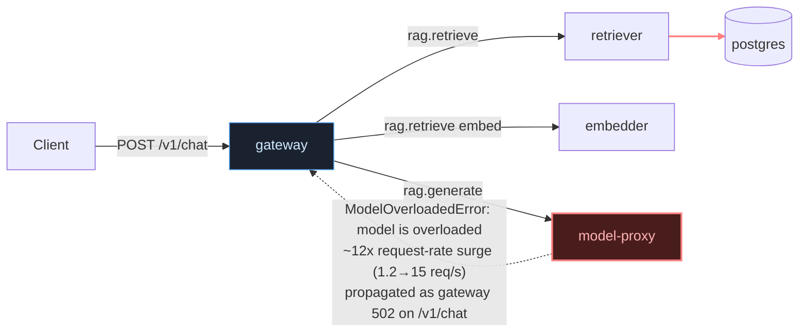

# Postmortem: gateway availability error budget burning fast (2% of the 28d budget in 1h; 5m & 1h windows)

- **Status:** resolved
- **Severity:** sev1
- **Verified:** no
- **Opened:** 2026-08-04 13:12:42Z
- **Resolved:** 2026-08-04 13:17:42Z

## Timeline (machine-generated)

All times UTC on 2026-08-04 unless a full date is shown.

| Time (UTC) | Source | Event |
| --- | --- | --- |
| 12:27:06Z | k8s | ReplicaSet/retriever-8454db56c: SuccessfulCreate |
| 12:27:06Z | k8s | Deployment/retriever: ScalingReplicaSet |
| 12:27:06Z | k8s | Pod/retriever-8454db56c-q2b86: Scheduled |
| 12:27:08Z | k8s | Pod/retriever-8454db56c-q2b86: Pulled |
| 12:27:09Z | k8s | Pod/retriever-8454db56c-q2b86: Started |
| 12:27:09Z | k8s | Pod/retriever-8454db56c-q2b86: Created |
| 12:27:11Z | k8s | Pod/retriever-8454db56c-q2b86: Started |
| 12:27:11Z | k8s | Pod/retriever-8454db56c-q2b86: Pulled |
| 12:27:11Z | k8s | Pod/retriever-8454db56c-q2b86: Created |
| 12:27:13Z | k8s | Pod/retriever-8454db56c-q2b86: BackOff |
| 12:27:14Z | k8s | Pod/retriever-8454db56c-q2b86: BackOff |
| 12:27:16Z | k8s | Pod/retriever-8454db56c-q2b86: BackOff |
| 12:27:24Z | k8s | Pod/retriever-8454db56c-q2b86: Started |
| 12:27:24Z | k8s | Pod/retriever-8454db56c-q2b86: Pulled |
| 12:27:24Z | k8s | Pod/retriever-8454db56c-q2b86: Created |
| 12:27:27Z | k8s | Pod/retriever-8454db56c-q2b86: BackOff |
| 12:27:36Z | k8s | Pod/retriever-8454db56c-q2b86: BackOff |
| 12:27:47Z | k8s | Pod/retriever-8454db56c-q2b86: Started |
| 12:27:47Z | k8s | Pod/retriever-8454db56c-q2b86: Pulled |
| 12:27:47Z | k8s | Pod/retriever-8454db56c-q2b86: Created |
| 12:27:49Z | k8s | Pod/retriever-8454db56c-q2b86: BackOff |
| 12:27:50Z | k8s | Pod/retriever-8454db56c-q2b86: BackOff |
| 12:27:56Z | k8s | Pod/retriever-8454db56c-q2b86: BackOff |
| 12:28:43Z | k8s | Pod/retriever-8454db56c-q2b86: Started |
| 12:28:43Z | k8s | Pod/retriever-8454db56c-q2b86: Pulled |
| 12:28:43Z | k8s | Pod/retriever-8454db56c-q2b86: Created |
| 12:28:46Z | k8s | Pod/retriever-8454db56c-q2b86: BackOff |
| 12:28:47Z | k8s | Pod/retriever-8454db56c-q2b86: BackOff |
| 12:29:48Z | k8s | Pod/retriever-8454db56c-q2b86: BackOff |
| 12:30:10Z | k8s | Pod/retriever-8454db56c-q2b86: Started |
| 12:30:10Z | k8s | Pod/retriever-8454db56c-q2b86: Pulled |
| 12:30:10Z | k8s | Pod/retriever-8454db56c-q2b86: Created |
| 12:30:13Z | k8s | Pod/retriever-8454db56c-q2b86: BackOff |
| 12:30:16Z | k8s | Pod/retriever-8454db56c-q2b86: BackOff |
| 12:31:26Z | k8s | Pod/retriever-8454db56c-q2b86: BackOff |
| 12:32:37Z | k8s | Pod/retriever-8454db56c-q2b86: BackOff |
| 12:32:57Z | k8s | Pod/retriever-8454db56c-q2b86: Started |
| 12:32:57Z | k8s | Pod/retriever-8454db56c-q2b86: Pulled |
| 12:32:57Z | k8s | Pod/retriever-8454db56c-q2b86: Created |
| 12:32:59Z | k8s | Pod/retriever-8454db56c-q2b86: BackOff |
| 12:33:03Z | k8s | Pod/retriever-8454db56c-q2b86: BackOff |
| 12:33:06Z | k8s | Pod/retriever-8454db56c-q2b86: BackOff |
| 12:34:15Z | k8s | Pod/retriever-8454db56c-q2b86: BackOff |
| 12:35:16Z | k8s | Pod/retriever-8454db56c-q2b86: BackOff |
| 12:36:08Z | k8s | ReplicaSet/retriever-8454db56c: SuccessfulDelete |
| 12:36:08Z | k8s | Deployment/retriever: ScalingReplicaSet |
| 13:02:43Z | log-spike | log-spike onset: [gateway] unhandled error: 16 \| } |
| 13:12:10Z | alert | alert firing: SLO gateway availability — fast burn |
| 13:13:10Z | alert | alert resolved: SLO gateway availability — fast burn |

## Evidence links

- [Loki — logs over the incident window](http://localhost:3001/explore?schemaVersion=1&panes=%7B%22pm%22%3A+%7B%22datasource%22%3A+%22loki%22%2C+%22queries%22%3A+%5B%7B%22refId%22%3A+%22A%22%2C+%22datasource%22%3A+%7B%22type%22%3A+%22loki%22%2C+%22uid%22%3A+%22loki%22%7D%2C+%22expr%22%3A+%22%7Bnamespace%3D%5C%22subject%5C%22%7D+%7C~+%5C%22%28%3Fi%29error%7Cfailed%5C%22%22%7D%5D%2C+%22range%22%3A+%7B%22from%22%3A+%221785849162893%22%2C+%22to%22%3A+%221785849462867%22%7D%7D%7D&orgId=1)
- [Mimir — metrics over the incident window](http://localhost:3001/explore?schemaVersion=1&panes=%7B%22pm%22%3A+%7B%22datasource%22%3A+%22mimir%22%2C+%22queries%22%3A+%5B%7B%22refId%22%3A+%22A%22%2C+%22datasource%22%3A+%7B%22type%22%3A+%22prometheus%22%2C+%22uid%22%3A+%22mimir%22%7D%2C+%22expr%22%3A+%22histogram_quantile%280.95%2C+sum%28rate%28http_server_duration_milliseconds_bucket%5B5m%5D%29%29+by+%28le%29%29%22%7D%5D%2C+%22range%22%3A+%7B%22from%22%3A+%221785849162893%22%2C+%22to%22%3A+%221785849462867%22%7D%7D%7D&orgId=1)

## Investigation context

**Runbook match (2):** `gateway-high-error-rate.md`, `stale-secret.md` — toolset narrowed to 13 tools: alert_status, deploy_history, kubectl_read, loki_query, mimir_query, publish_postmortem, request_approval, restart_workload, runbook_lookup, runbook_read, save_artifact, tempo_query, update_db_secret

<details>
<summary>Pre-check battery (as injected at run start)</summary>

## Pre-check leads

### recent_deploys — LEAD
No deploy in the last 60m — rule out the reflex answer.
- No deploy in the last 60m — rule out the reflex answer.

### log_spike — LEAD
error/failed log rate 133/10min vs baseline 0/10min (133x baseline) — onset: [gateway] unhandled error: 16 |         } at 2026-08-04T13:02:43.645595+00:00
- error/failed log rate 133/10min vs baseline 0/10min (133x baseline) — onset: [gateway] unhandled error: 16 |         } at 2026-08-04T13:02:43.645595+00:00

### kube_scan — UNAVAILABLE
error: You must be logged in to the server (Unauthorized)

### rollout_state — UNAVAILABLE
gateway: E0804 15:12:43.420091   40584 memcache.go:265] "Unhandled Error" err="couldn't get current server API group list: the server has asked for the client to provide credentials"
E0804 15:12:43.499176   40584 memcache.go:265] "Unhandled Error" err="couldn't get current server API group list: the server has asked for the client to provide credentials"
E0804 15:12:43.599754   40584 memcache.go:265] "Unhandled Error" err="couldn't get current server API group list: the server has asked for the client to; gateway analysis: E0804 15:12:43.406415   34180 memcache.go:265] "Unhandled Error" err="couldn't get current server API group list: the server has asked for the client to provide credentials"
E0804 15:12:43.489816   34180 memcache.go:265] "Unhandled Error"
… (section truncated)

### secret_age — UNAVAILABLE
error: You must be logged in to the server (Unauthorized)

</details>

## Narrative

## Summary
`SLO gateway availability — fast burn` fired for tenant `acme`. Investigation traced the burned error budget to two distinct bursts of `502 Bad Gateway` responses on `gateway`'s `POST /v1/chat` route, both driven by `model-proxy` throwing `ModelOverloadedError: model is overloaded` back to the gateway. By the time diagnosis completed, the condition had already self-resolved — `alert_status` reports `active: false` and the gateway 5xx rate has been flat at 0 for several consecutive evaluation windows.

## Impact
Two windows of degraded `/v1/chat` availability (roughly 15 minutes each), peaking at ~0.5–0.64 failed req/s on that route (see chart artifact), with a mix of 502/500/504 responses. The alert's 1h fast-burn window meant the page arrived after the second burst had already tailed off.

## Root cause
`deploy_history` showed **no deploy** to gateway (or any workload) in the preceding 180 minutes — the reflex "bad deploy" explanation is ruled out. The `stale-secret` runbook hypothesis was also ruled out: `loki_query` for `"password authentication failed"` over the incident window returned zero matches, so this was not a rotated-DB-credential-vs-stale-pod issue.

Following the `gateway-high-error-rate` runbook's downstream-health hypothesis: a Tempo trace pulled from the incident window (`0647fa7bbf5e9a49fd22ba87218e5b81`) shows the `rag.generate` span throwing
```
ModelOverloadedError: model is overloaded
  at complete (/app/apps/gateway/src/slices/inference/adapters/model-http.ts:18:15)
```
Cross-checking Mimir confirms `model-proxy`'s inbound request rate spiked from its steady-state baseline of ~1.2 req/s up to ~15 req/s (a ~12x surge) in lockstep with both 502 bursts on the gateway (burst windows and the request-rate spike windows are the same to the minute). `model-proxy` had no restarts and no OOM signal in that window — this was a burst of demand outrunning its concurrency/capacity headroom, not a crash or bad code path. `retriever` and `embedder` were not implicated: `embedder` showed zero errors throughout, and `retriever`'s 500/503 counts are old cumulative counter values from earlier in the pod's lifetime (its 5xx *rate* has been flat 0 for the entire lookback window).

The `[gateway] unhandled error: 16 | }` line from the pre-check log-spike lead is the tail of this same cascade — gateway's uncaught-exception logger printing a truncated code-frame for the propagated `ModelOverloadedError`.

## What fixed it
Nothing manual was applied. By the time root cause was confirmed, the traffic surge had already subsided on its own: model-proxy's request rate returned to baseline, the gateway 502 rate returned to and held at 0, and `alert_status` independently confirmed the alert cleared before any remediation tool was invoked. A restart of `model-proxy` was considered per the runbook's "restart the failing downstream" mitigation, but was **not** executed — restarting healthy pods against an already-cleared, load-driven (not crash-driven) condition would not have been a meaningful action, and no capacity/scaling tool was available in this incident's toolset to address the actual gap (insufficient burst headroom).

## Lessons
- `model-proxy` has no visible backpressure/circuit-breaker in front of it — a ~12x request-rate surge translated directly into user-facing 502s rather than queueing or shedding gracefully. Follow-up: consider a concurrency limiter with fast-fail + retry-after on the gateway side, or provisioning `model-proxy` with headroom/autoscaling for burst traffic.
- The fast-burn SLO alert's trailing window meant the page landed after the underlying condition had already cleared — worth having a note in the runbook that a first move should be a fresh `alert_status`/current-rate check before assuming the burst is still in progress.
- `kubectl_read` and Argo/rollout sources were unauthorized throughout this incident (pre-check `kube_scan`/`rollout_state`/`secret_age` all UNAVAILABLE), so pod-level confirmation (restart counts, start times) relied on Mimir's `kube_pod_container_status_restarts_total` instead — that gap is worth closing so on-call isn't missing a corroborating signal next time.


