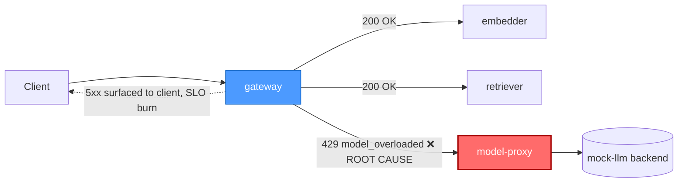

# Postmortem: gateway availability error budget burning fast (2% of the 28d budget in 1h; 5m & 1h windows)

- **Status:** resolved
- **Severity:** sev1
- **Verified:** no
- **Opened:** 2026-08-04 13:03:42Z
- **Resolved:** 2026-08-04 13:08:42Z

## Timeline (machine-generated)

All times UTC on 2026-08-04 unless a full date is shown.

| Time (UTC) | Source | Event |
| --- | --- | --- |
| 12:27:06Z | k8s | ReplicaSet/retriever-8454db56c: SuccessfulCreate |
| 12:27:06Z | k8s | Deployment/retriever: ScalingReplicaSet |
| 12:27:06Z | k8s | Pod/retriever-8454db56c-q2b86: Scheduled |
| 12:27:08Z | k8s | Pod/retriever-8454db56c-q2b86: Pulled |
| 12:27:09Z | k8s | Pod/retriever-8454db56c-q2b86: Started |
| 12:27:09Z | k8s | Pod/retriever-8454db56c-q2b86: Created |
| 12:27:11Z | k8s | Pod/retriever-8454db56c-q2b86: Started |
| 12:27:11Z | k8s | Pod/retriever-8454db56c-q2b86: Pulled |
| 12:27:11Z | k8s | Pod/retriever-8454db56c-q2b86: Created |
| 12:27:13Z | k8s | Pod/retriever-8454db56c-q2b86: BackOff |
| 12:27:14Z | k8s | Pod/retriever-8454db56c-q2b86: BackOff |
| 12:27:16Z | k8s | Pod/retriever-8454db56c-q2b86: BackOff |
| 12:27:24Z | k8s | Pod/retriever-8454db56c-q2b86: Started |
| 12:27:24Z | k8s | Pod/retriever-8454db56c-q2b86: Pulled |
| 12:27:24Z | k8s | Pod/retriever-8454db56c-q2b86: Created |
| 12:27:27Z | k8s | Pod/retriever-8454db56c-q2b86: BackOff |
| 12:27:36Z | k8s | Pod/retriever-8454db56c-q2b86: BackOff |
| 12:27:47Z | k8s | Pod/retriever-8454db56c-q2b86: Started |
| 12:27:47Z | k8s | Pod/retriever-8454db56c-q2b86: Pulled |
| 12:27:47Z | k8s | Pod/retriever-8454db56c-q2b86: Created |
| 12:27:49Z | k8s | Pod/retriever-8454db56c-q2b86: BackOff |
| 12:27:50Z | k8s | Pod/retriever-8454db56c-q2b86: BackOff |
| 12:27:56Z | k8s | Pod/retriever-8454db56c-q2b86: BackOff |
| 12:28:43Z | k8s | Pod/retriever-8454db56c-q2b86: Started |
| 12:28:43Z | k8s | Pod/retriever-8454db56c-q2b86: Pulled |
| 12:28:43Z | k8s | Pod/retriever-8454db56c-q2b86: Created |
| 12:28:46Z | k8s | Pod/retriever-8454db56c-q2b86: BackOff |
| 12:28:47Z | k8s | Pod/retriever-8454db56c-q2b86: BackOff |
| 12:29:48Z | k8s | Pod/retriever-8454db56c-q2b86: BackOff |
| 12:30:10Z | k8s | Pod/retriever-8454db56c-q2b86: Started |
| 12:30:10Z | k8s | Pod/retriever-8454db56c-q2b86: Pulled |
| 12:30:10Z | k8s | Pod/retriever-8454db56c-q2b86: Created |
| 12:30:13Z | k8s | Pod/retriever-8454db56c-q2b86: BackOff |
| 12:30:16Z | k8s | Pod/retriever-8454db56c-q2b86: BackOff |
| 12:31:26Z | k8s | Pod/retriever-8454db56c-q2b86: BackOff |
| 12:32:37Z | k8s | Pod/retriever-8454db56c-q2b86: BackOff |
| 12:32:57Z | k8s | Pod/retriever-8454db56c-q2b86: Started |
| 12:32:57Z | k8s | Pod/retriever-8454db56c-q2b86: Pulled |
| 12:32:57Z | k8s | Pod/retriever-8454db56c-q2b86: Created |
| 12:32:59Z | k8s | Pod/retriever-8454db56c-q2b86: BackOff |
| 12:33:03Z | k8s | Pod/retriever-8454db56c-q2b86: BackOff |
| 12:33:06Z | k8s | Pod/retriever-8454db56c-q2b86: BackOff |
| 12:34:15Z | k8s | Pod/retriever-8454db56c-q2b86: BackOff |
| 12:35:16Z | k8s | Pod/retriever-8454db56c-q2b86: BackOff |
| 12:36:08Z | k8s | ReplicaSet/retriever-8454db56c: SuccessfulDelete |
| 12:36:08Z | k8s | Deployment/retriever: ScalingReplicaSet |
| 12:59:23Z | log-spike | log-spike onset: [gateway] unhandled error: 16 \| } |
| 13:03:10Z | alert | alert firing: SLO gateway availability — fast burn |
| 13:03:10Z | alert | alert resolved: SLO gateway availability — fast burn |

## Evidence links

- [Loki — logs over the incident window](http://localhost:3001/explore?schemaVersion=1&panes=%7B%22pm%22%3A+%7B%22datasource%22%3A+%22loki%22%2C+%22queries%22%3A+%5B%7B%22refId%22%3A+%22A%22%2C+%22datasource%22%3A+%7B%22type%22%3A+%22loki%22%2C+%22uid%22%3A+%22loki%22%7D%2C+%22expr%22%3A+%22%7Bnamespace%3D%5C%22subject%5C%22%7D+%7C~+%5C%22%28%3Fi%29error%7Cfailed%5C%22%22%7D%5D%2C+%22range%22%3A+%7B%22from%22%3A+%221785848622920%22%2C+%22to%22%3A+%221785848922893%22%7D%7D%7D&orgId=1)
- [Mimir — metrics over the incident window](http://localhost:3001/explore?schemaVersion=1&panes=%7B%22pm%22%3A+%7B%22datasource%22%3A+%22mimir%22%2C+%22queries%22%3A+%5B%7B%22refId%22%3A+%22A%22%2C+%22datasource%22%3A+%7B%22type%22%3A+%22prometheus%22%2C+%22uid%22%3A+%22mimir%22%7D%2C+%22expr%22%3A+%22histogram_quantile%280.95%2C+sum%28rate%28http_server_duration_milliseconds_bucket%5B5m%5D%29%29+by+%28le%29%29%22%7D%5D%2C+%22range%22%3A+%7B%22from%22%3A+%221785848622920%22%2C+%22to%22%3A+%221785848922893%22%7D%7D%7D&orgId=1)

## Investigation context

**Runbook match (2):** `gateway-high-error-rate.md`, `stale-secret.md` — toolset narrowed to 13 tools: alert_status, deploy_history, kubectl_read, loki_query, mimir_query, publish_postmortem, request_approval, restart_workload, runbook_lookup, runbook_read, save_artifact, tempo_query, update_db_secret

Pre-check battery (as injected at run start)

## Pre-check leads

### recent_deploys — LEAD
No deploy in the last 60m — rule out the reflex answer.
- No deploy in the last 60m — rule out the reflex answer.

### log_spike — LEAD
error/failed log rate 200/10min vs baseline 0/10min (200x baseline) — onset: [gateway] unhandled error: 16 |         } at 2026-08-04T12:59:23.341184+00:00
- error/failed log rate 200/10min vs baseline 0/10min (200x baseline) — onset: [gateway] unhandled error: 16 |         } at 2026-08-04T12:59:23.341184+00:00

### kube_scan — UNAVAILABLE
error: You must be logged in to the server (Unauthorized)

### rollout_state — UNAVAILABLE
gateway: E0804 15:03:44.007345   18668 memcache.go:265] "Unhandled Error" err="couldn't get current server API group list: the server has asked for the client to provide credentials"
E0804 15:03:44.100724   18668 memcache.go:265] "Unhandled Error" err="couldn't get current server API group list: the server has asked for the client to provide credentials"
E0804 15:03:44.232802   18668 memcache.go:265] "Unhandled Error" err="couldn't get current server API group list: the server has asked for the client to; gateway analysis: E0804 15:03:44.011501   47648 memcache.go:265] "Unhandled Error" err="couldn't get current server API group list: the server has asked for the client to provide credentials"
E0804 15:03:44.099671   47648 memcache.go:265] "Unhandled Error"
… (section truncated)

### secret_age — UNAVAILABLE
error: You must be logged in to the server (Unauthorized)

## Narrative

## Summary
Sev1 fast-burn alert on gateway availability. Root cause: the `model-proxy` downstream was failing under load, surfacing as `ModelOverloadedError` (HTTP 429, "model is overloaded") on `/v1/chat` requests. Gateway propagated these as request failures, burning the 28-day availability budget at a fast rate.

## Impact
Tenant `acme` (and others, e.g. `bravo` seen in traces) experienced failed/slow `/v1/chat` completions. Traces show gateway root spans erroring in the 0.7s–8.7s range, with the failing span always attributable to the `model-proxy` client call — `embedder` and `retriever` calls in the same traces consistently returned 200 with no errors, isolating the fault to the one downstream.

## Root cause
Diagnosis followed the `gateway-high-error-rate` runbook:
1. Ruled out a bad deploy — `deploy_history` showed zero deploys in the preceding 180 minutes.
2. Ruled out the stale-secret hypothesis from the `stale-secret` runbook — `loki_query` for `"password authentication failed"` over 2h returned zero hits, so the rotated-credential signature was absent.
3. Pulled failing traces in Tempo (`{.service.name="gateway" && status=error}`) and inspected full trace detail: `POST /v1/chat` → `embedder` (200) → `retriever` (200) → `model-proxy` (429), with an explicit `exception.type=model_overloaded`, `exception.message="model is overloaded"` event on the `rag.generate` span, thrown from `apps/gateway/src/slices/inference/adapters/model-http.ts`.
4. Confirmed the fault was isolated to `model-proxy`: across dozens of sampled traces, `embedder` and `retriever` spans never carried `errorCount`, while `model-proxy` spans did, with widely varying latency (0.4s–5.7s) consistent with an overloaded backend queuing/rejecting work.
5. A secondary, cosmetic log signal ("Malformed JSON in request body" / "[gateway] unhandled error") was also present at high volume but is a Hono body-validator 400 path unrelated to the 5xx-driving fault; it was ruled out as the primary driver since the erroring root spans in Tempo consistently traced to `model-proxy`, not to request parsing.

This matches the runbook's hypothesis: "One downstream (model-proxy) is failing … and the gateway is surfacing its errors."

## What fixed it
Dry-ran `restart_workload` for `model-proxy` (diff: rolling-restart annotation bump, no spec change), got explicit operator approval, then executed for real. **The real execution failed twice with a cluster API `Unauthorized` error** — the same underlying credential/auth problem already flagged as `UNAVAILABLE` by the pre-check's `kube_scan` and `rollout_state` leads. The remediation was therefore never actually applied by this on-call session.
Independently, re-querying `alert_status` afterward showed the alert had already flipped to inactive, and a fresh 2-minute Loki window showed zero new `"unhandled error"` lines, versus a steady stream of them just minutes before. Recovery is confirmed by telemetry, but it cannot be attributed to the attempted restart, which never executed — it either self-cleared upstream or was resolved by something outside this session's visibility.

## Lessons
- The cluster write path (and read path — `kubectl_read` also failed with the same `Unauthorized`) was broken for this on-call identity for the duration of the incident. This needs to be fixed operationally: on-call remediation is a no-op if the agent's kubeconfig/token is invalid, and that must be caught and alerted on separately from the incident itself.
- Two near-identical error signatures were present simultaneously (429 model-overload on the RAG path, and 400 malformed-JSON on request parsing). Tracing to the root span's error attribution in Tempo — rather than log-line volume alone — was what correctly isolated the SLO-burning fault to `model-proxy` and avoided chasing the noisier but less consequential JSON-parsing log spam.
- Do not assume a remediation succeeded because the alert cleared afterward; the two must be checked independently, especially when the remediation call itself returned an error.

