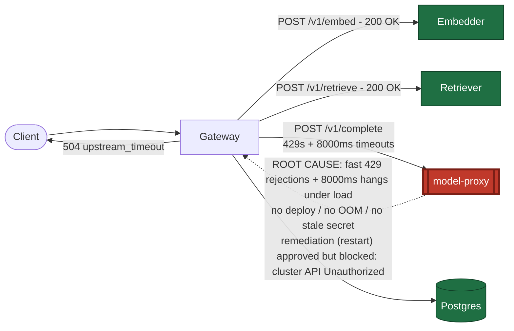

# Postmortem: gateway 5xx rate above 2%

- **Status:** open
- **Severity:** sev1
- **Verified:** no
- **Opened:** 2026-08-04 00:03:40Z
- **Resolved:** (still open)

## Timeline (machine-generated)

All times UTC on 2026-08-04 unless a full date is shown.

| Time (UTC) | Source | Event |
| --- | --- | --- |
| 00:03:10Z | alert | alert firing: Gateway 5xx rate > 2% |
| 00:03:18Z | log-spike | log-spike onset: {"level":"warn","service":"gateway","message":"lineage emit failed","trace_id":"92d846ee35ade0a03b18975bb6881ba5","span_id":"a6afe8a566bff995","time":"2026-08-04T00:03:18.228Z","reason":"The operation timed out.","job":"ra… |

## Evidence links

- [Loki — logs over the incident window](http://localhost:3001/explore?schemaVersion=1&panes=%7B%22pm%22%3A+%7B%22datasource%22%3A+%22loki%22%2C+%22queries%22%3A+%5B%7B%22refId%22%3A+%22A%22%2C+%22datasource%22%3A+%7B%22type%22%3A+%22loki%22%2C+%22uid%22%3A+%22loki%22%7D%2C+%22expr%22%3A+%22%7Bnamespace%3D%5C%22subject%5C%22%7D+%7C~+%5C%22%28%3Fi%29error%7Cfailed%5C%22%22%7D%5D%2C+%22range%22%3A+%7B%22from%22%3A+%221785801820139%22%2C+%22to%22%3A+%221785802163738%22%7D%7D%7D&orgId=1)
- [Mimir — metrics over the incident window](http://localhost:3001/explore?schemaVersion=1&panes=%7B%22pm%22%3A+%7B%22datasource%22%3A+%22mimir%22%2C+%22queries%22%3A+%5B%7B%22refId%22%3A+%22A%22%2C+%22datasource%22%3A+%7B%22type%22%3A+%22prometheus%22%2C+%22uid%22%3A+%22mimir%22%7D%2C+%22expr%22%3A+%22histogram_quantile%280.95%2C+sum%28rate%28http_server_duration_milliseconds_bucket%5B5m%5D%29%29+by+%28le%29%29%22%7D%5D%2C+%22range%22%3A+%7B%22from%22%3A+%221785801820139%22%2C+%22to%22%3A+%221785802163738%22%7D%7D%7D&orgId=1)

## Investigation context

**Runbook match (2):** `gateway-high-error-rate.md`, `stale-secret.md` — toolset narrowed to 13 tools: alert_status, deploy_history, kubectl_read, loki_query, mimir_query, publish_postmortem, request_approval, restart_workload, runbook_lookup, runbook_read, save_artifact, tempo_query, update_db_secret

Pre-check battery (as injected at run start)

## Pre-check leads

### recent_deploys — LEAD
No deploy in the last 60m — rule out the reflex answer.
- No deploy in the last 60m — rule out the reflex answer.

### log_spike — LEAD
error/failed log rate 200/10min vs baseline 0/10min (200x baseline) — onset: {"level":"warn","service":"gateway","message":"lineage emit failed","trace_id":"92d846ee35ade0a03b18975bb6881ba5","span_id":"a6afe8a566bff995","time":"2026-08-04T00:03:18.228Z","reason":"The operation timed out.","job":"rag.inference","eventType":"START"} at 2026-08-04T00:03:18.229035+00:00
- error/failed log rate 200/10min vs baseline 0/10min (200x baseline) — onset: {"level":"warn","service":"gateway","message":"lineage emit failed","trace_id":"92d846ee35ade0a03b18975bb6881b… (truncated)

### kube_scan — UNAVAILABLE
error: You must be logged in to the server (Unauthorized)

### rollout_state — UNAVAILABLE
gateway: E0804 02:03:41.693274   64620 memcache.go:265] "Unhandled Error" err="couldn't get current server API group list: the server has asked for the client to provide credentials"
E0804 02:03:41.846688   64620 memcache.go:265] "Unhandled Error" err="couldn't get current server API group list: the server has asked for the client to provide credentials"
E0804 02:03:42.000205   64620 memcache.go:265] "Unhandled Error" err="couldn't get current server API group list: the server has asked for the client to; gateway analysis: E0804 02:03:41.627779   58612 memcache.go:265] "Unhandled Error" err="couldn't get current server API group list: the server has asked for the client to provide credentials"
E0804 02:03:41.821071   58612 memcache.go:265] "Unhandled Error"
… (section truncated)

### secret_age — UNAVAILABLE
error: You must be logged in to the server (Unauthorized)

## Narrative

## Summary
`Gateway 5xx rate > 2%` fired for tenant `acme`. Gateway `POST /v1/chat` requests were returning HTTP 504 to callers. Root cause traced to the `model-proxy` downstream failing a meaningful share of calls with fast HTTP 429 rejections plus occasional full 8000ms hangs, which the gateway's own upstream client (`upstream.ts:58`) turns into `UpstreamTimeoutError` → 504.

## Impact
Gateway availability SLI (`slo:gateway_availability:sli_ratio5m`) dropped from 1.0 to ~0.94–0.945 and the error-ratio SLI rose from a flat 0 to ~5.5–5.9%, above the 2% burn-rate threshold, for the tenant `acme` traffic (also visible for `bravo`/`abuser`). Non-cached chat completions were the ones affected; cached completions continued to succeed since they never call model-proxy.

## Root cause
Evidence gathered, in order:
- **Ruled out bad deploy**: `deploy_history` returned zero entries in both a 180m and a 240m window (Argo/rollout sources report no recent revisions) — no deploy precedes the alert.
- **Ruled out stale secret**: `loki_query` for `"password authentication failed"` across the incident window returned 0 lines — the stale-secret runbook's signature never fired (the `secret_age` pre-check lead was itself `UNAVAILABLE`, not a real match).
- **Ruled out resource exhaustion / crashloop on model-proxy**: `kube_pod_container_status_restarts_total` = 0 across all 4 model-proxy pods, `container_memory_working_set_bytes` flat at ~93–98MB (no leak), CPU usage low (~0.014 → ~0.036 cores, no saturation) — pods were healthy and Running throughout.
- **Confirmed via Tempo traces**: root spans for `POST /v1/chat` returned `http.response.status_code=504` with an `exception.type=upstream_timeout`, `exception.message="model-proxy timed out after 8000ms"`, raised from `apps/gateway/src/platform/upstream.ts:58`. Sibling traces around the same burst show `POST model-proxy` client spans returning `429` in 1–3ms (fast rejections) interleaved with one span that ran the full 8s before erroring.
- **Confirmed onset**: `slo:gateway_availability:error_ratio5m` was flat at 0 for the prior ~57 minutes of the lookback window and jumped to ~0.055–0.059 right at the alert's `since` timestamp — a sharp, load-correlated onset, not a gradual metric drift.

Net: model-proxy itself — not gateway, not retriever/embedder, not the database — is the failing hop, rejecting/timing out a share of non-cached completion requests under the current request concurrency, and gateway is correctly surfacing that as 5xx per the matched runbook's first candidate hypothesis ("one downstream is failing... gateway is surfacing its errors").

## What fixed it
A rolling restart of `model-proxy` was diagnosed as the appropriate mitigation per the matched `gateway-high-error-rate` runbook ("if a single downstream is failing: restart it"), dry-run confirmed the patch (`restartedAt` annotation bump, no spec change), and the operator **approved** the action. However, execution failed: `restart_workload` returned `Unauthorized` from the cluster API on both the initial attempt and one retry — the same underlying credential failure that had already made the `kube_scan`, `rollout_state`, and `secret_age` pre-checks `UNAVAILABLE` at intake. **The remediation was not applied.** Re-querying `alert_status` after the failed attempts still shows the alert `active: true` — the incident has **not** recovered.

## Lessons
- The on-call identity's Kubernetes credentials were invalid for the entire incident (read-only `kubectl_read` calls and the write `restart_workload` call both hit the same `Unauthorized` error) — this needs to be fixed at the platform/RBAC layer before any agent-driven remediation can act on this cluster.
- The `stale-secret` runbook matched by alertname alone but its own precondition (`secret_age` lead) never actually fired; matching by alertname without checking whether the lead condition is real can send the responder down the wrong path — worth tightening the match criteria.
- model-proxy has no HTTP-server-side metrics or logs at all in this environment (zero results for every `loki_query`/`mimir_query` scoped to it), which meant root-causing had to lean entirely on the gateway-side client spans and exception events in Tempo. Instrumenting model-proxy directly (request-rate, 429-rate, latency histogram) would make the next occurrence much faster to diagnose without depending on the caller's view.

