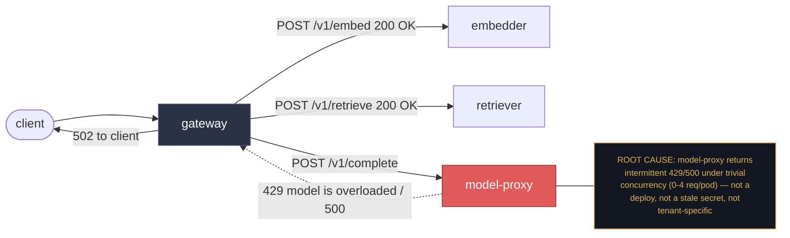

# Postmortem: gateway 5xx rate above 2%

- **Status:** open
- **Severity:** sev1
- **Verified:** no
- **Opened:** 2026-08-04 13:47:40Z
- **Resolved:** (still open)

## Timeline (machine-generated)

All times UTC on 2026-08-04 unless a full date is shown.

| Time (UTC) | Source | Event |
| --- | --- | --- |
| 13:44:42Z | k8s | Rollout/gateway: RolloutUpdated |
| 13:44:42Z | k8s | Rollout/gateway: NewReplicaSetCreated |
| 13:44:43Z | k8s | Pod/gateway-dd85945b4-pwg4s: Killing |
| 13:44:43Z | k8s | ReplicaSet/gateway-dd85945b4: SuccessfulDelete |
| 13:44:43Z | k8s | Rollout/gateway: ScalingReplicaSet |
| 13:44:43Z | k8s | Rollout/gateway: RolloutNotCompleted |
| 13:44:44Z | k8s | ReplicaSet/gateway-865966ff97: SuccessfulCreate |
| 13:44:44Z | k8s | Rollout/gateway: ScalingReplicaSet |
| 13:44:44Z | k8s | Pod/gateway-865966ff97-zhm57: Scheduled |
| 13:44:46Z | k8s | Pod/gateway-865966ff97-zhm57: Failed |
| 13:44:46Z | k8s | Pod/gateway-865966ff97-zhm57: Pulling |
| 13:44:47Z | k8s | Pod/gateway-865966ff97-zhm57: Failed |
| 13:44:47Z | k8s | Pod/gateway-865966ff97-zhm57: BackOff |
| 13:44:47Z | log-spike | log-spike onset: {"level":"warn","service":"gateway","message":"lineage emit failed","trace_id":"af827a0804551804516f6e234ee03a89","span_id":"08e0d32b7502741d","time":"2026-08-04T13:44:47.992Z","reason":"The operation timed out.","job":"ra… |
| 13:44:57Z | k8s | Pod/gateway-865966ff97-zhm57: Failed |
| 13:44:57Z | k8s | Pod/gateway-865966ff97-zhm57: Pulling |
| 13:45:08Z | k8s | Pod/gateway-865966ff97-zhm57: Failed |
| 13:45:08Z | k8s | Pod/gateway-865966ff97-zhm57: BackOff |
| 13:45:19Z | k8s | Pod/gateway-865966ff97-zhm57: Failed |
| 13:45:19Z | k8s | Pod/gateway-865966ff97-zhm57: Pulling |
| 13:45:33Z | k8s | Pod/gateway-865966ff97-zhm57: Failed |
| 13:45:33Z | k8s | Pod/gateway-865966ff97-zhm57: BackOff |
| 13:45:46Z | k8s | Pod/gateway-865966ff97-zhm57: Failed |
| 13:45:46Z | k8s | Pod/gateway-865966ff97-zhm57: BackOff |
| 13:45:57Z | k8s | Pod/gateway-865966ff97-zhm57: Failed |
| 13:45:57Z | k8s | Pod/gateway-865966ff97-zhm57: BackOff |
| 13:46:10Z | k8s | Pod/gateway-865966ff97-zhm57: Failed |
| 13:46:10Z | k8s | Pod/gateway-865966ff97-zhm57: Pulling |
| 13:46:24Z | k8s | Pod/gateway-865966ff97-zhm57: Failed |
| 13:46:24Z | k8s | Pod/gateway-865966ff97-zhm57: BackOff |
| 13:46:37Z | k8s | Pod/gateway-865966ff97-zhm57: Failed |
| 13:46:37Z | k8s | Pod/gateway-865966ff97-zhm57: BackOff |
| 13:46:48Z | k8s | Pod/gateway-865966ff97-zhm57: Failed |
| 13:46:48Z | k8s | Pod/gateway-865966ff97-zhm57: BackOff |
| 13:47:00Z | k8s | Pod/gateway-865966ff97-zhm57: Failed |
| 13:47:00Z | k8s | Pod/gateway-865966ff97-zhm57: BackOff |
| 13:47:10Z | alert | alert firing: Gateway 5xx rate > 2% |
| 13:47:13Z | k8s | Pod/gateway-865966ff97-zhm57: Failed |
| 13:47:13Z | k8s | Pod/gateway-865966ff97-zhm57: BackOff |
| 13:47:27Z | k8s | Pod/gateway-865966ff97-zhm57: Failed |
| 13:47:27Z | k8s | Pod/gateway-865966ff97-zhm57: BackOff |
| 13:47:38Z | k8s | Pod/gateway-865966ff97-zhm57: Failed |
| 13:47:38Z | k8s | Pod/gateway-865966ff97-zhm57: Pulling |
| 13:47:49Z | k8s | Pod/gateway-865966ff97-zhm57: Failed |
| 13:47:49Z | k8s | Pod/gateway-865966ff97-zhm57: BackOff |
| 13:48:03Z | k8s | Pod/gateway-865966ff97-zhm57: Failed |
| 13:48:03Z | k8s | Pod/gateway-865966ff97-zhm57: BackOff |
| 13:48:16Z | k8s | Pod/gateway-865966ff97-zhm57: Failed |
| 13:48:16Z | k8s | Pod/gateway-865966ff97-zhm57: BackOff |
| 13:48:31Z | k8s | Pod/gateway-865966ff97-zhm57: Failed |
| 13:48:31Z | k8s | Pod/gateway-865966ff97-zhm57: BackOff |
| 13:48:44Z | k8s | Pod/gateway-865966ff97-zhm57: BackOff |
| 13:48:56Z | k8s | Pod/gateway-865966ff97-zhm57: BackOff |
| 13:49:10Z | k8s | Pod/gateway-865966ff97-zhm57: BackOff |
| 13:49:21Z | k8s | Pod/gateway-865966ff97-zhm57: BackOff |
| 13:49:35Z | k8s | Pod/gateway-865966ff97-zhm57: BackOff |
| 13:49:48Z | k8s | Pod/gateway-865966ff97-zhm57: Failed |
| 13:49:48Z | k8s | Pod/gateway-865966ff97-zhm57: BackOff |
| 13:54:47Z | k8s | Pod/gateway-865966ff97-zhm57: Failed |
| 13:54:47Z | k8s | Pod/gateway-865966ff97-zhm57: BackOff |

## Evidence links

- [Loki — logs over the incident window](http://localhost:3001/explore?schemaVersion=1&panes=%7B%22pm%22%3A+%7B%22datasource%22%3A+%22loki%22%2C+%22queries%22%3A+%5B%7B%22refId%22%3A+%22A%22%2C+%22datasource%22%3A+%7B%22type%22%3A+%22loki%22%2C+%22uid%22%3A+%22loki%22%7D%2C+%22expr%22%3A+%22%7Bnamespace%3D%5C%22subject%5C%22%7D+%7C~+%5C%22%28%3Fi%29error%7Cfailed%5C%22%22%7D%5D%2C+%22range%22%3A+%7B%22from%22%3A+%221785851260098%22%2C+%22to%22%3A+%221785851698447%22%7D%7D%7D&orgId=1)
- [Mimir — metrics over the incident window](http://localhost:3001/explore?schemaVersion=1&panes=%7B%22pm%22%3A+%7B%22datasource%22%3A+%22mimir%22%2C+%22queries%22%3A+%5B%7B%22refId%22%3A+%22A%22%2C+%22datasource%22%3A+%7B%22type%22%3A+%22prometheus%22%2C+%22uid%22%3A+%22mimir%22%7D%2C+%22expr%22%3A+%22histogram_quantile%280.95%2C+sum%28rate%28http_server_duration_milliseconds_bucket%5B5m%5D%29%29+by+%28le%29%29%22%7D%5D%2C+%22range%22%3A+%7B%22from%22%3A+%221785851260098%22%2C+%22to%22%3A+%221785851698447%22%7D%7D%7D&orgId=1)

## Investigation context

**Runbook match (2):** `gateway-high-error-rate.md`, `stale-secret.md` — toolset narrowed to 13 tools: alert_status, deploy_history, kubectl_read, loki_query, mimir_query, publish_postmortem, request_approval, restart_workload, runbook_lookup, runbook_read, save_artifact, tempo_query, update_db_secret

Pre-check battery (as injected at run start)

## Pre-check leads

### recent_deploys — LEAD
No deploy in the last 60m — rule out the reflex answer.
- No deploy in the last 60m — rule out the reflex answer.

### log_spike — LEAD
error/failed log rate 200/10min vs baseline 0/10min (200x baseline) — onset: {"level":"warn","service":"gateway","message":"lineage emit failed","trace_id":"af827a0804551804516f6e234ee03a89","span_id":"08e0d32b7502741d","time":"2026-08-04T13:44:47.992Z","reason":"The operation timed out.","job":"rag.inference","eventType":"START"} at 2026-08-04T13:44:47.993153+00:00
- error/failed log rate 200/10min vs baseline 0/10min (200x baseline) — onset: {"level":"warn","service":"gateway","message":"lineage emit failed","trace_id":"af827a0804551804516f6e234ee03a… (truncated)

### kube_scan — UNAVAILABLE
error: You must be logged in to the server (Unauthorized)

### rollout_state — UNAVAILABLE
gateway: E0804 15:47:40.909222   45548 memcache.go:265] "Unhandled Error" err="couldn't get current server API group list: the server has asked for the client to provide credentials"
E0804 15:47:41.030659   45548 memcache.go:265] "Unhandled Error" err="couldn't get current server API group list: the server has asked for the client to provide credentials"
E0804 15:47:41.244146   45548 memcache.go:265] "Unhandled Error" err="couldn't get current server API group list: the server has asked for the client to; gateway analysis: E0804 15:47:40.967225   12172 memcache.go:265] "Unhandled Error" err="couldn't get current server API group list: the server has asked for the client to provide credentials"
E0804 15:47:41.094273   12172 memcache.go:265] "Unhandled Error"
… (section truncated)

### secret_age — UNAVAILABLE
error: You must be logged in to the server (Unauthorized)

## Narrative

## Summary

`Gateway 5xx rate > 2%` fired for tenant acme. Investigation traced the 5xx directly to the `model-proxy` hop: gateway's own `rag.generate` spans recorded `upstream_error` exceptions — "model-proxy returned 500" and, in other requests, a `model_overloaded` exception with message "model is overloaded" (HTTP 429) — surfaced to clients as gateway `502`s.

## Impact

`slo:gateway_availability:error_ratio5m` breached the 2% alerting threshold at 13:47:10 UTC and was still active (~5.9%) at the time of investigation. The same signal shows an earlier, larger excursion (peaking ~35%) roughly 13:23–13:36 UTC that self-resolved before this page fired, plus a smaller ~7% blip around 13:14–13:19 UTC — a recurring pattern, not a one-off.

## Root cause

`model-proxy` is the failing hop. Evidence ruling out the runbook's other hypotheses:
- **Not a bad deploy** — `deploy_history` returned zero entries for the gateway/model-proxy workloads in the preceding 180 minutes; the pre-check `recent_deploys` lead already flagged "no deploy in last 60m."
- **Not a stale DB secret** — `loki_query` for `"password authentication failed"` over the incident window returned zero lines; the stale-secret runbook's own trigger signature (rotation timestamp leading auth failures) never appeared, and `secret_age`/`kube_scan` checks were themselves `UNAVAILABLE (Unauthorized)`, not positive.
- **Not a single-tenant 429 storm** — both `acme` and `bravo` traffic showed identical "chat completed" success logs and identical error-trace shapes; the model-proxy errors hit both tenants, so this isn't the expected/benign per-tenant rate-limit case.
- **Not real capacity overload** — `active_requests{job="model-proxy"}` stayed at 0–4 concurrent requests per pod across all 4 replicas throughout the incident window, yet model-proxy still returned `429 model is overloaded` and separately `500`. That mismatch between trivial concurrency and "overloaded"/server-error responses points at model-proxy itself being unhealthy (a stuck limiter or a subset of unhealthy pods intermittently serving errors) rather than genuine demand exceeding capacity.

This matches the `gateway-high-error-rate.md` runbook's hypothesis: "One downstream (model-proxy) is failing health checks and the gateway is surfacing its errors."

## What fixed it

Remediation was scoped, dry-run, and approved: a rolling restart of `model-proxy` (`request_approval` → approved). However, **execution failed** — `restart_workload(dry_run=false)` returned `Unauthorized` from the cluster API on two consecutive attempts. This is consistent with the pre-check leads: `kube_scan`, `rollout_state`, and `secret_age` were all reported `UNAVAILABLE` with the identical "must be logged in to the server (Unauthorized)" error, and every direct `kubectl_read` call in this investigation failed the same way. The on-call agent's cluster credentials are not authorized to mutate (or even read) the `subject` namespace in this environment right now.

**The incident is NOT resolved.** Re-querying `alert_status` after the failed restart attempts still shows `active: true` (since 13:47:10 UTC). No successful remediation was applied.

## Lessons

- Root cause is confidently pinned on `model-proxy` returning mixed `429`/`500` under trivial load, evidenced by trace exception events on both response paths (`upstream_error` / `model_overloaded`), independent of tenant.
- The intended fix (rolling restart of `model-proxy`) could not be executed because cluster API auth is broken for this agent identity — this blocked both read (`kubectl_read`, `k8s_events`) and write (`restart_workload`) paths equally, so it is an infrastructure/credentials issue, not a decision to withhold action.
- Follow-up: restore/verify the agent-ro (and remediation) kubeconfig credentials for the `subject` cluster, then re-run the approved restart of `model-proxy`. Until then, this alert should be treated as open and escalated for manual restart.
- The recurring pattern (7% blip, 35% spike, now a third rise) suggests model-proxy's failure mode is intermittent/self-triggering rather than continuous — worth checking model-proxy's internal request-limiter/pool logic for a leak once cluster access is restored, since restart alone may only be a temporary mitigation if the same condition re-accumulates.

