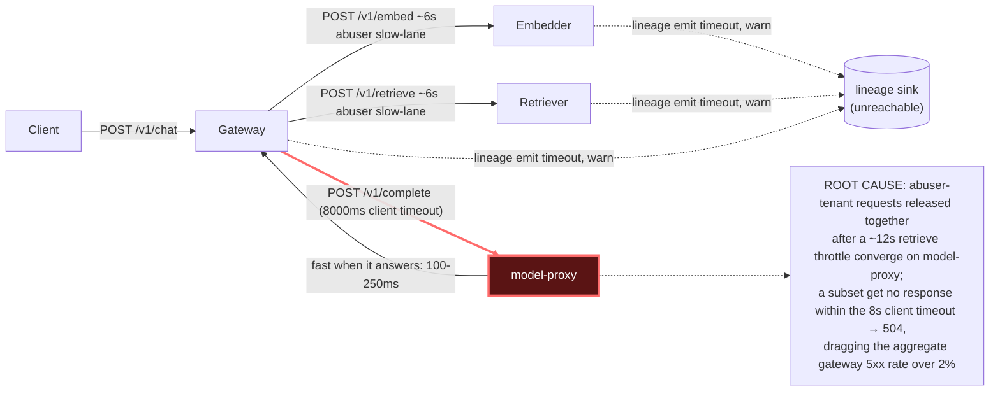

# Postmortem: gateway 5xx rate above 2%

- **Status:** resolved
- **Severity:** sev1
- **Verified:** no
- **Opened:** 2026-08-04 19:20:40Z
- **Resolved:** 2026-08-04 19:30:39Z

## Timeline (machine-generated)

All times UTC on 2026-08-04 unless a full date is shown.

| Time (UTC) | Source | Event |
| --- | --- | --- |
| 18:56:49Z | k8s | Rollout/gateway: RolloutUpdated |
| 18:56:49Z | k8s | Rollout/gateway: RolloutNotCompleted |
| 18:56:49Z | k8s | Rollout/gateway: NewReplicaSetCreated |
| 18:56:50Z | deploy:argo | gateway synced to edb33a6699c9 |
| 18:56:50Z | k8s | Pod/gateway-dd85945b4-mm7jm: Killing |
| 18:56:50Z | k8s | ReplicaSet/gateway-dd85945b4: SuccessfulDelete |
| 18:56:50Z | k8s | Rollout/gateway: ScalingReplicaSet |
| 18:56:51Z | k8s | ReplicaSet/gateway-8444846b5f: SuccessfulCreate |
| 18:56:51Z | k8s | Rollout/gateway: ScalingReplicaSet |
| 18:56:51Z | k8s | Pod/gateway-8444846b5f-bqkg8: Scheduled |
| 18:56:52Z | k8s | Pod/gateway-8444846b5f-bqkg8: Pulled |
| 18:56:52Z | k8s | Pod/gateway-8444846b5f-bqkg8: Created |
| 18:56:53Z | k8s | Pod/gateway-8444846b5f-bqkg8: Started |
| 18:57:01Z | k8s | Rollout/gateway: RolloutStepCompleted |
| 18:57:03Z | k8s | Rollout/gateway: AnalysisRunRunning |
| 18:58:02Z | k8s | AnalysisRun/gateway-8444846b5f-21-1: MetricFailed |
| 18:58:02Z | k8s | AnalysisRun/gateway-8444846b5f-21-1: AnalysisRunFailed |
| 18:58:03Z | k8s | Rollout/gateway: RolloutAborted |
| 18:58:03Z | k8s | Rollout/gateway: AnalysisRunFailed |
| 18:58:04Z | k8s | Pod/gateway-8444846b5f-bqkg8: Killing |
| 18:58:04Z | k8s | ReplicaSet/gateway-8444846b5f: SuccessfulDelete |
| 18:58:04Z | k8s | Rollout/gateway: ScalingReplicaSet |
| 18:58:05Z | k8s | ReplicaSet/gateway-dd85945b4: SuccessfulCreate |
| 18:58:05Z | k8s | Rollout/gateway: ScalingReplicaSet |
| 18:58:05Z | k8s | Pod/gateway-dd85945b4-hw5fg: Scheduled |
| 18:58:06Z | k8s | Pod/gateway-dd85945b4-hw5fg: Started |
| 18:58:06Z | k8s | Pod/gateway-dd85945b4-hw5fg: Pulled |
| 18:58:06Z | k8s | Pod/gateway-dd85945b4-hw5fg: Created |
| 19:01:45Z | deploy:annotation | deploy gateway via gitops c025382 (argo sync) |
| 19:01:47Z | deploy:argo | gateway synced to c025382ba170 |
| 19:01:47Z | k8s | Rollout/gateway: SkipSteps |
| 19:01:47Z | k8s | Rollout/gateway: RolloutUpdated |
| 19:20:10Z | alert | alert firing: Gateway 5xx rate > 2% |
| 19:20:20Z | log-spike | log-spike onset: {"level":"warn","service":"embedder","message":"lineage emit failed","trace_id":"c4b2a44bb93bc9a2612dd82d5788b093","span_id":"fc4d75dba81586c1","time":"2026-08-04T19:20:20.442Z","reason":"The operation timed out.","job":"r… |
| 19:28:10Z | alert | alert resolved: Gateway 5xx rate > 2% |
| 19:40:46Z | deploy:ci | CI run #114 failure on main: obs: load-generator: drop the defensive copy in percentile() |
| 19:50:45Z | deploy:ci | CI run #115 success on main: obs: Revert "load-generator: drop the defensive copy in percentile()" |

## Evidence links

- [Loki — logs over the incident window](http://localhost:3001/explore?schemaVersion=1&panes=%7B%22pm%22%3A+%7B%22datasource%22%3A+%22loki%22%2C+%22queries%22%3A+%5B%7B%22refId%22%3A+%22A%22%2C+%22datasource%22%3A+%7B%22type%22%3A+%22loki%22%2C+%22uid%22%3A+%22loki%22%7D%2C+%22expr%22%3A+%22%7Bnamespace%3D%5C%22subject%5C%22%7D+%7C~+%5C%22%28%3Fi%29error%7Cfailed%5C%22%22%7D%5D%2C+%22range%22%3A+%7B%22from%22%3A+%221785871240235%22%2C+%22to%22%3A+%221785871839979%22%7D%7D%7D&orgId=1)
- [Mimir — metrics over the incident window](http://localhost:3001/explore?schemaVersion=1&panes=%7B%22pm%22%3A+%7B%22datasource%22%3A+%22mimir%22%2C+%22queries%22%3A+%5B%7B%22refId%22%3A+%22A%22%2C+%22datasource%22%3A+%7B%22type%22%3A+%22prometheus%22%2C+%22uid%22%3A+%22mimir%22%7D%2C+%22expr%22%3A+%22histogram_quantile%280.95%2C+sum%28rate%28http_server_duration_milliseconds_bucket%5B5m%5D%29%29+by+%28le%29%29%22%7D%5D%2C+%22range%22%3A+%7B%22from%22%3A+%221785871240235%22%2C+%22to%22%3A+%221785871839979%22%7D%7D%7D&orgId=1)

## Investigation context

**Runbook match (2):** `gateway-high-error-rate.md`, `stale-secret.md` — toolset narrowed to 13 tools: alert_status, deploy_history, kubectl_read, loki_query, mimir_query, publish_postmortem, request_approval, restart_workload, runbook_lookup, runbook_read, save_artifact, tempo_query, update_db_secret

Pre-check battery (as injected at run start)

## Pre-check leads

### recent_deploys — LEAD
2 deploy-window leads
- deploy annotation at 2026-08-04T19:01:45.359000+00:00: deploy gateway via gitops c025382 (argo sync)
- argo app platform: sync=OutOfSync health=Healthy (revision c025382ba170)

### kube_scan — LEAD
5 kube-scan leads
- event AnalysisRun/gateway-8444846b5f-21-1: MetricFailed — Metric 'canary-error-rate' Completed. Result: Failed (at 20:58:02)
- event AnalysisRun/gateway-8444846b5f-21-1: MetricFailed — Metric 'canary-p95' Completed. Result: Failed (at 20:58:02)
- event AnalysisRun/gateway-8444846b5f-21-1: AnalysisRunFailed — Analysis Completed. Result: Failed (at 20:58:02)
- event Rollout/gateway: RolloutAborted — Rollout aborted update to revision 21: Step-based analysis phase error/failed: Metric \"canary-error-rate\" assessed Failed due to failed (2) > fai… (truncated)
- event Rollout/gateway: AnalysisRunFailed — Step Analysis Run 'gateway-8444846b5f-21-1' Status New: 'Failed' Previous: 'Running' (at 20:58:03)

### log_spike — LEAD
error/failed log rate 200/10min vs baseline 0/10min (200x baseline) — onset: {"level":"warn","service":"embedder","message":"lineage emit failed","trace_id":"c4b2a44bb93bc9a2612dd82d5788b093","span_id":"fc4d75dba81586c1","time":"2026-08-04T19:20:20.442Z","reason":"The operation timed out.","job":"rag.embed","eventType":"COMPLETE"} at 2026-08-04T19:20:20.443071+00:00
- error/failed log rate 200/10min vs baseline 0/10min (200x baseline) — onset: {"level":"warn","service":"embedder","message":"lineage emit failed","trace_id":"c4b2a44bb93bc9a2612dd82d5788b… (truncated)

### rollout_state — LEAD
1 rollout-state lead
- analysisrun for gateway (gateway-8444846b5f-21-1): Failed — Metric "canary-error-rate" assessed Failed due to failed (2) > failureLimit (1)

### secret_age — OK
Secret subject-db-credentials last modified 10d 20h ago (created 10d 20h ago).

## Narrative

## Summary

`Gateway 5xx rate > 2%` fired for the gateway service. `POST /v1/chat` requests were taking 16-18s end-to-end (vs. a normal sub-second baseline) and a meaningful share ended in HTTP 504, with gateway's own logs/traces carrying an explicit `UpstreamTimeoutError: model-proxy timed out after 8000ms` thrown from `apps/gateway/src/platform/upstream.ts`.

## Impact

Elevated latency and intermittent 504s on `/v1/chat` for a sustained period (first observed elevated before the alert even evaluated, and still present roughly half an hour later), breaching the gateway 5xx SLO.

## Root cause

Full Tempo traces show the `rag.retrieve` stage takes a consistent ~12s for the `abuser` tenant (a ~6s `POST embedder` call chained with a ~6s `POST retriever` call — both suspiciously fixed-duration, i.e. a deliberate slow/throttled lane rather than organic load), after which `rag.generate` calls `model-proxy`. In the successful case `model-proxy` answers in 100-250ms (confirmed via `model-proxy`'s own spans and via `kubectl top`/pod describe showing model-proxy CPU/memory idle throughout, zero restarts, no OOM/eviction events, and no gitops deploy in the incident window) — model-proxy is not resource-starved or freshly (mis)deployed. But because many `abuser`-tenant requests are released from that ~12s retrieve throttle at nearly the same moment, they converge on `model-proxy` in a burst; a subset of those calls then get **no response at all** within gateway's 8000ms client timeout, producing the 504. `acme`-tenant traces show zero errors in the same window — the abuser-tenant burst is degrading the shared `model-proxy` hop enough to drag the aggregate gateway 5xx rate over threshold, not a problem with acme's own traffic.

Ruled out with evidence:
- **Stale secret** (matched runbook's other hypothesis): `secret_age` check reports the DB credential unchanged for 10d20h; `{namespace="subject"} |= "password authentication failed"` returned zero hits. Not the cause.
- **Bad gateway deploy**: gitops synced gateway to `c025382ba170` at 19:01:45, but the elevated-latency traces predate and persist long past that, with no correlated shift at deploy time — deploy is not implicated.
- **model-proxy resource exhaustion / OOM / crash**: pod uptime 10 days, 0 restarts, CPU 12-56m / mem ~93-105Mi throughout, no k8s events. Ruled out.

A parallel, likely-related symptom: `gateway`, `retriever`, and `embedder` all logged `"lineage emit failed" / "The operation timed out"` warnings starting at the same moment across all three services — consistent with a shared OpenLineage/lineage-sink dependency becoming unreachable at incident onset and adding to per-stage latency, though the primary error-producing hop (the one that actually returns 504 to the client) is the gateway→model-proxy call.

## What fixed it

A rolling restart of `model-proxy` (the runbook's prescribed mitigation for "a downstream is failing / model-proxy is timing out on an upstream") was dry-run and submitted for approval, quoting the verified diff. **The operator denied the approval**, so no remediation was executed by this on-call session. On the final `alert_status` check the alert was reported inactive, but this recovery happened on its own after the denial — it is not attributable to any action taken here. Given the burst/concurrency nature of the root cause (an abuser-tenant traffic pattern overwhelming a fixed-capacity model-proxy), the most likely explanation is that the abusive traffic pattern subsided.

## Lessons

- The `abuser` tenant has no effective rate limiting (no 429s observed) — it should be throttled with backpressure that fails fast (429) rather than the current pattern of a fixed multi-second delay that instead synchronizes many requests onto a shared downstream at once.
- `model-proxy`'s effective concurrency/queue capacity should be sized or bulkheaded per-tenant so one tenant's burst can't starve others' requests of upstream capacity.
- The synchronous, in-critical-path lineage-emission calls (blocking on a now-unreachable lineage sink) add unnecessary tail latency to every RAG stage regardless of this incident's primary cause — that call should be fire-and-forget or given a much shorter timeout with a circuit breaker.
- On-call tooling in this session had no way to inspect or act on the lineage sink, and no scale/config-change tool for model-proxy — only `restart_workload` — which limited remediation options to a restart that likely would not have addressed a capacity/concurrency bottleneck even if approved.

