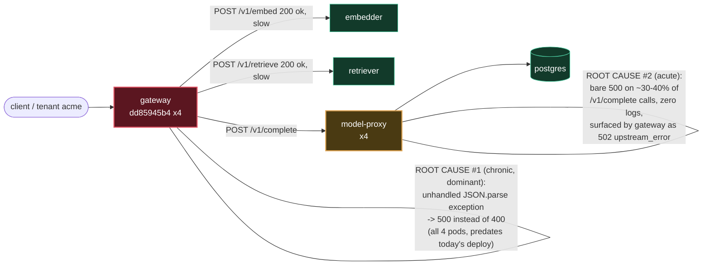

# Postmortem: gateway 5xx rate above 2%

- **Status:** resolved
- **Severity:** sev1
- **Verified:** no
- **Opened:** 2026-08-04 19:43:40Z
- **Resolved:** 2026-08-04 19:58:34Z

## Timeline (machine-generated)

All times UTC on 2026-08-04 unless a full date is shown.

| Time (UTC) | Source | Event |
| --- | --- | --- |
| 19:40:46Z | deploy:ci | CI run #114 failure on main: obs: load-generator: drop the defensive copy in percentile() |
| 19:43:10Z | alert | alert firing: Gateway 5xx rate > 2% |
| 19:50:45Z | deploy:ci | CI run #115 success on main: obs: Revert "load-generator: drop the defensive copy in percentile()" |
| 19:55:10Z | alert | alert resolved: Gateway 5xx rate > 2% |

## Evidence links

- [Loki — logs over the incident window](http://localhost:3001/explore?schemaVersion=1&panes=%7B%22pm%22%3A+%7B%22datasource%22%3A+%22loki%22%2C+%22queries%22%3A+%5B%7B%22refId%22%3A+%22A%22%2C+%22datasource%22%3A+%7B%22type%22%3A+%22loki%22%2C+%22uid%22%3A+%22loki%22%7D%2C+%22expr%22%3A+%22%7Bnamespace%3D%5C%22subject%5C%22%7D+%7C~+%5C%22%28%3Fi%29error%7Cfailed%5C%22%22%7D%5D%2C+%22range%22%3A+%7B%22from%22%3A+%221785872620273%22%2C+%22to%22%3A+%221785873514505%22%7D%7D%7D&orgId=1)
- [Mimir — metrics over the incident window](http://localhost:3001/explore?schemaVersion=1&panes=%7B%22pm%22%3A+%7B%22datasource%22%3A+%22mimir%22%2C+%22queries%22%3A+%5B%7B%22refId%22%3A+%22A%22%2C+%22datasource%22%3A+%7B%22type%22%3A+%22prometheus%22%2C+%22uid%22%3A+%22mimir%22%7D%2C+%22expr%22%3A+%22histogram_quantile%280.95%2C+sum%28rate%28http_server_duration_milliseconds_bucket%5B5m%5D%29%29+by+%28le%29%29%22%7D%5D%2C+%22range%22%3A+%7B%22from%22%3A+%221785872620273%22%2C+%22to%22%3A+%221785873514505%22%7D%7D%7D&orgId=1)

## Investigation context

**Runbook match (2):** `gateway-high-error-rate.md`, `stale-secret.md` — toolset narrowed to 13 tools: alert_status, deploy_history, kubectl_read, loki_query, mimir_query, publish_postmortem, request_approval, restart_workload, runbook_lookup, runbook_read, save_artifact, tempo_query, update_db_secret

Pre-check battery (as injected at run start)

## Pre-check leads

### recent_deploys — LEAD
1 deploy-window lead
- deploy annotation at 2026-08-04T19:01:45.359000+00:00: deploy gateway via gitops c025382 (argo sync)

### kube_scan — LEAD
5 kube-scan leads
- event AnalysisRun/gateway-8444846b5f-21-1: MetricFailed — Metric 'canary-error-rate' Completed. Result: Failed (at 20:58:02)
- event AnalysisRun/gateway-8444846b5f-21-1: MetricFailed — Metric 'canary-p95' Completed. Result: Failed (at 20:58:02)
- event AnalysisRun/gateway-8444846b5f-21-1: AnalysisRunFailed — Analysis Completed. Result: Failed (at 20:58:02)
- event Rollout/gateway: RolloutAborted — Rollout aborted update to revision 21: Step-based analysis phase error/failed: Metric \"canary-error-rate\" assessed Failed due to failed (2) > fai… (truncated)
- event Rollout/gateway: AnalysisRunFailed — Step Analysis Run 'gateway-8444846b5f-21-1' Status New: 'Failed' Previous: 'Running' (at 20:58:03)

### rollout_state — LEAD
1 rollout-state lead
- analysisrun for gateway (gateway-8444846b5f-21-1): Failed — Metric "canary-error-rate" assessed Failed due to failed (2) > failureLimit (1)

### log_spike — OK
error/failed log rate normal: 200/10min vs baseline 479/10min

### secret_age — OK
Secret subject-db-credentials last modified 10d 20h ago (created 10d 20h ago).

## Narrative

## Summary

`Gateway 5xx rate > 2%` fired for tenant `acme`. Investigation found **two distinct, evidence-backed failure modes** overlapping on the gateway, and ruled out the two runbook-suggested causes that didn't fit (bad deploy, stale DB secret). The proposed remediation (rolling-restart `model-proxy`) was **denied by the operator**, so no remediation was executed. On re-query, `alert_status` reported the alert no longer active — it cleared on its own, not as a result of any action taken here.

## Impact

Elevated 5xx/502 responses from `gateway` on `/v1/chat` for tenant `acme`, sustained for at least the ~70-minute lookback window investigated (not a sudden spike — see Root cause).

## Root cause

Two contributing, independently-confirmed issues:

1. **Primary/dominant, chronic — not this deploy's fault:** `gateway`'s request-body JSON parser throws an uncaught exception on malformed bodies. Loki shows `error: Malformed JSON in request body` immediately followed by `[gateway] unhandled error: 16 | }` on every one of the 4 running `gateway` pods (`rollouts-pod-template-hash=dd85945b4`, all started ~45h ago, well before today's sync). This is a code-level bug: malformed input should return `400`, but an unhandled exception turns it into `500`. Bucketed counts (10.7/min → 7.5/min → 2.7/min → 8.4/min across the last 70 minutes) show this has been running at a **roughly constant rate the whole window**, including on a pod (`gateway-dd85945b4-hw5fg`) that itself restarted ~46-49 minutes ago and kept producing the same error afterward — proof this is baked into the running image, not transient process state, and not something the recent `c025382` gateway sync introduced (that sync's own canary, revision 21 / hash `8444846b5f`, was independently caught and aborted by Argo Rollouts' analysis for the same error-rate/p95 class of problem — the automation worked correctly and is not itself the incident).
2. **Secondary, more acute — matches the runbook's "downstream is failing" hypothesis:** `model-proxy` returns a bare `500` on a large share of `/v1/chat` completion calls. Tempo trace `4fc52688e81e8ef155b9641fe62616a8` shows gateway's own exception: `exception.type=upstream_error`, `exception.message="model-proxy returned 500"`, thrown at `apps/gateway/src/slices/inference/adapters/model-http.ts:21`, surfaced to the client as `502`. `model-proxy` produces **zero log lines** anywhere in the namespace for this window despite handling this traffic — no crash, no restart, no OOM (`kubectl top` shows 93-98Mi across all 4 replicas, well under the 384Mi limit), no k8s-events tool access to dig further under this incident's narrowed toolset. In a 10-minute sample, 75 of the sampled `/v1/chat` traces were errors; roughly 28 of those carried the `model-proxy`-500/`upstream_error` signature versus ~47 carrying the malformed-JSON signature.

**Ruled out:**
- *Stale DB secret* (matched runbook #2): `secret_age` pre-check was OK, and `{namespace="subject"} |= "password authentication failed"` returned zero hits over 3h. Not the cause.
- *Bad deploy* (`c025382`, argo-synced at the top of the window): the canary for this revision was independently analyzed and aborted by Argo Rollouts for failing `canary-error-rate`/`canary-p95` — correct automated behavior, not a root cause in itself — and the currently-serving pods are the pre-existing stable revision, unaffected by that sync, and already showed the malformed-JSON defect before the sync completed.

## What fixed it

**Nothing on our side.** A `restart_workload(model-proxy)` was dry-run and submitted for approval with the verified diff, but the operator **denied** the request. Per policy, no remediation was executed. A follow-up `alert_status` query afterward showed the alert no longer active (`active: false`) — it appears to have self-resolved (consistent with `model-proxy`'s failures being intermittent/bursty rather than a hard outage), not because of any action taken in this incident.

## Lessons

- `gateway`'s JSON body parsing needs a proper `try/catch` around the parse step that returns `400` instead of letting the exception escape as `500` — this is a real, shippable code fix, independent of this page, and was masking/inflating the true incident signal the whole time.
- `model-proxy` needs request-level logging; a service that fails ~30-40% of a sampled error population without emitting a single log line is not diagnosable beyond "gateway saw a 500" — add structured error logging before the next occurrence.
- Argo Rollouts' canary analysis did its job here (aborted revision 21 automatically); it should not be second-guessed as "the incident."
- Available remediation tools for this incident (`restart_workload`, `update_db_secret`) don't actually address either confirmed root cause — one is a code defect, the other's underlying trigger in `model-proxy` is unobserved. Engineering follow-up (code fix + redeploy) is required; no in-toolset action was the right lever here, which the operator's denial implicitly confirmed.

