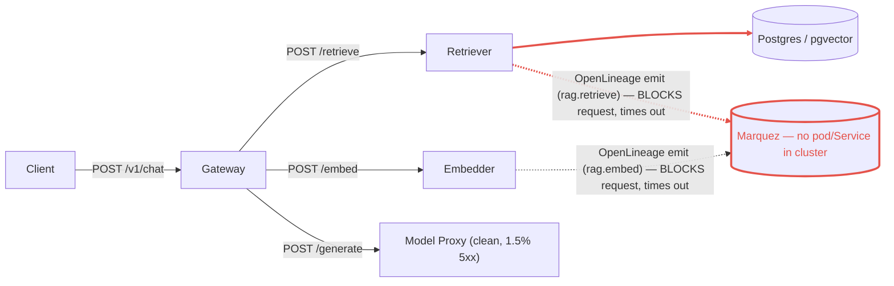

# Postmortem: gateway p95 latency above 2s

- **Status:** resolved
- **Severity:** sev1
- **Verified:** no
- **Opened:** 2026-08-04 21:15:41Z
- **Resolved:** 2026-08-04 21:25:41Z

## Timeline (machine-generated)

All times UTC on 2026-08-04 unless a full date is shown.

| Time (UTC) | Source | Event |
| --- | --- | --- |
| 21:12:36Z | log-spike | log-spike onset: error: Malformed JSON in request body |
| 21:15:10Z | alert | alert firing: Gateway p95 latency > 2s |
| 21:24:10Z | alert | alert resolved: Gateway p95 latency > 2s |

## Evidence links

- [Loki — logs over the incident window](http://localhost:3001/explore?schemaVersion=1&panes=%7B%22pm%22%3A+%7B%22datasource%22%3A+%22loki%22%2C+%22queries%22%3A+%5B%7B%22refId%22%3A+%22A%22%2C+%22datasource%22%3A+%7B%22type%22%3A+%22loki%22%2C+%22uid%22%3A+%22loki%22%7D%2C+%22expr%22%3A+%22%7Bnamespace%3D%5C%22subject%5C%22%7D+%7C~+%5C%22%28%3Fi%29error%7Cfailed%5C%22%22%7D%5D%2C+%22range%22%3A+%7B%22from%22%3A+%221785878141498%22%2C+%22to%22%3A+%221785878741471%22%7D%7D%7D&orgId=1)
- [Mimir — metrics over the incident window](http://localhost:3001/explore?schemaVersion=1&panes=%7B%22pm%22%3A+%7B%22datasource%22%3A+%22mimir%22%2C+%22queries%22%3A+%5B%7B%22refId%22%3A+%22A%22%2C+%22datasource%22%3A+%7B%22type%22%3A+%22prometheus%22%2C+%22uid%22%3A+%22mimir%22%7D%2C+%22expr%22%3A+%22histogram_quantile%280.95%2C+sum%28rate%28http_server_duration_milliseconds_bucket%5B5m%5D%29%29+by+%28le%29%29%22%7D%5D%2C+%22range%22%3A+%7B%22from%22%3A+%221785878141498%22%2C+%22to%22%3A+%221785878741471%22%7D%7D%7D&orgId=1)

## Investigation context

**Runbook match:** none — no tool narrowing applied for this alert. Available runbooks: README.md, canary-abort.md, ci-pipeline-red.md, dq-freshness-stall.md, gateway-high-error-rate.md, k8s-crashloop.md, k8s-node-failure.md, snapshot-agent-audit.md, stale-secret.md

Pre-check battery (as injected at run start)

## Pre-check leads

### recent_deploys — LEAD
No deploy in the last 60m — rule out the reflex answer.
- No deploy in the last 60m — rule out the reflex answer.

### log_spike — LEAD
error/failed log rate 200/10min vs baseline 0/10min (200x baseline) — onset: error: Malformed JSON in request body at 2026-08-04T21:12:36.621311+00:00
- error/failed log rate 200/10min vs baseline 0/10min (200x baseline) — onset: error: Malformed JSON in request body at 2026-08-04T21:12:36.621311+00:00

### attribution — LEAD
errors concentrate on gateway (26.1%); time concentrates in gateway's own handler (~4.3s of 7.8s) over the last 10m — which is not necessarily the workload named on the alert:
- gateway: 26.1% of its OWN responses are 5xx (10m)
- retriever: 25.0% of its OWN responses are 5xx (10m)
- model-proxy: 1.5% of its OWN responses are 5xx (10m)
- gateway → POST retriever: 25.8% of those outbound calls failed
- gateway → POST model-proxy: 7.1% of those outbound calls failed
- own-handler p95 (server p95 minus its slowest outbound call — a ranking, not a measurement): gateway ~4.3s of 7.8s end to end, embedder ~3.4s of 3.4s end to end, retriever ~3.0s of 3.0s end to end
- gateway → POST embedder: p95 3.4s outbound
- gateway → POST retriever: p95 3.0s outbound

### rollout_state — LEAD
1 rollout-state lead
- analysisrun for gateway (gateway-8444846b5f-21-1): Failed — Metric "canary-error-rate" assessed Failed due to failed (2) > failureLimit (1)

### kube_scan — OK
all pods Ready, no notable cluster events

### secret_age — OK
Secret subject-db-credentials last modified 10d 21h ago (created 10d 21h ago).

## Narrative

## Summary
`Gateway p95 latency > 2s` fired for tenant acme. Gateway's own p95 for `POST /v1/chat` ran anywhere from ~4.9s to ~10s through the incident window, well above the 2s SLO. No gateway deploy occurred in the hour before onset, ruling out the reflex "bad deploy" answer — the Argo history shows gateway's last sync completing well before the metric started climbing, and `deploy_history` explicitly returned no deploy in the preceding 60 minutes.

## Impact
Every `/v1/chat` request through gateway was affected: p95 end-to-end latency spent most of the window between roughly 2.4x and 5x the 2s SLO, with 5xx elevated on gateway (26.1% of its own responses) and on retriever (25.0% of its own responses), and gateway's own outbound call to retriever failing 25.8% of the time. tenant acme's chat traffic was the exposed surface.

## Root cause
Both `retriever` and `embedder` log a recurring `"lineage emit failed"` warning with `"reason":"The operation timed out."` for jobs `rag.retrieve` and `rag.embed` respectively — this is the OpenLineage event emission each service performs on every request. Cross-checking `kubectl get pods -A` and `kubectl get svc -n subject` shows **no Marquez pod or Service exists anywhere in this cluster** — the lineage sink both services call is simply not reachable from this environment. Because that emit call sits synchronously in the request-handling path (not fire-and-forget, not budgeted with a short circuit-breaking timeout), every retrieve/embed call pays the full multi-second timeout: retriever's own-handler p95 tracked ~2.4-3.0s and embedder's ~3.0-3.4s, matching the metric-series jump seen in `request_duration_seconds` for both services (flat at 0.00475s baseline, then stepping to multi-second p95 for the incident duration). With only a single replica each (`embedder` 1/1, `retriever` 1/1) and ~16 req/s of load against each, CPU/memory stayed low (95-273m CPU, <130Mi) — this was pure I/O-wait queueing behind the blocked lineage call, not a resource constraint, which is why gateway's end-to-end p95 (7.8-10s) ran well above either downstream component's own p95: sequential retrieve→embed calls each individually blocked, and requests queued behind the single pod of each.

Ruled out: gateway deploy/rollout (last canary at 18:57 already resolved to Healthy well before this alert and outside the deploy-history window), OOM/crashloop (`kube_scan` clean, zero restarts, `k8s_events` empty for retriever/embedder), stale DB secret (checked, 10d21h old, unrelated), and model-proxy (only 1.5% of its own responses were 5xx — clean).

## What fixed it
No remediation was executed. I proposed scaling `retriever` and `embedder` from 1→4 replicas each (to relieve the single-pod queueing amplifying the blocking lineage-timeout latency into gateway's p95) and dry-ran it, but the operator **denied** the request_approval call, so nothing was changed by this on-call session. Re-querying `alert_status` afterward shows the alert is no longer active, and retriever/embedder p95 have independently returned to the 0.00475s baseline — the underlying timeout condition appears to have stopped on its own (traffic-side or upstream-dependency-side), not because of anything this session did. This incident should be treated as **unresolved by remediation** even though the alert has since cleared.

## Lessons
- The OpenLineage emit call in `retriever`/`embedder` must not block the serving path — make it fire-and-forget (or budget it to tens of milliseconds with a hard client-side timeout) so a dead/unreachable Marquez doesn't add multi-second tail latency to every RAG request.
- `retriever` and `embedder` each run a single replica; any per-request stall on either turns into compounding p95 amplification under real load. Worth a standing HPA or minimum-replica bump independent of this incident.
- There is genuinely no Marquez deployment in this cluster's `subject` (or any) namespace — either restore it, or point lineage emission at a real endpoint, or remove the blocking dependency; leaving it dangling makes this a recurring failure mode.
- No runbook currently matches `Gateway p95 latency > 2s` — this incident is a good template for one: check retriever/embedder own-handler p95 and grep for `"lineage emit failed"` before chasing deploys.

