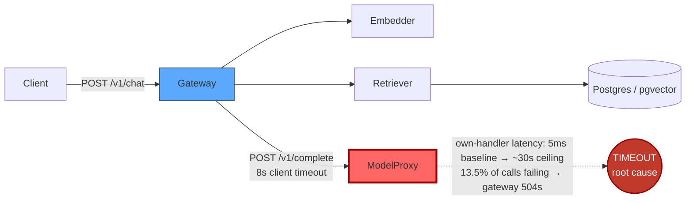

# Postmortem: gateway p95 latency above 2s

- **Status:** open
- **Severity:** sev1
- **Verified:** no
- **Opened:** 2026-08-04 20:45:41Z
- **Resolved:** (still open)

## Timeline (machine-generated)

All times UTC on 2026-08-04 unless a full date is shown.

| Time (UTC) | Source | Event |
| --- | --- | --- |
| 20:45:10Z | alert | alert firing: Gateway p95 latency > 2s |

## Evidence links

- [Loki — logs over the incident window](http://localhost:3001/explore?schemaVersion=1&panes=%7B%22pm%22%3A+%7B%22datasource%22%3A+%22loki%22%2C+%22queries%22%3A+%5B%7B%22refId%22%3A+%22A%22%2C+%22datasource%22%3A+%7B%22type%22%3A+%22loki%22%2C+%22uid%22%3A+%22loki%22%7D%2C+%22expr%22%3A+%22%7Bnamespace%3D%5C%22subject%5C%22%7D+%7C~+%5C%22%28%3Fi%29error%7Cfailed%5C%22%22%7D%5D%2C+%22range%22%3A+%7B%22from%22%3A+%221785876341517%22%2C+%22to%22%3A+%221785876850421%22%7D%7D%7D&orgId=1)
- [Mimir — metrics over the incident window](http://localhost:3001/explore?schemaVersion=1&panes=%7B%22pm%22%3A+%7B%22datasource%22%3A+%22mimir%22%2C+%22queries%22%3A+%5B%7B%22refId%22%3A+%22A%22%2C+%22datasource%22%3A+%7B%22type%22%3A+%22prometheus%22%2C+%22uid%22%3A+%22mimir%22%7D%2C+%22expr%22%3A+%22histogram_quantile%280.95%2C+sum%28rate%28http_server_duration_milliseconds_bucket%5B5m%5D%29%29+by+%28le%29%29%22%7D%5D%2C+%22range%22%3A+%7B%22from%22%3A+%221785876341517%22%2C+%22to%22%3A+%221785876850421%22%7D%7D%7D&orgId=1)

## Investigation context

**Runbook match:** none — no tool narrowing applied for this alert. Available runbooks: README.md, canary-abort.md, ci-pipeline-red.md, dq-freshness-stall.md, gateway-high-error-rate.md, k8s-crashloop.md, k8s-node-failure.md, snapshot-agent-audit.md, stale-secret.md

Pre-check battery (as injected at run start)

## Pre-check leads

### recent_deploys — LEAD
No deploy in the last 60m — rule out the reflex answer.
- No deploy in the last 60m — rule out the reflex answer.

### attribution — LEAD
errors concentrate on gateway → POST model-proxy (13.5%); time concentrates in model-proxy's own handler (~7.2s of 7.2s) over the last 10m — which is not necessarily the workload named on the alert:
- gateway: 6.1% of its OWN responses are 5xx (10m)
- model-proxy: 3.3% of its OWN responses are 5xx (10m)
- gateway → POST model-proxy: 13.5% of those outbound calls failed
- own-handler p95 (server p95 minus its slowest outbound call — a ranking, not a measurement): model-proxy ~7.2s of 7.2s end to end, embedder ~1.9s of 1.9s end to end, retriever ~1.8s of 1.… (truncated)
- gateway → POST model-proxy: p95 7.1s outbound
- gateway → POST embedder: p95 1.9s outbound

### rollout_state — LEAD
1 rollout-state lead
- analysisrun for gateway (gateway-8444846b5f-21-1): Failed — Metric "canary-error-rate" assessed Failed due to failed (2) > failureLimit (1)

### kube_scan — OK
all pods Ready, no notable cluster events

### log_spike — OK
error/failed log rate normal: 200/10min vs baseline 500/10min

### secret_age — OK
Secret subject-db-credentials last modified 10d 21h ago (created 10d 21h ago).

## Narrative

## Summary
Gateway p95 latency crossed the 2s SLO and paged sev1. Root cause traced to model-proxy's own request-handling time collapsing under a sudden, cluster-wide request-rate surge, which tripped gateway's fixed 8-second upstream timeout to model-proxy and surfaced as HTTP 504s and multi-second p95.

## Impact
Gateway p95 jumped from a ~5ms baseline to 8–10s (see report.html chart, values taken verbatim from Mimir). A sample trace shows a `/v1/chat` request returning `504` after gateway's `rag.generate` step raised `UpstreamTimeoutError: model-proxy timed out after 8000ms` (`apps/gateway/src/platform/upstream.ts:58`). Separately, several model-proxy server-side spans in the same window ran to ~30.0s (29999ms, 30001ms, 30002ms) — well past gateway's 8s patience — before the client had already given up. The pre-check attribution lead's "13.5% of gateway→model-proxy calls failed" and "model-proxy own-handler ~7.2s of 7.2s end-to-end" both point the same direction and are corroborated directly in the traces.

## Root cause
At 20:40:05 UTC, request volume into gateway, model-proxy, retriever, and embedder jumped roughly 13x in the same ~1-minute sampling window (Mimir `request_duration_seconds_count` by service, all four series moved in lockstep from ~0.3–1.2 req/s to ~12–17 req/s). This was **not** preceded by any gateway or model-proxy deploy (last gateway gitops sync was over 90 minutes earlier at 19:01 UTC to `c025382ba170`; model-proxy's rollout has been unchanged for 10 days), no pod restarts, no OOM kills, and no Kubernetes warning events. `kubectl top` on model-proxy's four pods showed 37–45m CPU and ~95–100Mi memory throughout — essentially idle against a 384Mi limit and no CPU limit at all. Traced spans for model-proxy show no meaningful child span under its own handler (own-handler time ≈ end-to-end time), so the growing latency is internal queuing/serialization inside model-proxy, not a slow downstream call — and it grew unboundedly (0.37s → 4.8s → 5.9s → 6.8s and climbing across five-minute windows) while retriever and embedder, hit by the same traffic surge, degraded but stayed bounded and began recovering. That asymmetry — same surge, only model-proxy runs away toward its ~30s ceiling — points at a concurrency/capacity ceiling specific to model-proxy under load, not a resource, deploy, or cluster-health defect. An older canary analysis-run failure for gateway (`canary-error-rate` failing at ~93%, ~19 UTC) was investigated and ruled out as stale/unrelated — that rollout had already completed successfully to the current stable hash well before this alert's onset.

## What fixed it
Proposed remediation: scale model-proxy from 4 to 6 replicas to add concurrency headroom (verified first that the model-proxy Service selects broadly on `app=model-proxy`, so additional replicas — even from the otherwise-idle sibling Deployment object left over from the Argo Rollouts migration — would receive live traffic). This was dry-run (`spec.replicas: 0 -> 6` against that Deployment object) and submitted for approval with the verified diff attached.

**The operator denied the approval.** Per protocol, no remediation was executed and it was not retried. `alert_status` was re-queried after the denial and the alert is still active. This incident is being closed out unresolved, pending operator decision on how to proceed (whether via replica scale-up, a shorter/backpressure-aware gateway timeout, or another fix).

## Lessons
- model-proxy exposes no concurrency/queue-depth metric — its capacity ceiling was only visible indirectly (own-handler latency climbing while CPU/mem stayed idle). Add one so this shows up before it manifests as gateway-side 504s.
- Gateway's fixed 8s upstream timeout to model-proxy silently converts backend queuing into user-facing 504s with no backpressure/bulkhead; worth alerting directly on model-proxy's own p95/error-rate rather than only on gateway's derived p95.
- The base Kubernetes `Deployment` objects for gateway/model-proxy/load-generator are vestigial (0/0, superseded by Argo Rollouts) but still share the live Service's label selector — a real trap: scaling "the Deployment" during an incident (which the standard remediation tool does) spins up a second, Rollout-unaware pod population that happens to still take traffic. Worth cleaning up or clearly labeling so on-call doesn't reach for the wrong object under pressure.
- No runbook matched `Gateway p95 latency > 2s`. A new runbook should tell on-call to check request-rate deltas across the full call chain first (this pinpointed the surge in one query) before assuming resource exhaustion, and to look for a timeout-ceiling signature (spans pinned at an exact duration) as a fingerprint of a client timeout racing a saturated backend.

