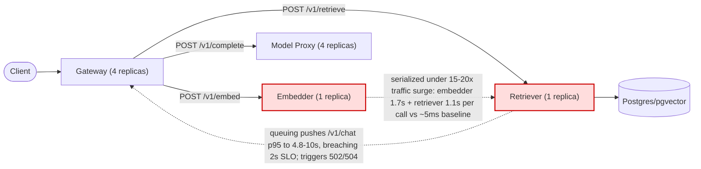

# Postmortem: gateway p95 latency above 2s

- **Status:** resolved
- **Severity:** sev1
- **Verified:** no
- **Opened:** 2026-08-04 19:45:52Z
- **Resolved:** 2026-08-04 20:00:49Z

## Timeline (machine-generated)

All times UTC on 2026-08-04 unless a full date is shown.

| Time (UTC) | Source | Event |
| --- | --- | --- |
| 19:40:46Z | deploy:ci | CI run #114 failure on main: obs: load-generator: drop the defensive copy in percentile() |
| 19:45:10Z | alert | alert firing: Gateway p95 latency > 2s |
| 19:50:45Z | deploy:ci | CI run #115 success on main: obs: Revert "load-generator: drop the defensive copy in percentile()" |
| 19:56:10Z | alert | alert resolved: Gateway p95 latency > 2s |

## Evidence links

- [Loki — logs over the incident window](http://localhost:3001/explore?schemaVersion=1&panes=%7B%22pm%22%3A+%7B%22datasource%22%3A+%22loki%22%2C+%22queries%22%3A+%5B%7B%22refId%22%3A+%22A%22%2C+%22datasource%22%3A+%7B%22type%22%3A+%22loki%22%2C+%22uid%22%3A+%22loki%22%7D%2C+%22expr%22%3A+%22%7Bnamespace%3D%5C%22subject%5C%22%7D+%7C~+%5C%22%28%3Fi%29error%7Cfailed%5C%22%22%7D%5D%2C+%22range%22%3A+%7B%22from%22%3A+%221785872752514%22%2C+%22to%22%3A+%221785873649120%22%7D%7D%7D&orgId=1)
- [Mimir — metrics over the incident window](http://localhost:3001/explore?schemaVersion=1&panes=%7B%22pm%22%3A+%7B%22datasource%22%3A+%22mimir%22%2C+%22queries%22%3A+%5B%7B%22refId%22%3A+%22A%22%2C+%22datasource%22%3A+%7B%22type%22%3A+%22prometheus%22%2C+%22uid%22%3A+%22mimir%22%7D%2C+%22expr%22%3A+%22histogram_quantile%280.95%2C+sum%28rate%28http_server_duration_milliseconds_bucket%5B5m%5D%29%29+by+%28le%29%29%22%7D%5D%2C+%22range%22%3A+%7B%22from%22%3A+%221785872752514%22%2C+%22to%22%3A+%221785873649120%22%7D%7D%7D&orgId=1)

## Investigation context

**Runbook match:** none — no tool narrowing applied for this alert. Available runbooks: README.md, canary-abort.md, ci-pipeline-red.md, dq-freshness-stall.md, gateway-high-error-rate.md, k8s-crashloop.md, k8s-node-failure.md, snapshot-agent-audit.md, stale-secret.md

Pre-check battery (as injected at run start)

## Pre-check leads

### recent_deploys — LEAD
1 deploy-window lead
- deploy annotation at 2026-08-04T19:01:45.359000+00:00: deploy gateway via gitops c025382 (argo sync)

### kube_scan — LEAD
5 kube-scan leads
- event AnalysisRun/gateway-8444846b5f-21-1: MetricFailed — Metric 'canary-error-rate' Completed. Result: Failed (at 20:58:02)
- event AnalysisRun/gateway-8444846b5f-21-1: MetricFailed — Metric 'canary-p95' Completed. Result: Failed (at 20:58:02)
- event AnalysisRun/gateway-8444846b5f-21-1: AnalysisRunFailed — Analysis Completed. Result: Failed (at 20:58:02)
- event Rollout/gateway: RolloutAborted — Rollout aborted update to revision 21: Step-based analysis phase error/failed: Metric \"canary-error-rate\" assessed Failed due to failed (2) > fai… (truncated)
- event Rollout/gateway: AnalysisRunFailed — Step Analysis Run 'gateway-8444846b5f-21-1' Status New: 'Failed' Previous: 'Running' (at 20:58:03)

### rollout_state — LEAD
1 rollout-state lead
- analysisrun for gateway (gateway-8444846b5f-21-1): Failed — Metric "canary-error-rate" assessed Failed due to failed (2) > failureLimit (1)

### log_spike — OK
error/failed log rate normal: 200/10min vs baseline 316/10min

### secret_age — OK
Secret subject-db-credentials last modified 10d 20h ago (created 10d 20h ago).

## Narrative

## Summary

Page fired on `Gateway p95 latency > 2s` (tenant acme). Investigation found the gateway's `/v1/chat` route repeatedly blowing past the 2s SLO in periodic bursts (~5-10s p95), driven by the `retriever` and `embedder` services — both scaled to a single replica — saturating under periodic ~15-20x traffic surges. A same-window gateway canary rollout (revision 21) also aborted on failed `canary-error-rate`/`canary-p95` analysis, but that was a casualty of this same pre-existing saturation, not its cause.

## Impact

`/v1/chat` p95 latency reached 4.8-10s across at least four distinct bursts in the incident window (roughly every 20-25 minutes, each lasting ~10-12 minutes), each accompanied by a rise in gateway 5xx/502/504 responses (evidence: `sum(rate(request_duration_seconds_count{service="gateway",http_route="/v1/chat"}[2m])) by (http_status_code)` shows 500/502/504 climbing in lockstep with each latency burst). Tenant `acme` traffic was affected; a minor 429 share also appeared during bursts (expected rate-limiting behavior, not incremental impact).

## Root cause

`kubectl get deployments -n subject` shows `gateway` and `model-proxy` each running 4 replicas, but `retriever` and `embedder` each running exactly 1 (`retriever-dc7ddd494-jv9j7`, `embedder-596696c46d-s25xc`, both `1/1`, zero restarts, no OOM/eviction events, healthy per `kubectl describe pod`). `mimir_query` on `request_duration_seconds_count` shows request rate to gateway/embedder/retriever/model-proxy jumping from a ~0.3-1.2 req/s baseline to 10-20 req/s in lockstep, exactly coincident with each p95 spike (e.g. embedder rate 0.30 → 17.98 req/s at the 18:30 burst onset). A full Tempo trace of a 7.1s `/v1/chat` request during a burst (`426108fa9878031bd4b23a694df6e972`) shows the `rag.retrieve` span alone taking ~2.8s, made up of a 1.69s `POST embedder` call followed by a 1.14s `POST retriever` call — both against baseline `/health` p95 of ~0.00475s on those same services. This is a single-replica capacity bottleneck: `retriever` and `embedder` have no burst headroom, so incoming traffic surges serialize/queue on the lone pod of each, and that queuing latency propagates straight into gateway's `/v1/chat` response time and eventually into request timeouts (502/504). The `deploy_history`/`argo_app`/`analysisrun_get` evidence rules out the gateway deploys as cause: the gitops sync to `c025382ba170` at 19:01:47 landed *after* the latency pattern was already established (first burst onset ~18:27-18:30 UTC, per `request_duration_seconds_bucket` histograms), and the prior canary AnalysisRun (`gateway-8444846b5f-21-1`) failed specifically because it sampled `canary-p95`/`canary-error-rate` during one of these pre-existing saturation bursts — the rollout abort was a symptom, not the trigger.

## What fixed it

No fix was applied. The proposed remediation — scaling both `retriever` and `embedder` from 1 to 4 replicas (dry-run diffs: `spec.replicas: 1 -> 4` for each, action IDs `bf3dc7c95c6effcf` and `95a26bc412f86c40`) — was **denied by the operator** on both `request_approval` calls. No remediating action was executed. A subsequent `alert_status` check shows the alert no longer active, but this reflects the current burst having naturally subsided (consistent with the ~10-12 minute burst duration observed throughout the window), not any corrective action. The underlying single-replica bottleneck is unchanged and will recur on the next traffic surge.

## Lessons

- `retriever` and `embedder` need either a higher baseline replica count or an HPA keyed on request rate/latency — they are the narrowest part of the serving path by a wide margin (1 replica vs. 4 for gateway/model-proxy) despite sitting on the hot path of every `/v1/chat` call.
- Canary analysis (`canary-p95`, `canary-error-rate`) is doing its job correctly by failing during ambient saturation, but it means a legitimate deploy can get blocked by an unrelated capacity issue — worth decoupling canary judgment from ambient noise, or fixing the capacity issue first.
- No runbook currently matches `Gateway p95 latency > 2s` by exact alertname; `gateway-high-error-rate.md` is adjacent but doesn't cover the retriever/embedder replica-count check that was decisive here. Worth authoring a dedicated latency runbook that starts from "check replica count vs. request-rate burst" before chasing deploys.
- This incident remains **unresolved from a durability standpoint**: the trigger will recur on the next traffic burst since no capacity change was approved.

