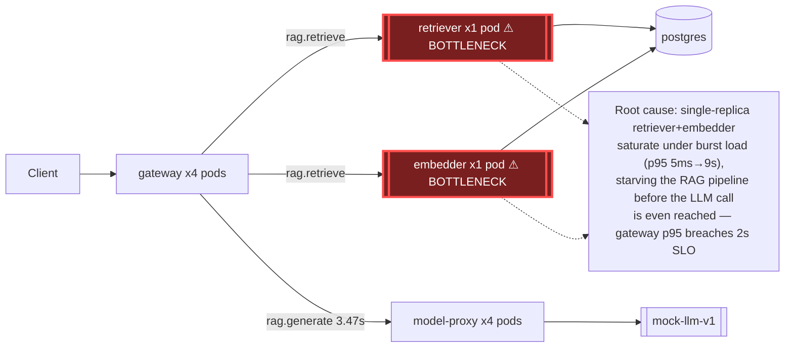

# Postmortem: gateway p95 latency above 2s

- **Status:** open
- **Severity:** sev1
- **Verified:** no
- **Opened:** 2026-08-04 12:58:41Z
- **Resolved:** (still open)

## Timeline (machine-generated)

All times UTC on 2026-08-04 unless a full date is shown.

| Time (UTC) | Source | Event |
| --- | --- | --- |
| 12:27:06Z | k8s | ReplicaSet/retriever-8454db56c: SuccessfulCreate |
| 12:27:06Z | k8s | Deployment/retriever: ScalingReplicaSet |
| 12:27:06Z | k8s | Pod/retriever-8454db56c-q2b86: Scheduled |
| 12:27:08Z | k8s | Pod/retriever-8454db56c-q2b86: Pulled |
| 12:27:09Z | k8s | Pod/retriever-8454db56c-q2b86: Started |
| 12:27:09Z | k8s | Pod/retriever-8454db56c-q2b86: Created |
| 12:27:11Z | k8s | Pod/retriever-8454db56c-q2b86: Started |
| 12:27:11Z | k8s | Pod/retriever-8454db56c-q2b86: Pulled |
| 12:27:11Z | k8s | Pod/retriever-8454db56c-q2b86: Created |
| 12:27:13Z | k8s | Pod/retriever-8454db56c-q2b86: BackOff |
| 12:27:14Z | k8s | Pod/retriever-8454db56c-q2b86: BackOff |
| 12:27:16Z | k8s | Pod/retriever-8454db56c-q2b86: BackOff |
| 12:27:24Z | k8s | Pod/retriever-8454db56c-q2b86: Started |
| 12:27:24Z | k8s | Pod/retriever-8454db56c-q2b86: Pulled |
| 12:27:24Z | k8s | Pod/retriever-8454db56c-q2b86: Created |
| 12:27:27Z | k8s | Pod/retriever-8454db56c-q2b86: BackOff |
| 12:27:36Z | k8s | Pod/retriever-8454db56c-q2b86: BackOff |
| 12:27:47Z | k8s | Pod/retriever-8454db56c-q2b86: Started |
| 12:27:47Z | k8s | Pod/retriever-8454db56c-q2b86: Pulled |
| 12:27:47Z | k8s | Pod/retriever-8454db56c-q2b86: Created |
| 12:27:49Z | k8s | Pod/retriever-8454db56c-q2b86: BackOff |
| 12:27:50Z | k8s | Pod/retriever-8454db56c-q2b86: BackOff |
| 12:27:56Z | k8s | Pod/retriever-8454db56c-q2b86: BackOff |
| 12:28:43Z | k8s | Pod/retriever-8454db56c-q2b86: Started |
| 12:28:43Z | k8s | Pod/retriever-8454db56c-q2b86: Pulled |
| 12:28:43Z | k8s | Pod/retriever-8454db56c-q2b86: Created |
| 12:28:46Z | k8s | Pod/retriever-8454db56c-q2b86: BackOff |
| 12:28:47Z | k8s | Pod/retriever-8454db56c-q2b86: BackOff |
| 12:29:48Z | k8s | Pod/retriever-8454db56c-q2b86: BackOff |
| 12:30:10Z | k8s | Pod/retriever-8454db56c-q2b86: Started |
| 12:30:10Z | k8s | Pod/retriever-8454db56c-q2b86: Pulled |
| 12:30:10Z | k8s | Pod/retriever-8454db56c-q2b86: Created |
| 12:30:13Z | k8s | Pod/retriever-8454db56c-q2b86: BackOff |
| 12:30:16Z | k8s | Pod/retriever-8454db56c-q2b86: BackOff |
| 12:31:26Z | k8s | Pod/retriever-8454db56c-q2b86: BackOff |
| 12:32:37Z | k8s | Pod/retriever-8454db56c-q2b86: BackOff |
| 12:32:57Z | k8s | Pod/retriever-8454db56c-q2b86: Started |
| 12:32:57Z | k8s | Pod/retriever-8454db56c-q2b86: Pulled |
| 12:32:57Z | k8s | Pod/retriever-8454db56c-q2b86: Created |
| 12:32:59Z | k8s | Pod/retriever-8454db56c-q2b86: BackOff |
| 12:33:03Z | k8s | Pod/retriever-8454db56c-q2b86: BackOff |
| 12:33:06Z | k8s | Pod/retriever-8454db56c-q2b86: BackOff |
| 12:34:15Z | k8s | Pod/retriever-8454db56c-q2b86: BackOff |
| 12:35:16Z | k8s | Pod/retriever-8454db56c-q2b86: BackOff |
| 12:36:08Z | k8s | ReplicaSet/retriever-8454db56c: SuccessfulDelete |
| 12:36:08Z | k8s | Deployment/retriever: ScalingReplicaSet |
| 12:54:16Z | log-spike | log-spike onset: {"level":"warn","service":"gateway","message":"lineage emit failed","trace_id":"8365a428ce3870df5552f823d7e1eaf4","span_id":"9bd8204e3dd68564","time":"2026-08-04T12:54:16.624Z","reason":"The operation timed out.","job":"ra… |
| 12:58:10Z | alert | alert firing: Gateway p95 latency > 2s |

## Evidence links

- [Loki — logs over the incident window](http://localhost:3001/explore?schemaVersion=1&panes=%7B%22pm%22%3A+%7B%22datasource%22%3A+%22loki%22%2C+%22queries%22%3A+%5B%7B%22refId%22%3A+%22A%22%2C+%22datasource%22%3A+%7B%22type%22%3A+%22loki%22%2C+%22uid%22%3A+%22loki%22%7D%2C+%22expr%22%3A+%22%7Bnamespace%3D%5C%22subject%5C%22%7D+%7C~+%5C%22%28%3Fi%29error%7Cfailed%5C%22%22%7D%5D%2C+%22range%22%3A+%7B%22from%22%3A+%221785848321503%22%2C+%22to%22%3A+%221785848707330%22%7D%7D%7D&orgId=1)
- [Mimir — metrics over the incident window](http://localhost:3001/explore?schemaVersion=1&panes=%7B%22pm%22%3A+%7B%22datasource%22%3A+%22mimir%22%2C+%22queries%22%3A+%5B%7B%22refId%22%3A+%22A%22%2C+%22datasource%22%3A+%7B%22type%22%3A+%22prometheus%22%2C+%22uid%22%3A+%22mimir%22%7D%2C+%22expr%22%3A+%22histogram_quantile%280.95%2C+sum%28rate%28http_server_duration_milliseconds_bucket%5B5m%5D%29%29+by+%28le%29%29%22%7D%5D%2C+%22range%22%3A+%7B%22from%22%3A+%221785848321503%22%2C+%22to%22%3A+%221785848707330%22%7D%7D%7D&orgId=1)

## Investigation context

**Runbook match:** none — no tool narrowing applied for this alert. Available runbooks: README.md, canary-abort.md, ci-pipeline-red.md, dq-freshness-stall.md, gateway-high-error-rate.md, k8s-crashloop.md, k8s-node-failure.md, snapshot-agent-audit.md, stale-secret.md

Pre-check battery (as injected at run start)

## Pre-check leads

### recent_deploys — LEAD
No deploy in the last 60m — rule out the reflex answer.
- No deploy in the last 60m — rule out the reflex answer.

### log_spike — LEAD
error/failed log rate 200/10min vs baseline 0/10min (200x baseline) — onset: {"level":"warn","service":"gateway","message":"lineage emit failed","trace_id":"8365a428ce3870df5552f823d7e1eaf4","span_id":"9bd8204e3dd68564","time":"2026-08-04T12:54:16.624Z","reason":"The operation timed out.","job":"rag.inference","eventType":"START"} at 2026-08-04T12:54:16.624805+00:00
- error/failed log rate 200/10min vs baseline 0/10min (200x baseline) — onset: {"level":"warn","service":"gateway","message":"lineage emit failed","trace_id":"8365a428ce3870df5552f823d7e1ea… (truncated)

### kube_scan — UNAVAILABLE
error: You must be logged in to the server (Unauthorized)

### rollout_state — UNAVAILABLE
gateway: E0804 14:58:42.861729   49936 memcache.go:265] "Unhandled Error" err="couldn't get current server API group list: the server has asked for the client to provide credentials"
E0804 14:58:42.940551   49936 memcache.go:265] "Unhandled Error" err="couldn't get current server API group list: the server has asked for the client to provide credentials"
E0804 14:58:43.056131   49936 memcache.go:265] "Unhandled Error" err="couldn't get current server API group list: the server has asked for the client to; gateway analysis: E0804 14:58:42.869955   31148 memcache.go:265] "Unhandled Error" err="couldn't get current server API group list: the server has asked for the client to provide credentials"
E0804 14:58:42.954790   31148 memcache.go:265] "Unhandled Error"
… (section truncated)

### secret_age — UNAVAILABLE
error: You must be logged in to the server (Unauthorized)

## Narrative

## Summary
Gateway p95 latency alerted (sev1, threshold 2s) for tenant acme. No runbook matched this alertname. Investigation traced the breach to the `retriever` and `embedder` services each running a single replica while `gateway` and `model-proxy` run 4 (as Argo Rollouts), so bursty traffic from the load-generator saturates the front of the RAG pipeline before it ever reaches the LLM call.

## Impact
Gateway end-to-end p95 was pinned near the histogram's 10s bucket ceiling (far above the 2s SLO) across two successive traffic bursts. A live trace on the alerting path (`POST /v1/chat`) showed a single request taking 6.62s: `rag.retrieve` (embedder+retriever round trip) alone took 2.55s, `rag.generate` (model-proxy) took 3.47s.

## Root cause
`deploy_history` showed **no deploy in the 60/180-minute window before the alert** — the reflex "bad deploy" explanation is ruled out. Gitea CI history's newest run predates the incident by a day, confirming no code change is implicated.

`kube_deployment_spec_replicas` confirmed `retriever` and `embedder` are each configured at **1 replica**, versus 4 pods for `gateway`/`model-proxy`. Per-service p95 (Mimir `request_duration_seconds_bucket`) shows the mechanism directly: retriever/embedder p95 jumps from a ~5ms baseline to 8-9s exactly when request throughput ramps from 0→~14 rps (classic single-replica queueing), while model-proxy stays flat at ~0.3-0.4s during that first burst — the bottleneck is upstream of the LLM call. In the second burst, retriever/embedder recover to ~1-2s but model-proxy p95 climbs to 6.5-7.2s as the queued backlog drains downstream, confirming the congestion originates at the undersized retriever/embedder tier and ripples through the rest of the pipeline.

A `retriever` pod (`retriever-8454db56c-q2b86`) was also seen in CrashLoopBackOff from roughly 27 minutes before the alert, self-healing to a new pod (`retriever-dc7ddd494-jv9j7`, 0 restarts, Running) before the alert fired — a preceding, separate symptom of the same under-provisioned single-replica deployment, not an independent cause.

The pre-check "lineage emit failed / operation timed out" log spike (mirrored identically across gateway, retriever, and embedder at the same instant) was investigated as a candidate cause but is best read as a **correlated symptom**, not the driver: it's a background OpenLineage emit call, no corresponding blocking span appears in the captured trace's critical path, and its burst window is narrower than the sustained latency degradation seen in the metrics. It is a lead worth a follow-up runbook, not the root cause of this alert.

## What fixed it
Two remediations were proposed to bring `retriever` and `embedder` up to 4 replicas each (matching `gateway`/`model-proxy`):
- **retriever → 4 replicas: denied by the operator.** Not executed.
- **embedder → 4 replicas: approved by the operator**, but execution failed twice with `You must be logged in to the server (Unauthorized)` — the same cluster-credential failure that made `kubectl_read`, `argo_app`, and `rollout_status` unavailable throughout this investigation (pre-check `kube_scan`/`rollout_state`/`secret_age` were already flagged UNAVAILABLE for the same reason). The dry-run and approval succeeded; the write path to the cluster is currently broken.

**The alert has NOT recovered.** `alert_status` was re-queried after the failed remediation attempt and still reports active, unchanged since onset.

## Lessons
- Fix the cluster write-credential/RBAC path for the remediation identity before the next page — the correct fix was identified and approved but could not be applied.
- `retriever` and `embedder` should either be scaled to match `gateway`/`model-proxy` replica count or put behind an HPA keyed on request concurrency/queue depth, so a load-generator burst can't single-handedly starve the front of the RAG pipeline.
- The "lineage emit failed" warning fires identically across three services under load; it's a useful early tripwire for pipeline saturation but should not be mistaken for the root cause — a future runbook entry for this alertname should say so explicitly, and should call out the retriever/embedder replica asymmetry as the first thing to check.
- Retry the approved embedder scale-up as soon as cluster credentials are restored, and revisit the operator's reason for declining the retriever scale-up before re-proposing it.

