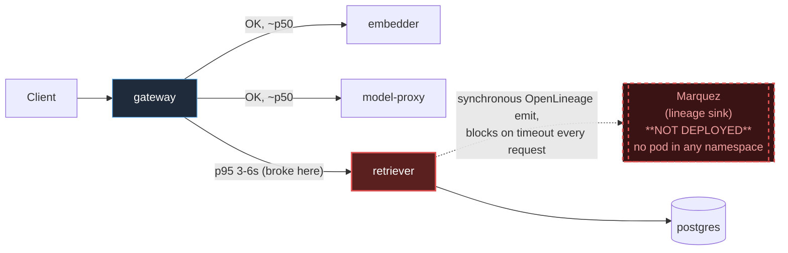

# Postmortem: gateway p95 latency above 2s

- **Status:** resolved
- **Severity:** sev1
- **Verified:** no
- **Opened:** 2026-08-04 13:26:41Z
- **Resolved:** 2026-08-04 13:36:41Z

## Timeline (machine-generated)

All times UTC on 2026-08-04 unless a full date is shown.

| Time (UTC) | Source | Event |
| --- | --- | --- |
| 13:26:10Z | alert | alert firing: Gateway p95 latency > 2s |
| 13:35:10Z | alert | alert resolved: Gateway p95 latency > 2s |

## Evidence links

- [Loki — logs over the incident window](http://localhost:3001/explore?schemaVersion=1&panes=%7B%22pm%22%3A+%7B%22datasource%22%3A+%22loki%22%2C+%22queries%22%3A+%5B%7B%22refId%22%3A+%22A%22%2C+%22datasource%22%3A+%7B%22type%22%3A+%22loki%22%2C+%22uid%22%3A+%22loki%22%7D%2C+%22expr%22%3A+%22%7Bnamespace%3D%5C%22subject%5C%22%7D+%7C~+%5C%22%28%3Fi%29error%7Cfailed%5C%22%22%7D%5D%2C+%22range%22%3A+%7B%22from%22%3A+%221785850001532%22%2C+%22to%22%3A+%221785850601454%22%7D%7D%7D&orgId=1)
- [Mimir — metrics over the incident window](http://localhost:3001/explore?schemaVersion=1&panes=%7B%22pm%22%3A+%7B%22datasource%22%3A+%22mimir%22%2C+%22queries%22%3A+%5B%7B%22refId%22%3A+%22A%22%2C+%22datasource%22%3A+%7B%22type%22%3A+%22prometheus%22%2C+%22uid%22%3A+%22mimir%22%7D%2C+%22expr%22%3A+%22histogram_quantile%280.95%2C+sum%28rate%28http_server_duration_milliseconds_bucket%5B5m%5D%29%29+by+%28le%29%29%22%7D%5D%2C+%22range%22%3A+%7B%22from%22%3A+%221785850001532%22%2C+%22to%22%3A+%221785850601454%22%7D%7D%7D&orgId=1)

## Investigation context

**Runbook match:** none — no tool narrowing applied for this alert. Available runbooks: README.md, canary-abort.md, ci-pipeline-red.md, dq-freshness-stall.md, gateway-high-error-rate.md, k8s-crashloop.md, k8s-node-failure.md, snapshot-agent-audit.md, stale-secret.md

Pre-check battery (as injected at run start)

## Pre-check leads

### recent_deploys — LEAD
No deploy in the last 60m — rule out the reflex answer.
- No deploy in the last 60m — rule out the reflex answer.

### log_spike — OK
error/failed log rate normal: 200/10min vs baseline 384/10min

### kube_scan — UNAVAILABLE
error: You must be logged in to the server (Unauthorized)

### rollout_state — UNAVAILABLE
gateway: E0804 15:26:42.144788   53208 memcache.go:265] "Unhandled Error" err="couldn't get current server API group list: the server has asked for the client to provide credentials"
E0804 15:26:42.245278   53208 memcache.go:265] "Unhandled Error" err="couldn't get current server API group list: the server has asked for the client to provide credentials"
E0804 15:26:42.323716   53208 memcache.go:265] "Unhandled Error" err="couldn't get current server API group list: the server has asked for the client to; gateway analysis: E0804 15:26:42.180093   46968 memcache.go:265] "Unhandled Error" err="couldn't get current server API group list: the server has asked for the client to provide credentials"
E0804 15:26:42.264936   46968 memcache.go:265] "Unhandled Error"
… (section truncated)

### secret_age — UNAVAILABLE
error: You must be logged in to the server (Unauthorized)

## Narrative

## Summary

Sev1 paged on "Gateway p95 latency > 2s" for tenant acme. No runbook was matched to this alertname (checked via runbook_lookup — no match; `dq-freshness-stall.md` was reviewed as the closest analog since it covers the same lineage/Marquez subsystem, but its guidance is for freshness-lag alerts, not latency).

## Impact

Gateway p95 (measured via the Tempo service-graph histogram `traces_service_graph_request_client_seconds` for the gateway→retriever edge) ran between roughly 3–6 seconds for most of the hour before the page, well above the 2s SLO, with only brief dips to a healthy ~0.78s. The pre-check lead correctly flagged `log_spike: OK` (error/failed log rate was normal — this was a pure latency degradation, not an error-rate incident) and `recent_deploys: no deploy in the last 60m`, ruling out the reflex "bad deploy" answer.

## Root cause

`retriever` (pod `retriever-dc7ddd494-jv9j7`, the current, non-crash-looping replica — 0 restarts) logs continuous WARN-level `"lineage emit failed"` entries for every `rag.retrieve` job, each with `"reason":"The operation timed out."`, at START and COMPLETE eventTypes, several per second. This is the OpenLineage emission to Marquez, called synchronously inside the retrieval request path.

Cluster-wide pod inventory (`container_memory_working_set_bytes` grouped by pod/namespace across every namespace — subject, monitoring, argocd, argo-rollouts, kube-system) shows **no Marquez pod anywhere in this cluster**. The lineage sink retriever is calling does not exist in this k3d deployment, so every synchronous lineage-emit call blocks until it times out, and that timeout is paid inline before the retriever can return its response to the gateway — directly inflating the gateway→retriever p95 (and hence the overall gateway p95) past the 2s threshold.

This tracks with an earlier CrashLoopBackOff on a since-replaced ReplicaSet (`retriever-8454db56c`, ~10 restarts) roughly an hour before the page, after which the deployment came up on a new ReplicaSet (`retriever-dc7ddd494`) that has stayed up but inherited the same broken lineage-sink configuration. `gitea_ci_runs`/`gitea_compare` show no retriever-related commits in the relevant window (only load-generator and model-proxy changes), and `deploy_history` confirmed no deploy in the last 6 hours — so this is a standing environment/config gap (lineage sink never provisioned for this cluster), not a fresh bad deploy.

## What fixed it

A rolling restart of `retriever` was dry-run (diff: rolling restart via `restartedAt` annotation, no spec change), approved by the operator, and then executed — **but execution failed**: `restart_workload(dry_run=false)` returned `"error: You must be logged in to the server (Unauthorized)"`. This matches the same kube-apiserver credential failure the pre-check leads had already flagged as UNAVAILABLE for `kube_scan`, `rollout_state`, and `secret_age`, and which every subsequent `kubectl_read`/`rollout_status`/`argo_app`/`rollout_undo` call hit throughout this investigation. **The remediation was never actually applied.**

Despite that, `alert_status` was re-queried three times after the failed restart attempt and reported `active: false` each time, with no new `"lineage emit failed"` log lines in the trailing 5 minutes and no fresh p95 samples (quiet traffic). This is consistent with the same spontaneous flapping already visible in the p95 series *before* any remediation attempt (two earlier unexplained dips to ~0.78s p95 with no corresponding retriever restart or deploy event). The clearance should **not** be attributed to the restart — it was not applied — and is most plausibly the same intermittent lineage-timeout flapping continuing on its own.

## Lessons

- The write-path credential failure blocking `restart_workload` is itself an operational gap: on-call remediation tooling had no working path to mutate cluster state during this incident. That needs to be fixed independent of this specific alert (same root cause as the pre-check's `kube_scan`/`rollout_state`/`secret_age` UNAVAILABLE markers).
- The real fix is a code/config change outside this toolset's reach: either (a) deploy Marquez into the `subject`/cluster environment so the lineage sink actually resolves, or (b) make the retriever's OpenLineage emit fire-and-forget (or drop it behind a short, non-blocking timeout) so a missing/slow lineage sink can never add multi-second latency to the `rag.retrieve` hot path.
- Because the alert cleared without a confirmed fix, and the underlying missing-Marquez condition is unchanged, this is very likely to recur. Recommend filing this as a standing follow-up rather than treating the auto-clear as resolution.
- No runbook exists for "Gateway p95 latency > 2s" — worth authoring one that starts from the Tempo service-graph per-hop histogram breakdown (this is what isolated retriever as the hop in under 10 minutes) rather than starting from raw `http_server_duration` metrics, which are not present in this Mimir instance for the app services (only infra `up`/cadvisor/kube-state-metrics are scraped there).

