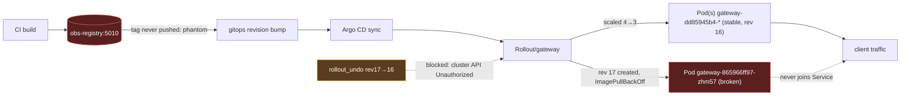

# Postmortem: subject/gateway-865966ff97-zhm57 container gateway stuck waiting: ImagePullBackOff

- **Status:** open
- **Severity:** sev1
- **Verified:** no
- **Opened:** 2026-08-04 13:51:20Z
- **Resolved:** (still open)

## Timeline (machine-generated)

All times UTC on 2026-08-04 unless a full date is shown.

| Time (UTC) | Source | Event |
| --- | --- | --- |
| 13:44:42Z | k8s | Rollout/gateway: RolloutUpdated |
| 13:44:42Z | k8s | Rollout/gateway: NewReplicaSetCreated |
| 13:44:43Z | k8s | Pod/gateway-dd85945b4-pwg4s: Killing |
| 13:44:43Z | k8s | ReplicaSet/gateway-dd85945b4: SuccessfulDelete |
| 13:44:43Z | k8s | Rollout/gateway: ScalingReplicaSet |
| 13:44:43Z | k8s | Rollout/gateway: RolloutNotCompleted |
| 13:44:44Z | k8s | ReplicaSet/gateway-865966ff97: SuccessfulCreate |
| 13:44:44Z | k8s | Rollout/gateway: ScalingReplicaSet |
| 13:44:44Z | k8s | Pod/gateway-865966ff97-zhm57: Scheduled |
| 13:44:46Z | k8s | Pod/gateway-865966ff97-zhm57: Failed |
| 13:44:46Z | k8s | Pod/gateway-865966ff97-zhm57: Pulling |
| 13:44:47Z | k8s | Pod/gateway-865966ff97-zhm57: Failed |
| 13:44:47Z | k8s | Pod/gateway-865966ff97-zhm57: BackOff |
| 13:44:57Z | k8s | Pod/gateway-865966ff97-zhm57: Failed |
| 13:44:57Z | k8s | Pod/gateway-865966ff97-zhm57: Pulling |
| 13:45:08Z | k8s | Pod/gateway-865966ff97-zhm57: Failed |
| 13:45:08Z | k8s | Pod/gateway-865966ff97-zhm57: BackOff |
| 13:45:19Z | k8s | Pod/gateway-865966ff97-zhm57: Failed |
| 13:45:19Z | k8s | Pod/gateway-865966ff97-zhm57: Pulling |
| 13:45:33Z | k8s | Pod/gateway-865966ff97-zhm57: Failed |
| 13:45:33Z | k8s | Pod/gateway-865966ff97-zhm57: BackOff |
| 13:45:46Z | k8s | Pod/gateway-865966ff97-zhm57: Failed |
| 13:45:46Z | k8s | Pod/gateway-865966ff97-zhm57: BackOff |
| 13:45:57Z | k8s | Pod/gateway-865966ff97-zhm57: Failed |
| 13:45:57Z | k8s | Pod/gateway-865966ff97-zhm57: BackOff |
| 13:46:10Z | k8s | Pod/gateway-865966ff97-zhm57: Failed |
| 13:46:10Z | k8s | Pod/gateway-865966ff97-zhm57: Pulling |
| 13:46:24Z | k8s | Pod/gateway-865966ff97-zhm57: Failed |
| 13:46:24Z | k8s | Pod/gateway-865966ff97-zhm57: BackOff |
| 13:46:37Z | k8s | Pod/gateway-865966ff97-zhm57: Failed |
| 13:46:37Z | k8s | Pod/gateway-865966ff97-zhm57: BackOff |
| 13:46:48Z | k8s | Pod/gateway-865966ff97-zhm57: Failed |
| 13:46:48Z | k8s | Pod/gateway-865966ff97-zhm57: BackOff |
| 13:47:00Z | k8s | Pod/gateway-865966ff97-zhm57: Failed |
| 13:47:00Z | k8s | Pod/gateway-865966ff97-zhm57: BackOff |
| 13:47:13Z | k8s | Pod/gateway-865966ff97-zhm57: Failed |
| 13:47:13Z | k8s | Pod/gateway-865966ff97-zhm57: BackOff |
| 13:47:27Z | k8s | Pod/gateway-865966ff97-zhm57: Failed |
| 13:47:27Z | k8s | Pod/gateway-865966ff97-zhm57: BackOff |
| 13:47:38Z | k8s | Pod/gateway-865966ff97-zhm57: Failed |
| 13:47:38Z | k8s | Pod/gateway-865966ff97-zhm57: Pulling |
| 13:47:49Z | k8s | Pod/gateway-865966ff97-zhm57: Failed |
| 13:47:49Z | k8s | Pod/gateway-865966ff97-zhm57: BackOff |
| 13:47:52Z | log-spike | log-spike onset: [gateway] unhandled error: 16 \| } |
| 13:48:03Z | k8s | Pod/gateway-865966ff97-zhm57: Failed |
| 13:48:03Z | k8s | Pod/gateway-865966ff97-zhm57: BackOff |
| 13:48:16Z | k8s | Pod/gateway-865966ff97-zhm57: Failed |
| 13:48:16Z | k8s | Pod/gateway-865966ff97-zhm57: BackOff |
| 13:48:31Z | k8s | Pod/gateway-865966ff97-zhm57: Failed |
| 13:48:31Z | k8s | Pod/gateway-865966ff97-zhm57: BackOff |
| 13:48:44Z | k8s | Pod/gateway-865966ff97-zhm57: BackOff |
| 13:48:56Z | k8s | Pod/gateway-865966ff97-zhm57: BackOff |
| 13:49:10Z | k8s | Pod/gateway-865966ff97-zhm57: BackOff |
| 13:49:21Z | k8s | Pod/gateway-865966ff97-zhm57: BackOff |
| 13:49:35Z | k8s | Pod/gateway-865966ff97-zhm57: BackOff |
| 13:49:48Z | k8s | Pod/gateway-865966ff97-zhm57: Failed |
| 13:49:48Z | k8s | Pod/gateway-865966ff97-zhm57: BackOff |
| 13:50:50Z | alert | alert firing: KubeContainerWaiting |
| 13:54:47Z | k8s | Pod/gateway-865966ff97-zhm57: Failed |
| 13:54:47Z | k8s | Pod/gateway-865966ff97-zhm57: BackOff |

## Evidence links

- [Loki — logs over the incident window](http://localhost:3001/explore?schemaVersion=1&panes=%7B%22pm%22%3A+%7B%22datasource%22%3A+%22loki%22%2C+%22queries%22%3A+%5B%7B%22refId%22%3A+%22A%22%2C+%22datasource%22%3A+%7B%22type%22%3A+%22loki%22%2C+%22uid%22%3A+%22loki%22%7D%2C+%22expr%22%3A+%22%7Bnamespace%3D%5C%22subject%5C%22%7D+%7C~+%5C%22%28%3Fi%29error%7Cfailed%5C%22%22%7D%5D%2C+%22range%22%3A+%7B%22from%22%3A+%221785851480170%22%2C+%22to%22%3A+%221785851701987%22%7D%7D%7D&orgId=1)
- [Mimir — metrics over the incident window](http://localhost:3001/explore?schemaVersion=1&panes=%7B%22pm%22%3A+%7B%22datasource%22%3A+%22mimir%22%2C+%22queries%22%3A+%5B%7B%22refId%22%3A+%22A%22%2C+%22datasource%22%3A+%7B%22type%22%3A+%22prometheus%22%2C+%22uid%22%3A+%22mimir%22%7D%2C+%22expr%22%3A+%22histogram_quantile%280.95%2C+sum%28rate%28http_server_duration_milliseconds_bucket%5B5m%5D%29%29+by+%28le%29%29%22%7D%5D%2C+%22range%22%3A+%7B%22from%22%3A+%221785851480170%22%2C+%22to%22%3A+%221785851701987%22%7D%7D%7D&orgId=1)

## Investigation context

**Runbook match (1):** `k8s-crashloop.md` — toolset narrowed to 12 tools: alert_status, deploy_history, k8s_events, kubectl_read, loki_query, publish_postmortem, request_approval, restart_workload, rollout_undo, runbook_lookup, runbook_read, save_artifact

Pre-check battery (as injected at run start)

## Pre-check leads

### recent_deploys — LEAD
No deploy in the last 60m — rule out the reflex answer.
- No deploy in the last 60m — rule out the reflex answer.

### log_spike — LEAD
error/failed log rate 200/10min vs baseline 0/10min (200x baseline) — onset: [gateway] unhandled error: 16 |         } at 2026-08-04T13:47:52.524162+00:00
- error/failed log rate 200/10min vs baseline 0/10min (200x baseline) — onset: [gateway] unhandled error: 16 |         } at 2026-08-04T13:47:52.524162+00:00

### kube_scan — UNAVAILABLE
error: You must be logged in to the server (Unauthorized)

### rollout_state — UNAVAILABLE
gateway: E0804 15:51:21.901759   21192 memcache.go:265] "Unhandled Error" err="couldn't get current server API group list: the server has asked for the client to provide credentials"
E0804 15:51:22.038842   21192 memcache.go:265] "Unhandled Error" err="couldn't get current server API group list: the server has asked for the client to provide credentials"
E0804 15:51:22.164314   21192 memcache.go:265] "Unhandled Error" err="couldn't get current server API group list: the server has asked for the client to; gateway analysis: E0804 15:51:21.887636   56884 memcache.go:265] "Unhandled Error" err="couldn't get current server API group list: the server has asked for the client to provide credentials"
E0804 15:51:22.048487   56884 memcache.go:265] "Unhandled Error"
… (section truncated)

### secret_age — UNAVAILABLE
error: You must be logged in to the server (Unauthorized)

## Narrative

## Summary
Argo Rollout `gateway` advanced to revision 17, creating ReplicaSet `gateway-865966ff97` with container image `obs-registry:5010/gateway:phantom`. That tag does not exist in the registry (`NotFound` on manifest resolve), so the sole pod of the new revision (`gateway-865966ff97-zhm57`) has been stuck in `ErrImagePull`/`ImagePullBackOff` since the rollout started, tripping the sev1 `KubeContainerWaiting` page.

## Impact
The rollout's own scale-down step killed one pod of the previously-stable revision 16 ReplicaSet (`gateway-dd85945b4`, 4→3 replicas) to make room for the (never-ready) new pod, permanently trimming serving capacity while the broken revision sits in backoff. Coincident with this, the remaining revision-16 pods (`gateway-dd85945b4-f9rwq`, `-lvg8w`, `-bnt4c`) began emitting `[gateway] unhandled error: 16 | }` on stderr at ~200x their 0-baseline rate — consistent with the reduced-capacity pods absorbing load that the (never-started) 4th replica should have handled. The `ImagePullBackOff` backoff counter climbed monotonically (1 → 21+) over the observed window with no sign of flattening — the failure is persistent, not self-healing.

## Root cause
A bad rollout: revision 17 of the `gateway` Rollout was created referencing a non-existent image tag (`phantom`) at `obs-registry:5010/gateway:phantom`. `deploy_history` itself came back empty because its `argo`/`rollout` sources were unauthorized in this window, but the Rollout's own Kubernetes events (via `k8s_events`/Loki) independently name the exact revision, the exact bad image string, and the exact `NotFound` resolve failure — this is a bad-revision crashloop per the matched `k8s-crashloop.md` runbook, hypothesis 1/2 (bad revision + missing image), not an application bug.

## What fixed it
**Nothing yet — the incident is unresolved.** The correct remediation (`rollout_undo` back to the last known-good revision 16, `gateway-dd85945b4`) was dry-run, approved by the operator, and executed — but both the dry-run's diff read and the real execution failed with the identical `"You must be logged in to the server (Unauthorized)"` error. This matches the same auth failure seen independently on every direct cluster-API read this incident (`kubectl_read describe pod`, rollout revision history) — a cluster-auth/RBAC fault is blocking the remediation path itself, separate from the original bad-deploy root cause. `alert_status` was re-queried after the (failed) execution and still reports `KubeContainerWaiting` active. No further unapproved retries were attempted since the failure is confirmed persistent, not transient.

## Lessons
- The registry/CI pipeline let a Rollout reference a tag (`phantom`) that was never pushed — needs a pre-promotion check that the target image digest actually resolves in the registry before the Rollout object is updated.
- `deploy_history`'s argo/rollout sources and the remediation tools' write path share the same cluster credential; when that credential is stale/unauthorized, both diagnosis (deploy correlation) and remediation (rollback) degrade at once. The on-call surface needs a health check on this credential that pages separately from application alerts.
- The rollout controller scaled down a healthy replica to make room for an unverified new one — a max-unavailable/max-surge policy that holds the old ReplicaSet at full strength until the new pod is verified Ready would have avoided the capacity loss entirely.
- This incident needs human/higher-privilege follow-up to restore cluster-API credentials for the remediation identity, then re-run `rollout_undo` (revision 17 → 16) once that access is confirmed.

