# Postmortem: gateway availability error budget burning slowly (10% of the 28d budget in 6h; 30m & 6h windows)

- **Status:** open
- **Severity:** sev2
- **Verified:** no
- **Opened:** 2026-08-04 13:39:44Z
- **Resolved:** (still open)

## Timeline (machine-generated)

All times UTC on 2026-08-04 unless a full date is shown.

| Time (UTC) | Source | Event |
| --- | --- | --- |
| 13:39:10Z | alert | alert firing: SLO gateway availability — slow burn |
| 13:44:42Z | k8s | Rollout/gateway: RolloutUpdated |
| 13:44:42Z | k8s | Rollout/gateway: NewReplicaSetCreated |
| 13:44:43Z | k8s | Pod/gateway-dd85945b4-pwg4s: Killing |
| 13:44:43Z | k8s | ReplicaSet/gateway-dd85945b4: SuccessfulDelete |
| 13:44:43Z | k8s | Rollout/gateway: ScalingReplicaSet |
| 13:44:43Z | k8s | Rollout/gateway: RolloutNotCompleted |
| 13:44:44Z | k8s | ReplicaSet/gateway-865966ff97: SuccessfulCreate |
| 13:44:44Z | k8s | Rollout/gateway: ScalingReplicaSet |
| 13:44:44Z | k8s | Pod/gateway-865966ff97-zhm57: Scheduled |
| 13:44:46Z | k8s | Pod/gateway-865966ff97-zhm57: Failed |
| 13:44:46Z | k8s | Pod/gateway-865966ff97-zhm57: Pulling |
| 13:44:47Z | k8s | Pod/gateway-865966ff97-zhm57: Failed |
| 13:44:47Z | k8s | Pod/gateway-865966ff97-zhm57: BackOff |
| 13:44:57Z | k8s | Pod/gateway-865966ff97-zhm57: Failed |
| 13:44:57Z | k8s | Pod/gateway-865966ff97-zhm57: Pulling |
| 13:45:08Z | k8s | Pod/gateway-865966ff97-zhm57: Failed |
| 13:45:08Z | k8s | Pod/gateway-865966ff97-zhm57: BackOff |
| 13:45:19Z | k8s | Pod/gateway-865966ff97-zhm57: Failed |
| 13:45:19Z | k8s | Pod/gateway-865966ff97-zhm57: Pulling |
| 13:45:33Z | k8s | Pod/gateway-865966ff97-zhm57: Failed |
| 13:45:33Z | k8s | Pod/gateway-865966ff97-zhm57: BackOff |
| 13:45:46Z | k8s | Pod/gateway-865966ff97-zhm57: Failed |
| 13:45:46Z | k8s | Pod/gateway-865966ff97-zhm57: BackOff |
| 13:45:57Z | k8s | Pod/gateway-865966ff97-zhm57: Failed |
| 13:45:57Z | k8s | Pod/gateway-865966ff97-zhm57: BackOff |
| 13:46:10Z | k8s | Pod/gateway-865966ff97-zhm57: Failed |
| 13:46:10Z | k8s | Pod/gateway-865966ff97-zhm57: Pulling |
| 13:46:24Z | k8s | Pod/gateway-865966ff97-zhm57: Failed |
| 13:46:24Z | k8s | Pod/gateway-865966ff97-zhm57: BackOff |
| 13:46:37Z | k8s | Pod/gateway-865966ff97-zhm57: Failed |
| 13:46:37Z | k8s | Pod/gateway-865966ff97-zhm57: BackOff |
| 13:46:48Z | k8s | Pod/gateway-865966ff97-zhm57: Failed |
| 13:46:48Z | k8s | Pod/gateway-865966ff97-zhm57: BackOff |
| 13:47:00Z | k8s | Pod/gateway-865966ff97-zhm57: Failed |
| 13:47:00Z | k8s | Pod/gateway-865966ff97-zhm57: BackOff |
| 13:47:13Z | k8s | Pod/gateway-865966ff97-zhm57: Failed |
| 13:47:13Z | k8s | Pod/gateway-865966ff97-zhm57: BackOff |
| 13:47:27Z | k8s | Pod/gateway-865966ff97-zhm57: Failed |
| 13:47:27Z | k8s | Pod/gateway-865966ff97-zhm57: BackOff |
| 13:47:38Z | k8s | Pod/gateway-865966ff97-zhm57: Failed |
| 13:47:38Z | k8s | Pod/gateway-865966ff97-zhm57: Pulling |
| 13:47:41Z | verification | recovery NOT verified — deadline armed |
| 13:47:49Z | k8s | Pod/gateway-865966ff97-zhm57: Failed |
| 13:47:49Z | k8s | Pod/gateway-865966ff97-zhm57: BackOff |
| 13:48:03Z | k8s | Pod/gateway-865966ff97-zhm57: Failed |
| 13:48:03Z | k8s | Pod/gateway-865966ff97-zhm57: BackOff |
| 13:48:16Z | k8s | Pod/gateway-865966ff97-zhm57: Failed |
| 13:48:16Z | k8s | Pod/gateway-865966ff97-zhm57: BackOff |
| 13:48:31Z | k8s | Pod/gateway-865966ff97-zhm57: Failed |
| 13:48:31Z | k8s | Pod/gateway-865966ff97-zhm57: BackOff |
| 13:48:44Z | k8s | Pod/gateway-865966ff97-zhm57: BackOff |
| 13:48:56Z | k8s | Pod/gateway-865966ff97-zhm57: BackOff |
| 13:49:10Z | k8s | Pod/gateway-865966ff97-zhm57: BackOff |
| 13:49:21Z | k8s | Pod/gateway-865966ff97-zhm57: BackOff |
| 13:49:35Z | k8s | Pod/gateway-865966ff97-zhm57: BackOff |
| 13:49:48Z | k8s | Pod/gateway-865966ff97-zhm57: Failed |
| 13:49:48Z | k8s | Pod/gateway-865966ff97-zhm57: BackOff |
| 13:54:47Z | k8s | Pod/gateway-865966ff97-zhm57: Failed |
| 13:54:47Z | k8s | Pod/gateway-865966ff97-zhm57: BackOff |
| 13:55:31Z | k8s | Rollout/gateway: SkipSteps |
| 13:55:31Z | k8s | Rollout/gateway: RolloutUpdated |
| 13:55:32Z | k8s | ReplicaSet/gateway-dd85945b4: SuccessfulCreate |
| 13:55:32Z | k8s | ReplicaSet/gateway-865966ff97: SuccessfulDelete |
| 13:55:32Z | k8s | Rollout/gateway: ScalingReplicaSet |
| 13:55:32Z | k8s | Pod/gateway-dd85945b4-jfd54: Scheduled |
| 13:55:35Z | k8s | Pod/gateway-dd85945b4-jfd54: Started |
| 13:55:35Z | k8s | Pod/gateway-dd85945b4-jfd54: Pulled |
| 13:55:35Z | k8s | Pod/gateway-dd85945b4-jfd54: Created |

## Evidence links

- [Loki — logs over the incident window](http://localhost:3001/explore?schemaVersion=1&panes=%7B%22pm%22%3A+%7B%22datasource%22%3A+%22loki%22%2C+%22queries%22%3A+%5B%7B%22refId%22%3A+%22A%22%2C+%22datasource%22%3A+%7B%22type%22%3A+%22loki%22%2C+%22uid%22%3A+%22loki%22%7D%2C+%22expr%22%3A+%22%7Bnamespace%3D%5C%22subject%5C%22%7D+%7C~+%5C%22%28%3Fi%29error%7Cfailed%5C%22%22%7D%5D%2C+%22range%22%3A+%7B%22from%22%3A+%221785850784314%22%2C+%22to%22%3A+%221785852208215%22%7D%7D%7D&orgId=1)
- [Mimir — metrics over the incident window](http://localhost:3001/explore?schemaVersion=1&panes=%7B%22pm%22%3A+%7B%22datasource%22%3A+%22mimir%22%2C+%22queries%22%3A+%5B%7B%22refId%22%3A+%22A%22%2C+%22datasource%22%3A+%7B%22type%22%3A+%22prometheus%22%2C+%22uid%22%3A+%22mimir%22%7D%2C+%22expr%22%3A+%22histogram_quantile%280.95%2C+sum%28rate%28http_server_duration_milliseconds_bucket%5B5m%5D%29%29+by+%28le%29%29%22%7D%5D%2C+%22range%22%3A+%7B%22from%22%3A+%221785850784314%22%2C+%22to%22%3A+%221785852208215%22%7D%7D%7D&orgId=1)

## Investigation context

**Runbook match:** none — no tool narrowing applied for this alert. Available runbooks: README.md, canary-abort.md, ci-pipeline-red.md, dq-freshness-stall.md, gateway-high-error-rate.md, k8s-crashloop.md, k8s-node-failure.md, snapshot-agent-audit.md, stale-secret.md

Pre-check battery (as injected at run start)

## Pre-check leads

### recent_deploys — LEAD
No deploy in the last 60m — rule out the reflex answer.
- No deploy in the last 60m — rule out the reflex answer.

### log_spike — OK
error/failed log rate normal: 200/10min vs baseline 454/10min

### kube_scan — UNAVAILABLE
error: You must be logged in to the server (Unauthorized)

### rollout_state — UNAVAILABLE
gateway: E0804 15:58:11.739041   58452 memcache.go:265] "Unhandled Error" err="couldn't get current server API group list: the server has asked for the client to provide credentials"
E0804 15:58:11.920560   58452 memcache.go:265] "Unhandled Error" err="couldn't get current server API group list: the server has asked for the client to provide credentials"
E0804 15:58:12.003761   58452 memcache.go:265] "Unhandled Error" err="couldn't get current server API group list: the server has asked for the client to; gateway analysis: E0804 15:58:11.734181   66324 memcache.go:265] "Unhandled Error" err="couldn't get current server API group list: the server has asked for the client to provide credentials"
E0804 15:58:11.887616   66324 memcache.go:265] "Unhandled Error"
… (section truncated)

### secret_age — UNAVAILABLE
error: You must be logged in to the server (Unauthorized)

## Narrative

## Summary

Second look at inc_19fcd006a3780a (attempt 2). The alert re-fired/never cleared, and re-examination found the prior diagnosis's root cause (retriever saturation from a blocking lineage-emit call) was real but **not the live cause of this attempt's continued burn** — the retriever's own CrashLoopBackOff/503 window had already ended before this pass started, and Loki/Mimir showed no fresh retriever error signal in the current window. Fresh k8s-event evidence surfaced a second, independent fault that lines up exactly with the alert's re-onset: Argo Rollout `gateway` advanced to **revision 17**, creating ReplicaSet `gateway-865966ff97` pinned to image `obs-registry:5010/gateway:phantom` — a tag that does not exist in the registry (kubelet: `rpc error: code = NotFound ... failed to resolve reference ".../gateway:phantom"`). The canary pod has been stuck in `ErrImagePull` → `ImagePullBackOff` continuously since creation and never became ready.

## Impact

`gateway availability — slow burn` (sev2) active continuously since the rollout was created, per `alert_status`. The rollout simultaneously scaled the stable ReplicaSet (`gateway-dd85945b4`, revision 16) down from 4 to 3 to make room for the (never-healthy) canary, so gateway ran the entire window one replica short of nominal capacity — consistent with a *slow*, not sharp, burn (reduced headroom under load rather than a hard outage).

## Root cause

A bad Argo Rollout to `gateway` (revision 17) referenced image tag `gateway:phantom`, which was never produced by CI. Checked the last 5 completed Gitea Actions runs on `main` (`d62500f603`, `28686bc2ba`, `283cec4c08`, `b47a84c5fc`, `ed08014000`) — all use real content-sha tags from `build-push`; none is, or built, `phantom`. So this was not a stuck/red CI pipeline gating a legitimate fix (as hypothesized going in) — CI is green and uninvolved. The `phantom` tag manifest reached the cluster by some other path (manual/bypassed gitops bump) and the kubelet correctly rejects it as `NotFound`. This is a different, later-onset fault than the retriever saturation named in the first pass, and better explains the alert still being active after that first remediation attempt.

## What fixed it

**Not fixed — remediation blocked, same as attempt 1, but now confirmed on the write path too.** Diagnosed the correct action (abort the Rollout so Argo Rollouts reverts fully to the healthy stable ReplicaSet) and dry-ran `rollout_abort`, which — unlike `rollout_undo`/`scale_deployment` — returned a concrete patch preview (`status.abort=true` merge-patch) despite read-side credential errors. Operator approved it. Executing for real (`dry_run=false`) still failed: `error: You must be logged in to the server (Unauthorized)`. This is the identical failure `kube_scan`/`rollout_state`/`argo_app`/`rollout_status` all hit throughout this incident — the on-call agent's cluster credentials are unauthorized across *both* the read (`agent-ro`) and write (`agent-remediate`) paths right now. Re-queried `alert_status` afterward: still active. No further remediation attempt was made without new evidence, per instructions — repeating the identical abort would hit the identical credential wall.

## Lessons

- The credential outage itself is now a confirmed, standing blocker across two independent incident passes and every mutating tool tried (`scale_deployment`, `rollout_undo`, `rollout_abort`) — this needs to be fixed out-of-band (rotate/refresh the agent-ro/agent-remediate kubeconfig token) before any on-call agent can execute remediation here at all.
- Don't stop at the first plausible root cause on a re-check: the retriever theory from attempt 1 was evidence-backed but stale by the time of this pass; the live fault had moved to a completely different hop (image-tag typo/bypass in the gateway rollout).
- `phantom` was never built by CI — a manifest can reference a tag CI never produced. Worth a runbook step (and maybe an Argo CD admission check) that verifies a rollout's target image tag exists in the registry, or was produced by a known CI run, before it's allowed to sync.
- `rollout_abort`'s dry-run degrades better than `rollout_undo`/`scale_deployment` under a broken read path (it can still show the intended patch), which made it the right tool to attempt even though the underlying credential fault ultimately blocked execution too.

```mermaid
flowchart LR
    CI["Gitea CI (main)\nlast 5 runs green,\nreal sha tags only"] -->|build-push| REG["obs-registry:5010"]
    REG -->|"no 'phantom' tag ever pushed"| GITOPS["obs-gitops manifest bump\n(image tag set to 'phantom')"]
    GITOPS --> ARGOCD["Argo CD Application: gateway"]
    ARGOCD --> ROLLOUT["Argo Rollout gateway\nrevision 17"]
    ROLLOUT -->|canary| CANARY["ReplicaSet gateway-865966ff97\nimage: gateway:phantom"]
    ROLLOUT -->|"scaled 4→3"| STABLE["ReplicaSet gateway-dd85945b4\n(rev16, healthy)"]
    CANARY --> KUBELET["kubelet image pull"]
    KUBELET -->|"BROKEN HOP:\nNotFound — tag never built\nErrImagePull → ImagePullBackOff"| STUCK["canary pod never Ready"]
    STUCK -.->|reduced capacity| SVC["gateway Service"]
    STABLE --> SVC
    SVC --> CLIENT["clients — SLO slow burn"]
    REMEDY["rollout_abort dry-run: OK\nrollout_abort execute: BLOCKED\n(Unauthorized — agent-remediate\ncreds broken cluster-wide)"] -.->|attempted fix, failed| ROLLOUT

    style KUBELET fill:#f85149,stroke:#f85149,color:#fff
    style STUCK fill:#f85149,stroke:#f85149,color:#fff
    style REMEDY fill:#d29922,stroke:#d29922,color:#000
```

Artifacts: chart of the sustained ImagePullBackOff waiting-reason signal — `report.html` (art_19fcd15aa23be7).
