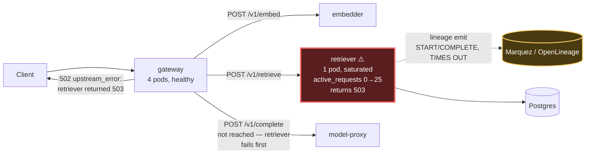

# Postmortem: gateway availability error budget burning slowly (10% of the 28d budget in 6h; 30m & 6h windows)

- **Status:** open
- **Severity:** sev2
- **Verified:** no
- **Opened:** 2026-08-04 13:39:44Z
- **Resolved:** (still open)

## Timeline (machine-generated)

All times UTC on 2026-08-04 unless a full date is shown.

| Time (UTC) | Source | Event |
| --- | --- | --- |
| 13:39:10Z | alert | alert firing: SLO gateway availability — slow burn |
| 13:44:42Z | k8s | Rollout/gateway: RolloutUpdated |
| 13:44:42Z | k8s | Rollout/gateway: NewReplicaSetCreated |
| 13:44:43Z | k8s | Pod/gateway-dd85945b4-pwg4s: Killing |
| 13:44:43Z | k8s | ReplicaSet/gateway-dd85945b4: SuccessfulDelete |
| 13:44:43Z | k8s | Rollout/gateway: ScalingReplicaSet |
| 13:44:43Z | k8s | Rollout/gateway: RolloutNotCompleted |
| 13:44:44Z | k8s | ReplicaSet/gateway-865966ff97: SuccessfulCreate |
| 13:44:44Z | k8s | Rollout/gateway: ScalingReplicaSet |
| 13:44:44Z | k8s | Pod/gateway-865966ff97-zhm57: Scheduled |
| 13:44:46Z | k8s | Pod/gateway-865966ff97-zhm57: Failed |
| 13:44:46Z | k8s | Pod/gateway-865966ff97-zhm57: Pulling |
| 13:44:47Z | k8s | Pod/gateway-865966ff97-zhm57: Failed |
| 13:44:47Z | k8s | Pod/gateway-865966ff97-zhm57: BackOff |
| 13:44:57Z | k8s | Pod/gateway-865966ff97-zhm57: Failed |
| 13:44:57Z | k8s | Pod/gateway-865966ff97-zhm57: Pulling |
| 13:45:08Z | k8s | Pod/gateway-865966ff97-zhm57: Failed |
| 13:45:08Z | k8s | Pod/gateway-865966ff97-zhm57: BackOff |
| 13:45:19Z | k8s | Pod/gateway-865966ff97-zhm57: Failed |
| 13:45:19Z | k8s | Pod/gateway-865966ff97-zhm57: Pulling |
| 13:45:33Z | k8s | Pod/gateway-865966ff97-zhm57: Failed |
| 13:45:33Z | k8s | Pod/gateway-865966ff97-zhm57: BackOff |
| 13:45:46Z | k8s | Pod/gateway-865966ff97-zhm57: Failed |
| 13:45:46Z | k8s | Pod/gateway-865966ff97-zhm57: BackOff |
| 13:45:57Z | k8s | Pod/gateway-865966ff97-zhm57: Failed |
| 13:45:57Z | k8s | Pod/gateway-865966ff97-zhm57: BackOff |
| 13:46:10Z | k8s | Pod/gateway-865966ff97-zhm57: Failed |
| 13:46:10Z | k8s | Pod/gateway-865966ff97-zhm57: Pulling |
| 13:46:24Z | k8s | Pod/gateway-865966ff97-zhm57: Failed |
| 13:46:24Z | k8s | Pod/gateway-865966ff97-zhm57: BackOff |
| 13:46:37Z | k8s | Pod/gateway-865966ff97-zhm57: Failed |
| 13:46:37Z | k8s | Pod/gateway-865966ff97-zhm57: BackOff |
| 13:46:48Z | k8s | Pod/gateway-865966ff97-zhm57: Failed |
| 13:46:48Z | k8s | Pod/gateway-865966ff97-zhm57: BackOff |
| 13:47:00Z | k8s | Pod/gateway-865966ff97-zhm57: Failed |
| 13:47:00Z | k8s | Pod/gateway-865966ff97-zhm57: BackOff |
| 13:47:13Z | k8s | Pod/gateway-865966ff97-zhm57: Failed |
| 13:47:13Z | k8s | Pod/gateway-865966ff97-zhm57: BackOff |

## Evidence links

- [Loki — logs over the incident window](http://localhost:3001/explore?schemaVersion=1&panes=%7B%22pm%22%3A+%7B%22datasource%22%3A+%22loki%22%2C+%22queries%22%3A+%5B%7B%22refId%22%3A+%22A%22%2C+%22datasource%22%3A+%7B%22type%22%3A+%22loki%22%2C+%22uid%22%3A+%22loki%22%7D%2C+%22expr%22%3A+%22%7Bnamespace%3D%5C%22subject%5C%22%7D+%7C~+%5C%22%28%3Fi%29error%7Cfailed%5C%22%22%7D%5D%2C+%22range%22%3A+%7B%22from%22%3A+%221785850784314%22%2C+%22to%22%3A+%221785851243575%22%7D%7D%7D&orgId=1)
- [Mimir — metrics over the incident window](http://localhost:3001/explore?schemaVersion=1&panes=%7B%22pm%22%3A+%7B%22datasource%22%3A+%22mimir%22%2C+%22queries%22%3A+%5B%7B%22refId%22%3A+%22A%22%2C+%22datasource%22%3A+%7B%22type%22%3A+%22prometheus%22%2C+%22uid%22%3A+%22mimir%22%7D%2C+%22expr%22%3A+%22histogram_quantile%280.95%2C+sum%28rate%28http_server_duration_milliseconds_bucket%5B5m%5D%29%29+by+%28le%29%29%22%7D%5D%2C+%22range%22%3A+%7B%22from%22%3A+%221785850784314%22%2C+%22to%22%3A+%221785851243575%22%7D%7D%7D&orgId=1)

## Investigation context

**Runbook match:** none — no tool narrowing applied for this alert. Available runbooks: README.md, canary-abort.md, ci-pipeline-red.md, dq-freshness-stall.md, gateway-high-error-rate.md, k8s-crashloop.md, k8s-node-failure.md, snapshot-agent-audit.md, stale-secret.md

Pre-check battery (as injected at run start)

## Pre-check leads

### recent_deploys — LEAD
No deploy in the last 60m — rule out the reflex answer.
- No deploy in the last 60m — rule out the reflex answer.

### log_spike — OK
error/failed log rate normal: 0/10min vs baseline 500/10min

### kube_scan — UNAVAILABLE
error: You must be logged in to the server (Unauthorized)

### rollout_state — UNAVAILABLE
gateway: E0804 15:39:45.384492   38980 memcache.go:265] "Unhandled Error" err="couldn't get current server API group list: the server has asked for the client to provide credentials"
E0804 15:39:45.869239   38980 memcache.go:265] "Unhandled Error" err="couldn't get current server API group list: the server has asked for the client to provide credentials"
E0804 15:39:45.965205   38980 memcache.go:265] "Unhandled Error" err="couldn't get current server API group list: the server has asked for the client to; gateway analysis: E0804 15:39:45.401144    5544 memcache.go:265] "Unhandled Error" err="couldn't get current server API group list: the server has asked for the client to provide credentials"
E0804 15:39:45.864354    5544 memcache.go:265] "Unhandled Error"
… (section truncated)

### secret_age — UNAVAILABLE
error: You must be logged in to the server (Unauthorized)

## Narrative

## Summary

The `SLO gateway availability — slow burn` alert (sev2, tenant `acme`) fired because the gateway's 30m/6h error-budget burn ratio climbed from 0% to over 31% in the incident window. The proximate cause is the single `retriever` pod exhausting its request concurrency and returning HTTP 503, which the gateway propagates to callers as 502.

## Impact

`POST /v1/chat` traffic through the gateway saw a growing share of 502/500 responses on the tenant `acme` path, with the 30-minute error ratio reaching ~31.6% by the time of paging — well past the burn-rate threshold for a 28-day availability budget.

## Root cause

Two distinct, chronologically-adjacent retriever problems combined to drive the burn:

1. **12:27–12:36 UTC** — a new retriever ReplicaSet (`retriever-8454db56c`) was scaled up from 0 and its pod (`retriever-8454db56c-q2b86`) entered `CrashLoopBackOff` (20+ BackOff events, zero log lines emitted before each restart — it never got far enough to log). It was scaled back to 0 and deleted at 12:36 UTC, leaving only the pre-existing stable pod `retriever-dc7ddd494-jv9j7` in service. This produced the first ~7% error-ratio plateau but was self-resolving.
2. **From ~13:23 UTC onward (the acute driver)** — the sole remaining retriever replica began saturating: `active_requests` on that pod spiked to 25 concurrent (baseline is 0) at the same moments `request_duration_seconds_count{http_status_code="503"}` on the retriever started incrementing (0 → 804 → 1630 per 10-minute window). The retriever's own logs show a matching pattern of `"lineage emit failed", "reason":"The operation timed out."` warnings tied to `rag.retrieve` spans — its Marquez/OpenLineage emission calls are timing out and tying up request-handling capacity. A captured gateway trace confirms the causal chain directly: `rag.chat` → `rag.retrieve` throws `UpstreamError: retriever returned 503` from `retriever-http.ts:14`, and the gateway returns 502 to the client.

`deploy_history`/`grafana_annotations` show **no deploy in the last 8h** and no CI run correlates with the onset — this is a capacity/backpressure incident on a single-replica dependency, not a bad release.

## What fixed it

**Remediation could not be executed.** I dry-ran and got operator approval to scale `retriever` to 3 replicas (action `686a6d35280693a5`, approval `apr_19fcd04abe5871`), then to roll-restart `retriever` as a fallback (action `7a540f71e5a6becd`, approval `apr_19fcd0600a287a`). Both write calls failed with `Unauthorized` against the cluster API — the same credential failure the pre-check leads already flagged for `kube_scan`/`rollout_state`. Read-only tooling (Mimir, Loki, Tempo, k8s_events) remained available throughout and is what produced the root-cause evidence above; only the mutating kubectl-backed remediation path is affected. `alert_status` was re-queried after the failed remediation attempts and the alert is still firing.

**Recommended immediate action (manual):** restore/renew the agent-remediate cluster credentials, then scale `deployment/retriever` to ≥3 replicas (or otherwise add capacity) to relieve the concurrency saturation; separately, make the Marquez lineage emit call in the retriever's `rag.retrieve` path non-blocking or apply a short timeout + fire-and-forget so a slow lineage backend can't consume retrieve-path capacity.

## Lessons

- The retriever is a single point of capacity for the whole `/v1/chat` path — one replica has no headroom for a slow downstream call (lineage emission) to degrade into full request saturation. It should run ≥2 replicas with HPA headroom.
- The lineage emit call inside `rag.retrieve` is apparently synchronous/blocking; a timing out lineage backend should never be able to reduce retrieve throughput. Decouple it (async emit, bounded timeout, or circuit breaker).
- The 12:27–12:36 UTC crashloop of a freshly-scaled retriever ReplicaSet self-healed but was never explained — the pod produced zero log output before each restart, meaning startup failures on this path are currently invisible; a fast startup-probe/log-on-exit would have made this diagnosable instead of just observed via BackOff events.
- Cluster-write credentials for the remediation path were unauthorized for the entire incident, blocking automated remediation entirely. This needs its own alert — an on-call agent silently unable to remediate is worse than one that's slow.

