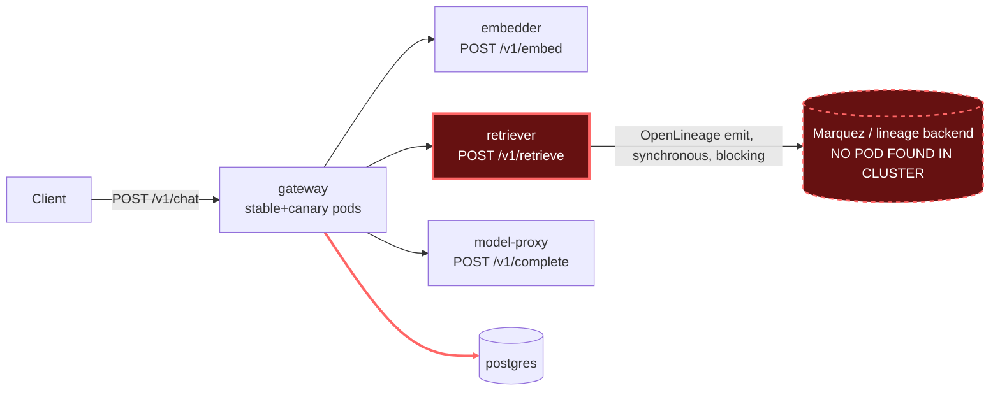

# Postmortem: gateway p95 latency above 2s

- **Status:** resolved
- **Severity:** sev1
- **Verified:** no
- **Opened:** 2026-08-04 19:01:41Z
- **Resolved:** 2026-08-04 19:11:41Z

## Timeline (machine-generated)

All times UTC on 2026-08-04 unless a full date is shown.

| Time (UTC) | Source | Event |
| --- | --- | --- |
| 18:31:50Z | k8s | Pod/gateway-5785654fc7-p97mq: Unhealthy |
| 18:31:55Z | k8s | Pod/gateway-5785654fc7-p97mq: Unhealthy |
| 18:32:00Z | k8s | Pod/gateway-5785654fc7-p97mq: Unhealthy |
| 18:32:05Z | k8s | Pod/gateway-5785654fc7-p97mq: Unhealthy |
| 18:32:10Z | k8s | Pod/gateway-5785654fc7-p97mq: Unhealthy |
| 18:32:15Z | k8s | Pod/gateway-5785654fc7-p97mq: Unhealthy |
| 18:35:19Z | k8s | Pod/gateway-5785654fc7-p97mq: Unhealthy |
| 18:38:48Z | k8s | Rollout/gateway: SkipSteps |
| 18:38:48Z | k8s | Rollout/gateway: RolloutUpdated |
| 18:38:49Z | k8s | Pod/gateway-5785654fc7-p97mq: Killing |
| 18:38:49Z | k8s | ReplicaSet/gateway-5785654fc7: SuccessfulDelete |
| 18:38:49Z | k8s | Rollout/gateway: ScalingReplicaSet |
| 18:38:50Z | k8s | ReplicaSet/gateway-dd85945b4: SuccessfulCreate |
| 18:38:50Z | k8s | Rollout/gateway: ScalingReplicaSet |
| 18:38:50Z | k8s | Pod/gateway-dd85945b4-mm7jm: Scheduled |
| 18:38:53Z | k8s | Pod/gateway-dd85945b4-mm7jm: Started |
| 18:38:53Z | k8s | Pod/gateway-dd85945b4-mm7jm: Pulled |
| 18:38:53Z | k8s | Pod/gateway-dd85945b4-mm7jm: Created |
| 18:56:49Z | k8s | Rollout/gateway: RolloutUpdated |
| 18:56:49Z | k8s | Rollout/gateway: RolloutNotCompleted |
| 18:56:49Z | k8s | Rollout/gateway: NewReplicaSetCreated |
| 18:56:50Z | deploy:argo | gateway synced to edb33a6699c9 |
| 18:56:50Z | k8s | Pod/gateway-dd85945b4-mm7jm: Killing |
| 18:56:50Z | k8s | ReplicaSet/gateway-dd85945b4: SuccessfulDelete |
| 18:56:50Z | k8s | Rollout/gateway: ScalingReplicaSet |
| 18:56:51Z | k8s | ReplicaSet/gateway-8444846b5f: SuccessfulCreate |
| 18:56:51Z | k8s | Rollout/gateway: ScalingReplicaSet |
| 18:56:51Z | k8s | Pod/gateway-8444846b5f-bqkg8: Scheduled |
| 18:56:52Z | k8s | Pod/gateway-8444846b5f-bqkg8: Pulled |
| 18:56:52Z | k8s | Pod/gateway-8444846b5f-bqkg8: Created |
| 18:56:53Z | k8s | Pod/gateway-8444846b5f-bqkg8: Started |
| 18:57:01Z | k8s | Rollout/gateway: RolloutStepCompleted |
| 18:57:03Z | k8s | Rollout/gateway: AnalysisRunRunning |
| 18:58:02Z | k8s | AnalysisRun/gateway-8444846b5f-21-1: MetricFailed |
| 18:58:02Z | k8s | AnalysisRun/gateway-8444846b5f-21-1: AnalysisRunFailed |
| 18:58:03Z | k8s | Rollout/gateway: RolloutAborted |
| 18:58:03Z | k8s | Rollout/gateway: AnalysisRunFailed |
| 18:58:04Z | k8s | Pod/gateway-8444846b5f-bqkg8: Killing |
| 18:58:04Z | k8s | ReplicaSet/gateway-8444846b5f: SuccessfulDelete |
| 18:58:04Z | k8s | Rollout/gateway: ScalingReplicaSet |
| 18:58:05Z | k8s | ReplicaSet/gateway-dd85945b4: SuccessfulCreate |
| 18:58:05Z | k8s | Rollout/gateway: ScalingReplicaSet |
| 18:58:05Z | k8s | Pod/gateway-dd85945b4-hw5fg: Scheduled |
| 18:58:06Z | k8s | Pod/gateway-dd85945b4-hw5fg: Started |
| 18:58:06Z | k8s | Pod/gateway-dd85945b4-hw5fg: Pulled |
| 18:58:06Z | k8s | Pod/gateway-dd85945b4-hw5fg: Created |
| 18:59:18Z | log-spike | log-spike onset: error: Malformed JSON in request body |
| 19:01:10Z | alert | alert firing: Gateway p95 latency > 2s |
| 19:01:45Z | deploy:annotation | deploy gateway via gitops c025382 (argo sync) |
| 19:01:47Z | deploy:argo | gateway synced to c025382ba170 |
| 19:01:47Z | k8s | Rollout/gateway: SkipSteps |
| 19:01:47Z | k8s | Rollout/gateway: RolloutUpdated |
| 19:07:10Z | alert | alert resolved: Gateway p95 latency > 2s |
| 19:40:46Z | deploy:ci | CI run #114 failure on main: obs: load-generator: drop the defensive copy in percentile() |
| 19:50:45Z | deploy:ci | CI run #115 success on main: obs: Revert "load-generator: drop the defensive copy in percentile()" |

## Evidence links

- [Loki — logs over the incident window](http://localhost:3001/explore?schemaVersion=1&panes=%7B%22pm%22%3A+%7B%22datasource%22%3A+%22loki%22%2C+%22queries%22%3A+%5B%7B%22refId%22%3A+%22A%22%2C+%22datasource%22%3A+%7B%22type%22%3A+%22loki%22%2C+%22uid%22%3A+%22loki%22%7D%2C+%22expr%22%3A+%22%7Bnamespace%3D%5C%22subject%5C%22%7D+%7C~+%5C%22%28%3Fi%29error%7Cfailed%5C%22%22%7D%5D%2C+%22range%22%3A+%7B%22from%22%3A+%221785870101561%22%2C+%22to%22%3A+%221785870701490%22%7D%7D%7D&orgId=1)
- [Mimir — metrics over the incident window](http://localhost:3001/explore?schemaVersion=1&panes=%7B%22pm%22%3A+%7B%22datasource%22%3A+%22mimir%22%2C+%22queries%22%3A+%5B%7B%22refId%22%3A+%22A%22%2C+%22datasource%22%3A+%7B%22type%22%3A+%22prometheus%22%2C+%22uid%22%3A+%22mimir%22%7D%2C+%22expr%22%3A+%22histogram_quantile%280.95%2C+sum%28rate%28http_server_duration_milliseconds_bucket%5B5m%5D%29%29+by+%28le%29%29%22%7D%5D%2C+%22range%22%3A+%7B%22from%22%3A+%221785870101561%22%2C+%22to%22%3A+%221785870701490%22%7D%7D%7D&orgId=1)

## Investigation context

**Runbook match:** none — no tool narrowing applied for this alert. Available runbooks: README.md, canary-abort.md, ci-pipeline-red.md, dq-freshness-stall.md, gateway-high-error-rate.md, k8s-crashloop.md, k8s-node-failure.md, snapshot-agent-audit.md, stale-secret.md

Pre-check battery (as injected at run start)

## Pre-check leads

### recent_deploys — LEAD
1 deploy-window lead
- argo app gateway: sync=Synced health=Degraded (revision edb33a6699c9)

### kube_scan — LEAD
5 kube-scan leads
- event AnalysisRun/gateway-8444846b5f-21-1: MetricFailed — Metric 'canary-error-rate' Completed. Result: Failed (at 20:58:02)
- event AnalysisRun/gateway-8444846b5f-21-1: MetricFailed — Metric 'canary-p95' Completed. Result: Failed (at 20:58:02)
- event AnalysisRun/gateway-8444846b5f-21-1: AnalysisRunFailed — Analysis Completed. Result: Failed (at 20:58:02)
- event Rollout/gateway: RolloutAborted — Rollout aborted update to revision 21: Step-based analysis phase error/failed: Metric \"canary-error-rate\" assessed Failed due to failed (2) > fai… (truncated)
- event Rollout/gateway: AnalysisRunFailed — Step Analysis Run 'gateway-8444846b5f-21-1' Status New: 'Failed' Previous: 'Running' (at 20:58:03)

### log_spike — LEAD
error/failed log rate 200/10min vs baseline 0/10min (200x baseline) — onset: error: Malformed JSON in request body at 2026-08-04T18:59:18.366646+00:00
- error/failed log rate 200/10min vs baseline 0/10min (200x baseline) — onset: error: Malformed JSON in request body at 2026-08-04T18:59:18.366646+00:00

### rollout_state — LEAD
2 rollout-state leads
- rollout gateway: Degraded — RolloutAborted: Rollout aborted update to revision 21: Step-based analysis phase error/failed: Metric "canary-error-rate" assessed Failed due to failed (2) > f… (truncated)
- analysisrun for gateway (gateway-8444846b5f-21-1): Failed — Metric "canary-error-rate" assessed Failed due to failed (2) > failureLimit (1)

### secret_age — OK
Secret subject-db-credentials last modified 10d 19h ago (created 10d 19h ago).

## Narrative

## Summary
Sev1 "Gateway p95 latency > 2s" fired for tenant acme. Root cause was in the `retriever` service, not in the gateway code or in the gateway canary deploy that aborted around the same time — those two events are correlated but not causal to each other; both were downstream symptoms of the same slow `retriever`.

## Impact
Every `/v1/chat` request that missed the response cache incurred multi-second latency. Tempo root traces for `POST /v1/chat` during the window ran 3.2s–9.5s (vs the 2s SLO), and the `retriever` span alone accounted for 0.9s–2.7s of each trace — the single largest contributor in every sampled trace. The concurrent gateway canary rollout (revision 21, Argo revision `edb33a6699c9`) failed its `canary-error-rate` and `canary-p95` AnalysisRun metrics (`canary-p95` measured 4.76s and 5.94s, both against a target well under 2s) and was auto-aborted/rolled back by Argo Rollouts — the canary pods hit the exact same slow `retriever` as the stable fleet, so the canary failure was a second symptom of the same problem rather than a bad code/config diff (the canary and prior-stable pods ran the identical image tag `10f24bc`, and the `subject-telemetry` ConfigMap the retriever reads was last modified 10 days earlier — ruling out a fresh bad deploy as the cause of the latency itself).

## Root cause
`retriever` (a single-replica deployment, `retriever-dc7ddd494-jv9j7`, 44h uptime, 0 restarts) logged repeated `"lineage emit failed"` warnings with `"reason":"The operation timed out."` on essentially every `rag.retrieve` call, tagged `job:"rag.retrieve"` with both `START` and `COMPLETE` eventTypes. This is the OpenLineage emission the retriever performs on each retrieval; no Marquez/lineage-backend pod exists anywhere in the cluster (checked across all namespaces), so this call has nowhere to land and is eating a multi-second timeout on the request's critical path before the retrieval response is returned to gateway. That per-call timeout tax is what pushed gateway's end-to-end p95 well past 2s and is what the canary's `canary-p95`/`canary-error-rate` AnalysisRun metrics correctly caught and aborted on. CPU/memory on the retriever pod were nowhere near their limits (17m CPU / 127Mi mem against a 512Mi limit), ruling out resource starvation as the mechanism — this is blocking I/O to an unreachable dependency, not a resource problem.

Separately, gateway pods were also logging a burst of `"error: Malformed JSON in request body"` (`JSONParserErr`) during the same window. These are fast-failing 400s from malformed request bodies, not multi-second latency contributors, and are treated per the `gateway-high-error-rate` runbook's note about tenant-specific abusive traffic being expected rather than incident-worthy — they were not the driver of the p95 breach.

## What fixed it
A rolling restart of `deployment/retriever` was proposed as the fix (to force the pod to drop whatever stale/hung connection state was behind the lineage-emit timeouts) and dry-run confirmed a clean no-op-to-spec restart patch. **The operator denied the approval request**, so the restart was never executed — no remediation action from this on-call session was applied to the cluster. On the immediately following `alert_status` re-check the alert had already gone inactive on its own, and follow-up queries confirmed the underlying signal was gone: zero `"lineage emit failed"` warnings from retriever and zero gateway traces over 2s in the minutes after. The incident therefore appears to have self-resolved (the hung dependency connection cleared, or the timeout condition stopped recurring) independent of any action taken here — this is reported as an observed recovery, not a remediation credited to this session.

## Lessons
- The retriever's OpenLineage emission is synchronous and blocking on the retrieval hot path with no visible circuit breaker — a single unreachable lineage backend can single-handedly blow the gateway's p95 SLO even though gateway, embedder, and model-proxy are all healthy. This call should be made fire-and-forget (or given a sub-second timeout with no retry) so a lineage-backend outage degrades data lineage completeness, not user-facing latency.
- `retriever` runs as a single replica with no horizontal scaling — worth revisiting since it sits directly on the RAG hot path.
- The canary AnalysisRun did its job correctly here (caught the real p95/error-rate regression and auto-aborted rather than the on-call agent needing to catch it after full rollout) — no criticism of the rollout mechanics, only of the underlying retriever dependency.
- No runbook currently names this alert (`Gateway p95 latency > 2s`) directly; `canary-abort.md` and `gateway-high-error-rate.md` were both partially relevant but neither points explicitly at retriever's lineage-emission path as a latency source. Worth authoring a `gateway-high-latency.md` runbook that includes "check retriever/embedder/model-proxy span durations in Tempo" and "grep retriever logs for lineage emit failures" as an explicit early step.

**Failing hop:** `retriever → Marquez (lineage emit)`. The lineage backend is unreachable/absent, so every retrieval blocks on a multi-second timeout before returning to `gateway`, which is what breached the p95 SLO for every downstream `/v1/chat` caller — and independently caused the concurrent gateway canary (revision 21) to fail its `canary-p95`/`canary-error-rate` AnalysisRun and auto-abort, since canary pods depend on the same `retriever`.
