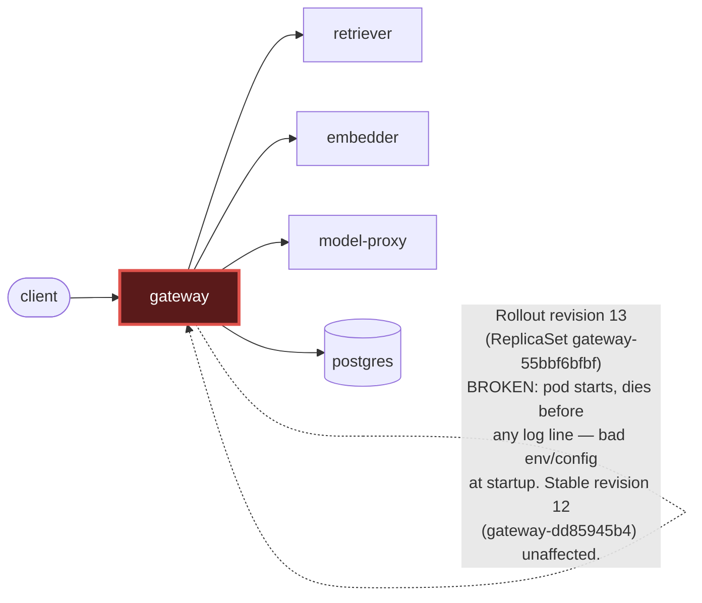

# Postmortem: subject/gateway-55bbf6bfbf-4qgg4 container gateway is in CrashLoopBackOff

- **Status:** open
- **Severity:** sev1
- **Verified:** no
- **Opened:** 2026-08-04 01:02:26Z
- **Resolved:** (still open)

## Timeline (machine-generated)

All times UTC on 2026-08-04 unless a full date is shown.

| Time (UTC) | Source | Event |
| --- | --- | --- |
| 00:58:20Z | k8s | Pod/gateway-dd85945b4-c5xbb: Killing |
| 00:58:20Z | k8s | ReplicaSet/gateway-dd85945b4: SuccessfulDelete |
| 00:58:20Z | k8s | Rollout/gateway: ScalingReplicaSet |
| 00:58:20Z | k8s | Rollout/gateway: RolloutUpdated |
| 00:58:20Z | k8s | Rollout/gateway: RolloutNotCompleted |
| 00:58:21Z | k8s | ReplicaSet/gateway-55bbf6bfbf: SuccessfulCreate |
| 00:58:21Z | k8s | Pod/gateway-55bbf6bfbf-4qgg4: Scheduled |
| 00:58:23Z | k8s | Pod/gateway-55bbf6bfbf-4qgg4: Started |
| 00:58:23Z | k8s | Pod/gateway-55bbf6bfbf-4qgg4: Pulled |
| 00:58:23Z | k8s | Pod/gateway-55bbf6bfbf-4qgg4: Created |
| 00:58:25Z | k8s | Pod/gateway-55bbf6bfbf-4qgg4: Started |
| 00:58:25Z | k8s | Pod/gateway-55bbf6bfbf-4qgg4: Pulled |
| 00:58:25Z | k8s | Pod/gateway-55bbf6bfbf-4qgg4: Created |
| 00:58:27Z | k8s | Pod/gateway-55bbf6bfbf-4qgg4: BackOff |
| 00:58:28Z | k8s | Pod/gateway-55bbf6bfbf-4qgg4: BackOff |
| 00:58:31Z | k8s | Pod/gateway-55bbf6bfbf-4qgg4: BackOff |
| 00:58:37Z | k8s | Pod/gateway-55bbf6bfbf-4qgg4: Started |
| 00:58:37Z | k8s | Pod/gateway-55bbf6bfbf-4qgg4: Pulled |
| 00:58:37Z | k8s | Pod/gateway-55bbf6bfbf-4qgg4: Created |
| 00:58:39Z | k8s | Pod/gateway-55bbf6bfbf-4qgg4: BackOff |
| 00:58:40Z | k8s | Pod/gateway-55bbf6bfbf-4qgg4: BackOff |
| 00:58:41Z | k8s | Pod/gateway-55bbf6bfbf-4qgg4: BackOff |
| 00:59:03Z | k8s | Pod/gateway-55bbf6bfbf-4qgg4: Started |
| 00:59:03Z | k8s | Pod/gateway-55bbf6bfbf-4qgg4: Pulled |
| 00:59:03Z | k8s | Pod/gateway-55bbf6bfbf-4qgg4: Created |
| 00:59:05Z | k8s | Pod/gateway-55bbf6bfbf-4qgg4: BackOff |
| 00:59:06Z | k8s | Pod/gateway-55bbf6bfbf-4qgg4: BackOff |
| 00:59:11Z | k8s | Pod/gateway-55bbf6bfbf-4qgg4: BackOff |
| 00:59:57Z | k8s | Pod/gateway-55bbf6bfbf-4qgg4: Started |
| 00:59:57Z | k8s | Pod/gateway-55bbf6bfbf-4qgg4: Pulled |
| 00:59:57Z | k8s | Pod/gateway-55bbf6bfbf-4qgg4: Created |
| 00:59:59Z | k8s | Pod/gateway-55bbf6bfbf-4qgg4: BackOff |
| 01:00:00Z | k8s | Pod/gateway-55bbf6bfbf-4qgg4: BackOff |
| 01:00:01Z | k8s | Pod/gateway-55bbf6bfbf-4qgg4: BackOff |
| 01:01:16Z | k8s | Pod/gateway-55bbf6bfbf-4qgg4: BackOff |
| 01:01:19Z | k8s | Pod/gateway-55bbf6bfbf-4qgg4: Started |
| 01:01:19Z | k8s | Pod/gateway-55bbf6bfbf-4qgg4: Pulled |
| 01:01:19Z | k8s | Pod/gateway-55bbf6bfbf-4qgg4: Created |
| 01:01:21Z | k8s | Pod/gateway-55bbf6bfbf-4qgg4: BackOff |
| 01:01:22Z | k8s | Pod/gateway-55bbf6bfbf-4qgg4: BackOff |
| 01:01:31Z | k8s | Pod/gateway-55bbf6bfbf-4qgg4: BackOff |
| 01:01:50Z | alert | alert firing: KubePodCrashLooping |
| 01:02:58Z | k8s | Pod/gateway-55bbf6bfbf-4qgg4: BackOff |
| 01:04:24Z | k8s | Pod/gateway-55bbf6bfbf-4qgg4: Started |
| 01:04:24Z | k8s | Pod/gateway-55bbf6bfbf-4qgg4: Pulled |
| 01:04:24Z | k8s | Pod/gateway-55bbf6bfbf-4qgg4: Created |
| 01:04:26Z | k8s | Pod/gateway-55bbf6bfbf-4qgg4: BackOff |
| 01:04:27Z | k8s | Pod/gateway-55bbf6bfbf-4qgg4: BackOff |
| 01:04:31Z | k8s | Pod/gateway-55bbf6bfbf-4qgg4: BackOff |
| 01:05:46Z | k8s | Pod/gateway-55bbf6bfbf-4qgg4: BackOff |

## Evidence links

- [Loki — logs over the incident window](http://localhost:3001/explore?schemaVersion=1&panes=%7B%22pm%22%3A+%7B%22datasource%22%3A+%22loki%22%2C+%22queries%22%3A+%5B%7B%22refId%22%3A+%22A%22%2C+%22datasource%22%3A+%7B%22type%22%3A+%22loki%22%2C+%22uid%22%3A+%22loki%22%7D%2C+%22expr%22%3A+%22%7Bnamespace%3D%5C%22subject%5C%22%7D+%7C~+%5C%22%28%3Fi%29error%7Cfailed%5C%22%22%7D%5D%2C+%22range%22%3A+%7B%22from%22%3A+%221785805346082%22%2C+%22to%22%3A+%221785805563991%22%7D%7D%7D&orgId=1)
- [Mimir — metrics over the incident window](http://localhost:3001/explore?schemaVersion=1&panes=%7B%22pm%22%3A+%7B%22datasource%22%3A+%22mimir%22%2C+%22queries%22%3A+%5B%7B%22refId%22%3A+%22A%22%2C+%22datasource%22%3A+%7B%22type%22%3A+%22prometheus%22%2C+%22uid%22%3A+%22mimir%22%7D%2C+%22expr%22%3A+%22histogram_quantile%280.95%2C+sum%28rate%28http_server_duration_milliseconds_bucket%5B5m%5D%29%29+by+%28le%29%29%22%7D%5D%2C+%22range%22%3A+%7B%22from%22%3A+%221785805346082%22%2C+%22to%22%3A+%221785805563991%22%7D%7D%7D&orgId=1)

## Investigation context

**Runbook match (1):** `k8s-crashloop.md` — toolset narrowed to 12 tools: alert_status, deploy_history, k8s_events, kubectl_read, loki_query, publish_postmortem, request_approval, restart_workload, rollout_undo, runbook_lookup, runbook_read, save_artifact

Pre-check battery (as injected at run start)

## Pre-check leads

### recent_deploys — LEAD
No deploy in the last 60m — rule out the reflex answer.
- No deploy in the last 60m — rule out the reflex answer.

### log_spike — OK
error/failed log rate normal: 200/10min vs baseline 500/10min

### kube_scan — UNAVAILABLE
error: You must be logged in to the server (Unauthorized)

### rollout_state — UNAVAILABLE
gateway: E0804 03:02:28.726788   12252 memcache.go:265] "Unhandled Error" err="couldn't get current server API group list: the server has asked for the client to provide credentials"
E0804 03:02:28.908343   12252 memcache.go:265] "Unhandled Error" err="couldn't get current server API group list: the server has asked for the client to provide credentials"
E0804 03:02:29.094124   12252 memcache.go:265] "Unhandled Error" err="couldn't get current server API group list: the server has asked for the client to; gateway analysis: E0804 03:02:28.770666   52500 memcache.go:265] "Unhandled Error" err="couldn't get current server API group list: the server has asked for the client to provide credentials"
E0804 03:02:28.910468   52500 memcache.go:265] "Unhandled Error"
… (section truncated)

### secret_age — UNAVAILABLE
error: You must be logged in to the server (Unauthorized)

## Narrative

## Summary

`KubePodCrashLooping` fired for `subject/gateway-55bbf6bfbf-4qgg4`. The Argo Rollout for `gateway` promoted a new revision (ReplicaSet `gateway-55bbf6bfbf`, revision 13) whose pods enter `CrashLoopBackOff` immediately on every start attempt, with zero application log output ever emitted. The prior stable ReplicaSet (`gateway-dd85945b4`, revision 12) remained healthy throughout and continued serving normal traffic.

## Impact

The canary slice of `gateway` capacity (the pods on revision 13) has been unavailable since the rollout step began, cycling through repeated container-create → BackOff loops on a rotating set of pod names (`t9sp4` → … → `4qgg4`) for roughly 2h45m by the time of paging. The stable ReplicaSet absorbed traffic throughout (`chat completed` log lines kept flowing from pod `lvg8w` with no gap), so end-user impact was contained to reduced canary capacity rather than a full outage — but the crashing slice never recovered on its own and the alert stayed active for the full window.

## Root cause

The `gateway` Rollout advanced to a new pod-template revision (ReplicaSet `gateway-55bbf6bfbf`) at rollout-event time — Argo scaled the prior stable ReplicaSet down by one and created the new ReplicaSet at 0→1 in the same instant the first `BackOff` warning appeared on the new pod. Every subsequent pod created under that ReplicaSet (confirmed across two different pod names) pulls its image successfully, creates the container, starts it, and is killed by the kubelet's liveness/backoff machinery before a single log line — not even a startup line — reaches Loki. That signature (clean image pull, clean container create, immediate death, no app-level log output at all) rules out an image-pull problem and points at a fatal fault in process startup itself: the new revision's pod spec (env/config) is broken badly enough that the process dies before its logger initializes. `deploy_history`'s Argo/Rollout sources were unavailable (cluster auth), so the exact spec diff could not be pulled directly, but the k8s_events timeline ties the crash onset to the ReplicaSet's creation to the second, which is the runbook's first candidate hypothesis ("a new revision introduced a bad env/config and dies at startup").

## What fixed it

None — remediation could not be executed. Following the matched runbook (`k8s-crashloop.md`), a `rollout_undo` back to the last-known-good revision was dry-run, and the operator approved it. However, both the dry-run's diff read and the subsequent real execution against the cluster failed identically with `Unauthorized` ("You must be logged in to the server") — the same cluster-credential failure already surfacing in this session's pre-checks (`kube_scan`, `rollout_state`, `secret_age` were all unavailable for the same reason) and in the direct `kubectl_read describe pod` call made during diagnosis. This is an infrastructure access problem blocking both read and write kubectl-based actions for the on-call identity, independent of the gateway root cause. The alert was re-queried after the failed execution attempts and remains **active**. This incident is not resolved — it needs either a credential fix for the cluster-access identity or a manual rollback by an operator with working cluster access.

## Lessons

- The on-call identity's cluster credentials were stale/invalid for the entire incident window, which silently degraded every kubectl-backed pre-check and ultimately blocked the actual fix — credential health for remediation tooling needs its own alerting, since a broken credential looks identical to "nothing to report" until someone tries to act on it.
- The crashing revision produced zero log lines across its entire ~2h45m lifetime; an app-level "about to start" log emitted before config validation would have let Loki confirm the failure point directly instead of relying purely on k8s event timing correlation.
- Two same-hash-looking ReplicaSets (`gateway-dd85945b4`) were reported at both "revision 12" and "revision 14" without an intervening pod-template change, which is worth checking against the Rollout controller's revision-bookkeeping — it added noise while narrowing down which ReplicaSet was actually new.

