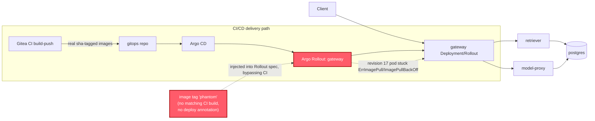

# Postmortem: subject/gateway-865966ff97-zhm57 has been not-ready for 4 minutes (readiness probe or startup trouble)

- **Status:** open
- **Severity:** sev1
- **Verified:** no
- **Opened:** 2026-08-04 13:50:27Z
- **Resolved:** (still open)

## Timeline (machine-generated)

All times UTC on 2026-08-04 unless a full date is shown.

| Time (UTC) | Source | Event |
| --- | --- | --- |
| 13:44:42Z | k8s | Rollout/gateway: RolloutUpdated |
| 13:44:42Z | k8s | Rollout/gateway: NewReplicaSetCreated |
| 13:44:43Z | k8s | Pod/gateway-dd85945b4-pwg4s: Killing |
| 13:44:43Z | k8s | ReplicaSet/gateway-dd85945b4: SuccessfulDelete |
| 13:44:43Z | k8s | Rollout/gateway: ScalingReplicaSet |
| 13:44:43Z | k8s | Rollout/gateway: RolloutNotCompleted |
| 13:44:44Z | k8s | ReplicaSet/gateway-865966ff97: SuccessfulCreate |
| 13:44:44Z | k8s | Rollout/gateway: ScalingReplicaSet |
| 13:44:44Z | k8s | Pod/gateway-865966ff97-zhm57: Scheduled |
| 13:44:46Z | k8s | Pod/gateway-865966ff97-zhm57: Failed |
| 13:44:46Z | k8s | Pod/gateway-865966ff97-zhm57: Pulling |
| 13:44:47Z | k8s | Pod/gateway-865966ff97-zhm57: Failed |
| 13:44:47Z | k8s | Pod/gateway-865966ff97-zhm57: BackOff |
| 13:44:57Z | k8s | Pod/gateway-865966ff97-zhm57: Failed |
| 13:44:57Z | k8s | Pod/gateway-865966ff97-zhm57: Pulling |
| 13:45:08Z | k8s | Pod/gateway-865966ff97-zhm57: Failed |
| 13:45:08Z | k8s | Pod/gateway-865966ff97-zhm57: BackOff |
| 13:45:19Z | k8s | Pod/gateway-865966ff97-zhm57: Failed |
| 13:45:19Z | k8s | Pod/gateway-865966ff97-zhm57: Pulling |
| 13:45:33Z | k8s | Pod/gateway-865966ff97-zhm57: Failed |
| 13:45:33Z | k8s | Pod/gateway-865966ff97-zhm57: BackOff |
| 13:45:46Z | k8s | Pod/gateway-865966ff97-zhm57: Failed |
| 13:45:46Z | k8s | Pod/gateway-865966ff97-zhm57: BackOff |
| 13:45:57Z | k8s | Pod/gateway-865966ff97-zhm57: Failed |
| 13:45:57Z | k8s | Pod/gateway-865966ff97-zhm57: BackOff |
| 13:46:10Z | k8s | Pod/gateway-865966ff97-zhm57: Failed |
| 13:46:10Z | k8s | Pod/gateway-865966ff97-zhm57: Pulling |
| 13:46:24Z | k8s | Pod/gateway-865966ff97-zhm57: Failed |
| 13:46:24Z | k8s | Pod/gateway-865966ff97-zhm57: BackOff |
| 13:46:37Z | k8s | Pod/gateway-865966ff97-zhm57: Failed |
| 13:46:37Z | k8s | Pod/gateway-865966ff97-zhm57: BackOff |
| 13:46:48Z | k8s | Pod/gateway-865966ff97-zhm57: Failed |
| 13:46:48Z | k8s | Pod/gateway-865966ff97-zhm57: BackOff |
| 13:47:00Z | k8s | Pod/gateway-865966ff97-zhm57: Failed |
| 13:47:00Z | k8s | Pod/gateway-865966ff97-zhm57: BackOff |
| 13:47:13Z | k8s | Pod/gateway-865966ff97-zhm57: Failed |
| 13:47:13Z | k8s | Pod/gateway-865966ff97-zhm57: BackOff |
| 13:47:19Z | log-spike | log-spike onset: {"level":"warn","service":"retriever","message":"lineage emit failed","trace_id":"0ec34b276132526ac708cb1cbe7e7d71","span_id":"47f0eb2d368534fe","time":"2026-08-04T13:47:19.241Z","reason":"The operation timed out.","job":"… |
| 13:47:27Z | k8s | Pod/gateway-865966ff97-zhm57: Failed |
| 13:47:27Z | k8s | Pod/gateway-865966ff97-zhm57: BackOff |
| 13:47:38Z | k8s | Pod/gateway-865966ff97-zhm57: Failed |
| 13:47:38Z | k8s | Pod/gateway-865966ff97-zhm57: Pulling |
| 13:47:49Z | k8s | Pod/gateway-865966ff97-zhm57: Failed |
| 13:47:49Z | k8s | Pod/gateway-865966ff97-zhm57: BackOff |
| 13:48:03Z | k8s | Pod/gateway-865966ff97-zhm57: Failed |
| 13:48:03Z | k8s | Pod/gateway-865966ff97-zhm57: BackOff |
| 13:48:16Z | k8s | Pod/gateway-865966ff97-zhm57: Failed |
| 13:48:16Z | k8s | Pod/gateway-865966ff97-zhm57: BackOff |
| 13:48:31Z | k8s | Pod/gateway-865966ff97-zhm57: Failed |
| 13:48:31Z | k8s | Pod/gateway-865966ff97-zhm57: BackOff |
| 13:48:44Z | k8s | Pod/gateway-865966ff97-zhm57: BackOff |
| 13:48:56Z | k8s | Pod/gateway-865966ff97-zhm57: BackOff |
| 13:49:10Z | k8s | Pod/gateway-865966ff97-zhm57: BackOff |
| 13:49:21Z | k8s | Pod/gateway-865966ff97-zhm57: BackOff |
| 13:49:35Z | k8s | Pod/gateway-865966ff97-zhm57: BackOff |
| 13:49:48Z | k8s | Pod/gateway-865966ff97-zhm57: Failed |
| 13:49:48Z | k8s | Pod/gateway-865966ff97-zhm57: BackOff |
| 13:49:50Z | alert | alert firing: KubePodNotReady |

## Evidence links

- [Loki — logs over the incident window](http://localhost:3001/explore?schemaVersion=1&panes=%7B%22pm%22%3A+%7B%22datasource%22%3A+%22loki%22%2C+%22queries%22%3A+%5B%7B%22refId%22%3A+%22A%22%2C+%22datasource%22%3A+%7B%22type%22%3A+%22loki%22%2C+%22uid%22%3A+%22loki%22%7D%2C+%22expr%22%3A+%22%7Bnamespace%3D%5C%22subject%5C%22%7D+%7C~+%5C%22%28%3Fi%29error%7Cfailed%5C%22%22%7D%5D%2C+%22range%22%3A+%7B%22from%22%3A+%221785851427075%22%2C+%22to%22%3A+%221785851664650%22%7D%7D%7D&orgId=1)
- [Mimir — metrics over the incident window](http://localhost:3001/explore?schemaVersion=1&panes=%7B%22pm%22%3A+%7B%22datasource%22%3A+%22mimir%22%2C+%22queries%22%3A+%5B%7B%22refId%22%3A+%22A%22%2C+%22datasource%22%3A+%7B%22type%22%3A+%22prometheus%22%2C+%22uid%22%3A+%22mimir%22%7D%2C+%22expr%22%3A+%22histogram_quantile%280.95%2C+sum%28rate%28http_server_duration_milliseconds_bucket%5B5m%5D%29%29+by+%28le%29%29%22%7D%5D%2C+%22range%22%3A+%7B%22from%22%3A+%221785851427075%22%2C+%22to%22%3A+%221785851664650%22%7D%7D%7D&orgId=1)

## Investigation context

**Runbook match:** none — no tool narrowing applied for this alert. Available runbooks: README.md, canary-abort.md, ci-pipeline-red.md, dq-freshness-stall.md, gateway-high-error-rate.md, k8s-crashloop.md, k8s-node-failure.md, snapshot-agent-audit.md, stale-secret.md

Pre-check battery (as injected at run start)

## Pre-check leads

### recent_deploys — LEAD
No deploy in the last 60m — rule out the reflex answer.
- No deploy in the last 60m — rule out the reflex answer.

### log_spike — LEAD
error/failed log rate 200/10min vs baseline 0/10min (200x baseline) — onset: {"level":"warn","service":"retriever","message":"lineage emit failed","trace_id":"0ec34b276132526ac708cb1cbe7e7d71","span_id":"47f0eb2d368534fe","time":"2026-08-04T13:47:19.241Z","reason":"The operation timed out.","job":"rag.retrieve","eventType":"START"} at 2026-08-04T13:47:19.241494+00:00
- error/failed log rate 200/10min vs baseline 0/10min (200x baseline) — onset: {"level":"warn","service":"retriever","message":"lineage emit failed","trace_id":"0ec34b276132526ac708cb1cbe7e… (truncated)

### kube_scan — UNAVAILABLE
error: You must be logged in to the server (Unauthorized)

### rollout_state — UNAVAILABLE
gateway: E0804 15:50:27.666271   55084 memcache.go:265] "Unhandled Error" err="couldn't get current server API group list: the server has asked for the client to provide credentials"
E0804 15:50:27.756447   55084 memcache.go:265] "Unhandled Error" err="couldn't get current server API group list: the server has asked for the client to provide credentials"
E0804 15:50:27.849409   55084 memcache.go:265] "Unhandled Error" err="couldn't get current server API group list: the server has asked for the client to; gateway analysis: E0804 15:50:27.665152   41368 memcache.go:265] "Unhandled Error" err="couldn't get current server API group list: the server has asked for the client to provide credentials"
E0804 15:50:27.757812   41368 memcache.go:265] "Unhandled Error"
… (section truncated)

### secret_age — UNAVAILABLE
error: You must be logged in to the server (Unauthorized)

## Narrative

## Summary
`KubePodNotReady` fired for `subject/gateway-865966ff97-zhm57`. The pod belongs to a new Argo Rollout revision (17) that references container image `obs-registry:5010/gateway:phantom`. That tag does not exist in the registry, so the pod has sat in `ErrImagePull` / `ImagePullBackOff` continuously since it was scheduled, never became Ready, and tripped the not-ready-for-4-minutes threshold.

## Impact
One gateway pod (the newly-rolled canary replica, revision 17) permanently NotReady/CrashLoop-on-pull. The prior stable ReplicaSet (`gateway-dd85945b4`, revision 16) still held 3 Ready replicas throughout, so the gateway kept serving traffic on the stable replicas at reduced headroom (3 vs the intended 4) rather than a full outage. The retriever "lineage emit failed" warning log spike noted in pre-checks was investigated and is a separate, lower-severity signal (retriever lineage-emit timeouts) — not the cause of this pod's not-ready state; it shares no object/trace lineage with the gateway ImagePullBackOff and is left for its own alert if it persists.

## Root cause
The gateway Rollout was advanced to revision 17 pointing at image tag `gateway:phantom`. Cross-checking Gitea CI history shows no build ever produced a `phantom` tag — the most recent real builds are content-addressed/sha-tagged (`d62500f603`, `28686bc2ba`, `283cec4c08`, ...). There is also no matching Grafana deployment annotation for this rollout, unlike normal CI→gitops promotions. This points to an out-of-band/bad image reference being pushed onto the Rollout spec rather than a legitimate CI-built release — a bad deploy in the sense of "wrong artifact reference," just not one that came through the normal pipeline with a discoverable commit. `deploy_history` and `argo_app` were both unable to corroborate further because the cluster's kubectl-based read path was independently returning `Unauthorized` for the entire session (see Lessons).

## What fixed it
Diagnosed via `k8s_events` (repeated `Failed to pull image "obs-registry:5010/gateway:phantom"` / `ErrImagePull` / `ImagePullBackOff`, 21+ retries and climbing) and corroborated against `gitea_ci_runs` (no CI-built `phantom` tag) and `grafana_annotations` (no deploy marker for this rollout). Proposed remediation: abort the in-progress Argo Rollout (`status.abort=true`) to revert traffic/scaling to the last known-good ReplicaSet (revision 16, `gateway-dd85945b4`, still 3/3 Ready). This was dry-run, the diff (`{"status":{"abort":true}}` merge-patch on the Rollout status subresource) was verified, and an operator approved it.

**Execution failed.** Both attempts to apply the approved abort (`dry_run=false`) returned `Unauthorized` from the cluster API — the same credential failure that had already made `kubectl_read`, `rollout_status`, and `argo_app` unavailable throughout this investigation (flagged UNAVAILABLE in pre-checks before I started). This is an independent cluster-auth outage, not a flaw in the remediation plan. Re-querying `alert_status` after both attempts confirms `KubePodNotReady` is **still active** — I am reporting this as an unresolved incident, not assuming success.

## Lessons
- The remediation credential path (used by `rollout_abort`/`rollout_status`/`kubectl_read`/`argo_app`) was broken for the full duration of this incident. This needs its own ticket: whoever holds cluster admin needs to refresh/rotate the agent's kubeconfig/service-account token before any kubectl-mediated remediation can execute, dry-run diffs aside.
- Once auth is restored, re-run `rollout_abort(workload="gateway", dry_run=false)` with a fresh approval (the prior approval is single-use and was already consumed against a failed attempt), or fall back to `rollout_undo` / manually fixing the Rollout's image reference to a real, CI-built tag.
- Add an admission-time guard (or a CI/gitops check) that rejects Rollout image references which don't match a tag actually produced by `build-push`, so a `phantom`-style bad tag can't reach the cluster undetected next time.
- Consider a dedicated runbook for `KubePodNotReady` — none matched this alert; the closest useful signal came from generic `k8s_events` triage.

Chart artifact `report.html` shows the cumulative `ImagePullBackOff` retry count for the affected pod climbing continuously from pod creation through alert onset with no flattening — consistent with a permanently unpullable image, not a transient registry blip.
