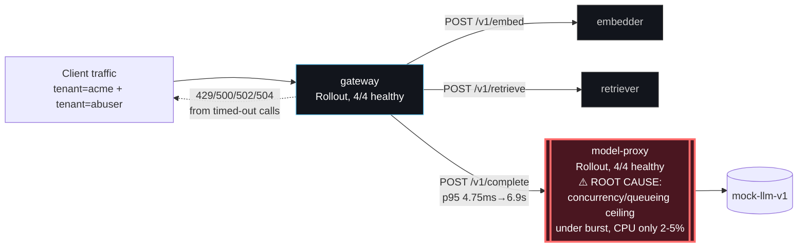

# Postmortem: gateway availability error budget burning slowly (10% of the 28d budget in 6h; 30m & 6h windows)

- **Status:** open
- **Severity:** sev2
- **Verified:** no
- **Opened:** 2026-08-04 20:59:44Z
- **Resolved:** (still open)

## Timeline (machine-generated)

All times UTC on 2026-08-04 unless a full date is shown.

| Time (UTC) | Source | Event |
| --- | --- | --- |
| 20:59:10Z | alert | alert firing: SLO gateway availability — slow burn |

## Evidence links

- [Loki — logs over the incident window](http://localhost:3001/explore?schemaVersion=1&panes=%7B%22pm%22%3A+%7B%22datasource%22%3A+%22loki%22%2C+%22queries%22%3A+%5B%7B%22refId%22%3A+%22A%22%2C+%22datasource%22%3A+%7B%22type%22%3A+%22loki%22%2C+%22uid%22%3A+%22loki%22%7D%2C+%22expr%22%3A+%22%7Bnamespace%3D%5C%22subject%5C%22%7D+%7C~+%5C%22%28%3Fi%29error%7Cfailed%5C%22%22%7D%5D%2C+%22range%22%3A+%7B%22from%22%3A+%221785877184321%22%2C+%22to%22%3A+%221785879960904%22%7D%7D%7D&orgId=1)
- [Mimir — metrics over the incident window](http://localhost:3001/explore?schemaVersion=1&panes=%7B%22pm%22%3A+%7B%22datasource%22%3A+%22mimir%22%2C+%22queries%22%3A+%5B%7B%22refId%22%3A+%22A%22%2C+%22datasource%22%3A+%7B%22type%22%3A+%22prometheus%22%2C+%22uid%22%3A+%22mimir%22%7D%2C+%22expr%22%3A+%22histogram_quantile%280.95%2C+sum%28rate%28http_server_duration_milliseconds_bucket%5B5m%5D%29%29+by+%28le%29%29%22%7D%5D%2C+%22range%22%3A+%7B%22from%22%3A+%221785877184321%22%2C+%22to%22%3A+%221785879960904%22%7D%7D%7D&orgId=1)

## Investigation context

**Runbook match:** none — no tool narrowing applied for this alert. Available runbooks: README.md, canary-abort.md, ci-pipeline-red.md, dq-freshness-stall.md, gateway-high-error-rate.md, k8s-crashloop.md, k8s-node-failure.md, snapshot-agent-audit.md, stale-secret.md

Pre-check battery (as injected at run start)

## Pre-check leads

### recent_deploys — LEAD
No deploy in the last 60m — rule out the reflex answer.
- No deploy in the last 60m — rule out the reflex answer.

### attribution — LEAD
errors concentrate on gateway → POST model-proxy (11.6%); time concentrates in model-proxy's own handler (~7.4s of 7.4s) over the last 10m — which is not necessarily the workload named on the alert:
- gateway: 4.5% of its OWN responses are 5xx (10m)
- model-proxy: 2.1% of its OWN responses are 5xx (10m)
- gateway → POST model-proxy: 11.6% of those outbound calls failed
- own-handler p95 (server p95 minus its slowest outbound call — a ranking, not a measurement): model-proxy ~7.4s of 7.4s end to end, gateway ~3.3s of 10.6s end to end, embedder ~1.9s of 1.9… (truncated)
- gateway → POST model-proxy: p95 7.3s outbound
- gateway → POST embedder: p95 1.9s outbound

### rollout_state — LEAD
1 rollout-state lead
- analysisrun for gateway (gateway-8444846b5f-21-1): Failed — Metric "canary-error-rate" assessed Failed due to failed (2) > failureLimit (1)

### kube_scan — OK
all pods Ready, no notable cluster events

### log_spike — OK
error/failed log rate normal: 200/10min vs baseline 500/10min

### secret_age — OK
Secret subject-db-credentials last modified 10d 21h ago (created 10d 21h ago).

## Narrative

## Summary
SLO gateway availability (slow-burn, tenant acme, 10% of 28d budget in 6h across 30m/6h windows) fired. Root cause is a request-concurrency bottleneck in model-proxy, exposed by a large multi-tenant traffic burst, not a CPU/memory limit and not the reflex answer of "a bad deploy" (no deploy in the 60m before the page). A denied remediation means the incident is closed out unresolved from a change-management standpoint, though the triggering traffic burst had already subsided by the time of investigation.

## Impact
gateway's `/v1/chat` p95 (dominated by the `POST model-proxy` outbound call / model-proxy's own handler time) rose from a steady 4.75ms baseline to a sustained 6.1–6.9s during the acute window, with gateway emitting 422/429/500/502/504 responses that were flat at zero outside that window. Both tenant `acme` and tenant `abuser` traffic were present in traces during the burst (`rag.retrieve` span attribute `tenant`), consistent with a noisy-neighbor pattern where an unthrottled tenant degraded shared model-proxy capacity for `acme`.

## Root cause
Telemetry shows two distinct episodes inside the 6h SLO window, neither explained by a deploy:
- **18:29–19:54**: a lower-amplitude, intermittent p95 disturbance (~0.36–0.40s, alternating with clean baseline samples) time-aligned with a gateway canary rollout of revision `edb33a6699c9`. That canary's AnalysisRun (`gateway-8444846b5f-21-1`) failed its `canary-error-rate` metric at 18:57–18:58 with measured failure ratios of 0.93 and 0.92 against a failureLimit of 1. Argo Rollouts advanced past it to revision `c025382ba170` at 19:01:47, which is currently `Healthy` at step 4/4 — this contributed early budget burn but is not the active cause.
- **20:39–20:59 (active at alert time)**: model-proxy's own p95 climbed monotonically from 2.9s to 6.9s. This tracks a ~10x request-rate burst on model-proxy (baseline ~1.2 req/s including health checks → peak ~15 req/s on `/v1/chat`-driven calls), confirmed via `request_duration_seconds_count`. Critically, container CPU usage on all 4 model-proxy pods stayed at 2–5% of their 100m CPU *request* throughout the burst, and memory stayed well under the 384Mi limit (`kubectl top` showed ~93–99Mi) — ruling out resource exhaustion/OOM. `k8s_events` and Loki showed no crashes, restarts, or error-level log lines. This is an application-level concurrency/queueing ceiling in model-proxy that surfaces as latency growth under burst load rather than errors on model-proxy's own status codes (model-proxy's own 5xx rate was only 2.1%; the failures showed up mostly as gateway-side 429/500/502/504 from timing out on the slow backend calls).

The `load-generator` deployment was scaled to 0/0/0/0 the entire time, so the burst did not originate from the lab's normal synthetic load generator — it came from real client traffic against gateway, including a tenant literally named `abuser` sharing the same unthrottled model-proxy capacity as `acme`.

## What fixed it
Nothing was applied. The proposed remediation — scaling model-proxy to add headroom behind its Service (`app=model-proxy` selector, which is not hash-scoped, so pods from either the Rollout's ReplicaSet or the separate 0-replica Deployment object would receive live traffic) — was dry-run (`spec.replicas: 0 -> 6` on `deployment/model-proxy`) and submitted for approval, but was **denied by the operator**. Per policy, it was not retried and no substitute action was taken unapproved. `alert_status` was re-queried after the denial and the alert is still reported `active`. The underlying traffic burst itself had already subsided by the time of investigation (request rate back to ~0 in the most recent sample), but no corrective action was taken by this on-call session, so the SLO burn accounting and the alert state are unresolved from a remediation standpoint.

## Lessons
- model-proxy has no visible per-tenant rate limiting/quota in front of it — a single tenant (`abuser`, by name) can burn a shared latency budget for other tenants (`acme`). This is a design gap worth closing independent of tonight's specific burst.
- The workload topology is confusing for on-call: `model-proxy` (and `gateway`) are served by an Argo Rollout, but a stale/duplicate `Deployment` object with matching pod-selector labels and `spec.replicas: 0` also exists. Any future capacity remediation via a generic "scale the Deployment" tool needs this understood ahead of time, since it silently coexists with the Rollout-managed ReplicaSet behind the same Service — worth cleaning up the orphaned manifest so it can't be scaled by accident into a conflicting pod set.
- Low CPU/memory utilization during a latency incident is itself a useful signal — it pointed straight at an application-level concurrency ceiling instead of sending us toward infra resource remediation (which would not have fixed anything).
- The earlier failed canary (`edb33a6699c9`) self-healed via Argo's analysis-driven progressive delivery before this alert fired, and was correctly ruled out as the active cause per the "no deploy in the last 60m" pre-check — a good example of that lead doing its job.
- No runbook currently matches `SLO gateway availability — slow burn`; one should be authored covering: (1) rule out recent deploy/canary first via `deploy_history`/`analysisrun_get`, (2) check `request_duration_seconds` rate + status-code breakdown for burst shape, (3) check CPU/memory before assuming resource exhaustion, (4) check trace `tenant` span attributes for noisy-neighbor patterns, (5) confirm which k8s object (Deployment vs Rollout) actually controls live replicas before proposing a scale remediation.

## Delivery path

