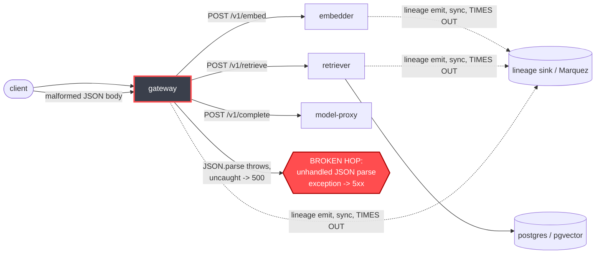

# Postmortem: gateway availability error budget burning slowly (10% of the 28d budget in 6h; 30m & 6h windows)

- **Status:** open
- **Severity:** sev2
- **Verified:** no
- **Opened:** 2026-08-04 00:23:44Z
- **Resolved:** (still open)

## Timeline (machine-generated)

All times UTC on 2026-08-04 unless a full date is shown.

| Time (UTC) | Source | Event |
| --- | --- | --- |
| 00:23:05Z | log-spike | log-spike onset: {"level":"warn","service":"embedder","message":"lineage emit failed","trace_id":"a5d979e5b1e30a0ffd046d9551fc346f","span_id":"5e4e17320616cdef","time":"2026-08-04T00:23:05.171Z","reason":"The operation timed out.","job":"r… |
| 00:23:10Z | alert | alert firing: SLO gateway availability — slow burn |

## Evidence links

- [Loki — logs over the incident window](http://localhost:3001/explore?schemaVersion=1&panes=%7B%22pm%22%3A+%7B%22datasource%22%3A+%22loki%22%2C+%22queries%22%3A+%5B%7B%22refId%22%3A+%22A%22%2C+%22datasource%22%3A+%7B%22type%22%3A+%22loki%22%2C+%22uid%22%3A+%22loki%22%7D%2C+%22expr%22%3A+%22%7Bnamespace%3D%5C%22subject%5C%22%7D+%7C~+%5C%22%28%3Fi%29error%7Cfailed%5C%22%22%7D%5D%2C+%22range%22%3A+%7B%22from%22%3A+%221785803024389%22%2C+%22to%22%3A+%221785803595137%22%7D%7D%7D&orgId=1)
- [Mimir — metrics over the incident window](http://localhost:3001/explore?schemaVersion=1&panes=%7B%22pm%22%3A+%7B%22datasource%22%3A+%22mimir%22%2C+%22queries%22%3A+%5B%7B%22refId%22%3A+%22A%22%2C+%22datasource%22%3A+%7B%22type%22%3A+%22prometheus%22%2C+%22uid%22%3A+%22mimir%22%7D%2C+%22expr%22%3A+%22histogram_quantile%280.95%2C+sum%28rate%28http_server_duration_milliseconds_bucket%5B5m%5D%29%29+by+%28le%29%29%22%7D%5D%2C+%22range%22%3A+%7B%22from%22%3A+%221785803024389%22%2C+%22to%22%3A+%221785803595137%22%7D%7D%7D&orgId=1)

## Investigation context

**Runbook match:** none — no tool narrowing applied for this alert. Available runbooks: README.md, canary-abort.md, ci-pipeline-red.md, dq-freshness-stall.md, gateway-high-error-rate.md, k8s-crashloop.md, k8s-node-failure.md, snapshot-agent-audit.md, stale-secret.md

Pre-check battery (as injected at run start)

## Pre-check leads

### recent_deploys — LEAD
No deploy in the last 60m — rule out the reflex answer.
- No deploy in the last 60m — rule out the reflex answer.

### log_spike — LEAD
error/failed log rate 200/10min vs baseline 0/10min (200x baseline) — onset: {"level":"warn","service":"embedder","message":"lineage emit failed","trace_id":"a5d979e5b1e30a0ffd046d9551fc346f","span_id":"5e4e17320616cdef","time":"2026-08-04T00:23:05.171Z","reason":"The operation timed out.","job":"rag.embed","eventType":"COMPLETE"} at 2026-08-04T00:23:05.171769+00:00
- error/failed log rate 200/10min vs baseline 0/10min (200x baseline) — onset: {"level":"warn","service":"embedder","message":"lineage emit failed","trace_id":"a5d979e5b1e30a0ffd046d9551fc3… (truncated)

### kube_scan — UNAVAILABLE
error: You must be logged in to the server (Unauthorized)

### rollout_state — UNAVAILABLE
gateway: E0804 02:23:47.167861   55628 memcache.go:265] "Unhandled Error" err="couldn't get current server API group list: the server has asked for the client to provide credentials"
E0804 02:23:47.767491   55628 memcache.go:265] "Unhandled Error" err="couldn't get current server API group list: the server has asked for the client to provide credentials"
E0804 02:23:47.918310   55628 memcache.go:265] "Unhandled Error" err="couldn't get current server API group list: the server has asked for the client to; gateway analysis: E0804 02:23:46.405038   65456 memcache.go:265] "Unhandled Error" err="couldn't get current server API group list: the server has asked for the client to provide credentials"
E0804 02:23:47.097761   65456 memcache.go:265] "Unhandled Error"
… (section truncated)

### secret_age — UNAVAILABLE
error: You must be logged in to the server (Unauthorized)

## Narrative

## Summary

`SLO gateway availability — slow burn` fired for tenant acme (10% of the 28d error budget burned in 6h, tripping both the 30m and 6h windows). Investigation found gateway itself throwing uncaught exceptions on malformed JSON request bodies, converting normal bad-input traffic into 500s that directly burn the availability SLO. A second, independent issue (embedder/retriever lineage-emission timeouts inflating request latency) was also found and is noted for follow-up but is not the driver of this specific alert.

## Impact

- `slo:gateway_availability:error_ratio5m/30m/1h` sat around 5–6% (vs. SLO target), and the 6h burn-rate metric ranged as high as ~49% during the window, consistent with a chronic, not spiky, degradation ("slow burn").
- `slo:gateway_latency:sli_ratio5m` was separately measured at ~0.05 (95% of requests breaching the latency objective) — a parallel, compounding problem from the embedder/retriever lineage-timeout issue described below, driving `slo:gateway_latency` (a different alert) rather than this one.
- Traffic kept flowing (mock-llm responses still returned, `cached:true` chat-completed logs continued), so this was a partial-availability degradation, not a full outage.

## Root cause

Evidence, in order of collection:

1. **Runbook**: no runbook matched this exact alertname; `gateway-high-error-rate.md` was used as the closest analog (route/downstream/tenant checklist).
2. **Deploy correlation**: `deploy_history` reported no deploy in the last 60m (though its argo/rollout sources were themselves unavailable — see Lessons). A genuine Argo Rollout event to gateway revision 13 was found via Loki's k8s-events stream at the very edge of the window, but its canary pod (`gateway-55bbf6bfbf-t9sp4`) crash-looped (`BackOff`) for under a minute and was superseded — current traffic is served entirely by the stable revision-12 pods (`gateway-dd85945b4-*`), so this blip is ruled out as the sustained cause.
3. **Loki, gateway logs**: a steady, ongoing pair of log lines — `error: Malformed JSON in request body` immediately followed by `[gateway] unhandled error: ...` — recurring on every gateway replica roughly once every ~10 seconds, cycling through all 4 pods (`c5xbb`, `lvg8w`, `f9rwq`, `bnt4c`). This is an uncaught exception in gateway's request-body JSON parsing: instead of returning a clean `400`, the parse failure propagates as an unhandled error, which the SLI records as an availability failure.
4. **Mimir**: `slo:gateway_availability:error_ratio5m/30m/1h` (~5–6%) is directly consistent with this steady low-rate-but-persistent stream of unhandled-exception 500s across 4 replicas.
5. **Secondary finding (not this alert's driver but worth recording)**: Tempo traces and the `traces_service_graph_request_client_seconds` histograms show gateway→embedder and gateway→retriever call latency sitting at 1.6–4s per hop (vs. gateway→model-proxy's stable ~0.15s). Loki shows `"lineage emit failed"` / `"reason":"The operation timed out."` warnings on essentially every `rag.embed`, `rag.retrieve`, and `rag.inference` span, on gateway, retriever, and embedder alike — consistent with a synchronous OpenLineage emit call to an unreachable/slow lineage sink blocking the hot path. This is what's driving the separately-firing `slo:gateway_latency` SLI, not the availability SLI directly.

## What fixed it

Remediation was **not** successfully applied. A rolling restart of `deployment/gateway` was dry-run (diff: rolling-restart annotation bump, no spec change), the diff was reviewed, and the operator **approved** the action. However, the real (`dry_run=false`) execution failed both attempts with `Unauthorized — you must be logged in to the server` from the cluster API — the same credential failure already flagged as UNAVAILABLE for `kube_scan`, `rollout_state`, and `secret_age` in this session's pre-checks. `alert_status` was re-queried after the failed attempts and continues to report the alert **active** (no recovery observed).

## Lessons

- The on-call agent-ro/remediation credential to the cluster is currently broken for both reads (`kubectl_read`, `argo_app`, `rollout_status` all returned the identical memcache/"Unauthorized" error) and, critically, for writes (`restart_workload` dry-run succeeds but the real patch fails the same way) — this is itself an actionable infra issue: the kubeconfig/service-account token used by these tools needs to be refreshed/rotated. Until then, no remediation tool in this toolset can actually mutate cluster state, only dry-run against a cached/mocked diff.
- gateway needs a try/catch (or body-parser error middleware) around JSON body parsing that returns a `400` instead of letting a parse `SyntaxError` propagate as an unhandled exception/500 — this is a code fix, out of scope for runtime remediation tools, and should be filed against the gateway repo.
- The lineage-emit timeout affecting embedder/retriever/gateway should be tracked as a separate incident against the `slo:gateway_latency` alert; it appears independent of the malformed-JSON bug (different services, different failure signature) but compounds user-facing pain and should not be conflated with this one.
- `deploy_history`'s "no deploy in last 60m" verdict should be treated with suspicion whenever its `sources_unavailable` includes `argo`/`rollout` — cross-check with `k8s_events`, which caught the revision-13 rollout blip that `deploy_history` missed entirely.

