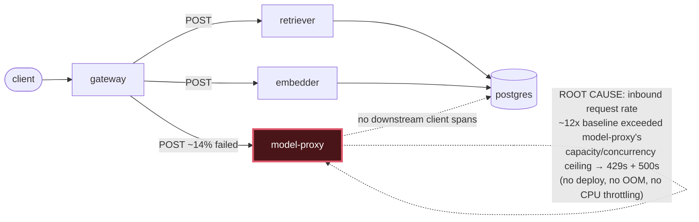

# Postmortem: gateway availability error budget burning fast (2% of the 28d budget in 1h; 5m & 1h windows)

- **Status:** resolved
- **Severity:** sev1
- **Verified:** no
- **Opened:** 2026-08-04 20:52:42Z
- **Resolved:** 2026-08-04 20:57:42Z

## Timeline (machine-generated)

All times UTC on 2026-08-04 unless a full date is shown.

| Time (UTC) | Source | Event |
| --- | --- | --- |
| 20:52:10Z | alert | alert firing: SLO gateway availability — fast burn |
| 20:54:10Z | alert | alert resolved: SLO gateway availability — fast burn |

## Evidence links

- [Loki — logs over the incident window](http://localhost:3001/explore?schemaVersion=1&panes=%7B%22pm%22%3A+%7B%22datasource%22%3A+%22loki%22%2C+%22queries%22%3A+%5B%7B%22refId%22%3A+%22A%22%2C+%22datasource%22%3A+%7B%22type%22%3A+%22loki%22%2C+%22uid%22%3A+%22loki%22%7D%2C+%22expr%22%3A+%22%7Bnamespace%3D%5C%22subject%5C%22%7D+%7C~+%5C%22%28%3Fi%29error%7Cfailed%5C%22%22%7D%5D%2C+%22range%22%3A+%7B%22from%22%3A+%221785876762993%22%2C+%22to%22%3A+%221785877062895%22%7D%7D%7D&orgId=1)
- [Mimir — metrics over the incident window](http://localhost:3001/explore?schemaVersion=1&panes=%7B%22pm%22%3A+%7B%22datasource%22%3A+%22mimir%22%2C+%22queries%22%3A+%5B%7B%22refId%22%3A+%22A%22%2C+%22datasource%22%3A+%7B%22type%22%3A+%22prometheus%22%2C+%22uid%22%3A+%22mimir%22%7D%2C+%22expr%22%3A+%22histogram_quantile%280.95%2C+sum%28rate%28http_server_duration_milliseconds_bucket%5B5m%5D%29%29+by+%28le%29%29%22%7D%5D%2C+%22range%22%3A+%7B%22from%22%3A+%221785876762993%22%2C+%22to%22%3A+%221785877062895%22%7D%7D%7D&orgId=1)

## Investigation context

**Runbook match (2):** `gateway-high-error-rate.md`, `stale-secret.md` — toolset narrowed to 13 tools: alert_status, deploy_history, kubectl_read, loki_query, mimir_query, publish_postmortem, request_approval, restart_workload, runbook_lookup, runbook_read, save_artifact, tempo_query, update_db_secret

Pre-check battery (as injected at run start)

## Pre-check leads

### recent_deploys — LEAD
No deploy in the last 60m — rule out the reflex answer.
- No deploy in the last 60m — rule out the reflex answer.

### attribution — LEAD
errors concentrate on gateway → POST model-proxy (14.3%); time concentrates in model-proxy's own handler (~7.4s of 7.4s) over the last 10m — which is not necessarily the workload named on the alert:
- gateway: 6.5% of its OWN responses are 5xx (10m)
- model-proxy: 3.4% of its OWN responses are 5xx (10m)
- gateway → POST model-proxy: 14.3% of those outbound calls failed
- own-handler p95 (server p95 minus its slowest outbound call — a ranking, not a measurement): model-proxy ~7.4s of 7.4s end to end, embedder ~1.6s of 1.6s end to end, retriever ~1.5s of 1.… (truncated)
- gateway → POST model-proxy: p95 7.3s outbound
- gateway → POST embedder: p95 1.6s outbound

### rollout_state — LEAD
1 rollout-state lead
- analysisrun for gateway (gateway-8444846b5f-21-1): Failed — Metric "canary-error-rate" assessed Failed due to failed (2) > failureLimit (1)

### kube_scan — OK
all pods Ready, no notable cluster events

### log_spike — OK
error/failed log rate normal: 200/10min vs baseline 500/10min

### secret_age — OK
Secret subject-db-credentials last modified 10d 21h ago (created 10d 21h ago).

## Narrative

## Summary
SLO gateway availability (fast burn) fired on tenant `acme`. Errors surfaced at the gateway but did not originate there: attribution by service and by dependency edge both pointed at `model-proxy`, and the failure mode was a sudden capacity overload, not a bad deploy, a crash, or a stale credential.

## Impact
Gateway-facing 5xx rate rose to roughly 6% and the `gateway → POST model-proxy` outbound call edge failed at roughly 14% of calls, driven almost entirely by `model-proxy` returning HTTP 429 (self-throttling) and HTTP 500 (overload) once its inbound request rate jumped roughly 10-12x above baseline. `model-proxy`'s own p95 latency went from ~5ms to ~6.8s over the same interval.

## Root cause
Ruled out, in order, using the matched runbooks:
- **Bad deploy**: `deploy_history` showed the last gateway/model-proxy gitops syncs well before the surge onset, and both rollouts report Healthy — no deploy inside the failure window.
- **Stale DB secret**: `subject-db-credentials` was last modified ~11 days ago, far older than the log-spike onset, so the rotation-vs-restart mismatch signature from the stale-secret runbook does not apply.
- **Crash/OOM/resource limits**: `model-proxy` pods show zero restarts, are still the same long-running pods, and `kubectl top` shows ~100Mi used against a 384Mi limit and CPU well under request — no throttling, no OOMKill, no eviction.
- **Gateway itself**: gateway's own error rate is real but smaller than the edge failure rate into `model-proxy`, and gateway's outbound call volume to `model-proxy` tracks 1:1 with gateway's own inbound surge — gateway is a faithful proxy of the surge, not an independent fault.

What's left, and what the evidence supports: `model-proxy`'s inbound request rate jumped from a steady ~1.2 req/s baseline to ~12-16 req/s in the same window its 429/500 responses and p95 latency exploded, with no corresponding CPU/memory pressure. Earlier bursts of similar magnitude earlier in the window were absorbed with only a mild latency bump (~400ms p95), so this was a capacity/concurrency ceiling inside `model-proxy` being exceeded by the volume of concurrent work, not an infrastructure resource limit. The gateway canary AnalysisRun's `canary-error-rate` failure recorded during the same period is a corroborating symptom of the same downstream overload, not a separate cause.

## What fixed it
A `restart_workload` dry-run on `model-proxy` was prepared as the runbook-indicated mitigation (act on the origin service, not the front door), but the operator **denied** the approval request. No remediation was executed. Re-checking `alert_status` afterward showed the alert had already cleared on its own, and `model-proxy`'s status-code mix returned to 100% 200s at the pre-incident baseline rate — the traffic surge receded before any action was taken.

## Lessons
- The gateway-high-error-rate runbook's attribution-first approach (own-service 5xx, then client-edge 5xx) correctly separated "gateway surfaces it" from "gateway causes it" within the first two queries.
- `model-proxy` has no visible concurrency/queue-depth metric (no eventloop/pool/queue series were exposed), which made "why did an equivalent burst succeed earlier but not this time" harder to answer directly from telemetry alone — worth adding a saturation metric here.
- The operator declined remediation and the incident self-resolved; that outcome should not be read as validating "wait it out" as a strategy — it means we got lucky that the surge was transient. If it recurs and doesn't recede, `model-proxy` capacity (concurrency limit or replica count) still needs to be increased, not just restarted.

