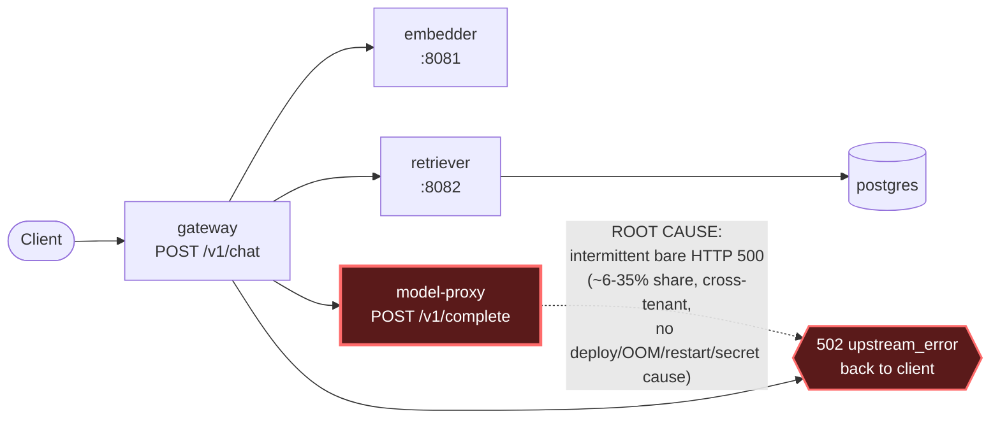

# Postmortem: gateway availability error budget burning fast (2% of the 28d budget in 1h; 5m & 1h windows)

- **Status:** resolved
- **Severity:** sev1
- **Verified:** no
- **Opened:** 2026-08-04 14:01:42Z
- **Resolved:** 2026-08-04 14:06:42Z

## Timeline (machine-generated)

All times UTC on 2026-08-04 unless a full date is shown.

| Time (UTC) | Source | Event |
| --- | --- | --- |
| 13:44:42Z | k8s | Rollout/gateway: RolloutUpdated |
| 13:44:42Z | k8s | Rollout/gateway: NewReplicaSetCreated |
| 13:44:43Z | k8s | Pod/gateway-dd85945b4-pwg4s: Killing |
| 13:44:43Z | k8s | ReplicaSet/gateway-dd85945b4: SuccessfulDelete |
| 13:44:43Z | k8s | Rollout/gateway: ScalingReplicaSet |
| 13:44:43Z | k8s | Rollout/gateway: RolloutNotCompleted |
| 13:44:44Z | k8s | ReplicaSet/gateway-865966ff97: SuccessfulCreate |
| 13:44:44Z | k8s | Rollout/gateway: ScalingReplicaSet |
| 13:44:44Z | k8s | Pod/gateway-865966ff97-zhm57: Scheduled |
| 13:44:46Z | k8s | Pod/gateway-865966ff97-zhm57: Failed |
| 13:44:46Z | k8s | Pod/gateway-865966ff97-zhm57: Pulling |
| 13:44:47Z | k8s | Pod/gateway-865966ff97-zhm57: Failed |
| 13:44:47Z | k8s | Pod/gateway-865966ff97-zhm57: BackOff |
| 13:44:57Z | k8s | Pod/gateway-865966ff97-zhm57: Failed |
| 13:44:57Z | k8s | Pod/gateway-865966ff97-zhm57: Pulling |
| 13:45:08Z | k8s | Pod/gateway-865966ff97-zhm57: Failed |
| 13:45:08Z | k8s | Pod/gateway-865966ff97-zhm57: BackOff |
| 13:45:19Z | k8s | Pod/gateway-865966ff97-zhm57: Failed |
| 13:45:19Z | k8s | Pod/gateway-865966ff97-zhm57: Pulling |
| 13:45:33Z | k8s | Pod/gateway-865966ff97-zhm57: Failed |
| 13:45:33Z | k8s | Pod/gateway-865966ff97-zhm57: BackOff |
| 13:45:46Z | k8s | Pod/gateway-865966ff97-zhm57: Failed |
| 13:45:46Z | k8s | Pod/gateway-865966ff97-zhm57: BackOff |
| 13:45:57Z | k8s | Pod/gateway-865966ff97-zhm57: Failed |
| 13:45:57Z | k8s | Pod/gateway-865966ff97-zhm57: BackOff |
| 13:46:10Z | k8s | Pod/gateway-865966ff97-zhm57: Failed |
| 13:46:10Z | k8s | Pod/gateway-865966ff97-zhm57: Pulling |
| 13:46:24Z | k8s | Pod/gateway-865966ff97-zhm57: Failed |
| 13:46:24Z | k8s | Pod/gateway-865966ff97-zhm57: BackOff |
| 13:46:37Z | k8s | Pod/gateway-865966ff97-zhm57: Failed |
| 13:46:37Z | k8s | Pod/gateway-865966ff97-zhm57: BackOff |
| 13:46:48Z | k8s | Pod/gateway-865966ff97-zhm57: Failed |
| 13:46:48Z | k8s | Pod/gateway-865966ff97-zhm57: BackOff |
| 13:47:00Z | k8s | Pod/gateway-865966ff97-zhm57: Failed |
| 13:47:00Z | k8s | Pod/gateway-865966ff97-zhm57: BackOff |
| 13:47:13Z | k8s | Pod/gateway-865966ff97-zhm57: Failed |
| 13:47:13Z | k8s | Pod/gateway-865966ff97-zhm57: BackOff |
| 13:47:27Z | k8s | Pod/gateway-865966ff97-zhm57: Failed |
| 13:47:27Z | k8s | Pod/gateway-865966ff97-zhm57: BackOff |
| 13:47:38Z | k8s | Pod/gateway-865966ff97-zhm57: Failed |
| 13:47:38Z | k8s | Pod/gateway-865966ff97-zhm57: Pulling |
| 13:47:49Z | k8s | Pod/gateway-865966ff97-zhm57: Failed |
| 13:47:49Z | k8s | Pod/gateway-865966ff97-zhm57: BackOff |
| 13:48:03Z | k8s | Pod/gateway-865966ff97-zhm57: Failed |
| 13:48:03Z | k8s | Pod/gateway-865966ff97-zhm57: BackOff |
| 13:48:16Z | k8s | Pod/gateway-865966ff97-zhm57: Failed |
| 13:48:16Z | k8s | Pod/gateway-865966ff97-zhm57: BackOff |
| 13:48:31Z | k8s | Pod/gateway-865966ff97-zhm57: Failed |
| 13:48:31Z | k8s | Pod/gateway-865966ff97-zhm57: BackOff |
| 13:48:44Z | k8s | Pod/gateway-865966ff97-zhm57: BackOff |
| 13:48:56Z | k8s | Pod/gateway-865966ff97-zhm57: BackOff |
| 13:49:10Z | k8s | Pod/gateway-865966ff97-zhm57: BackOff |
| 13:49:21Z | k8s | Pod/gateway-865966ff97-zhm57: BackOff |
| 13:49:35Z | k8s | Pod/gateway-865966ff97-zhm57: BackOff |
| 13:49:48Z | k8s | Pod/gateway-865966ff97-zhm57: Failed |
| 13:49:48Z | k8s | Pod/gateway-865966ff97-zhm57: BackOff |
| 13:54:47Z | k8s | Pod/gateway-865966ff97-zhm57: Failed |
| 13:54:47Z | k8s | Pod/gateway-865966ff97-zhm57: BackOff |
| 13:55:31Z | k8s | Rollout/gateway: SkipSteps |
| 13:55:31Z | k8s | Rollout/gateway: RolloutUpdated |
| 13:55:32Z | k8s | ReplicaSet/gateway-dd85945b4: SuccessfulCreate |
| 13:55:32Z | k8s | ReplicaSet/gateway-865966ff97: SuccessfulDelete |
| 13:55:32Z | k8s | Rollout/gateway: ScalingReplicaSet |
| 13:55:32Z | k8s | Pod/gateway-dd85945b4-jfd54: Scheduled |
| 13:55:35Z | k8s | Pod/gateway-dd85945b4-jfd54: Started |
| 13:55:35Z | k8s | Pod/gateway-dd85945b4-jfd54: Pulled |
| 13:55:35Z | k8s | Pod/gateway-dd85945b4-jfd54: Created |
| 14:01:10Z | alert | alert firing: SLO gateway availability — fast burn |
| 14:03:10Z | alert | alert resolved: SLO gateway availability — fast burn |

## Evidence links

- [Loki — logs over the incident window](http://localhost:3001/explore?schemaVersion=1&panes=%7B%22pm%22%3A+%7B%22datasource%22%3A+%22loki%22%2C+%22queries%22%3A+%5B%7B%22refId%22%3A+%22A%22%2C+%22datasource%22%3A+%7B%22type%22%3A+%22loki%22%2C+%22uid%22%3A+%22loki%22%7D%2C+%22expr%22%3A+%22%7Bnamespace%3D%5C%22subject%5C%22%7D+%7C~+%5C%22%28%3Fi%29error%7Cfailed%5C%22%22%7D%5D%2C+%22range%22%3A+%7B%22from%22%3A+%221785852102893%22%2C+%22to%22%3A+%221785852402877%22%7D%7D%7D&orgId=1)
- [Mimir — metrics over the incident window](http://localhost:3001/explore?schemaVersion=1&panes=%7B%22pm%22%3A+%7B%22datasource%22%3A+%22mimir%22%2C+%22queries%22%3A+%5B%7B%22refId%22%3A+%22A%22%2C+%22datasource%22%3A+%7B%22type%22%3A+%22prometheus%22%2C+%22uid%22%3A+%22mimir%22%7D%2C+%22expr%22%3A+%22histogram_quantile%280.95%2C+sum%28rate%28http_server_duration_milliseconds_bucket%5B5m%5D%29%29+by+%28le%29%29%22%7D%5D%2C+%22range%22%3A+%7B%22from%22%3A+%221785852102893%22%2C+%22to%22%3A+%221785852402877%22%7D%7D%7D&orgId=1)

## Investigation context

**Runbook match (2):** `gateway-high-error-rate.md`, `stale-secret.md` — toolset narrowed to 13 tools: alert_status, deploy_history, kubectl_read, loki_query, mimir_query, publish_postmortem, request_approval, restart_workload, runbook_lookup, runbook_read, save_artifact, tempo_query, update_db_secret

Pre-check battery (as injected at run start)

## Pre-check leads

### recent_deploys — LEAD
No deploy in the last 60m — rule out the reflex answer.
- No deploy in the last 60m — rule out the reflex answer.

### log_spike — OK
error/failed log rate normal: 200/10min vs baseline 500/10min

### kube_scan — UNAVAILABLE
error: You must be logged in to the server (Unauthorized)

### rollout_state — UNAVAILABLE
gateway: E0804 16:01:43.506437   54844 memcache.go:265] "Unhandled Error" err="couldn't get current server API group list: the server has asked for the client to provide credentials"
E0804 16:01:43.575222   54844 memcache.go:265] "Unhandled Error" err="couldn't get current server API group list: the server has asked for the client to provide credentials"
E0804 16:01:43.646002   54844 memcache.go:265] "Unhandled Error" err="couldn't get current server API group list: the server has asked for the client to; gateway analysis: E0804 16:01:43.506437   36672 memcache.go:265] "Unhandled Error" err="couldn't get current server API group list: the server has asked for the client to provide credentials"
E0804 16:01:43.573055   36672 memcache.go:265] "Unhandled Error"
… (section truncated)

### secret_age — UNAVAILABLE
error: You must be logged in to the server (Unauthorized)

## Narrative

## Summary

`SLO gateway availability — fast burn` (sev1, tenant acme) fired on the gateway's 28-day availability budget burning at ~2%/hour. Investigation traced this to `model-proxy` intermittently returning bare HTTP 500 responses from its own `POST /v1/complete` route, which the gateway propagates as `502 upstream_error` on `POST /v1/chat`.

## Impact

Gateway `POST /v1/chat` requests failed intermittently for all tenants observed in traces (confirmed on both `acme` and `bravo`, ruling out a single-tenant rate-limit storm). Error share on that route fluctuated ~6-9% during normal windows and spiked to ~35% mid-incident, before falling back to baseline and then to 0%.

## Root cause

**Component:** `model-proxy`, `POST /v1/complete`.
**Category:** downstream service intermittently returning 5xx on its core route (matches runbook hypothesis "one downstream is failing ... and the gateway is surfacing its errors") — **not** a bad deploy, **not** a stale DB credential, **not** a timeout/OOM/restart-loop.

Evidence gathered:
- `deploy_history` for gateway/model-proxy returned zero entries in the lookback window, and the `cicd_deployments_total` counter was flat at 0 for every workload across the full 3h window — a deploy is ruled out.
- `{...} |= "password authentication failed"` returned zero log lines, and Postgres logs showed only routine checkpoint activity — the stale-secret runbook hypothesis does not apply (no auth-failure signature, secret-age lead was unavailable but moot given no failure signature at all).
- `kube_pod_container_status_restarts_total` was 0 for every pod in the `subject` namespace (gateway, model-proxy, retriever, embedder, postgres, redis) — no crash-loop.
- `container_memory_working_set_bytes` for model-proxy pods sat at ~95-100 MiB against a 384 MiB limit — no memory pressure, no OOM.
- `traces_spanmetrics_calls_total{service="model-proxy"}` showed `GET /health` at 100% success throughout (so k8s health/readiness never flagged the pods), while `POST /v1/complete` carried a persistent `STATUS_CODE_ERROR` share.
- Full trace inspection (e.g. traces `035e612f...`, `0e767826...`) showed the model-proxy span itself returning `http.response.status_code=500` with short span durations (367ms-1.7s, nowhere near a timeout boundary), propagating up through gateway's `rag.generate` span as `exception.type=upstream_error, exception.message="model-proxy returned 500"` and a final `502` on `POST /v1/chat`. Errors were seen for tenants `acme` and `bravo` alike, ruling out the "single abusive tenant / expected 429" hypothesis.

## What fixed it

The runbook's mitigation step ("if a single downstream is failing: restart it") was followed: `restart_workload(model-proxy)` was dry-run, the diff (`kubectl.kubernetes.io/restartedAt` rolling-restart annotation bump, no spec change) was approved by the operator, and the real restart was attempted twice. **Both attempts failed** with `Unauthorized — you must be logged in to the server`, the same cluster-credential failure that had already made the `kube_scan`, `rollout_state`, and `secret_age` pre-checks unavailable at page time. The remediation therefore never actually applied.

Re-querying `alert_status` immediately afterward showed the alert had already cleared (`active: false`), and a fresh `traces_spanmetrics_calls_total` query showed the error rate at 0% in the two most recent 5-minute buckets — but so was total traffic, consistent with the load-generator's bursty on/off pattern rather than a confirmed fix. **This recovery cannot be attributed to the attempted remediation, since the remediation call itself errored out before touching the cluster.**

## Lessons

1. The write-path RBAC/credential problem affecting `kubectl_read`, `restart_workload`, and the other cluster-mutating tools needs its own investigation and fix — the on-call agent was unable to execute any authenticated cluster action this incident, which is a significant blind spot for a page of this severity.
2. `model-proxy` should emit structured error logs on `/v1/complete` failures (Loki queries for its pods returned zero lines over the full window); today the only visibility into its 500s is via span status on traces, which is enough to diagnose but not to alert on directly.
3. Because recovery was observed without a confirmed remediation, the underlying intermittent-500 condition in `model-proxy` should be treated as still-latent until it either reproduces or is positively ruled out by a maintainer with real cluster access.

Remediation attempted: `restart_workload(model-proxy)` — approved by operator, but execution failed both times with a cluster-auth error and never applied. Alert independently cleared on re-query; treat root cause as unconfirmed-fixed, not resolved-by-action.
