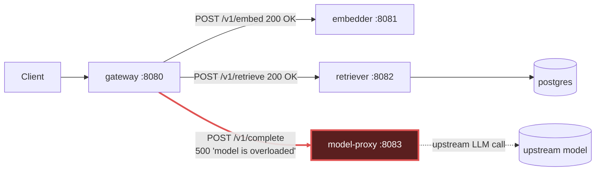

# Postmortem: gateway 5xx rate above 2%

- **Status:** open
- **Severity:** sev1
- **Verified:** no
- **Opened:** 2026-08-04 13:23:40Z
- **Resolved:** (still open)

## Timeline (machine-generated)

All times UTC on 2026-08-04 unless a full date is shown.

| Time (UTC) | Source | Event |
| --- | --- | --- |
| 12:29:48Z | k8s | Pod/retriever-8454db56c-q2b86: BackOff |
| 12:30:10Z | k8s | Pod/retriever-8454db56c-q2b86: Started |
| 12:30:10Z | k8s | Pod/retriever-8454db56c-q2b86: Pulled |
| 12:30:10Z | k8s | Pod/retriever-8454db56c-q2b86: Created |
| 12:30:13Z | k8s | Pod/retriever-8454db56c-q2b86: BackOff |
| 12:30:16Z | k8s | Pod/retriever-8454db56c-q2b86: BackOff |
| 12:31:26Z | k8s | Pod/retriever-8454db56c-q2b86: BackOff |
| 12:32:37Z | k8s | Pod/retriever-8454db56c-q2b86: BackOff |
| 12:32:57Z | k8s | Pod/retriever-8454db56c-q2b86: Started |
| 12:32:57Z | k8s | Pod/retriever-8454db56c-q2b86: Pulled |
| 12:32:57Z | k8s | Pod/retriever-8454db56c-q2b86: Created |
| 12:32:59Z | k8s | Pod/retriever-8454db56c-q2b86: BackOff |
| 12:33:03Z | k8s | Pod/retriever-8454db56c-q2b86: BackOff |
| 12:33:06Z | k8s | Pod/retriever-8454db56c-q2b86: BackOff |
| 12:34:15Z | k8s | Pod/retriever-8454db56c-q2b86: BackOff |
| 12:35:16Z | k8s | Pod/retriever-8454db56c-q2b86: BackOff |
| 12:36:08Z | k8s | ReplicaSet/retriever-8454db56c: SuccessfulDelete |
| 12:36:08Z | k8s | Deployment/retriever: ScalingReplicaSet |
| 13:20:30Z | log-spike | log-spike onset: {"level":"warn","service":"retriever","message":"lineage emit failed","trace_id":"b9b5da83b1948b3f342baad9638fb359","span_id":"5ff476420867bf75","time":"2026-08-04T13:20:30.359Z","reason":"The operation timed out.","job":"… |
| 13:23:10Z | alert | alert firing: Gateway 5xx rate > 2% |

## Evidence links

- [Loki — logs over the incident window](http://localhost:3001/explore?schemaVersion=1&panes=%7B%22pm%22%3A+%7B%22datasource%22%3A+%22loki%22%2C+%22queries%22%3A+%5B%7B%22refId%22%3A+%22A%22%2C+%22datasource%22%3A+%7B%22type%22%3A+%22loki%22%2C+%22uid%22%3A+%22loki%22%7D%2C+%22expr%22%3A+%22%7Bnamespace%3D%5C%22subject%5C%22%7D+%7C~+%5C%22%28%3Fi%29error%7Cfailed%5C%22%22%7D%5D%2C+%22range%22%3A+%7B%22from%22%3A+%221785849820079%22%2C+%22to%22%3A+%221785850148378%22%7D%7D%7D&orgId=1)
- [Mimir — metrics over the incident window](http://localhost:3001/explore?schemaVersion=1&panes=%7B%22pm%22%3A+%7B%22datasource%22%3A+%22mimir%22%2C+%22queries%22%3A+%5B%7B%22refId%22%3A+%22A%22%2C+%22datasource%22%3A+%7B%22type%22%3A+%22prometheus%22%2C+%22uid%22%3A+%22mimir%22%7D%2C+%22expr%22%3A+%22histogram_quantile%280.95%2C+sum%28rate%28http_server_duration_milliseconds_bucket%5B5m%5D%29%29+by+%28le%29%29%22%7D%5D%2C+%22range%22%3A+%7B%22from%22%3A+%221785849820079%22%2C+%22to%22%3A+%221785850148378%22%7D%7D%7D&orgId=1)

## Investigation context

**Runbook match (2):** `gateway-high-error-rate.md`, `stale-secret.md` — toolset narrowed to 13 tools: alert_status, deploy_history, kubectl_read, loki_query, mimir_query, publish_postmortem, request_approval, restart_workload, runbook_lookup, runbook_read, save_artifact, tempo_query, update_db_secret

Pre-check battery (as injected at run start)

## Pre-check leads

### recent_deploys — LEAD
No deploy in the last 60m — rule out the reflex answer.
- No deploy in the last 60m — rule out the reflex answer.

### log_spike — LEAD
error/failed log rate 200/10min vs baseline 0/10min (200x baseline) — onset: {"level":"warn","service":"retriever","message":"lineage emit failed","trace_id":"b9b5da83b1948b3f342baad9638fb359","span_id":"5ff476420867bf75","time":"2026-08-04T13:20:30.359Z","reason":"The operation timed out.","job":"rag.retrieve","eventType":"START"} at 2026-08-04T13:20:30.360317+00:00
- error/failed log rate 200/10min vs baseline 0/10min (200x baseline) — onset: {"level":"warn","service":"retriever","message":"lineage emit failed","trace_id":"b9b5da83b1948b3f342baad9638f… (truncated)

### kube_scan — UNAVAILABLE
error: You must be logged in to the server (Unauthorized)

### rollout_state — UNAVAILABLE
gateway: E0804 15:23:40.768305   63964 memcache.go:265] "Unhandled Error" err="couldn't get current server API group list: the server has asked for the client to provide credentials"
E0804 15:23:40.836512   63964 memcache.go:265] "Unhandled Error" err="couldn't get current server API group list: the server has asked for the client to provide credentials"
E0804 15:23:40.915017   63964 memcache.go:265] "Unhandled Error" err="couldn't get current server API group list: the server has asked for the client to; gateway analysis: E0804 15:23:40.780544   44760 memcache.go:265] "Unhandled Error" err="couldn't get current server API group list: the server has asked for the client to provide credentials"
E0804 15:23:40.869896   44760 memcache.go:265] "Unhandled Error"
… (section truncated)

### secret_age — UNAVAILABLE
error: You must be logged in to the server (Unauthorized)

## Narrative

## Summary

`Gateway 5xx rate > 2%` fired for tenant `acme`. Gateway's `/v1/chat` route was returning 502s to clients because its downstream call to `model-proxy` was failing.

## Impact

Any `/v1/chat` request that reached the `rag.generate` step failed end-to-end with a gateway 502 (surfaced from an `upstream_error: model-proxy returned 500`). Retrieval and embedding stages of the same requests completed successfully (200s from `retriever:8082` and `embedder:8081`) — only the model-proxy hop was broken, so failures were concentrated at the final generation step of the pipeline.

## Root cause

Evidence ruled out the two other runbook-listed hypotheses before landing on the real one:

- **Bad deploy** — `deploy_history` returned zero entries in the 180-minute window; no deploy precedes the alert. Ruled out.
- **Stale DB secret** — `loki_query {namespace="subject"} |= "password authentication failed"` returned zero lines over the incident window, and the failures aren't auth-shaped at all. Ruled out.
- **OOM / crashloop / resource starvation** — `kube_pod_container_status_restarts_total{namespace="subject"}` is `0` for every model-proxy pod, and `container_memory_working_set_bytes` for all 4 model-proxy pods sat flat around 93–107MiB throughout, no ceiling hit. Ruled out.

The actual signature: a full Tempo trace (`01bb4ee67b69f86efd728eff49fa27b5`) shows the `gateway` span for `POST /v1/chat` returning `http.response.status_code=502`, with its internal `rag.chat`/`rag.generate` spans carrying an `upstream_error` exception `"model-proxy returned 500"`. The client span `POST model-proxy` (`gateway → model-proxy:8083/v1/complete`) completed in ~1.5ms with `http.response.status_code=500` — far too fast to be a network timeout, i.e. model-proxy is rejecting the request almost immediately, not hanging.

Pulling model-proxy's own span (via `{resource.service.name="model-proxy"} && {event.exception.message=~".+"}`) surfaces the real exception text: **`"model is overloaded"`** — model-proxy's own internal capacity/concurrency guard is tripping and short-circuiting completion requests, which gateway then wraps and reports as a 502 to the client. This is an application-level overload condition inside model-proxy, not an infrastructure problem: CPU on the model-proxy pods bottomed out at the exact log-spike onset (13:20:30) and then climbed afterward as failed/retried requests added overhead — the shape you'd expect from a capacity guard tripping under load, not from CPU throttling causing the guard to trip.

The `retriever`/`embedder`/`gateway` "lineage emit failed … operation timed out" warnings present in the same window are a secondary, lower-severity symptom (OpenLineage emission timing out) — they share the same time window but are not the cause of the 5xx; the 502s are driven specifically by the `model-proxy` `/v1/complete` calls failing.

## What fixed it

**Nothing — the incident is unresolved.** A rolling restart of `deployment/model-proxy` was dry-run (diff: rolling-restart annotation bump, no spec change) and submitted for approval with the verified diff attached. The operator **denied** the approval. Per protocol, no remediation was executed. `alert_status` was re-queried after the denial and the alert is still active (`since: 2026-08-04T13:23:10Z`, unchanged). No further remediation attempts were made after the denial.

## Lessons

- model-proxy needs an exported metric for its internal overload/concurrency-guard state (rejected-request counter or in-flight gauge) — right now the only way to see this is by reading exception text out of trace spans, which doesn't scale for alerting.
- The `gateway-high-error-rate` runbook's mitigation step ("restart the failing downstream") assumes the operator will approve it; when denied, there's currently no secondary remediation path available to this on-call tooling (no scale-up, no failover trigger) — worth adding one for model-proxy capacity incidents specifically.
- Confirm with the service owner whether "model is overloaded" reflects a real upstream LLM provider throttling model-proxy, or a mis-tuned internal concurrency cap — that determines whether the fix is a config change (raise the cap / add backoff) or a capacity increase, neither of which this on-call session had a tool for.

