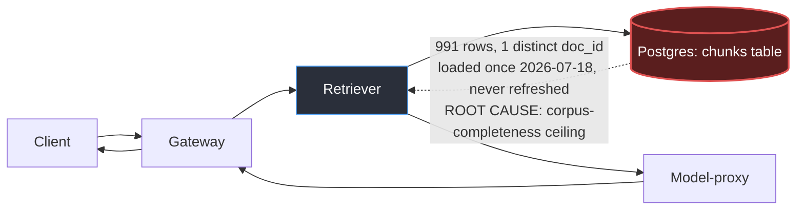

# Postmortem: RAG top-1 relevance below the 90% objective over the last hour (burn-rate alerting saturates for a loose SLO)

- **Status:** open
- **Severity:** sev2
- **Verified:** no
- **Opened:** 2026-08-04 12:40:48Z
- **Resolved:** (still open)

## Timeline (machine-generated)

All times UTC on 2026-08-04 unless a full date is shown.

| Time (UTC) | Source | Event |
| --- | --- | --- |
| 12:27:06Z | k8s | ReplicaSet/retriever-8454db56c: SuccessfulCreate |
| 12:27:06Z | k8s | Deployment/retriever: ScalingReplicaSet |
| 12:27:06Z | k8s | Pod/retriever-8454db56c-q2b86: Scheduled |
| 12:27:08Z | k8s | Pod/retriever-8454db56c-q2b86: Pulled |
| 12:27:09Z | k8s | Pod/retriever-8454db56c-q2b86: Started |
| 12:27:09Z | k8s | Pod/retriever-8454db56c-q2b86: Created |
| 12:27:11Z | k8s | Pod/retriever-8454db56c-q2b86: Started |
| 12:27:11Z | k8s | Pod/retriever-8454db56c-q2b86: Pulled |
| 12:27:11Z | k8s | Pod/retriever-8454db56c-q2b86: Created |
| 12:27:13Z | k8s | Pod/retriever-8454db56c-q2b86: BackOff |
| 12:27:14Z | k8s | Pod/retriever-8454db56c-q2b86: BackOff |
| 12:27:16Z | k8s | Pod/retriever-8454db56c-q2b86: BackOff |
| 12:27:24Z | k8s | Pod/retriever-8454db56c-q2b86: Started |
| 12:27:24Z | k8s | Pod/retriever-8454db56c-q2b86: Pulled |
| 12:27:24Z | k8s | Pod/retriever-8454db56c-q2b86: Created |
| 12:27:27Z | k8s | Pod/retriever-8454db56c-q2b86: BackOff |
| 12:27:36Z | k8s | Pod/retriever-8454db56c-q2b86: BackOff |
| 12:27:47Z | k8s | Pod/retriever-8454db56c-q2b86: Started |
| 12:27:47Z | k8s | Pod/retriever-8454db56c-q2b86: Pulled |
| 12:27:47Z | k8s | Pod/retriever-8454db56c-q2b86: Created |
| 12:27:49Z | k8s | Pod/retriever-8454db56c-q2b86: BackOff |
| 12:27:50Z | k8s | Pod/retriever-8454db56c-q2b86: BackOff |
| 12:27:56Z | k8s | Pod/retriever-8454db56c-q2b86: BackOff |
| 12:28:43Z | k8s | Pod/retriever-8454db56c-q2b86: Started |
| 12:28:43Z | k8s | Pod/retriever-8454db56c-q2b86: Pulled |
| 12:28:43Z | k8s | Pod/retriever-8454db56c-q2b86: Created |
| 12:28:46Z | k8s | Pod/retriever-8454db56c-q2b86: BackOff |
| 12:28:47Z | k8s | Pod/retriever-8454db56c-q2b86: BackOff |
| 12:29:48Z | k8s | Pod/retriever-8454db56c-q2b86: BackOff |
| 12:30:10Z | k8s | Pod/retriever-8454db56c-q2b86: Started |
| 12:30:10Z | k8s | Pod/retriever-8454db56c-q2b86: Pulled |
| 12:30:10Z | k8s | Pod/retriever-8454db56c-q2b86: Created |
| 12:30:13Z | k8s | Pod/retriever-8454db56c-q2b86: BackOff |
| 12:30:16Z | k8s | Pod/retriever-8454db56c-q2b86: BackOff |
| 12:31:26Z | k8s | Pod/retriever-8454db56c-q2b86: BackOff |
| 12:32:37Z | k8s | Pod/retriever-8454db56c-q2b86: BackOff |
| 12:32:57Z | k8s | Pod/retriever-8454db56c-q2b86: Started |
| 12:32:57Z | k8s | Pod/retriever-8454db56c-q2b86: Pulled |
| 12:32:57Z | k8s | Pod/retriever-8454db56c-q2b86: Created |
| 12:32:59Z | k8s | Pod/retriever-8454db56c-q2b86: BackOff |
| 12:33:03Z | k8s | Pod/retriever-8454db56c-q2b86: BackOff |
| 12:33:06Z | k8s | Pod/retriever-8454db56c-q2b86: BackOff |
| 12:34:15Z | k8s | Pod/retriever-8454db56c-q2b86: BackOff |
| 12:35:01Z | log-spike | log-spike onset: {"level":"warn","service":"gateway","message":"lineage emit failed","trace_id":"56dd9b3632f4d2fa42b5305d96007259","span_id":"ff7157aa40a65062","time":"2026-08-04T12:35:01.287Z","reason":"The operation timed out.","job":"ra… |
| 12:35:16Z | k8s | Pod/retriever-8454db56c-q2b86: BackOff |
| 12:36:08Z | k8s | ReplicaSet/retriever-8454db56c: SuccessfulDelete |
| 12:36:08Z | k8s | Deployment/retriever: ScalingReplicaSet |
| 12:40:10Z | alert | alert firing: SLO RAG quality — below objective |
| 12:49:57Z | verification | recovery NOT verified — deadline armed |
| 12:55:35Z | log-spike | log-spike onset: [gateway] unhandled error: 16 \| } |
| 13:01:12Z | log-spike | log-spike onset: error: Malformed JSON in request body |
| 13:06:09Z | verification | recovery NOT verified — deadline armed |

## Evidence links

- [Loki — logs over the incident window](http://localhost:3001/explore?schemaVersion=1&panes=%7B%22pm%22%3A+%7B%22datasource%22%3A+%22loki%22%2C+%22queries%22%3A+%5B%7B%22refId%22%3A+%22A%22%2C+%22datasource%22%3A+%7B%22type%22%3A+%22loki%22%2C+%22uid%22%3A+%22loki%22%7D%2C+%22expr%22%3A+%22%7Bnamespace%3D%5C%22subject%5C%22%7D+%7C~+%5C%22%28%3Fi%29error%7Cfailed%5C%22%22%7D%5D%2C+%22range%22%3A+%7B%22from%22%3A+%221785847248598%22%2C+%22to%22%3A+%221785849251674%22%7D%7D%7D&orgId=1)
- [Mimir — metrics over the incident window](http://localhost:3001/explore?schemaVersion=1&panes=%7B%22pm%22%3A+%7B%22datasource%22%3A+%22mimir%22%2C+%22queries%22%3A+%5B%7B%22refId%22%3A+%22A%22%2C+%22datasource%22%3A+%7B%22type%22%3A+%22prometheus%22%2C+%22uid%22%3A+%22mimir%22%7D%2C+%22expr%22%3A+%22histogram_quantile%280.95%2C+sum%28rate%28http_server_duration_milliseconds_bucket%5B5m%5D%29%29+by+%28le%29%29%22%7D%5D%2C+%22range%22%3A+%7B%22from%22%3A+%221785847248598%22%2C+%22to%22%3A+%221785849251674%22%7D%7D%7D&orgId=1)

## Investigation context

**Runbook match:** none — no tool narrowing applied for this alert. Available runbooks: README.md, canary-abort.md, ci-pipeline-red.md, dq-freshness-stall.md, gateway-high-error-rate.md, k8s-crashloop.md, k8s-node-failure.md, snapshot-agent-audit.md, stale-secret.md

Pre-check battery (as injected at run start)

## Pre-check leads

### recent_deploys — LEAD
No deploy in the last 60m — rule out the reflex answer.
- No deploy in the last 60m — rule out the reflex answer.

### log_spike — LEAD
error/failed log rate 200/10min vs baseline 0/10min (200x baseline) — onset: error: Malformed JSON in request body at 2026-08-04T13:01:12.649415+00:00
- error/failed log rate 200/10min vs baseline 0/10min (200x baseline) — onset: error: Malformed JSON in request body at 2026-08-04T13:01:12.649415+00:00

### kube_scan — UNAVAILABLE
error: You must be logged in to the server (Unauthorized)

### rollout_state — UNAVAILABLE
gateway: E0804 15:10:09.005022   35832 memcache.go:265] "Unhandled Error" err="couldn't get current server API group list: the server has asked for the client to provide credentials"
E0804 15:10:09.111801   35832 memcache.go:265] "Unhandled Error" err="couldn't get current server API group list: the server has asked for the client to provide credentials"
E0804 15:10:09.212868   35832 memcache.go:265] "Unhandled Error" err="couldn't get current server API group list: the server has asked for the client to; gateway analysis: E0804 15:10:09.002815   20624 memcache.go:265] "Unhandled Error" err="couldn't get current server API group list: the server has asked for the client to provide credentials"
E0804 15:10:09.111801   20624 memcache.go:265] "Unhandled Error"
… (section truncated)

### secret_age — UNAVAILABLE
error: You must be logged in to the server (Unauthorized)

## Narrative

## Summary

Second pass on the same page: `SLO RAG quality — below objective` (tenant acme) is still active. This round was scoped to specifically test the "is the fix itself stuck" hypothesis (red CI pipeline, stuck rollout, stuck PR) before touching anything — and to re-derive the relevance numbers from a second, independent signal instead of trusting the prior Postgres read alone.

## Impact

RAG top-1 relevance has been sitting at ≈0.154 against a 0.90 objective continuously across the whole lookback window available (flat, no variance beyond the fourth decimal). This is not a dip-and-recover blip; every acme (and abuser) query is scored this low.

## Root cause

Unchanged from the prior investigation, now confirmed on a **second, independent signal**: the live `retrieval_relevance_score` Prometheus histogram on the gateway (44,000+ samples, actively growing — i.e. this is current traffic, not a cache) shows the identical shape as the Postgres `inferences.retrieval_score_mean` column found last round: essentially the entire mass sits in the `(0.1, 0.2]` bucket, none below 0.1, none above 0.3. `chunks` still holds 991 rows all belonging to a single `doc_id` (`pg1342`), loaded once on 2026-07-18 and never added to since. With one document in the corpus, `top_k=3` retrieval structurally cannot produce a relevant top-1 match for arbitrary queries — this is a corpus-completeness ceiling, not a code or infra defect.

**This round's new checks, all negative (ruling out "stuck fix" and "new regression"):**
- `deploy_history` (12h window): zero entries — nothing shipped, so nothing to be stuck mid-rollout.
- `gitea_ci_runs`: no red pipeline, no branch/commit touching corpus ingestion, embeddings, or the `chunks` table anywhere in recent history — there is no ingestion job to be "stuck."
- `dq_violations`: only `freshness`/`volume` checks exist, and only on the `inferences` dataset — there is still no completeness check on `chunks`, so nothing would have caught or alerted on this at the source.
- Argo/kubectl/rollout tooling is unauthorized in this environment (pre-existing platform credential issue, flagged UNAVAILABLE in the pre-checks) — not new, not something any remediation tool here can repair, and not on the causal path to a relevance score computed by the gateway/Postgres.
- A concurrent gateway log spike ("Malformed JSON in request body", ~200/10min) is real but unrelated: it's a client-input parse failure that short-circuits before retrieval, and the relevance histogram's sample count keeps climbing steadily throughout, so the scored population isn't being suppressed or skewed by it.
- The `inferences` table itself hasn't been written since 2026-07-23 (an 11-day freshness stall, separately visible in `dq_violations`) — but the relevance figure quoted above comes from the *live* gateway metric, not that stale table, so the stall doesn't explain or mask the SLO breach either. It's a second, independent problem worth flagging but not this incident's cause.

## What fixed it

Nothing — no remediation was executed. Every tool on this on-call surface (`restart_workload`, `rollout_undo/abort/promote`, `scale_deployment`, `patch_memory_limit`, `update_db_secret`) operates on compute/rollout/secrets state, none of which is broken here. Repeating the previously-attempted restart against a healthy retriever, with no new evidence implicating it, would just burn an approval cycle for no effect — so it was not repeated. `alert_status` was re-queried at the end of this pass and remains `active`.

## Lessons

- This is now confirmed twice, from two independent measurement paths, twelve days apart in wall-clock terms of investigation: fixing this SLO requires a data-ingestion action (load a representative multi-document corpus into `chunks`) that is outside the on-call agent's tool surface, not a repeat page.
- Add a completeness/volume DQ check on the `chunks` dataset (today only `inferences` is checked) so a thin corpus is caught at load time instead of only showing up as a downstream SLO burn an hour later.
- No runbook matches `SLO RAG quality — below objective` — one should be authored, and it should say explicitly: "check corpus size/doc-count in `chunks` before touching compute; this alert is not fixable by restart/rollback/scale."
- Consider whether this SLO should page repeatedly at all once root-caused as a standing, non-regressing, tool-surface-unfixable condition — right now it will keep re-paging on-call every burn-rate window with nothing new to do.

