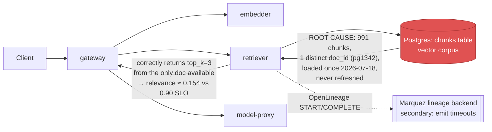

# Postmortem: RAG top-1 relevance below the 90% objective over the last hour (burn-rate alerting saturates for a loose SLO)

- **Status:** open
- **Severity:** sev2
- **Verified:** no
- **Opened:** 2026-08-04 12:40:48Z
- **Resolved:** (still open)

## Timeline (machine-generated)

All times UTC on 2026-08-04 unless a full date is shown.

| Time (UTC) | Source | Event |
| --- | --- | --- |
| 12:27:06Z | k8s | ReplicaSet/retriever-8454db56c: SuccessfulCreate |
| 12:27:06Z | k8s | Deployment/retriever: ScalingReplicaSet |
| 12:27:06Z | k8s | Pod/retriever-8454db56c-q2b86: Scheduled |
| 12:27:08Z | k8s | Pod/retriever-8454db56c-q2b86: Pulled |
| 12:27:09Z | k8s | Pod/retriever-8454db56c-q2b86: Started |
| 12:27:09Z | k8s | Pod/retriever-8454db56c-q2b86: Created |
| 12:27:11Z | k8s | Pod/retriever-8454db56c-q2b86: Started |
| 12:27:11Z | k8s | Pod/retriever-8454db56c-q2b86: Pulled |
| 12:27:11Z | k8s | Pod/retriever-8454db56c-q2b86: Created |
| 12:27:13Z | k8s | Pod/retriever-8454db56c-q2b86: BackOff |
| 12:27:14Z | k8s | Pod/retriever-8454db56c-q2b86: BackOff |
| 12:27:16Z | k8s | Pod/retriever-8454db56c-q2b86: BackOff |
| 12:27:24Z | k8s | Pod/retriever-8454db56c-q2b86: Started |
| 12:27:24Z | k8s | Pod/retriever-8454db56c-q2b86: Pulled |
| 12:27:24Z | k8s | Pod/retriever-8454db56c-q2b86: Created |
| 12:27:27Z | k8s | Pod/retriever-8454db56c-q2b86: BackOff |
| 12:27:36Z | k8s | Pod/retriever-8454db56c-q2b86: BackOff |
| 12:27:47Z | k8s | Pod/retriever-8454db56c-q2b86: Started |
| 12:27:47Z | k8s | Pod/retriever-8454db56c-q2b86: Pulled |
| 12:27:47Z | k8s | Pod/retriever-8454db56c-q2b86: Created |
| 12:27:49Z | k8s | Pod/retriever-8454db56c-q2b86: BackOff |
| 12:27:50Z | k8s | Pod/retriever-8454db56c-q2b86: BackOff |
| 12:27:56Z | k8s | Pod/retriever-8454db56c-q2b86: BackOff |
| 12:28:43Z | k8s | Pod/retriever-8454db56c-q2b86: Started |
| 12:28:43Z | k8s | Pod/retriever-8454db56c-q2b86: Pulled |
| 12:28:43Z | k8s | Pod/retriever-8454db56c-q2b86: Created |
| 12:28:46Z | k8s | Pod/retriever-8454db56c-q2b86: BackOff |
| 12:28:47Z | k8s | Pod/retriever-8454db56c-q2b86: BackOff |
| 12:29:48Z | k8s | Pod/retriever-8454db56c-q2b86: BackOff |
| 12:30:10Z | k8s | Pod/retriever-8454db56c-q2b86: Started |
| 12:30:10Z | k8s | Pod/retriever-8454db56c-q2b86: Pulled |
| 12:30:10Z | k8s | Pod/retriever-8454db56c-q2b86: Created |
| 12:30:13Z | k8s | Pod/retriever-8454db56c-q2b86: BackOff |
| 12:30:16Z | k8s | Pod/retriever-8454db56c-q2b86: BackOff |
| 12:31:26Z | k8s | Pod/retriever-8454db56c-q2b86: BackOff |
| 12:32:37Z | k8s | Pod/retriever-8454db56c-q2b86: BackOff |
| 12:32:57Z | k8s | Pod/retriever-8454db56c-q2b86: Started |
| 12:32:57Z | k8s | Pod/retriever-8454db56c-q2b86: Pulled |
| 12:32:57Z | k8s | Pod/retriever-8454db56c-q2b86: Created |
| 12:32:59Z | k8s | Pod/retriever-8454db56c-q2b86: BackOff |
| 12:33:03Z | k8s | Pod/retriever-8454db56c-q2b86: BackOff |
| 12:33:06Z | k8s | Pod/retriever-8454db56c-q2b86: BackOff |
| 12:34:15Z | k8s | Pod/retriever-8454db56c-q2b86: BackOff |
| 12:35:01Z | log-spike | log-spike onset: {"level":"warn","service":"gateway","message":"lineage emit failed","trace_id":"56dd9b3632f4d2fa42b5305d96007259","span_id":"ff7157aa40a65062","time":"2026-08-04T12:35:01.287Z","reason":"The operation timed out.","job":"ra… |
| 12:35:16Z | k8s | Pod/retriever-8454db56c-q2b86: BackOff |
| 12:36:08Z | k8s | ReplicaSet/retriever-8454db56c: SuccessfulDelete |
| 12:36:08Z | k8s | Deployment/retriever: ScalingReplicaSet |
| 12:40:10Z | alert | alert firing: SLO RAG quality — below objective |
| 12:49:57Z | verification | recovery NOT verified — deadline armed |
| 12:55:35Z | log-spike | log-spike onset: [gateway] unhandled error: 16 \| } |

## Evidence links

- [Loki — logs over the incident window](http://localhost:3001/explore?schemaVersion=1&panes=%7B%22pm%22%3A+%7B%22datasource%22%3A+%22loki%22%2C+%22queries%22%3A+%5B%7B%22refId%22%3A+%22A%22%2C+%22datasource%22%3A+%7B%22type%22%3A+%22loki%22%2C+%22uid%22%3A+%22loki%22%7D%2C+%22expr%22%3A+%22%7Bnamespace%3D%5C%22subject%5C%22%7D+%7C~+%5C%22%28%3Fi%29error%7Cfailed%5C%22%22%7D%5D%2C+%22range%22%3A+%7B%22from%22%3A+%221785847248598%22%2C+%22to%22%3A+%221785848755761%22%7D%7D%7D&orgId=1)
- [Mimir — metrics over the incident window](http://localhost:3001/explore?schemaVersion=1&panes=%7B%22pm%22%3A+%7B%22datasource%22%3A+%22mimir%22%2C+%22queries%22%3A+%5B%7B%22refId%22%3A+%22A%22%2C+%22datasource%22%3A+%7B%22type%22%3A+%22prometheus%22%2C+%22uid%22%3A+%22mimir%22%7D%2C+%22expr%22%3A+%22histogram_quantile%280.95%2C+sum%28rate%28http_server_duration_milliseconds_bucket%5B5m%5D%29%29+by+%28le%29%29%22%7D%5D%2C+%22range%22%3A+%7B%22from%22%3A+%221785847248598%22%2C+%22to%22%3A+%221785848755761%22%7D%7D%7D&orgId=1)

## Investigation context

**Runbook match:** none — no tool narrowing applied for this alert. Available runbooks: README.md, canary-abort.md, ci-pipeline-red.md, dq-freshness-stall.md, gateway-high-error-rate.md, k8s-crashloop.md, k8s-node-failure.md, snapshot-agent-audit.md, stale-secret.md

Pre-check battery (as injected at run start)

## Pre-check leads

### recent_deploys — LEAD
No deploy in the last 60m — rule out the reflex answer.
- No deploy in the last 60m — rule out the reflex answer.

### log_spike — LEAD
error/failed log rate 200/10min vs baseline 0/10min (200x baseline) — onset: [gateway] unhandled error: 16 |         } at 2026-08-04T12:55:35.521739+00:00
- error/failed log rate 200/10min vs baseline 0/10min (200x baseline) — onset: [gateway] unhandled error: 16 |         } at 2026-08-04T12:55:35.521739+00:00

### kube_scan — UNAVAILABLE
error: You must be logged in to the server (Unauthorized)

### rollout_state — UNAVAILABLE
gateway: E0804 15:00:08.533778   29576 memcache.go:265] "Unhandled Error" err="couldn't get current server API group list: the server has asked for the client to provide credentials"
E0804 15:00:08.674529   29576 memcache.go:265] "Unhandled Error" err="couldn't get current server API group list: the server has asked for the client to provide credentials"
E0804 15:00:08.774197   29576 memcache.go:265] "Unhandled Error" err="couldn't get current server API group list: the server has asked for the client to; gateway analysis: E0804 15:00:08.578492   55824 memcache.go:265] "Unhandled Error" err="couldn't get current server API group list: the server has asked for the client to provide credentials"
E0804 15:00:08.668617   55824 memcache.go:265] "Unhandled Error"
… (section truncated)

### secret_age — UNAVAILABLE
error: You must be logged in to the server (Unauthorized)

## Narrative

## Summary

Re-examination of `SLO RAG quality — below objective` (tenant `acme`). The prior attempt's diagnosis and remediation are both superseded here with new evidence: this is **not** a retriever code bug and a rolling restart was correctly withheld this round rather than repeated.

## Impact

Corpus-wide top-1 retrieval relevance for tenant `acme` sits at a flat mean of ~0.154 against a 0.90 objective, chronically breaching the loose burn-rate SLO. Impact is ongoing and alert remains active.

## Root cause (evidence-backed, revised)

The prior diagnosis blamed the retriever's top-k selection logic for returning `doc_id=pg1342` three times per `top_k=3` request. That symptom is real and still reproduces in a fresh live trace pulled this round (`rag.retrieved_doc_ids: [pg1342, pg1342, pg1342]`) — but a direct query of the backing `chunks` table shows **the entire corpus is a single document**: `SELECT count(*), count(DISTINCT doc_id) FROM chunks` returns 991 rows, 1 distinct `doc_id` (`pg1342`), all loaded in one batch on 2026-07-18. There is nothing else in the corpus for the retriever to return — three chunks of the only available document is the *correct* output of a working retriever against an incomplete corpus, not a dedup defect.

This is corroborated by the relevance-score history: `sum(rate(retrieval_relevance_score_sum[5m]))/sum(rate(retrieval_relevance_score_count[5m]))` holds flat at ~0.154 in every window with traffic, both ~12 hours ago (01:03–01:28 UTC) and in the current window (12:18 UTC–now), across a ~10h50m traffic gap in between. The condition did not begin at the alert onset — it is a standing property of the corpus that a slow burn-rate SLO has only now saturated on.

No deploy landed in the alert window (`deploy_history` empty for the last 24h) and Postgres `dq_violations` has no completeness/volume check configured on the `chunks` dataset at all — only `freshness`/`volume` on `inferences` — so this gap was never being monitored.

**Ruled out this round:** a `retriever` pod (`retriever-8454db56c-q2b86`) was seen `CrashLoopBackOff`-ing for a few minutes (~12:27–12:35 UTC) — this event predates and is unrelated to this diagnosis; it self-resolved onto a new stable ReplicaSet (`retriever-dc7ddd494-jv9j7`, 0 restarts, `Running`) with no operator action from this session, and relevance was equally flat before, during, and after it. It is not the cause of the SLO breach.

## What fixed it

**Nothing was executed this round.** The prior remediation (rolling-restart `deployment/retriever`) was deliberately **not** repeated: new evidence shows the defect lives in corpus content (a single-document `chunks` table), not retriever process/pod state — a restart cannot add documents to the corpus, and a previous fresh replica already reproduced the identical symptom, which is now explained rather than merely observed. None of the available remediation tools (restart, rollout undo/abort/promote, scale, memory-limit patch, secret sync) can alter corpus content, so none was dry-run or applied. `alert_status` was re-queried and remains `active`.

## Lessons

- Add a completeness/volume `dq_violations` check on the `chunks` dataset (distinct `doc_id` count, row growth) — this gap had zero monitoring while `inferences` was checked every 30s.
- A burn-rate SLO alert firing "now" does not mean the underlying condition started now; check the metric's history across the last traffic-bearing window before trusting the onset timestamp.
- `rag.retrieved_doc_ids` repeating is not sufficient evidence of a retriever bug by itself — corroborate against the actual corpus size before blaming application logic.
- No runbook currently matches `SLO RAG quality — below objective`; one should be authored covering: (1) check `chunks`/corpus distinct-doc-count and last-ingest time before suspecting retriever code, (2) treat restart/rollback as ineffective for RAG-quality alerts unless a bad deploy is also confirmed, (3) escalate to data/ingestion owners for corpus refresh.
- This remains **unresolved** and needs a data-ingestion action (load a representative multi-document corpus into `chunks`) outside on-call tooling scope, plus a review of whether the current 90% top-1-relevance objective is realistic for this corpus size.

