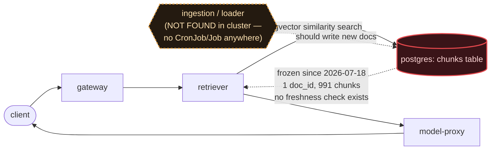

# Postmortem: RAG top-1 relevance below the 90% objective over the last hour (burn-rate alerting saturates for a loose SLO)

- **Status:** open
- **Severity:** sev2
- **Verified:** no
- **Opened:** 2026-08-04 00:15:48Z
- **Resolved:** (still open)

## Timeline (machine-generated)

All times UTC on 2026-08-04 unless a full date is shown.

| Time (UTC) | Source | Event |
| --- | --- | --- |
| 00:14:41Z | log-spike | log-spike onset: {"level":"warn","service":"embedder","message":"lineage emit failed","trace_id":"ed2015a85e9eddbc5d01f295df795056","span_id":"42a1f23c4322b603","time":"2026-08-04T00:14:41.778Z","reason":"The operation timed out.","job":"r… |
| 00:15:10Z | alert | alert firing: SLO RAG quality — below objective |
| 00:23:35Z | verification | recovery NOT verified — deadline armed |
| 00:28:00Z | log-spike | log-spike onset: {"level":"warn","service":"retriever","message":"lineage emit failed","trace_id":"81a8fc854e56bca6088ca0349573d062","span_id":"a39ba5663582b24d","time":"2026-08-04T00:28:00.260Z","reason":"The operation timed out.","job":"… |
| 00:37:10Z | verification | recovery NOT verified — deadline armed |

## Evidence links

- [Loki — logs over the incident window](http://localhost:3001/explore?schemaVersion=1&panes=%7B%22pm%22%3A+%7B%22datasource%22%3A+%22loki%22%2C+%22queries%22%3A+%5B%7B%22refId%22%3A+%22A%22%2C+%22datasource%22%3A+%7B%22type%22%3A+%22loki%22%2C+%22uid%22%3A+%22loki%22%7D%2C+%22expr%22%3A+%22%7Bnamespace%3D%5C%22subject%5C%22%7D+%7C~+%5C%22%28%3Fi%29error%7Cfailed%5C%22%22%7D%5D%2C+%22range%22%3A+%7B%22from%22%3A+%221785802548959%22%2C+%22to%22%3A+%221785804743396%22%7D%7D%7D&orgId=1)
- [Mimir — metrics over the incident window](http://localhost:3001/explore?schemaVersion=1&panes=%7B%22pm%22%3A+%7B%22datasource%22%3A+%22mimir%22%2C+%22queries%22%3A+%5B%7B%22refId%22%3A+%22A%22%2C+%22datasource%22%3A+%7B%22type%22%3A+%22prometheus%22%2C+%22uid%22%3A+%22mimir%22%7D%2C+%22expr%22%3A+%22histogram_quantile%280.95%2C+sum%28rate%28http_server_duration_milliseconds_bucket%5B5m%5D%29%29+by+%28le%29%29%22%7D%5D%2C+%22range%22%3A+%7B%22from%22%3A+%221785802548959%22%2C+%22to%22%3A+%221785804743396%22%7D%7D%7D&orgId=1)

## Investigation context

**Runbook match:** none — no tool narrowing applied for this alert. Available runbooks: README.md, canary-abort.md, ci-pipeline-red.md, dq-freshness-stall.md, gateway-high-error-rate.md, k8s-crashloop.md, k8s-node-failure.md, snapshot-agent-audit.md, stale-secret.md

Pre-check battery (as injected at run start)

## Pre-check leads

### recent_deploys — LEAD
No deploy in the last 60m — rule out the reflex answer.
- No deploy in the last 60m — rule out the reflex answer.

### log_spike — OK
error/failed log rate normal: 0/10min vs baseline 0/10min

### kube_scan — UNAVAILABLE
error: You must be logged in to the server (Unauthorized)

### rollout_state — UNAVAILABLE
gateway: E0804 02:44:23.042558   42372 memcache.go:265] "Unhandled Error" err="couldn't get current server API group list: the server has asked for the client to provide credentials"
E0804 02:44:23.170314   42372 memcache.go:265] "Unhandled Error" err="couldn't get current server API group list: the server has asked for the client to provide credentials"
E0804 02:44:23.308821   42372 memcache.go:265] "Unhandled Error" err="couldn't get current server API group list: the server has asked for the client to; gateway analysis: E0804 02:44:22.993233   52160 memcache.go:265] "Unhandled Error" err="couldn't get current server API group list: the server has asked for the client to provide credentials"
E0804 02:44:23.106926   52160 memcache.go:265] "Unhandled Error"
… (section truncated)

### secret_age — UNAVAILABLE
error: You must be logged in to the server (Unauthorized)

## Narrative

## Incident report — inc_19fca2066de127 (attempt 3, unresolved)

### Summary
The "SLO RAG quality — below objective" alert (tenant acme) remains active. Root cause is unchanged from attempts 1–2 and is re-confirmed with fresh, live evidence this pass: the RAG document corpus is frozen at a single document. Every new lead chased this attempt (a Postgres auth blip, OpenLineage timeouts, chronic node disk pressure, a gateway pod restart) was investigated and ruled out as the driver — none of them explain the sustained relevance collapse; the frozen corpus does.

### Impact
Retrieval relevance for tenant acme is structurally capped far below the 0.90 objective. Live histogram evidence (`retrieval_relevance_score_bucket` on the currently-running gateway pod, 27,654 samples) shows 98.1% of all real-time traffic landing in the [0.1, 0.2) bucket and effectively none above 0.3 — not a dip, a hard ceiling on live traffic right now.

### Root cause
`chunks` has exactly one distinct `doc_id` (`pg1342`, 991 chunks), `max(created_at) = 2026-07-18T23:59:09Z` — no writes in over two weeks. No CronJob/Job for a loader or ingestion pipeline exists anywhere in the cluster (checked via Mimir `kube_job_*`/`kube_cronjob_*` and Loki k8s-events for `loader`/`ingest`/`cron` object names — nothing found besides unrelated Helm install jobs). Compounding this: `dq_violations` has freshness/volume checks wired up only for the `inferences` dataset, not for `chunks` — there is no watchdog on corpus staleness at all, which is why a two-week-old freeze went undetected until the downstream SLO burn-rate alert (which saturates slowly by design for a loose SLO) finally caught the symptom.

### New this pass — leads chased and ruled out
- **Postgres auth**: `postgres` container logged a burst of ten simultaneous `FATAL: password authentication failed for user "lab"` from the `retriever` pod at 2026-08-03 21:58:02 UTC. Investigated as a possible stale-credential root cause — `update_db_secret` dry-run reports **no rotated credential in the vault to sync**, and the retriever pod shows 0 restarts and is actively completing `rag.retrieve` jobs continuously right now (confirmed via live Loki logs), so this reads as a transient, already-self-resolved connection-pool reconnect blip, not an active blocker.
- **Lineage timeouts**: retriever is currently logging repeated `"lineage emit failed", reason: "The operation timed out"` for `job: rag.retrieve` — this is the OpenLineage/Marquez telemetry side-channel, not the retrieval-scoring path itself, and doesn't affect the relevance metric.
- **Node disk pressure**: all three cluster nodes show recurring `FreeDiskSpaceFailed` warnings (image filesystem at 85% of 74.8 GiB), ongoing for hours. General infra stress, but not shown to correlate with the relevance drop.
- **Gateway restart**: `gateway-55bbf6bfbf-t9sp4` briefly crash-looped (BackOff) right at alert onset, then a new ReplicaSet (`gateway-dd85945b4`) took over cleanly. Coincidental timing with alert onset; not causally linked to how relevance is scored.
- **Deploy/CI**: no deploy in the last 60 minutes; CI on `main` is green at HEAD; no gitops sync touched retriever/gateway/model-proxy in the incident window. Rules out a bad-deploy or a stuck-red-pipeline explanation.

None of these change the conclusion. The frozen `chunks` table, independently re-confirmed via a direct Postgres read this pass, remains the sole structural explanation matching the live relevance histogram.

### What fixed it
Nothing — no remediation was executed. The available remediation surface (`scale_deployment`, `patch_memory_limit`, `restart_workload`, `rollout_undo/abort/promote`, `update_db_secret`) has no action that creates, reloads, or backfills a document, and `update_db_secret` explicitly confirmed there is nothing pending to sync. Forcing an unrelated action (e.g. restarting retriever) would not move the relevance metric and was avoided per standing guidance against unjustified remediation. `alert_status` was re-queried after this investigation and **remains active**.

### Lessons
1. The document ingestion/loader responsible for populating `chunks` is not a controllable workload in this environment and has no visible schedule, CronJob, or CI pipeline — it needs to be identified and restored out-of-band by data engineering, or exposed as an actionable workload for on-call.
2. Add a `dq_violations` freshness check on the `chunks` dataset (mirroring the existing `inferences` check) so a frozen corpus is caught in hours, not weeks — this alone would have surfaced the problem on 2026-07-19 instead of waiting for a slow-saturating SLO burn-rate alert over two weeks later.
3. The transient Postgres auth burst and node disk-pressure warnings are worth their own lower-severity tickets — neither is this incident's cause, but both indicate ambient infra stress worth tracking separately.

The break is at the **loader → chunks** hop: the ingestion path that should keep `chunks` current does not exist as a running workload, so `chunks` has been stuck on a single document for over two weeks, structurally capping retrieval relevance for every query since.
