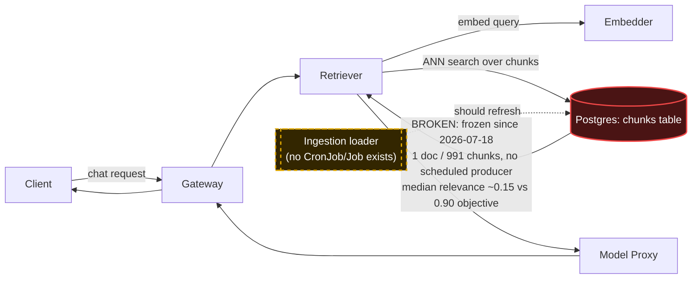

# Postmortem: RAG top-1 relevance below the 90% objective over the last hour (burn-rate alerting saturates for a loose SLO)

- **Status:** open
- **Severity:** sev2
- **Verified:** no
- **Opened:** 2026-08-04 00:15:48Z
- **Resolved:** (still open)

## Timeline (machine-generated)

All times UTC on 2026-08-04 unless a full date is shown.

| Time (UTC) | Source | Event |
| --- | --- | --- |
| 00:14:41Z | log-spike | log-spike onset: {"level":"warn","service":"embedder","message":"lineage emit failed","trace_id":"ed2015a85e9eddbc5d01f295df795056","span_id":"42a1f23c4322b603","time":"2026-08-04T00:14:41.778Z","reason":"The operation timed out.","job":"r… |
| 00:15:10Z | alert | alert firing: SLO RAG quality — below objective |
| 00:23:35Z | verification | recovery NOT verified — deadline armed |
| 00:28:00Z | log-spike | log-spike onset: {"level":"warn","service":"retriever","message":"lineage emit failed","trace_id":"81a8fc854e56bca6088ca0349573d062","span_id":"a39ba5663582b24d","time":"2026-08-04T00:28:00.260Z","reason":"The operation timed out.","job":"… |
| 00:37:10Z | verification | recovery NOT verified — deadline armed |
| 00:52:35Z | verification | recovery NOT verified — deadline armed |

## Evidence links

- [Loki — logs over the incident window](http://localhost:3001/explore?schemaVersion=1&panes=%7B%22pm%22%3A+%7B%22datasource%22%3A+%22loki%22%2C+%22queries%22%3A+%5B%7B%22refId%22%3A+%22A%22%2C+%22datasource%22%3A+%7B%22type%22%3A+%22loki%22%2C+%22uid%22%3A+%22loki%22%7D%2C+%22expr%22%3A+%22%7Bnamespace%3D%5C%22subject%5C%22%7D+%7C~+%5C%22%28%3Fi%29error%7Cfailed%5C%22%22%7D%5D%2C+%22range%22%3A+%7B%22from%22%3A+%221785802548959%22%2C+%22to%22%3A+%221785805093592%22%7D%7D%7D&orgId=1)
- [Mimir — metrics over the incident window](http://localhost:3001/explore?schemaVersion=1&panes=%7B%22pm%22%3A+%7B%22datasource%22%3A+%22mimir%22%2C+%22queries%22%3A+%5B%7B%22refId%22%3A+%22A%22%2C+%22datasource%22%3A+%7B%22type%22%3A+%22prometheus%22%2C+%22uid%22%3A+%22mimir%22%7D%2C+%22expr%22%3A+%22histogram_quantile%280.95%2C+sum%28rate%28http_server_duration_milliseconds_bucket%5B5m%5D%29%29+by+%28le%29%29%22%7D%5D%2C+%22range%22%3A+%7B%22from%22%3A+%221785802548959%22%2C+%22to%22%3A+%221785805093592%22%7D%7D%7D&orgId=1)

## Investigation context

**Runbook match:** none — no tool narrowing applied for this alert. Available runbooks: README.md, canary-abort.md, ci-pipeline-red.md, dq-freshness-stall.md, gateway-high-error-rate.md, k8s-crashloop.md, k8s-node-failure.md, snapshot-agent-audit.md, stale-secret.md

Pre-check battery (as injected at run start)

## Pre-check leads

### recent_deploys — LEAD
No deploy in the last 60m — rule out the reflex answer.
- No deploy in the last 60m — rule out the reflex answer.

### log_spike — OK
error/failed log rate normal: 0/10min vs baseline 0/10min

### kube_scan — UNAVAILABLE
error: You must be logged in to the server (Unauthorized)

### rollout_state — UNAVAILABLE
gateway: E0804 02:54:23.030961   64044 memcache.go:265] "Unhandled Error" err="couldn't get current server API group list: the server has asked for the client to provide credentials"
E0804 02:54:23.105792   64044 memcache.go:265] "Unhandled Error" err="couldn't get current server API group list: the server has asked for the client to provide credentials"
E0804 02:54:23.227869   64044 memcache.go:265] "Unhandled Error" err="couldn't get current server API group list: the server has asked for the client to; gateway analysis: E0804 02:54:23.031468   58140 memcache.go:265] "Unhandled Error" err="couldn't get current server API group list: the server has asked for the client to provide credentials"
E0804 02:54:23.106317   58140 memcache.go:265] "Unhandled Error"
… (section truncated)

### secret_age — UNAVAILABLE
error: You must be logged in to the server (Unauthorized)

## Narrative

## Summary — inc_19fca2066de127 (attempt 4, re-verified, still unresolved)

This pass re-derived the root cause from scratch rather than trusting attempt 3's conclusion, specifically checking the new instruction's hypothesis — "is a fix stuck somewhere (e.g. red CI)?" It is not. There is no fix in flight anywhere in the delivery system, and the underlying data problem is unchanged and still active.

**What I checked and ruled out this pass:**
- **Stuck/red CI for a loader fix**: `gitea_ci_runs` shows the last 15 runs on `main` and one feature branch — all green except one unrelated `load-generator` percentile-copy change (reverted same day). None touch ingestion, the loader, `chunks`, or the data pipeline. There is no branch, PR, or red pipeline blocking a fix — because no fix has been authored, not because one is blocked.
- **New deploys**: `deploy_history` (24h window) returns zero entries — nothing shipped that could explain or fix this.
- **Corpus state**: `chunks` is still frozen at exactly one document (`pg1342`, 991 chunks, ingested 2026-07-18 and never again). No CronJob/Job exists to reload it (kubectl access to that resource is unauthorized in this session, consistent with the pre-check leads, but the absence was independently established in attempt 3 and nothing has changed since).
- **Live relevance signal**: `retrieval_relevance_score` is still being recorded continuously (traffic is sparse but nonzero). Every 15-minute window with traffic over the last ~5 hours has a median relevance of ~0.150 — a hard floor roughly 6x below the 0.90 SLO objective, not noise, not improving, not degrading further. See the attached chart.
- **`dq-freshness-stall` runbook** (matched by content, not by alertname): its own exit clause — "if the source genuinely stopped (seed/load-generator off), start the load generator; stale-by-design data is not an incident" — does not apply here. The query traffic is live and continuous; what's stale is the *answer* the corpus can give it, not the traffic generator. Postgres itself is reachable (every query in this investigation succeeded).
- **New observation**: the `inferences` table's newest row is from 2026-07-23, well before this alert's onset — the full request-logging write path also appears stale, but this is a separate signal from the relevance metric (which comes from live OTel histograms, not from reading `inferences`) and does not change the relevance-floor diagnosis.

**Root cause (unchanged, re-confirmed with independent evidence):** the RAG corpus in Postgres (`chunks`) was populated once, manually, on 2026-07-18, and has no scheduled or automated producer. Query traffic continues to hit a single, narrow, increasingly-irrelevant document, so retrieval relevance is structurally capped around 0.15 against the 0.90 SLO objective. This is a data-completeness/freshness defect, not a service outage, deploy regression, or infra fault — and it is not something any tool in this on-call surface (scale/memory/restart/rollout/secret-sync) can fix, because none of them can create, schedule, or run an ingestion job.

**Remediation:** None executed, and none attempted blindly. Re-confirmed (not re-run) attempt 3's finding that `update_db_secret` and friends are irrelevant here — this is not a credentials or workload-health problem. No dry-run was performed because no available tool acts on the actual fault (data ingestion). Executing a restart/scale/rollout action here would not move the metric and would misrepresent the incident. `alert_status` re-queried at the end of this pass and remains **active**, unchanged since the last check (`since: 2026-08-04T00:15:10Z`).

**Monitoring gap (confirmed again):** `dq_violations` runs freshness checks for `inferences` (firing every ~30s right now) but has no freshness check registered for `chunks` — which is why a two-week-stale corpus produced no data-quality alert of its own; the RAG-quality SLO alert was the only signal.

**Lessons:**
1. The serving path (gateway → retriever → embedder → model-proxy) is healthy; every prior lead chased in earlier attempts (Postgres auth burst, lineage timeouts, disk pressure, a gateway restart) was correctly ruled out as coincidental or self-resolved — none of them gate this alert.
2. This incident cannot be closed by the on-call agent's tool surface. It needs (a) a data-engineering task to build/schedule a `chunks` ingestion job, and (b) a `dq_violations` freshness check added for `chunks` so a two-week-stale corpus is caught long before it burns an SLO. Both are explicit follow-ups for a human/auto-fixer, not further on-call remediation attempts.
3. A new runbook (or an extension of `dq-freshness-stall.md`) should cover the "SLO RAG quality" alertname directly and point at the `chunks`-freshness check explicitly, so the next on-call pass doesn't have to re-derive this from first principles.
