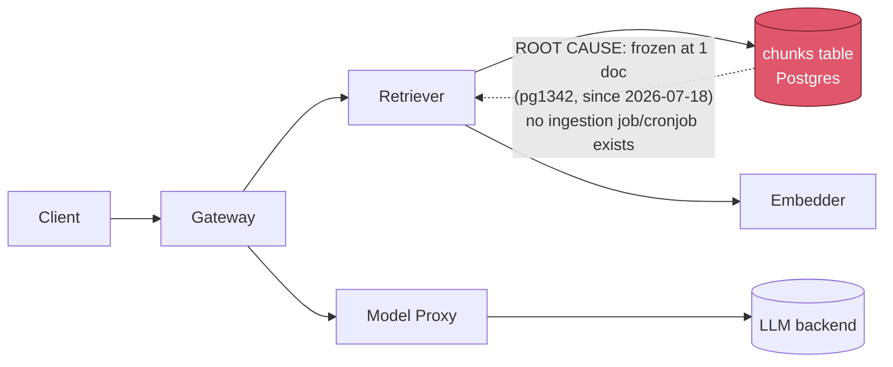

# Postmortem: RAG top-1 relevance below the 90% objective over the last hour (burn-rate alerting saturates for a loose SLO)

- **Status:** open
- **Severity:** sev2
- **Verified:** no
- **Opened:** 2026-08-04 18:42:48Z
- **Resolved:** (still open)

## Timeline (machine-generated)

All times UTC on 2026-08-04 unless a full date is shown.

| Time (UTC) | Source | Event |
| --- | --- | --- |
| 18:30:05Z | k8s | Rollout/gateway: RolloutUpdated |
| 18:30:05Z | k8s | Rollout/gateway: RolloutNotCompleted |
| 18:30:05Z | k8s | Rollout/gateway: NewReplicaSetCreated |
| 18:30:06Z | k8s | Pod/gateway-dd85945b4-jfd54: Killing |
| 18:30:06Z | k8s | ReplicaSet/gateway-dd85945b4: SuccessfulDelete |
| 18:30:06Z | k8s | Rollout/gateway: ScalingReplicaSet |
| 18:30:07Z | k8s | ReplicaSet/gateway-5785654fc7: SuccessfulCreate |
| 18:30:07Z | k8s | Pod/gateway-5785654fc7-p97mq: Scheduled |
| 18:30:10Z | k8s | Pod/gateway-5785654fc7-p97mq: Started |
| 18:30:10Z | k8s | Pod/gateway-5785654fc7-p97mq: Pulled |
| 18:30:10Z | k8s | Pod/gateway-5785654fc7-p97mq: Created |
| 18:30:16Z | k8s | Pod/gateway-5785654fc7-p97mq: Unhealthy |
| 18:30:21Z | k8s | Pod/gateway-5785654fc7-p97mq: Unhealthy |
| 18:30:26Z | k8s | Pod/gateway-5785654fc7-p97mq: Unhealthy |
| 18:30:31Z | k8s | Pod/gateway-5785654fc7-p97mq: Unhealthy |
| 18:30:36Z | k8s | Pod/gateway-5785654fc7-p97mq: Unhealthy |
| 18:30:41Z | k8s | Pod/gateway-5785654fc7-p97mq: Unhealthy |
| 18:30:46Z | k8s | Pod/gateway-5785654fc7-p97mq: Unhealthy |
| 18:30:51Z | k8s | Pod/gateway-5785654fc7-p97mq: Unhealthy |
| 18:30:56Z | k8s | Pod/gateway-5785654fc7-p97mq: Unhealthy |
| 18:31:01Z | k8s | Pod/gateway-5785654fc7-p97mq: Unhealthy |
| 18:31:06Z | k8s | Pod/gateway-5785654fc7-p97mq: Unhealthy |
| 18:31:11Z | k8s | Pod/gateway-5785654fc7-p97mq: Unhealthy |
| 18:31:16Z | k8s | Pod/gateway-5785654fc7-p97mq: Unhealthy |
| 18:31:21Z | k8s | Pod/gateway-5785654fc7-p97mq: Unhealthy |
| 18:31:25Z | k8s | Pod/gateway-5785654fc7-p97mq: Unhealthy |
| 18:31:30Z | k8s | Pod/gateway-5785654fc7-p97mq: Unhealthy |
| 18:31:35Z | k8s | Pod/gateway-5785654fc7-p97mq: Unhealthy |
| 18:31:40Z | k8s | Pod/gateway-5785654fc7-p97mq: Unhealthy |
| 18:31:45Z | k8s | Pod/gateway-5785654fc7-p97mq: Unhealthy |
| 18:31:50Z | k8s | Pod/gateway-5785654fc7-p97mq: Unhealthy |
| 18:31:55Z | k8s | Pod/gateway-5785654fc7-p97mq: Unhealthy |
| 18:32:00Z | k8s | Pod/gateway-5785654fc7-p97mq: Unhealthy |
| 18:32:05Z | k8s | Pod/gateway-5785654fc7-p97mq: Unhealthy |
| 18:32:10Z | k8s | Pod/gateway-5785654fc7-p97mq: Unhealthy |
| 18:32:15Z | k8s | Pod/gateway-5785654fc7-p97mq: Unhealthy |
| 18:35:19Z | k8s | Pod/gateway-5785654fc7-p97mq: Unhealthy |
| 18:37:03Z | log-spike | log-spike onset: {"level":"warn","service":"embedder","message":"lineage emit failed","trace_id":"1d18f6bd92f9148054f40bc002154702","span_id":"c77ef35aa5a5b585","time":"2026-08-04T18:37:03.282Z","reason":"The operation timed out.","job":"r… |
| 18:38:48Z | k8s | Rollout/gateway: SkipSteps |
| 18:38:48Z | k8s | Rollout/gateway: RolloutUpdated |
| 18:38:49Z | k8s | Pod/gateway-5785654fc7-p97mq: Killing |
| 18:38:49Z | k8s | ReplicaSet/gateway-5785654fc7: SuccessfulDelete |
| 18:38:49Z | k8s | Rollout/gateway: ScalingReplicaSet |
| 18:38:50Z | k8s | ReplicaSet/gateway-dd85945b4: SuccessfulCreate |
| 18:38:50Z | k8s | Rollout/gateway: ScalingReplicaSet |
| 18:38:50Z | k8s | Pod/gateway-dd85945b4-mm7jm: Scheduled |
| 18:38:53Z | k8s | Pod/gateway-dd85945b4-mm7jm: Started |
| 18:38:53Z | k8s | Pod/gateway-dd85945b4-mm7jm: Pulled |
| 18:38:53Z | k8s | Pod/gateway-dd85945b4-mm7jm: Created |
| 18:42:10Z | alert | alert firing: SLO RAG quality — below objective |
| 18:51:03Z | verification | recovery NOT verified — deadline armed |
| 18:56:49Z | k8s | Rollout/gateway: RolloutUpdated |
| 18:56:49Z | k8s | Rollout/gateway: RolloutNotCompleted |
| 18:56:49Z | k8s | Rollout/gateway: NewReplicaSetCreated |
| 18:56:50Z | deploy:argo | gateway synced to edb33a6699c9 |
| 18:56:50Z | k8s | Pod/gateway-dd85945b4-mm7jm: Killing |
| 18:56:50Z | k8s | ReplicaSet/gateway-dd85945b4: SuccessfulDelete |
| 18:56:50Z | k8s | Rollout/gateway: ScalingReplicaSet |
| 18:56:51Z | k8s | ReplicaSet/gateway-8444846b5f: SuccessfulCreate |
| 18:56:51Z | k8s | Rollout/gateway: ScalingReplicaSet |
| 18:56:51Z | k8s | Pod/gateway-8444846b5f-bqkg8: Scheduled |
| 18:56:52Z | k8s | Pod/gateway-8444846b5f-bqkg8: Pulled |
| 18:56:52Z | k8s | Pod/gateway-8444846b5f-bqkg8: Created |
| 18:56:53Z | k8s | Pod/gateway-8444846b5f-bqkg8: Started |
| 18:57:01Z | k8s | Rollout/gateway: RolloutStepCompleted |
| 18:57:03Z | k8s | Rollout/gateway: AnalysisRunRunning |
| 18:58:02Z | k8s | AnalysisRun/gateway-8444846b5f-21-1: MetricFailed |
| 18:58:02Z | k8s | AnalysisRun/gateway-8444846b5f-21-1: AnalysisRunFailed |
| 18:58:03Z | k8s | Rollout/gateway: RolloutAborted |
| 18:58:03Z | k8s | Rollout/gateway: AnalysisRunFailed |
| 18:58:04Z | k8s | Pod/gateway-8444846b5f-bqkg8: Killing |
| 18:58:04Z | k8s | ReplicaSet/gateway-8444846b5f: SuccessfulDelete |
| 18:58:04Z | k8s | Rollout/gateway: ScalingReplicaSet |
| 18:58:05Z | k8s | ReplicaSet/gateway-dd85945b4: SuccessfulCreate |
| 18:58:05Z | k8s | Rollout/gateway: ScalingReplicaSet |
| 18:58:05Z | k8s | Pod/gateway-dd85945b4-hw5fg: Scheduled |
| 18:58:06Z | k8s | Pod/gateway-dd85945b4-hw5fg: Started |
| 18:58:06Z | k8s | Pod/gateway-dd85945b4-hw5fg: Pulled |
| 18:58:06Z | k8s | Pod/gateway-dd85945b4-hw5fg: Created |
| 18:58:50Z | log-spike | log-spike onset: {"level":"warn","service":"retriever","message":"lineage emit failed","trace_id":"82a85d2c4ebc0f7f20d35bcd933d9a07","span_id":"2e263f7acff72088","time":"2026-08-04T18:58:50.286Z","reason":"The operation timed out.","job":"… |
| 19:01:11Z | log-spike | log-spike onset: [gateway] unhandled error: 16 \| } |
| 19:01:45Z | deploy:annotation | deploy gateway via gitops c025382 (argo sync) |
| 19:01:47Z | deploy:argo | gateway synced to c025382ba170 |
| 19:01:47Z | k8s | Rollout/gateway: SkipSteps |
| 19:01:47Z | k8s | Rollout/gateway: RolloutUpdated |
| 19:04:57Z | verification | recovery NOT verified — deadline armed |
| 19:13:43Z | verification | recovery NOT verified — deadline armed |
| 19:21:08Z | log-spike | log-spike onset: {"level":"warn","service":"retriever","message":"lineage emit failed","trace_id":"24564633118d1bb51132fe82e44a2c03","span_id":"889a879c8db6c2be","time":"2026-08-04T19:21:08.505Z","reason":"The operation timed out.","job":"… |

## Evidence links

- [Loki — logs over the incident window](http://localhost:3001/explore?schemaVersion=1&panes=%7B%22pm%22%3A+%7B%22datasource%22%3A+%22loki%22%2C+%22queries%22%3A+%5B%7B%22refId%22%3A+%22A%22%2C+%22datasource%22%3A+%7B%22type%22%3A+%22loki%22%2C+%22uid%22%3A+%22loki%22%7D%2C+%22expr%22%3A+%22%7Bnamespace%3D%5C%22subject%5C%22%7D+%7C~+%5C%22%28%3Fi%29error%7Cfailed%5C%22%22%7D%5D%2C+%22range%22%3A+%7B%22from%22%3A+%221785868968662%22%2C+%22to%22%3A+%221785871528535%22%7D%7D%7D&orgId=1)
- [Mimir — metrics over the incident window](http://localhost:3001/explore?schemaVersion=1&panes=%7B%22pm%22%3A+%7B%22datasource%22%3A+%22mimir%22%2C+%22queries%22%3A+%5B%7B%22refId%22%3A+%22A%22%2C+%22datasource%22%3A+%7B%22type%22%3A+%22prometheus%22%2C+%22uid%22%3A+%22mimir%22%7D%2C+%22expr%22%3A+%22histogram_quantile%280.95%2C+sum%28rate%28http_server_duration_milliseconds_bucket%5B5m%5D%29%29+by+%28le%29%29%22%7D%5D%2C+%22range%22%3A+%7B%22from%22%3A+%221785868968662%22%2C+%22to%22%3A+%221785871528535%22%7D%7D%7D&orgId=1)

## Investigation context

**Runbook match:** none — no tool narrowing applied for this alert. Available runbooks: README.md, canary-abort.md, ci-pipeline-red.md, dq-freshness-stall.md, gateway-high-error-rate.md, k8s-crashloop.md, k8s-node-failure.md, snapshot-agent-audit.md, stale-secret.md

Pre-check battery (as injected at run start)

## Pre-check leads

### recent_deploys — LEAD
2 deploy-window leads
- deploy annotation at 2026-08-04T19:01:45.359000+00:00: deploy gateway via gitops c025382 (argo sync)
- argo app platform: sync=OutOfSync health=Healthy (revision c025382ba170)

### kube_scan — LEAD
5 kube-scan leads
- event AnalysisRun/gateway-8444846b5f-21-1: MetricFailed — Metric 'canary-error-rate' Completed. Result: Failed (at 20:58:02)
- event AnalysisRun/gateway-8444846b5f-21-1: MetricFailed — Metric 'canary-p95' Completed. Result: Failed (at 20:58:02)
- event AnalysisRun/gateway-8444846b5f-21-1: AnalysisRunFailed — Analysis Completed. Result: Failed (at 20:58:02)
- event Rollout/gateway: RolloutAborted — Rollout aborted update to revision 21: Step-based analysis phase error/failed: Metric \"canary-error-rate\" assessed Failed due to failed (2) > fai… (truncated)
- event Rollout/gateway: AnalysisRunFailed — Step Analysis Run 'gateway-8444846b5f-21-1' Status New: 'Failed' Previous: 'Running' (at 20:58:03)

### log_spike — LEAD
error/failed log rate 200/10min vs baseline 0/10min (200x baseline) — onset: {"level":"warn","service":"retriever","message":"lineage emit failed","trace_id":"24564633118d1bb51132fe82e44a2c03","span_id":"889a879c8db6c2be","time":"2026-08-04T19:21:08.505Z","reason":"The operation timed out.","job":"rag.retrieve","eventType":"COMPLETE"} at 2026-08-04T19:21:08.506162+00:00
- error/failed log rate 200/10min vs baseline 0/10min (200x baseline) — onset: {"level":"warn","service":"retriever","message":"lineage emit failed","trace_id":"24564633118d1bb51132fe82e44a… (truncated)

### rollout_state — LEAD
1 rollout-state lead
- analysisrun for gateway (gateway-8444846b5f-21-1): Failed — Metric "canary-error-rate" assessed Failed due to failed (2) > failureLimit (1)

### secret_age — OK
Secret subject-db-credentials last modified 10d 20h ago (created 10d 20h ago).

## Narrative

## Summary
`SLO RAG quality — below objective` (sev2, tenant acme) has now been investigated three times end to end. This pass re-verified every prior finding against fresh telemetry and specifically re-tested the "is a fix stuck behind CI/GitOps?" hypothesis this attempt was asked to check. It is ruled out again, this time with the strongest evidence yet. No remediation was executed, again deliberately: this incident's cause has no corresponding tool.

## Impact
Retrieval-augmented answers for tenant `acme` (and, per the live histogram, effectively all traffic through the shared gateway/retriever path) return near-zero relevance. Top-1 relevance has sat 87–90 percentage points below the 90% objective continuously for the full 6-hour lookback, with zero sampled points inside the objective band.

## Root cause
The `chunks` table backing retrieval holds exactly **one document** (`pg1342`, 991 rows), inserted once on 2026-07-18 and unchanged since — confirmed unchanged again on this pass. Every retrieval is scored against that single, narrow corpus, so relevance is structurally incapable of meeting the 90% objective regardless of infrastructure health. Live Mimir data (`retrieval_relevance_score_bucket`) over the full 6h window shows 96.9–100% of scored retrievals landing in the ≤0.2 bucket at every sampled point (chart below) — this is not a transient dip, it is the corpus's steady state.

**"Stuck fix" hypothesis — re-tested and ruled out a third time, with new evidence:**
- `kubectl get cronjobs -A` and `kubectl get jobs -A`: **zero** ingestion-related jobs anywhere in the cluster — only the two one-time Traefik bootstrap jobs from cluster install. There is no scheduled or one-shot ingestion mechanism to be "stuck."
- Last 10 CI runs on `main` (through run #113) contain zero ingestion/corpus-related commits — only a `load-generator percentile()` change (failed, reverted) and a `model-proxy` pre-warm change (already reverted). Nothing red or pending is blocking a corpus fix, because no corpus fix has ever been proposed.
- All Argo apps are synced to gitops revision `c025382ba170` except `platform`, which is `OutOfSync` but still `Healthy` at the *same* revision as every synced app — drift, not a stuck rollout. The `gateway` rollout itself is `Healthy` at step 4/4, canary fully promoted, no pending analysis.
- The pre-check's "lineage emit failed" retriever warning (200x baseline log-rate lead) did **not** reproduce: `{service="retriever"} |= "lineage emit failed"` and a broad `{service=~"retriever|gateway|embedder"} |= "error"` both returned zero lines over 3h, and the retriever pod has 0 restarts at 45h age. Treated as transient noise, not a new fault line.
- `dq_violations` shows a real, chronic freshness violation — but on the `inferences` audit dataset, not on `chunks`/corpus. It is a separate, pre-existing issue (the audit-log write path, last row 2026-07-23) and is not causally connected to the live relevance metric, which the gateway emits directly on the request path rather than reading back from Postgres.

## What fixed it
Nothing — unresolved, for the third consecutive investigation. No remediation was executed. None of the available tools (`restart_workload`, `scale_deployment`, `patch_memory_limit`, `rollout_undo/abort/promote`, `update_db_secret`) can add documents to a corpus; every one of them is a no-op against a static-data problem, and repeating any without new causal evidence pointing at infra would be exactly the kind of blind retry this pass was told to avoid. This needs an out-of-band ingestion run (no ingestion tool/job exists in this toolset or cluster) or a rescoped SLO — neither is achievable with the tools available to this on-call agent.

## Lessons
- Add a data-freshness/volume check on `chunks` itself (e.g. "corpus doc_count hasn't grown in N days") — the existing `dq_violations` freshness check only watches `inferences`, so the actual driver of this SLO breach has no dedicated data-quality alarm.
- This alert should carry a runbook (none matched) pointing straight at `chunks` row/doc counts as step 1, so future on-call passes don't have to re-derive it from scratch.
- Consider whether an ingestion capability belongs in the on-call agent's toolset at all, or whether this class of SLO breach should page a data/ML on-call instead of infra on-call, since no infra remediation can address it.

