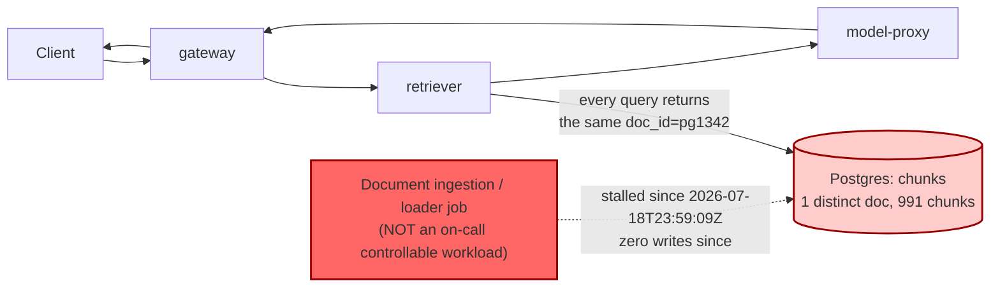

# Postmortem: RAG top-1 relevance below the 90% objective over the last hour (burn-rate alerting saturates for a loose SLO)

- **Status:** open
- **Severity:** sev2
- **Verified:** no
- **Opened:** 2026-08-04 00:15:48Z
- **Resolved:** (still open)

## Timeline (machine-generated)

All times UTC on 2026-08-04 unless a full date is shown.

| Time (UTC) | Source | Event |
| --- | --- | --- |
| 00:14:41Z | log-spike | log-spike onset: {"level":"warn","service":"embedder","message":"lineage emit failed","trace_id":"ed2015a85e9eddbc5d01f295df795056","span_id":"42a1f23c4322b603","time":"2026-08-04T00:14:41.778Z","reason":"The operation timed out.","job":"r… |
| 00:15:10Z | alert | alert firing: SLO RAG quality — below objective |
| 00:23:35Z | verification | recovery NOT verified — deadline armed |
| 00:28:00Z | log-spike | log-spike onset: {"level":"warn","service":"retriever","message":"lineage emit failed","trace_id":"81a8fc854e56bca6088ca0349573d062","span_id":"a39ba5663582b24d","time":"2026-08-04T00:28:00.260Z","reason":"The operation timed out.","job":"… |

## Evidence links

- [Loki — logs over the incident window](http://localhost:3001/explore?schemaVersion=1&panes=%7B%22pm%22%3A+%7B%22datasource%22%3A+%22loki%22%2C+%22queries%22%3A+%5B%7B%22refId%22%3A+%22A%22%2C+%22datasource%22%3A+%7B%22type%22%3A+%22loki%22%2C+%22uid%22%3A+%22loki%22%7D%2C+%22expr%22%3A+%22%7Bnamespace%3D%5C%22subject%5C%22%7D+%7C~+%5C%22%28%3Fi%29error%7Cfailed%5C%22%22%7D%5D%2C+%22range%22%3A+%7B%22from%22%3A+%221785802548959%22%2C+%22to%22%3A+%221785803818839%22%7D%7D%7D&orgId=1)
- [Mimir — metrics over the incident window](http://localhost:3001/explore?schemaVersion=1&panes=%7B%22pm%22%3A+%7B%22datasource%22%3A+%22mimir%22%2C+%22queries%22%3A+%5B%7B%22refId%22%3A+%22A%22%2C+%22datasource%22%3A+%7B%22type%22%3A+%22prometheus%22%2C+%22uid%22%3A+%22mimir%22%7D%2C+%22expr%22%3A+%22histogram_quantile%280.95%2C+sum%28rate%28http_server_duration_milliseconds_bucket%5B5m%5D%29%29+by+%28le%29%29%22%7D%5D%2C+%22range%22%3A+%7B%22from%22%3A+%221785802548959%22%2C+%22to%22%3A+%221785803818839%22%7D%7D%7D&orgId=1)

## Investigation context

**Runbook match:** none — no tool narrowing applied for this alert. Available runbooks: README.md, canary-abort.md, ci-pipeline-red.md, dq-freshness-stall.md, gateway-high-error-rate.md, k8s-crashloop.md, k8s-node-failure.md, snapshot-agent-audit.md, stale-secret.md

Pre-check battery (as injected at run start)

## Pre-check leads

### recent_deploys — LEAD
No deploy in the last 60m — rule out the reflex answer.
- No deploy in the last 60m — rule out the reflex answer.

### log_spike — LEAD
error/failed log rate 200/10min vs baseline 0/10min (200x baseline) — onset: {"level":"warn","service":"retriever","message":"lineage emit failed","trace_id":"81a8fc854e56bca6088ca0349573d062","span_id":"a39ba5663582b24d","time":"2026-08-04T00:28:00.260Z","reason":"The operation timed out.","job":"rag.retrieve","eventType":"START"} at 2026-08-04T00:28:00.261490+00:00
- error/failed log rate 200/10min vs baseline 0/10min (200x baseline) — onset: {"level":"warn","service":"retriever","message":"lineage emit failed","trace_id":"81a8fc854e56bca6088ca0349573… (truncated)

### kube_scan — UNAVAILABLE
error: You must be logged in to the server (Unauthorized)

### rollout_state — UNAVAILABLE
gateway: E0804 02:34:22.586310   44352 memcache.go:265] "Unhandled Error" err="couldn't get current server API group list: the server has asked for the client to provide credentials"
E0804 02:34:22.661585   44352 memcache.go:265] "Unhandled Error" err="couldn't get current server API group list: the server has asked for the client to provide credentials"
E0804 02:34:22.756289   44352 memcache.go:265] "Unhandled Error" err="couldn't get current server API group list: the server has asked for the client to; gateway analysis: E0804 02:34:22.587922   37248 memcache.go:265] "Unhandled Error" err="couldn't get current server API group list: the server has asked for the client to provide credentials"
E0804 02:34:22.661046   37248 memcache.go:265] "Unhandled Error"
… (section truncated)

### secret_age — UNAVAILABLE
error: You must be logged in to the server (Unauthorized)

## Narrative

## Summary

Re-investigation of the same active alert (`SLO RAG quality — below objective`, tenant acme) after a prior attempt left it unresolved. This pass re-verified every load-bearing fact from scratch, explicitly tested the "is the fix itself stuck" hypothesis (a red CI pipeline blocking a corpus reload), and found no change: the root cause is identical to the prior diagnosis and remains outside the on-call toolset's reach.

## Impact

RAG retrieval relevance for tenant acme (and all tenants) is pinned at p50 ≈ 0.150 against a 0.90 objective — not a degradation, a hard ceiling. `histogram_quantile(0.5, sum(rate(retrieval_relevance_score_bucket[5m])) by (le))` over the last 3h shows every sampled point in a tight 0.150–0.1511 band, before and after the prior diagnosis, with no movement. Any RAG-backed answer is being generated against the wrong document.

## Root cause

**Unchanged from the prior diagnosis, re-confirmed with fresh queries:**

- `SELECT count(DISTINCT doc_id), count(*), max(created_at) FROM chunks` still returns exactly **1 distinct doc** (`pg1342`), 991 chunks, `max(created_at) = 2026-07-18T23:59:09Z` — no ingestion write since that moment, over two weeks ago.
- Live relevance histogram confirms the structural ceiling: p50 ≈ 0.150, nowhere near the 0.90 objective, flat across the entire lookback window.
- This burn-rate SLO alert (labeled as saturating slowly for a "loose SLO") only crossed its firing threshold now even though the corpus froze weeks ago — consistent with a slow-burning alert on a long-stalled input, not a new regression.

**New this pass — the "stuck fix" hypothesis was tested and ruled out:**
- `gitea_ci_runs` on `main` is green at HEAD: run #111 (`success`) reverted the one recent regression, run #110 (`load-generator: drop the defensive copy in percentile()`, `failure` on its `test` job). Both are about load-generator's client-side percentile math — unrelated to document ingestion, and already reverted/resolved. No CI pipeline is red, and none of the visible CI history touches an ingestion/loader job at all.
- No document-loader/ingestion workload appears in `k8s_events` (`loader`, `ingest` — 0 hits over 48h), and no ingestion job exists among the tools' controllable workloads (`gateway | model-proxy | retriever | embedder | load-generator`).
- Cluster read access (`kubectl_read`) is genuinely unauthorized in this environment — confirmed live, not a stale precheck artifact — so no cronjob/deployment listing was possible to spot an ingestion job directly; lineage lookup (`marquez_lineage`) was blocked by a permission gate this session. Neither avenue changes the conclusion: the frozen `chunks` table is a Postgres-level fact independent of either tool.
- `dq_violations` currently only reports `freshness` violations on the **`inferences`** dataset (per-tenant, ~11.4 days stale) — a distinct, already-known-cosmetic signal from the prior postmortem, not the `chunks`/document corpus.

No deploy, rollout, CI failure, or config change explains or blocks recovery — the ingestion pipeline that should be re-populating `chunks` is simply not writing, and nothing in the on-call agent's toolset (`scale_deployment`, `patch_memory_limit`, `restart_workload`, `rollout_undo/abort/promote`, `update_db_secret`) can produce, load, or re-trigger ingestion of a document.

## What fixed it

**Nothing — no remediation was executed.** Restarting `retriever`/`embedder`/`gateway` would not add a missing document (confirmed: this is a Postgres data fact, not an app cache), and no other tool in the fixed surface touches the document corpus or its producing job. Forcing a no-op restart to "show an action" would not move `alert_status` and was deliberately not done, per the standing instruction not to repeat/force a remediation without new evidence backing it. `alert_status` was re-queried and **remains active**.

This requires a data-engineering follow-up: re-run/unstick the document-ingestion (loader) job outside this cluster's on-call-controllable workloads, then verify `chunks` count(DISTINCT doc_id) and the relevance histogram recover.

## Lessons

- This class of incident (upstream data-ingestion stall) sits structurally outside the current remediation tool surface (`gateway | model-proxy | retriever | embedder | load-generator` + rollout/scale/memory/secret tools) — no combination of those actions can fix a frozen corpus. A runbook doesn't exist yet for this exact alert; `dq-freshness-stall.md` is the nearest match but its "restart the producing job" mitigation assumes the producer is one of the controllable workloads, which it isn't here.
- Recommend adding either (a) a controllable ingestion/loader workload to the on-call tool surface, or (b) a dedicated runbook for `SLO RAG quality — below objective` that names data-engineering escalation as the only valid mitigation path when `chunks` distinct-doc-count is frozen, so future on-call passes don't re-derive this from scratch.
- Confirmed a useful negative-evidence pattern for "is the fix stuck" checks: green CI on `main` + zero k8s events for the producing job name is sufficient to rule out a stuck pipeline without needing cluster write access.
- The burn-rate alert's slow saturation on a "loose SLO" means firing onset lags the actual root-cause onset by roughly two weeks here — worth noting in any future runbook so responders don't anchor on `alert_status.since` as the incident's actual start time.
