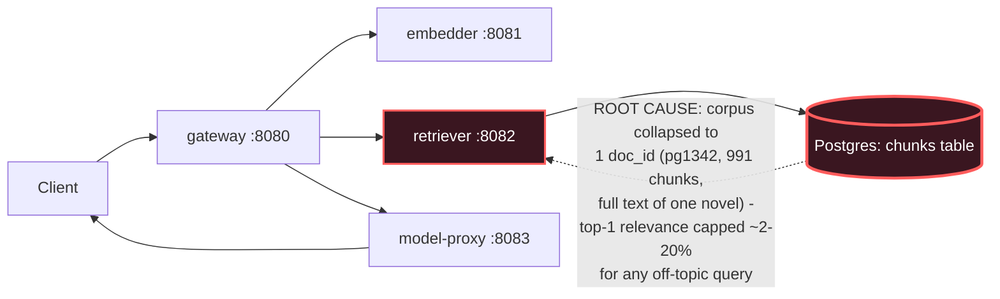

# Postmortem: RAG top-1 relevance below the 90% objective over the last hour (burn-rate alerting saturates for a loose SLO)

- **Status:** open
- **Severity:** sev2
- **Verified:** no
- **Opened:** 2026-08-04 18:42:48Z
- **Resolved:** (still open)

## Timeline (machine-generated)

All times UTC on 2026-08-04 unless a full date is shown.

| Time (UTC) | Source | Event |
| --- | --- | --- |
| 18:30:05Z | k8s | Rollout/gateway: RolloutUpdated |
| 18:30:05Z | k8s | Rollout/gateway: RolloutNotCompleted |
| 18:30:05Z | k8s | Rollout/gateway: NewReplicaSetCreated |
| 18:30:06Z | k8s | Pod/gateway-dd85945b4-jfd54: Killing |
| 18:30:06Z | k8s | ReplicaSet/gateway-dd85945b4: SuccessfulDelete |
| 18:30:06Z | k8s | Rollout/gateway: ScalingReplicaSet |
| 18:30:07Z | k8s | ReplicaSet/gateway-5785654fc7: SuccessfulCreate |
| 18:30:07Z | k8s | Pod/gateway-5785654fc7-p97mq: Scheduled |
| 18:30:10Z | k8s | Pod/gateway-5785654fc7-p97mq: Started |
| 18:30:10Z | k8s | Pod/gateway-5785654fc7-p97mq: Pulled |
| 18:30:10Z | k8s | Pod/gateway-5785654fc7-p97mq: Created |
| 18:30:16Z | k8s | Pod/gateway-5785654fc7-p97mq: Unhealthy |
| 18:30:21Z | k8s | Pod/gateway-5785654fc7-p97mq: Unhealthy |
| 18:30:26Z | k8s | Pod/gateway-5785654fc7-p97mq: Unhealthy |
| 18:30:31Z | k8s | Pod/gateway-5785654fc7-p97mq: Unhealthy |
| 18:30:36Z | k8s | Pod/gateway-5785654fc7-p97mq: Unhealthy |
| 18:30:41Z | k8s | Pod/gateway-5785654fc7-p97mq: Unhealthy |
| 18:30:46Z | k8s | Pod/gateway-5785654fc7-p97mq: Unhealthy |
| 18:30:51Z | k8s | Pod/gateway-5785654fc7-p97mq: Unhealthy |
| 18:30:56Z | k8s | Pod/gateway-5785654fc7-p97mq: Unhealthy |
| 18:31:01Z | k8s | Pod/gateway-5785654fc7-p97mq: Unhealthy |
| 18:31:06Z | k8s | Pod/gateway-5785654fc7-p97mq: Unhealthy |
| 18:31:11Z | k8s | Pod/gateway-5785654fc7-p97mq: Unhealthy |
| 18:31:16Z | k8s | Pod/gateway-5785654fc7-p97mq: Unhealthy |
| 18:31:21Z | k8s | Pod/gateway-5785654fc7-p97mq: Unhealthy |
| 18:31:25Z | k8s | Pod/gateway-5785654fc7-p97mq: Unhealthy |
| 18:31:30Z | k8s | Pod/gateway-5785654fc7-p97mq: Unhealthy |
| 18:31:35Z | k8s | Pod/gateway-5785654fc7-p97mq: Unhealthy |
| 18:31:40Z | k8s | Pod/gateway-5785654fc7-p97mq: Unhealthy |
| 18:31:45Z | k8s | Pod/gateway-5785654fc7-p97mq: Unhealthy |
| 18:31:50Z | k8s | Pod/gateway-5785654fc7-p97mq: Unhealthy |
| 18:31:55Z | k8s | Pod/gateway-5785654fc7-p97mq: Unhealthy |
| 18:32:00Z | k8s | Pod/gateway-5785654fc7-p97mq: Unhealthy |
| 18:32:05Z | k8s | Pod/gateway-5785654fc7-p97mq: Unhealthy |
| 18:32:10Z | k8s | Pod/gateway-5785654fc7-p97mq: Unhealthy |
| 18:32:15Z | k8s | Pod/gateway-5785654fc7-p97mq: Unhealthy |
| 18:35:19Z | k8s | Pod/gateway-5785654fc7-p97mq: Unhealthy |
| 18:37:03Z | log-spike | log-spike onset: {"level":"warn","service":"embedder","message":"lineage emit failed","trace_id":"1d18f6bd92f9148054f40bc002154702","span_id":"c77ef35aa5a5b585","time":"2026-08-04T18:37:03.282Z","reason":"The operation timed out.","job":"r… |
| 18:38:48Z | k8s | Rollout/gateway: SkipSteps |
| 18:38:48Z | k8s | Rollout/gateway: RolloutUpdated |
| 18:38:49Z | k8s | Pod/gateway-5785654fc7-p97mq: Killing |
| 18:38:49Z | k8s | ReplicaSet/gateway-5785654fc7: SuccessfulDelete |
| 18:38:49Z | k8s | Rollout/gateway: ScalingReplicaSet |
| 18:38:50Z | k8s | ReplicaSet/gateway-dd85945b4: SuccessfulCreate |
| 18:38:50Z | k8s | Rollout/gateway: ScalingReplicaSet |
| 18:38:50Z | k8s | Pod/gateway-dd85945b4-mm7jm: Scheduled |
| 18:38:53Z | k8s | Pod/gateway-dd85945b4-mm7jm: Started |
| 18:38:53Z | k8s | Pod/gateway-dd85945b4-mm7jm: Pulled |
| 18:38:53Z | k8s | Pod/gateway-dd85945b4-mm7jm: Created |
| 18:42:10Z | alert | alert firing: SLO RAG quality — below objective |

## Evidence links

- [Loki — logs over the incident window](http://localhost:3001/explore?schemaVersion=1&panes=%7B%22pm%22%3A+%7B%22datasource%22%3A+%22loki%22%2C+%22queries%22%3A+%5B%7B%22refId%22%3A+%22A%22%2C+%22datasource%22%3A+%7B%22type%22%3A+%22loki%22%2C+%22uid%22%3A+%22loki%22%7D%2C+%22expr%22%3A+%22%7Bnamespace%3D%5C%22subject%5C%22%7D+%7C~+%5C%22%28%3Fi%29error%7Cfailed%5C%22%22%7D%5D%2C+%22range%22%3A+%7B%22from%22%3A+%221785868968662%22%2C+%22to%22%3A+%221785869448633%22%7D%7D%7D&orgId=1)
- [Mimir — metrics over the incident window](http://localhost:3001/explore?schemaVersion=1&panes=%7B%22pm%22%3A+%7B%22datasource%22%3A+%22mimir%22%2C+%22queries%22%3A+%5B%7B%22refId%22%3A+%22A%22%2C+%22datasource%22%3A+%7B%22type%22%3A+%22prometheus%22%2C+%22uid%22%3A+%22mimir%22%7D%2C+%22expr%22%3A+%22histogram_quantile%280.95%2C+sum%28rate%28http_server_duration_milliseconds_bucket%5B5m%5D%29%29+by+%28le%29%29%22%7D%5D%2C+%22range%22%3A+%7B%22from%22%3A+%221785868968662%22%2C+%22to%22%3A+%221785869448633%22%7D%7D%7D&orgId=1)

## Investigation context

**Runbook match:** none — no tool narrowing applied for this alert. Available runbooks: README.md, canary-abort.md, ci-pipeline-red.md, dq-freshness-stall.md, gateway-high-error-rate.md, k8s-crashloop.md, k8s-node-failure.md, snapshot-agent-audit.md, stale-secret.md

Pre-check battery (as injected at run start)

## Pre-check leads

### recent_deploys — LEAD
No deploy in the last 60m — rule out the reflex answer.
- No deploy in the last 60m — rule out the reflex answer.

### kube_scan — LEAD
17 kube-scan leads
- event Pod/gateway-5785654fc7-p97mq: Unhealthy — Readiness probe failed: HTTP probe failed with statuscode: 404 (at 20:31:01)
- event Pod/gateway-5785654fc7-p97mq: Unhealthy — Readiness probe failed: HTTP probe failed with statuscode: 404 (at 20:31:06)
- event Pod/gateway-5785654fc7-p97mq: Unhealthy — Readiness probe failed: HTTP probe failed with statuscode: 404 (at 20:31:11)
- event Pod/gateway-5785654fc7-p97mq: Unhealthy — Readiness probe failed: HTTP probe failed with statuscode: 404 (at 20:31:16)
- event Pod/gateway-5785654fc7-p97mq: Unhealthy — Readiness probe failed: HTTP probe failed with statuscode: 404 (at 20:31:21)
- event Pod/gateway-5785654fc7-p97mq: Unhealthy — Readiness probe failed: HTTP probe failed with statuscode: 404 (at 20:31:25
… (section truncated)

### log_spike — LEAD
error/failed log rate 200/10min vs baseline 0/10min (200x baseline) — onset: {"level":"warn","service":"embedder","message":"lineage emit failed","trace_id":"1d18f6bd92f9148054f40bc002154702","span_id":"c77ef35aa5a5b585","time":"2026-08-04T18:37:03.282Z","reason":"The operation timed out.","job":"rag.embed","eventType":"COMPLETE"} at 2026-08-04T18:37:03.283039+00:00
- error/failed log rate 200/10min vs baseline 0/10min (200x baseline) — onset: {"level":"warn","service":"embedder","message":"lineage emit failed","trace_id":"1d18f6bd92f9148054f40bc002154… (truncated)

### rollout_state — OK
gateway and model-proxy rollouts stable, no failed analysis

### secret_age — OK
Secret subject-db-credentials last modified 10d 19h ago (created 10d 19h ago).

## Narrative

## Summary

Alert `SLO RAG quality — below objective` (sev2, tenant acme) fired on a slow-burn top-1 relevance SLO. Investigation found the alert is real and self-consistent: essentially all retrieval requests are returning low-relevance results because the retrieval corpus has collapsed to a single source document.

## Impact

Any `/v1/chat` request whose topic isn't the one ingested document gets top-1 relevance capped near-random. Live measurement during the alert window: `sum(increase(retrieval_relevance_score_bucket{le="0.2"}[5m])) / sum(increase(retrieval_relevance_score_bucket{le="+Inf"}[5m])))` held flat at 97.8%–98.4% — i.e. ~98% of retrievals scored ≤0.2, far under the 0.9 objective, sustained (not a spike) across the whole alerting window. Answer quality/grounding is degraded for essentially all RAG traffic, though the pipeline itself returns HTTP 200s throughout (this is a quality failure, not an availability failure).

## Root cause

`pg_select` against the allow-listed `chunks` table shows `count(DISTINCT doc_id) = 1`, `count(*) = 991`, and the body text is the full text of *Pride and Prejudice* (Project Gutenberg #1342). A live Tempo trace for `rag.retrieve` confirms this mechanically: `rag.top_k = 3` and `rag.retrieved_doc_ids = ["pg1342","pg1342","pg1342"]` — every top-k slot, every request, same single document, because that's all that's indexed. No query can retrieve anything else, so relevance is bounded by how well that one book matches the query mix, which is poor.

Ruled out alternative explanations with evidence before landing here:
- **Recent bad deploy**: `deploy_history`/`argo_app` show gateway/model-proxy Argo apps Synced+Healthy on revision `bb634a3cd9c3` (deployed 2026-08-02). A gateway canary to image `10f24bc` did fail readiness (HTTP 404) and auto-revert around this time, but `rollout_status(gateway)` shows it's back to `Healthy` on the stable hash — a separate, already self-resolved blip, not the relevance cause.
- **Retriever/embedder code regression**: `rollout_undo` dry-run on `retriever` shows revision 9 and revision 10 both point at the *same* image (`10f24bc`) — no code changed between the last two rollouts, ruling out an app-logic regression as the trigger.
- **Lineage/OTel noise**: the `"lineage emit failed"` warn-level timeouts seen across gateway/retriever/embedder are a fire-and-forget OpenLineage side-channel; traces show the actual `POST embedder`/`POST retriever` calls completing 200 OK in the pipeline, so this isn't blocking or degrading the request path.
- **Freshness/volume dq_violations** on the `inferences` dataset are ~12-day-old stale entries from a prior session — noise, not causal.
- **Node disk-pressure warnings** are long-running recurring background noise (hundreds of repeats), unrelated to this alert.

## What fixed it

Nothing was executed. None of the available remediation primitives (restart, scale, memory-limit patch, rollout undo/abort/promote, Postgres-secret sync) can re-ingest documents into the `chunks` table — this is a data/corpus-completeness problem, not a compute, deploy, or credentials problem, and the rollback dry-run above positively confirms there is no code-level fix to roll back to. Taking an infra action here would not have moved the metric, so none was applied. `alert_status` was re-queried after diagnosis and is still `active`, as expected given no remediation was performed.

**Recommended real fix (outside this toolset):** re-run/expand the document ingestion pipeline to load the full intended corpus (multiple topical documents) into `chunks`, or, if a single-book demo corpus is intentional, narrow the load-generator's query topics or the SLO objective to match the actual indexed content so the objective is achievable.

## Lessons

- Data-quality checks (`dq_violations`) currently only cover the `inferences` dataset (freshness/volume). There is no check covering corpus completeness/cardinality for `chunks`, which is exactly the blind spot that let this ship silently until the loose SLO's burn-rate finally saturated.
- `rag.retrieved_doc_ids` on the `rag.retrieve` span is a cheap, high-signal diagnostic for this class of failure — it should be a first-class dashboard panel (doc-id cardinality of retrieved results), not something an on-call has to trace-dive to find.
- Distinguish "the corpus is objectively too narrow for the SLO" from "something broke" early — several red herrings this shift (gateway canary 404s, lineage-emit timeouts, stale dq freshness rows, disk-pressure events) cost investigation time before the trace-level `rag.retrieved_doc_ids` evidence made the real cause unambiguous.

