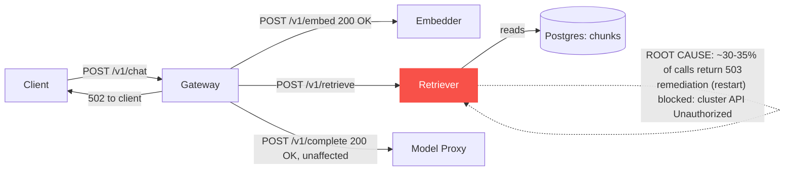

# Postmortem: gateway availability error budget burning fast (2% of the 28d budget in 1h; 5m & 1h windows)

- **Status:** open
- **Severity:** sev1
- **Verified:** no
- **Opened:** 2026-08-04 13:26:42Z
- **Resolved:** (still open)

## Timeline (machine-generated)

All times UTC on 2026-08-04 unless a full date is shown.

| Time (UTC) | Source | Event |
| --- | --- | --- |
| 12:32:37Z | k8s | Pod/retriever-8454db56c-q2b86: BackOff |
| 12:32:57Z | k8s | Pod/retriever-8454db56c-q2b86: Started |
| 12:32:57Z | k8s | Pod/retriever-8454db56c-q2b86: Pulled |
| 12:32:57Z | k8s | Pod/retriever-8454db56c-q2b86: Created |
| 12:32:59Z | k8s | Pod/retriever-8454db56c-q2b86: BackOff |
| 12:33:03Z | k8s | Pod/retriever-8454db56c-q2b86: BackOff |
| 12:33:06Z | k8s | Pod/retriever-8454db56c-q2b86: BackOff |
| 12:34:15Z | k8s | Pod/retriever-8454db56c-q2b86: BackOff |
| 12:35:16Z | k8s | Pod/retriever-8454db56c-q2b86: BackOff |
| 12:36:08Z | k8s | ReplicaSet/retriever-8454db56c: SuccessfulDelete |
| 12:36:08Z | k8s | Deployment/retriever: ScalingReplicaSet |
| 13:26:10Z | alert | alert firing: SLO gateway availability — fast burn |

## Evidence links

- [Loki — logs over the incident window](http://localhost:3001/explore?schemaVersion=1&panes=%7B%22pm%22%3A+%7B%22datasource%22%3A+%22loki%22%2C+%22queries%22%3A+%5B%7B%22refId%22%3A+%22A%22%2C+%22datasource%22%3A+%7B%22type%22%3A+%22loki%22%2C+%22uid%22%3A+%22loki%22%7D%2C+%22expr%22%3A+%22%7Bnamespace%3D%5C%22subject%5C%22%7D+%7C~+%5C%22%28%3Fi%29error%7Cfailed%5C%22%22%7D%5D%2C+%22range%22%3A+%7B%22from%22%3A+%221785850002918%22%2C+%22to%22%3A+%221785850355997%22%7D%7D%7D&orgId=1)
- [Mimir — metrics over the incident window](http://localhost:3001/explore?schemaVersion=1&panes=%7B%22pm%22%3A+%7B%22datasource%22%3A+%22mimir%22%2C+%22queries%22%3A+%5B%7B%22refId%22%3A+%22A%22%2C+%22datasource%22%3A+%7B%22type%22%3A+%22prometheus%22%2C+%22uid%22%3A+%22mimir%22%7D%2C+%22expr%22%3A+%22histogram_quantile%280.95%2C+sum%28rate%28http_server_duration_milliseconds_bucket%5B5m%5D%29%29+by+%28le%29%29%22%7D%5D%2C+%22range%22%3A+%7B%22from%22%3A+%221785850002918%22%2C+%22to%22%3A+%221785850355997%22%7D%7D%7D&orgId=1)

## Investigation context

**Runbook match (2):** `gateway-high-error-rate.md`, `stale-secret.md` — toolset narrowed to 13 tools: alert_status, deploy_history, kubectl_read, loki_query, mimir_query, publish_postmortem, request_approval, restart_workload, runbook_lookup, runbook_read, save_artifact, tempo_query, update_db_secret

Pre-check battery (as injected at run start)

## Pre-check leads

### recent_deploys — LEAD
No deploy in the last 60m — rule out the reflex answer.
- No deploy in the last 60m — rule out the reflex answer.

### log_spike — OK
error/failed log rate normal: 200/10min vs baseline 388/10min

### kube_scan — UNAVAILABLE
error: You must be logged in to the server (Unauthorized)

### rollout_state — UNAVAILABLE
gateway: E0804 15:26:43.847138   10260 memcache.go:265] "Unhandled Error" err="couldn't get current server API group list: the server has asked for the client to provide credentials"
E0804 15:26:43.917546   10260 memcache.go:265] "Unhandled Error" err="couldn't get current server API group list: the server has asked for the client to provide credentials"
E0804 15:26:44.052910   10260 memcache.go:265] "Unhandled Error" err="couldn't get current server API group list: the server has asked for the client to; gateway analysis: E0804 15:26:43.852941    6220 memcache.go:265] "Unhandled Error" err="couldn't get current server API group list: the server has asked for the client to provide credentials"
E0804 15:26:43.986790    6220 memcache.go:265] "Unhandled Error"
… (section truncated)

### secret_age — UNAVAILABLE
error: You must be logged in to the server (Unauthorized)

## Narrative

## Summary

`SLO gateway availability — fast burn` (sev1, tenant acme) fired on the gateway's 28d availability budget burning at fast-burn rate. Root-caused to the `retriever` downstream returning HTTP 503 on roughly 30-35% of its requests, which the gateway surfaces as 502s on `POST /v1/chat`. Remediation (rolling-restart of `retriever`) was approved but could not be executed — the cluster API rejected the action with "Unauthorized," the same failure mode already flagged as UNAVAILABLE by the `kube_scan`/`rollout_state`/`secret_age` pre-checks. **Incident remains open.**

## Impact

Gateway `POST /v1/chat` 5xx rate rose from a low, steady baseline to roughly a third of all requests, sustained and non-recovering (unlike two earlier, smaller, self-resolving blips in the preceding hour). Tenant `acme` traffic is affected.

## Root cause

Full traces for erroring `POST /v1/chat` requests show the gateway root span returning `502`, with an internal `upstream_error` exception: `"retriever returned 503"`, stack-rooted at `retriever-http.ts:14`. Embedder and model-proxy calls in the same traces return clean `200`s — the failure is isolated to the retriever hop, not a general gateway fault. This matches the `gateway-high-error-rate` runbook's hypothesis 1 ("one downstream is failing health checks and the gateway is surfacing its errors"), not hypothesis 2 (tenant rate-limit — no 429/abuser signature) or hypothesis 3 (model-proxy timeout — model-proxy showed zero errors).

Both the `stale-secret` and bad-deploy hypotheses were checked and ruled out with evidence:
- `deploy_history` for `gateway` over the incident window returned zero entries — no deploy precedes the alert.
- `loki_query` for `"password authentication failed"` over the incident window returned zero lines — no stale-DB-credential signature.

Immediately before the sustained error onset, gateway/`retriever` request-rate metrics show a ~12-minute total silence (call rate dropped to zero across all `POST /v1/chat` status codes), after which traffic resumed with the elevated ~30-35% error rate that has persisted since — consistent with the retriever pod cycling and coming back in a degraded state rather than a gradual organic decline. Retriever logs during the window show only one pod identity, no explicit "returned 503" log line, and a separate, non-fatal `"lineage emit failed: The operation timed out"` WARN (an OpenLineage/Marquez emit) that fires uniformly across START/COMPLETE/FAIL events on both `gateway` and `retriever` — this is a secondary, non-gating dependency issue, not the cause of the 502/503s (it does not correlate with which requests fail).

`kubectl_read` was unauthorized throughout the investigation (matching the pre-check `kube_scan`/`rollout_state`/`secret_age` leads), so pod restart count / OOM status / replica count could not be confirmed directly from the API server — the root cause is established from trace and log evidence at the application layer instead.

## What fixed it

Nothing yet. `restart_workload(retriever)` was dry-run (diff: rolling-restart annotation bump, no spec change), approved by the operator, then executed for real twice — both attempts returned `"error: You must be logged in to the server (Unauthorized)"` without applying. This is a cluster-credential/RBAC outage affecting the on-call agent's Kubernetes access broadly (reads and writes), not specific to this remediation. `alert_status` was re-queried after the failed attempts and the alert is still active. The incident is being published unresolved so a human operator can restart `retriever` directly and/or fix the agent's cluster credentials.

## Lessons

- The cluster credential/RBAC outage is itself an operational gap: it silently degraded from "read-only pre-checks unavailable" (tolerable, other evidence compensated) to "cannot execute an approved remediation" (not tolerable) without a distinct alert of its own. That outage deserves its own page/monitor separate from application SLOs.
- Retriever's 503s were not logged at the application layer with enough detail to name the exact internal cause (pool exhaustion vs. crash-restart vs. dependency failure) — an explicit error log on the 503 path (not just an OpenLineage warn) would have shortened this investigation.
- The two earlier, smaller error-rate blips in the hour before this incident self-resolved without intervention; this one didn't, and the difference (a full traffic outage gap beforehand) was the tell that this one needed a human/agent-triggered restart rather than a wait-and-see.

