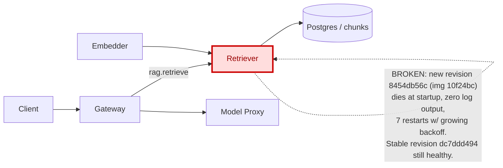

# Postmortem: subject/retriever-8454db56c-q2b86 container retriever is in CrashLoopBackOff

- **Status:** open
- **Severity:** sev1
- **Verified:** no
- **Opened:** 2026-08-04 12:32:56Z
- **Resolved:** (still open)

## Timeline (machine-generated)

All times UTC on 2026-08-04 unless a full date is shown.

| Time (UTC) | Source | Event |
| --- | --- | --- |
| 12:27:06Z | k8s | ReplicaSet/retriever-8454db56c: SuccessfulCreate |
| 12:27:06Z | k8s | Deployment/retriever: ScalingReplicaSet |
| 12:27:06Z | k8s | Pod/retriever-8454db56c-q2b86: Scheduled |
| 12:27:08Z | k8s | Pod/retriever-8454db56c-q2b86: Pulled |
| 12:27:09Z | k8s | Pod/retriever-8454db56c-q2b86: Started |
| 12:27:09Z | k8s | Pod/retriever-8454db56c-q2b86: Created |
| 12:27:11Z | k8s | Pod/retriever-8454db56c-q2b86: Started |
| 12:27:11Z | k8s | Pod/retriever-8454db56c-q2b86: Pulled |
| 12:27:11Z | k8s | Pod/retriever-8454db56c-q2b86: Created |
| 12:27:13Z | k8s | Pod/retriever-8454db56c-q2b86: BackOff |
| 12:27:14Z | k8s | Pod/retriever-8454db56c-q2b86: BackOff |
| 12:27:16Z | k8s | Pod/retriever-8454db56c-q2b86: BackOff |
| 12:27:24Z | k8s | Pod/retriever-8454db56c-q2b86: Started |
| 12:27:24Z | k8s | Pod/retriever-8454db56c-q2b86: Pulled |
| 12:27:24Z | k8s | Pod/retriever-8454db56c-q2b86: Created |
| 12:27:27Z | k8s | Pod/retriever-8454db56c-q2b86: BackOff |
| 12:27:36Z | k8s | Pod/retriever-8454db56c-q2b86: BackOff |
| 12:27:47Z | k8s | Pod/retriever-8454db56c-q2b86: Started |
| 12:27:47Z | k8s | Pod/retriever-8454db56c-q2b86: Pulled |
| 12:27:47Z | k8s | Pod/retriever-8454db56c-q2b86: Created |
| 12:27:49Z | k8s | Pod/retriever-8454db56c-q2b86: BackOff |
| 12:27:50Z | k8s | Pod/retriever-8454db56c-q2b86: BackOff |
| 12:27:56Z | k8s | Pod/retriever-8454db56c-q2b86: BackOff |
| 12:28:43Z | k8s | Pod/retriever-8454db56c-q2b86: Started |
| 12:28:43Z | k8s | Pod/retriever-8454db56c-q2b86: Pulled |
| 12:28:43Z | k8s | Pod/retriever-8454db56c-q2b86: Created |
| 12:28:46Z | k8s | Pod/retriever-8454db56c-q2b86: BackOff |
| 12:28:47Z | k8s | Pod/retriever-8454db56c-q2b86: BackOff |
| 12:29:48Z | k8s | Pod/retriever-8454db56c-q2b86: BackOff |
| 12:30:10Z | k8s | Pod/retriever-8454db56c-q2b86: Started |
| 12:30:10Z | k8s | Pod/retriever-8454db56c-q2b86: Pulled |
| 12:30:10Z | k8s | Pod/retriever-8454db56c-q2b86: Created |
| 12:30:13Z | k8s | Pod/retriever-8454db56c-q2b86: BackOff |
| 12:30:16Z | k8s | Pod/retriever-8454db56c-q2b86: BackOff |
| 12:31:26Z | k8s | Pod/retriever-8454db56c-q2b86: BackOff |
| 12:31:44Z | log-spike | log-spike onset: {"level":"warn","service":"gateway","message":"lineage emit failed","trace_id":"7c5e73e36f17f2f5e07b3be1eb3bab40","span_id":"37ca49ae2960080f","time":"2026-08-04T12:31:44.823Z","reason":"The operation timed out.","job":"ra… |
| 12:32:20Z | alert | alert firing: KubePodCrashLooping |
| 12:32:37Z | k8s | Pod/retriever-8454db56c-q2b86: BackOff |
| 12:32:57Z | k8s | Pod/retriever-8454db56c-q2b86: Started |
| 12:32:57Z | k8s | Pod/retriever-8454db56c-q2b86: Pulled |
| 12:32:57Z | k8s | Pod/retriever-8454db56c-q2b86: Created |
| 12:32:59Z | k8s | Pod/retriever-8454db56c-q2b86: BackOff |
| 12:33:03Z | k8s | Pod/retriever-8454db56c-q2b86: BackOff |
| 12:33:06Z | k8s | Pod/retriever-8454db56c-q2b86: BackOff |
| 12:34:15Z | k8s | Pod/retriever-8454db56c-q2b86: BackOff |
| 12:35:16Z | k8s | Pod/retriever-8454db56c-q2b86: BackOff |
| 12:36:08Z | k8s | ReplicaSet/retriever-8454db56c: SuccessfulDelete |
| 12:36:08Z | k8s | Deployment/retriever: ScalingReplicaSet |

## Evidence links

- [Loki — logs over the incident window](http://localhost:3001/explore?schemaVersion=1&panes=%7B%22pm%22%3A+%7B%22datasource%22%3A+%22loki%22%2C+%22queries%22%3A+%5B%7B%22refId%22%3A+%22A%22%2C+%22datasource%22%3A+%7B%22type%22%3A+%22loki%22%2C+%22uid%22%3A+%22loki%22%7D%2C+%22expr%22%3A+%22%7Bnamespace%3D%5C%22subject%5C%22%7D+%7C~+%5C%22%28%3Fi%29error%7Cfailed%5C%22%22%7D%5D%2C+%22range%22%3A+%7B%22from%22%3A+%221785846776100%22%2C+%22to%22%3A+%221785847007512%22%7D%7D%7D&orgId=1)
- [Mimir — metrics over the incident window](http://localhost:3001/explore?schemaVersion=1&panes=%7B%22pm%22%3A+%7B%22datasource%22%3A+%22mimir%22%2C+%22queries%22%3A+%5B%7B%22refId%22%3A+%22A%22%2C+%22datasource%22%3A+%7B%22type%22%3A+%22prometheus%22%2C+%22uid%22%3A+%22mimir%22%7D%2C+%22expr%22%3A+%22histogram_quantile%280.95%2C+sum%28rate%28http_server_duration_milliseconds_bucket%5B5m%5D%29%29+by+%28le%29%29%22%7D%5D%2C+%22range%22%3A+%7B%22from%22%3A+%221785846776100%22%2C+%22to%22%3A+%221785847007512%22%7D%7D%7D&orgId=1)

## Investigation context

**Runbook match (1):** `k8s-crashloop.md` — toolset narrowed to 12 tools: alert_status, deploy_history, k8s_events, kubectl_read, loki_query, publish_postmortem, request_approval, restart_workload, rollout_undo, runbook_lookup, runbook_read, save_artifact

Pre-check battery (as injected at run start)

## Pre-check leads

### recent_deploys — LEAD
No deploy in the last 60m — rule out the reflex answer.
- No deploy in the last 60m — rule out the reflex answer.

### log_spike — LEAD
error/failed log rate 200/10min vs baseline 0/10min (200x baseline) — onset: {"level":"warn","service":"gateway","message":"lineage emit failed","trace_id":"7c5e73e36f17f2f5e07b3be1eb3bab40","span_id":"37ca49ae2960080f","time":"2026-08-04T12:31:44.823Z","reason":"The operation timed out.","job":"rag.inference","eventType":"START"} at 2026-08-04T12:31:44.823622+00:00
- error/failed log rate 200/10min vs baseline 0/10min (200x baseline) — onset: {"level":"warn","service":"gateway","message":"lineage emit failed","trace_id":"7c5e73e36f17f2f5e07b3be1eb3bab… (truncated)

### kube_scan — UNAVAILABLE
error: You must be logged in to the server (Unauthorized)

### rollout_state — UNAVAILABLE
gateway: E0804 14:32:57.594439   55144 memcache.go:265] "Unhandled Error" err="couldn't get current server API group list: the server has asked for the client to provide credentials"
E0804 14:32:57.726375   55144 memcache.go:265] "Unhandled Error" err="couldn't get current server API group list: the server has asked for the client to provide credentials"
E0804 14:32:57.844760   55144 memcache.go:265] "Unhandled Error" err="couldn't get current server API group list: the server has asked for the client to; gateway analysis: E0804 14:32:57.594973   18496 memcache.go:265] "Unhandled Error" err="couldn't get current server API group list: the server has asked for the client to provide credentials"
E0804 14:32:57.722062   18496 memcache.go:265] "Unhandled Error"
… (section truncated)

### secret_age — UNAVAILABLE
error: You must be logged in to the server (Unauthorized)

## Narrative

## Summary
`KubePodCrashLooping` fired (sev1) for `subject/retriever-8454db56c-q2b86`. A newly-created pod-template-hash of the `retriever` Deployment has been cycling through CrashLoopBackOff since it first appeared, never reaching Ready.

## Impact
The RAG retrieval hop of the serving path was degraded: the replica belonging to the new revision (`8454db56c`, image `obs-registry:5010/retriever:10f24bc`) never served traffic, cycling through 7 restarts in under 6 minutes with growing backoff (2s → 13s → 23s → 56s → 87s → 167s between starts — textbook kubelet CrashLoopBackOff). The prior revision (pod-template-hash `dc7ddd494`) stayed up and kept logging normally throughout, so the retriever service likely continued to be served (in degraded capacity) by that stable replica rather than going fully dark.

## Root cause
The new revision of `deployment/retriever` (hash `8454db56c`, image tag `10f24bc`) dies at startup on every single restart: the container is pulled, created, and started successfully each cycle, but exits before emitting a single log line — a Loki query scoped to that pod across the full incident window returned zero lines, on all 7 restarts. That signature (starts, then dies silently, every time, on a brand-new revision, while the previous revision keeps running fine) matches the runbook's first hypothesis — a bad env/config or fatal init-time error in the new revision — rather than an image-pull problem (image pulls succeeded) or a request-time bug (there was no traffic-driven crash pattern, and no logs at all were produced, so it never got that far).

I could not name the exact source commit: `deploy_history` reported `argo`/`rollout` sources unavailable, and `kubectl describe`/rollout-history reads all failed with `Unauthorized` — the cluster read/remediation credential (agent-ro / agent-remediate) is being rejected cluster-wide this incident, which was already visible in the pre-check leads (`kube_scan`, `rollout_state` both `Unauthorized`) before investigation even began. This is a pre-existing environment condition, not something this incident caused, but it materially limited both diagnosis depth and the fix.

## What fixed it
**Nothing — remediation did not execute.** `rollout_undo` on `retriever` was dry-run (the dry-run itself could only partially read rollout history, due to the same auth outage) and approved by the operator (approval `apr_19fccc55890100`). Both real-execution attempts (`dry_run=false`) against `deployment/retriever` were rejected with `Unauthorized` by the cluster API. `alert_status` was re-queried afterward and `KubePodCrashLooping` is **still active**. This incident is closing unresolved from the tooling side.

## Lessons
- The blocking issue right now is cluster credentials, not the retriever code: agent-ro/agent-remediate auth needs to be restored before any further in-cluster diagnosis or remediation (describe pod, rollout history, rollout_undo) is possible.
- Once credentials are restored: re-run `rollout_undo` for `retriever` (a fresh dry-run + approval is required — this one is spent) to roll back to the `dc7ddd494` revision, and confirm the alert clears.
- Consider a synthetic/independent check that pages when agent-ro auth breaks — it silently disables on-call tooling during exactly the incidents that need it most, and that was true from before this page even fired.

## Delivery path

