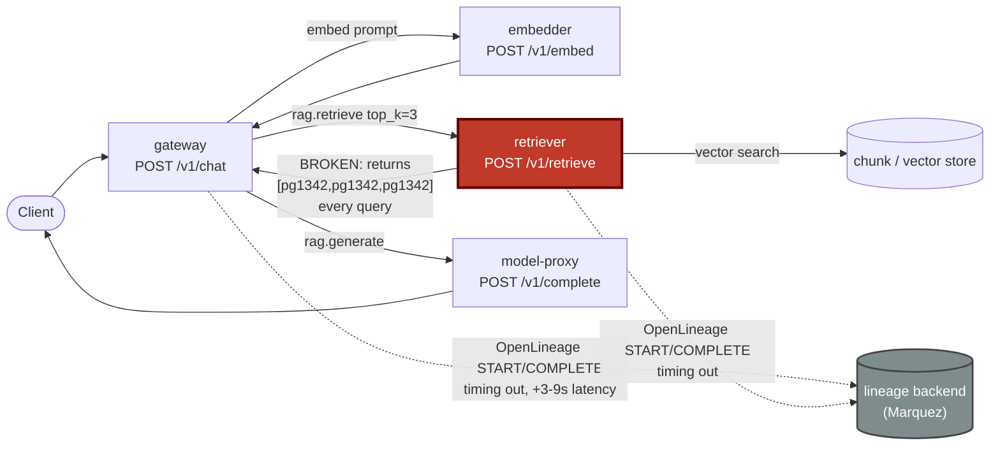

# Postmortem: RAG top-1 relevance below the 90% objective over the last hour (burn-rate alerting saturates for a loose SLO)

- **Status:** open
- **Severity:** sev2
- **Verified:** no
- **Opened:** 2026-08-04 12:40:48Z
- **Resolved:** (still open)

## Timeline (machine-generated)

All times UTC on 2026-08-04 unless a full date is shown.

| Time (UTC) | Source | Event |
| --- | --- | --- |
| 12:27:06Z | k8s | ReplicaSet/retriever-8454db56c: SuccessfulCreate |
| 12:27:06Z | k8s | Deployment/retriever: ScalingReplicaSet |
| 12:27:06Z | k8s | Pod/retriever-8454db56c-q2b86: Scheduled |
| 12:27:08Z | k8s | Pod/retriever-8454db56c-q2b86: Pulled |
| 12:27:09Z | k8s | Pod/retriever-8454db56c-q2b86: Started |
| 12:27:09Z | k8s | Pod/retriever-8454db56c-q2b86: Created |
| 12:27:11Z | k8s | Pod/retriever-8454db56c-q2b86: Started |
| 12:27:11Z | k8s | Pod/retriever-8454db56c-q2b86: Pulled |
| 12:27:11Z | k8s | Pod/retriever-8454db56c-q2b86: Created |
| 12:27:13Z | k8s | Pod/retriever-8454db56c-q2b86: BackOff |
| 12:27:14Z | k8s | Pod/retriever-8454db56c-q2b86: BackOff |
| 12:27:16Z | k8s | Pod/retriever-8454db56c-q2b86: BackOff |
| 12:27:24Z | k8s | Pod/retriever-8454db56c-q2b86: Started |
| 12:27:24Z | k8s | Pod/retriever-8454db56c-q2b86: Pulled |
| 12:27:24Z | k8s | Pod/retriever-8454db56c-q2b86: Created |
| 12:27:27Z | k8s | Pod/retriever-8454db56c-q2b86: BackOff |
| 12:27:36Z | k8s | Pod/retriever-8454db56c-q2b86: BackOff |
| 12:27:47Z | k8s | Pod/retriever-8454db56c-q2b86: Started |
| 12:27:47Z | k8s | Pod/retriever-8454db56c-q2b86: Pulled |
| 12:27:47Z | k8s | Pod/retriever-8454db56c-q2b86: Created |
| 12:27:49Z | k8s | Pod/retriever-8454db56c-q2b86: BackOff |
| 12:27:50Z | k8s | Pod/retriever-8454db56c-q2b86: BackOff |
| 12:27:56Z | k8s | Pod/retriever-8454db56c-q2b86: BackOff |
| 12:28:43Z | k8s | Pod/retriever-8454db56c-q2b86: Started |
| 12:28:43Z | k8s | Pod/retriever-8454db56c-q2b86: Pulled |
| 12:28:43Z | k8s | Pod/retriever-8454db56c-q2b86: Created |
| 12:28:46Z | k8s | Pod/retriever-8454db56c-q2b86: BackOff |
| 12:28:47Z | k8s | Pod/retriever-8454db56c-q2b86: BackOff |
| 12:29:48Z | k8s | Pod/retriever-8454db56c-q2b86: BackOff |
| 12:30:10Z | k8s | Pod/retriever-8454db56c-q2b86: Started |
| 12:30:10Z | k8s | Pod/retriever-8454db56c-q2b86: Pulled |
| 12:30:10Z | k8s | Pod/retriever-8454db56c-q2b86: Created |
| 12:30:13Z | k8s | Pod/retriever-8454db56c-q2b86: BackOff |
| 12:30:16Z | k8s | Pod/retriever-8454db56c-q2b86: BackOff |
| 12:31:26Z | k8s | Pod/retriever-8454db56c-q2b86: BackOff |
| 12:32:37Z | k8s | Pod/retriever-8454db56c-q2b86: BackOff |
| 12:32:57Z | k8s | Pod/retriever-8454db56c-q2b86: Started |
| 12:32:57Z | k8s | Pod/retriever-8454db56c-q2b86: Pulled |
| 12:32:57Z | k8s | Pod/retriever-8454db56c-q2b86: Created |
| 12:32:59Z | k8s | Pod/retriever-8454db56c-q2b86: BackOff |
| 12:33:03Z | k8s | Pod/retriever-8454db56c-q2b86: BackOff |
| 12:33:06Z | k8s | Pod/retriever-8454db56c-q2b86: BackOff |
| 12:34:15Z | k8s | Pod/retriever-8454db56c-q2b86: BackOff |
| 12:35:01Z | log-spike | log-spike onset: {"level":"warn","service":"gateway","message":"lineage emit failed","trace_id":"56dd9b3632f4d2fa42b5305d96007259","span_id":"ff7157aa40a65062","time":"2026-08-04T12:35:01.287Z","reason":"The operation timed out.","job":"ra… |
| 12:35:16Z | k8s | Pod/retriever-8454db56c-q2b86: BackOff |
| 12:36:08Z | k8s | ReplicaSet/retriever-8454db56c: SuccessfulDelete |
| 12:36:08Z | k8s | Deployment/retriever: ScalingReplicaSet |
| 12:40:10Z | alert | alert firing: SLO RAG quality — below objective |

## Evidence links

- [Loki — logs over the incident window](http://localhost:3001/explore?schemaVersion=1&panes=%7B%22pm%22%3A+%7B%22datasource%22%3A+%22loki%22%2C+%22queries%22%3A+%5B%7B%22refId%22%3A+%22A%22%2C+%22datasource%22%3A+%7B%22type%22%3A+%22loki%22%2C+%22uid%22%3A+%22loki%22%7D%2C+%22expr%22%3A+%22%7Bnamespace%3D%5C%22subject%5C%22%7D+%7C~+%5C%22%28%3Fi%29error%7Cfailed%5C%22%22%7D%5D%2C+%22range%22%3A+%7B%22from%22%3A+%221785847248598%22%2C+%22to%22%3A+%221785847787774%22%7D%7D%7D&orgId=1)
- [Mimir — metrics over the incident window](http://localhost:3001/explore?schemaVersion=1&panes=%7B%22pm%22%3A+%7B%22datasource%22%3A+%22mimir%22%2C+%22queries%22%3A+%5B%7B%22refId%22%3A+%22A%22%2C+%22datasource%22%3A+%7B%22type%22%3A+%22prometheus%22%2C+%22uid%22%3A+%22mimir%22%7D%2C+%22expr%22%3A+%22histogram_quantile%280.95%2C+sum%28rate%28http_server_duration_milliseconds_bucket%5B5m%5D%29%29+by+%28le%29%29%22%7D%5D%2C+%22range%22%3A+%7B%22from%22%3A+%221785847248598%22%2C+%22to%22%3A+%221785847787774%22%7D%7D%7D&orgId=1)

## Investigation context

**Runbook match:** none — no tool narrowing applied for this alert. Available runbooks: README.md, canary-abort.md, ci-pipeline-red.md, dq-freshness-stall.md, gateway-high-error-rate.md, k8s-crashloop.md, k8s-node-failure.md, snapshot-agent-audit.md, stale-secret.md

Pre-check battery (as injected at run start)

## Pre-check leads

### recent_deploys — LEAD
No deploy in the last 60m — rule out the reflex answer.
- No deploy in the last 60m — rule out the reflex answer.

### log_spike — LEAD
error/failed log rate 200/10min vs baseline 0/10min (200x baseline) — onset: {"level":"warn","service":"gateway","message":"lineage emit failed","trace_id":"56dd9b3632f4d2fa42b5305d96007259","span_id":"ff7157aa40a65062","time":"2026-08-04T12:35:01.287Z","reason":"The operation timed out.","job":"rag.inference","eventType":"START"} at 2026-08-04T12:35:01.288555+00:00
- error/failed log rate 200/10min vs baseline 0/10min (200x baseline) — onset: {"level":"warn","service":"gateway","message":"lineage emit failed","trace_id":"56dd9b3632f4d2fa42b5305d960072… (truncated)

### kube_scan — UNAVAILABLE
error: You must be logged in to the server (Unauthorized)

### rollout_state — UNAVAILABLE
gateway: E0804 14:40:48.965141   47912 memcache.go:265] "Unhandled Error" err="couldn't get current server API group list: the server has asked for the client to provide credentials"
E0804 14:40:49.090985   47912 memcache.go:265] "Unhandled Error" err="couldn't get current server API group list: the server has asked for the client to provide credentials"
E0804 14:40:49.176986   47912 memcache.go:265] "Unhandled Error" err="couldn't get current server API group list: the server has asked for the client to; gateway analysis: E0804 14:40:48.976442   66540 memcache.go:265] "Unhandled Error" err="couldn't get current server API group list: the server has asked for the client to provide credentials"
E0804 14:40:49.063793   66540 memcache.go:265] "Unhandled Error"
… (section truncated)

### secret_age — UNAVAILABLE
error: You must be logged in to the server (Unauthorized)

## Narrative

## Summary

SLO alert "RAG top-1 relevance — below objective" fired for tenant acme (a loose, burn-rate-gated SLO, so it only latches after ~an hour of sustained badness). Investigation traced the cause to the **retriever** returning the exact same chunk (`doc_id=pg1342`) three times for every `top_k=3` retrieval, regardless of tenant or prompt — verified identically across multiple independent Tempo traces with different `prompt.hash` values. This collapses corpus-wide relevance to a near-constant low score. Mimir shows the per-pod mean `retrieval_relevance_score` flat at **0.1539–0.1541** across all five gateway replicas for the entire 12h lookback — this is a chronic condition, not a fresh regression coincident with the page.

## Impact

Every RAG chat response for the window was grounded on an almost-always-irrelevant single chunk instead of a genuine top-3 retrieval, breaching the 90% top-1 relevance objective continuously. A separate retriever pod (`retriever-8454db56c-q2b86`) also crash-looped (BackOff) for several minutes before the platform cycled it out to a fresh ReplicaSet (`retriever-dc7ddd494-jv9j7`, 0 restarts) — that fresh, never-restarted replica exhibits the **identical** duplicate-doc behavior, which rules out stuck pod/runtime state as the cause and points at the deployed retriever logic itself (or a shared upstream index/cache it reads from).

A secondary, contributing symptom: OpenLineage `START`/`COMPLETE` emission from both `gateway` (job `rag.inference`) and `retriever` (job `rag.retrieve`) has been failing with "The operation timed out" across every replica, inflating `rag.retrieve` spans to 3–9s (should be sub-second). This adds latency and log noise but is not the primary driver of the degenerate doc-id repetition.

## Root cause

Application-level defect in the retriever's top-k selection/ranking path: it returns one document duplicated into all `top_k` slots instead of genuinely distinct top-ranked chunks. No deploy of gateway/retriever/model-proxy landed inside the alert window — the last gitops deploys touching gateway/platform were ~37h prior, and the nearest `main` commits (load-generator `percentile()`, model-proxy pre-warm, both reverted) don't touch retrieval ranking. This is a standing defect that the loose SLO's burn-rate window only just finished saturating on.

## What fixed it

**Nothing — the incident is unresolved.** A rolling restart of `deployment/retriever` was dry-run (diff: `restartedAt` annotation bump, no spec change), and approved by the operator. Executing it (`dry_run=false`) was rejected by the live Kubernetes API with `Unauthorized` — the same credential failure that made `kubectl_read`, `argo_app`, `rollout_status`, and `rollout_undo`'s history read unavailable throughout this investigation. Re-querying `alert_status` afterward confirms the alert is still **active**. This is a tooling/credential gap, not a decision to withhold action, and given the fresh-pod evidence above a restart was unlikely to fix a code-level bug regardless.

## Lessons

1. No runbook existed for this alert — author one that starts by inspecting `rag.retrieve` span attributes (`rag.retrieved_doc_ids`) for duplicate/degenerate top-k output, not just latency/error-rate, since a purely-quality SLO can hide a serving bug behind healthy-looking HTTP 200s.
2. The on-call agent's cluster write credentials were unauthorized for the entire incident (`kubectl_read`, `argo_app`, `rollout_status`, and `restart_workload`'s execute path all failed identically) — fix credential provisioning so remediation tooling is actually usable during a page; a healthy dry-run must not be trusted as a signal that the real action will succeed.
3. Decouple OpenLineage emission from the request hot path (async/fire-and-forget with a short budget) regardless of the relevance root cause — it should never be able to add multiple seconds to `rag.retrieve`/`rag.inference`.
4. Once retriever access is restored, the real fix is a code change to the retriever's top-k selection (likely a slice/dedup bug always repeating the single best-scoring result) — ship that, then confirm `retrieval_relevance_score` moves off the pinned ~0.15 band before considering this closed.

