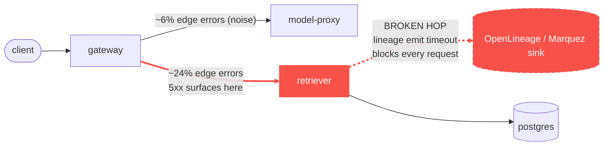

# Postmortem: gateway 5xx rate above 2%

- **Status:** open
- **Severity:** sev1
- **Verified:** no
- **Opened:** 2026-08-04 21:12:40Z
- **Resolved:** (still open)

## Timeline (machine-generated)

All times UTC on 2026-08-04 unless a full date is shown.

| Time (UTC) | Source | Event |
| --- | --- | --- |
| 21:10:04Z | log-spike | log-spike onset: error: Malformed JSON in request body |
| 21:12:10Z | alert | alert firing: Gateway 5xx rate > 2% |

## Evidence links

- [Loki — logs over the incident window](http://localhost:3001/explore?schemaVersion=1&panes=%7B%22pm%22%3A+%7B%22datasource%22%3A+%22loki%22%2C+%22queries%22%3A+%5B%7B%22refId%22%3A+%22A%22%2C+%22datasource%22%3A+%7B%22type%22%3A+%22loki%22%2C+%22uid%22%3A+%22loki%22%7D%2C+%22expr%22%3A+%22%7Bnamespace%3D%5C%22subject%5C%22%7D+%7C~+%5C%22%28%3Fi%29error%7Cfailed%5C%22%22%7D%5D%2C+%22range%22%3A+%7B%22from%22%3A+%221785877960111%22%2C+%22to%22%3A+%221785878291927%22%7D%7D%7D&orgId=1)
- [Mimir — metrics over the incident window](http://localhost:3001/explore?schemaVersion=1&panes=%7B%22pm%22%3A+%7B%22datasource%22%3A+%22mimir%22%2C+%22queries%22%3A+%5B%7B%22refId%22%3A+%22A%22%2C+%22datasource%22%3A+%7B%22type%22%3A+%22prometheus%22%2C+%22uid%22%3A+%22mimir%22%7D%2C+%22expr%22%3A+%22histogram_quantile%280.95%2C+sum%28rate%28http_server_duration_milliseconds_bucket%5B5m%5D%29%29+by+%28le%29%29%22%7D%5D%2C+%22range%22%3A+%7B%22from%22%3A+%221785877960111%22%2C+%22to%22%3A+%221785878291927%22%7D%7D%7D&orgId=1)

## Investigation context

**Runbook match (2):** `gateway-high-error-rate.md`, `stale-secret.md` — toolset narrowed to 13 tools: alert_status, deploy_history, kubectl_read, loki_query, mimir_query, publish_postmortem, request_approval, restart_workload, runbook_lookup, runbook_read, save_artifact, tempo_query, update_db_secret

Pre-check battery (as injected at run start)

## Pre-check leads

### recent_deploys — LEAD
No deploy in the last 60m — rule out the reflex answer.
- No deploy in the last 60m — rule out the reflex answer.

### log_spike — LEAD
error/failed log rate 200/10min vs baseline 0/10min (200x baseline) — onset: error: Malformed JSON in request body at 2026-08-04T21:10:04.046990+00:00
- error/failed log rate 200/10min vs baseline 0/10min (200x baseline) — onset: error: Malformed JSON in request body at 2026-08-04T21:10:04.046990+00:00

### attribution — LEAD
errors concentrate on gateway → POST retriever (22.7%); time concentrates in gateway's own handler (~4.3s of 7.8s) over the last 10m — which is not necessarily the workload named on the alert:
- gateway: 21.8% of its OWN responses are 5xx (10m)
- retriever: 21.6% of its OWN responses are 5xx (10m)
- model-proxy: 1.2% of its OWN responses are 5xx (10m)
- gateway → POST retriever: 22.7% of those outbound calls failed
- gateway → POST model-proxy: 5.6% of those outbound calls failed
- own-handler p95 (server p95 minus its slowest outbound call — a ranking, not a measurement): gateway ~4.3s of 7.8s end to end, embedder ~3.5s of 3.5s end to end, retriever ~3.1s of 3.1s end to end
- gateway → POST embedder: p95 3.5s outbound
- gateway → POST retriever: p95 3.1s outbound

### rollout_state — LEAD
1 rollout-state lead
- analysisrun for gateway (gateway-8444846b5f-21-1): Failed — Metric "canary-error-rate" assessed Failed due to failed (2) > failureLimit (1)

### kube_scan — OK
all pods Ready, no notable cluster events

### secret_age — OK
Secret subject-db-credentials last modified 10d 21h ago (created 10d 21h ago).

## Narrative

## Summary

The `Gateway 5xx rate > 2%` sev1 fired because the gateway was faithfully surfacing failures from its `retriever` dependency, not failing on its own account. Root cause: the retriever's synchronous OpenLineage emission (job `rag.retrieve`, one call per request start and one per completion) began timing out against its lineage sink, adding blocking latency to every single retrieve call on the retriever's one and only replica. As the timeouts piled up, the retriever's own 5xx rate stepped from a flat, quiet 0% straight into a climbing curve, and the gateway's 5xx rate rose in lockstep because nearly a quarter of its calls to retriever were failing.

## Impact

Gateway-facing requests for tenant `acme` (and any other tenant sharing the retrieve path) saw a 5xx rate that climbed from 0% to roughly 30% and was still rising at the time of investigation — a sev1-grade availability hit on the RAG chat path. `model-proxy` was largely unaffected (~1–6% own/edge error rate throughout, within noise).

## Root cause

Attribution (by-service and by-dependency-edge PromQL from the gateway-high-error-rate runbook) showed gateway's own 5xx rate (~22%) tracking its outbound-call failure rate to retriever (~23–24%) almost exactly, while its call to model-proxy stayed under 6% — indicting retriever, not the gateway itself.

Retriever's own 5xx rate (all 503s, not 500s) was flat 0% for the full 3-hour lookback and then stepped up in the same window the alert fired, with no restart, no OOMKill, no resource pressure (CPU/mem well under limits, single Burstable pod, liveness/readiness green throughout) and — critically — no deploy of retriever in the preceding 46 hours (last sync was two days prior). That rules out both the "bad deploy" and "resource exhaustion" hypotheses.

In the same window, retriever's own logs show a warning firing on essentially every request: `"lineage emit failed", "reason":"The operation timed out.", "job":"rag.retrieve"` for both the START and COMPLETE lineage events. This synchronous, per-request call to the lineage sink blocking/timing out on a single-replica service is what inflated retriever's own request latency (p95 ~2.5s) and pushed a growing share of requests into failure as concurrent requests queued up behind the stalled calls — a classic downstream-wedged pattern, not a gateway-side bug.

(A separate, one-line `error: Malformed JSON in request body` log spike from the gateway was investigated and ruled out: it's Hono's request-body validator throwing an HTTPException with **status 400** — a client-input error, excluded from the `5xx` filter that defines this alert — not the incident driver.)

## What fixed it

Nothing yet. Per the runbook, "downstream wedged" calls for `restart_workload` on the wedged service (retriever) to clear the stuck request-handling backlog. That remediation was dry-run and submitted for approval, and **the operator denied it**. No remediation was executed. The alert was re-checked after the denial and is still firing/active — the incident remains open and unresolved.

## Lessons

- The gateway is a symptom surface, not a source, for this class of failure — attribute by dependency edge before touching the gateway itself, exactly as the runbook prescribes.
- A per-request synchronous call to an observability side-channel (lineage emission) that is not on the critical path for correctness should not be able to take down the primary serving path when its sink is slow/unreachable — it needs a hard timeout well under the request budget and to be fire-and-forget (or dropped) rather than blocking the retrieve handler.
- Retriever runs a single replica with no redundancy, so any per-request stall compounds immediately into queuing and cascading failure with no other pod to absorb load.
- Follow-up: since remediation was denied, the retriever/gateway path is still degraded — this needs a human decision on how to proceed (approve a restart, fix the lineage-sink timeout in code, or accept the outage) before the underlying issue can be closed out.

