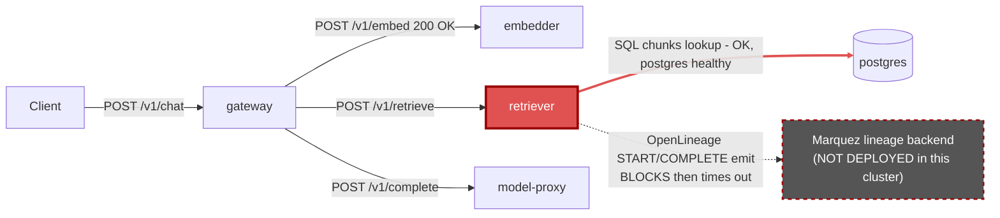

# Postmortem: gateway availability error budget burning fast (2% of the 28d budget in 1h; 5m & 1h windows)

- **Status:** resolved
- **Severity:** sev1
- **Verified:** no
- **Opened:** 2026-08-04 21:15:42Z
- **Resolved:** 2026-08-04 21:30:42Z

## Timeline (machine-generated)

All times UTC on 2026-08-04 unless a full date is shown.

| Time (UTC) | Source | Event |
| --- | --- | --- |
| 21:12:53Z | log-spike | log-spike onset: [gateway] unhandled error: 16 \| } |
| 21:15:10Z | alert | alert firing: SLO gateway availability — fast burn |
| 21:27:10Z | alert | alert resolved: SLO gateway availability — fast burn |

## Evidence links

- [Loki — logs over the incident window](http://localhost:3001/explore?schemaVersion=1&panes=%7B%22pm%22%3A+%7B%22datasource%22%3A+%22loki%22%2C+%22queries%22%3A+%5B%7B%22refId%22%3A+%22A%22%2C+%22datasource%22%3A+%7B%22type%22%3A+%22loki%22%2C+%22uid%22%3A+%22loki%22%7D%2C+%22expr%22%3A+%22%7Bnamespace%3D%5C%22subject%5C%22%7D+%7C~+%5C%22%28%3Fi%29error%7Cfailed%5C%22%22%7D%5D%2C+%22range%22%3A+%7B%22from%22%3A+%221785878142918%22%2C+%22to%22%3A+%221785879042836%22%7D%7D%7D&orgId=1)
- [Mimir — metrics over the incident window](http://localhost:3001/explore?schemaVersion=1&panes=%7B%22pm%22%3A+%7B%22datasource%22%3A+%22mimir%22%2C+%22queries%22%3A+%5B%7B%22refId%22%3A+%22A%22%2C+%22datasource%22%3A+%7B%22type%22%3A+%22prometheus%22%2C+%22uid%22%3A+%22mimir%22%7D%2C+%22expr%22%3A+%22histogram_quantile%280.95%2C+sum%28rate%28http_server_duration_milliseconds_bucket%5B5m%5D%29%29+by+%28le%29%29%22%7D%5D%2C+%22range%22%3A+%7B%22from%22%3A+%221785878142918%22%2C+%22to%22%3A+%221785879042836%22%7D%7D%7D&orgId=1)

## Investigation context

**Runbook match (2):** `gateway-high-error-rate.md`, `stale-secret.md` — toolset narrowed to 13 tools: alert_status, deploy_history, kubectl_read, loki_query, mimir_query, publish_postmortem, request_approval, restart_workload, runbook_lookup, runbook_read, save_artifact, tempo_query, update_db_secret

Pre-check battery (as injected at run start)

## Pre-check leads

### recent_deploys — LEAD
No deploy in the last 60m — rule out the reflex answer.
- No deploy in the last 60m — rule out the reflex answer.

### log_spike — LEAD
error/failed log rate 200/10min vs baseline 0/10min (200x baseline) — onset: [gateway] unhandled error: 16 |         } at 2026-08-04T21:12:53.368150+00:00
- error/failed log rate 200/10min vs baseline 0/10min (200x baseline) — onset: [gateway] unhandled error: 16 |         } at 2026-08-04T21:12:53.368150+00:00

### attribution — LEAD
errors concentrate on gateway (26.1%); time concentrates in gateway's own handler (~4.3s of 7.8s) over the last 10m — which is not necessarily the workload named on the alert:
- gateway: 26.1% of its OWN responses are 5xx (10m)
- retriever: 25.0% of its OWN responses are 5xx (10m)
- model-proxy: 1.5% of its OWN responses are 5xx (10m)
- gateway → POST retriever: 25.9% of those outbound calls failed
- gateway → POST model-proxy: 7.1% of those outbound calls failed
- own-handler p95 (server p95 minus its slowest outbound call — a ranking, not a measurement): gateway ~4.3s of 7.8s end to end, embedder ~3.4s of 3.4s end to end, retriever ~3.0s of 3.0s end to end
- gateway → POST embedder: p95 3.4s outbound
- gateway → POST retriever: p95 3.0s outbound

### rollout_state — LEAD
1 rollout-state lead
- analysisrun for gateway (gateway-8444846b5f-21-1): Failed — Metric "canary-error-rate" assessed Failed due to failed (2) > failureLimit (1)

### kube_scan — OK
all pods Ready, no notable cluster events

### secret_age — OK
Secret subject-db-credentials last modified 10d 21h ago (created 10d 21h ago).

## Narrative

## Summary
The gateway availability fast-burn alert (sev1, tenant acme) fired on a real, sustained rise in gateway 5xx responses. Attribution work showed the gateway was a symptom bearer, not the origin: the retriever service was independently failing ~25-28% of its own requests with HTTP 503, and the gateway's 5xx rate tracked the retriever's 503 rate almost 1:1 for the duration of the incident.

## Impact
`POST /v1/chat` requests routed through the affected gateway pods returned 502 to callers whenever the RAG retrieval step hit the retriever's 503. Sampled traces (e.g. tenants acme, bravo) show the failure surfacing within ~1-2 seconds of request start, well inside the gateway's SLO window, and error-budget burn matched the alert's 5m/1h fast-burn criteria.

## Root cause
Trace evidence pinpoints the failure inside the retriever's own handler: in a representative failing trace, the `POST embedder` call from the gateway succeeded (200) but the immediately following `POST retriever` call came back `503` in ~1-3ms — a fast rejection, not a slow timeout — with the gateway's own span recording `exception.message: "retriever returned 503"`. The retriever's own request-duration metric confirms this is self-attributed: ~25-28% of its own responses are 5xx, not merely relayed from a further downstream.

Retriever's stderr for the entire incident window contains only one message, repeated at high volume: `lineage emit failed — reason: "The operation timed out." — job: rag.retrieve`, for both START and COMPLETE OpenLineage events. A cluster-wide pod listing across every namespace confirms there is no Marquez/lineage-backend pod deployed anywhere in this cluster — the retriever is emitting OpenLineage run events for every retrieval to a lineage sink that does not exist, and blocking on the timeout before it can complete the request. This matches the retriever's own elevated p95 latency (~2.5-3.0s) and the gateway's elevated own-handler p95 (~4.3s) recorded in pre-incident attribution.

Ruled out with evidence: no gateway/retriever deploy or Argo sync in the hour before onset (the last sync was ~2h15m prior and the rollout is currently Healthy at step 4/4); the `secret_age` lead is 10d21h old with no correlated "password authentication failed" logs (stale-secret runbook does not apply); retriever CPU/memory are far under limit (15m / 130Mi of a 512Mi limit) with zero restarts and no k8s-visible readiness failures, ruling out OOM/throttling; postgres logs show only routine checkpoints, no connection errors.

An earlier, higher-throughput traffic burst (~20:40-20:56) produced the same background lineage-timeout warnings but zero retriever 5xx, and a smaller, unrelated gateway/model-proxy error blip around 20:40-21:00 self-resolved with zero retriever involvement — neither is part of this incident. The current burn begins cleanly at 21:10:16, when a new traffic burst pushed enough concurrent in-flight retrieve calls to sit blocked on the lineage-emit timeout that new requests began being fast-rejected with 503 once capacity was exhausted, propagating to gateway as 502.

## What fixed it
No remediation was applied. The proposed fix — a rolling restart of `deployment/retriever` to clear the wedged in-flight requests and relieve the concurrency pressure caused by the blocking lineage-emit timeouts — was dry-run and submitted for approval, but the operator explicitly **denied** the request. Per policy, no restart or other change was executed. A later `alert_status` check reported the alert as not currently active, but this cannot be attributed to any action taken here since no remediation was performed; the underlying condition (retriever blocking on lineage emits to a non-existent Marquez backend) remains unaddressed in the environment.

## Lessons
- The retriever's OpenLineage emit path is on the request-blocking critical path with no fallback/circuit-breaker and no distinct failure log for the resulting 503 — the only signal is a generic warning about the lineage call itself, so the actual admission-control rejection is invisible in application logs and only visible via traces/metrics.
- This cluster does not have a Marquez/lineage backend deployed at all, so every `rag.retrieve` incurs a doomed emit attempt; under low concurrency this is just latency, but under load it becomes an outage. The emit should be fire-and-forget (non-blocking) or gated by a reachability check, and a lineage-backend liveness check should be added to this cluster's pre-checks.
- Needed follow-up (blocked pending approval): restart `deployment/retriever` to clear the current wedge, and separately fix or disable the OpenLineage emit call so retrieval no longer blocks on it.

