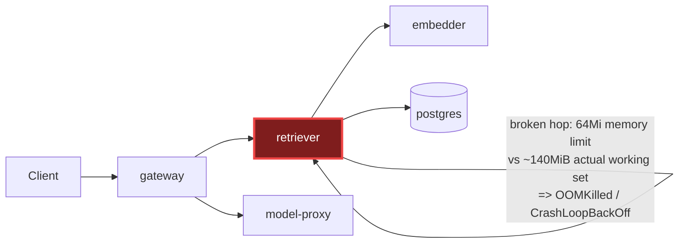

# Postmortem: subject/retriever-8454db56c-q2b86 container retriever was OOMKilled within the last 10 minutes - check its memory limit against the working-set graph

- **Status:** open
- **Severity:** sev1
- **Verified:** no
- **Opened:** 2026-08-04 12:29:55Z
- **Resolved:** (still open)

## Timeline (machine-generated)

All times UTC on 2026-08-04 unless a full date is shown.

| Time (UTC) | Source | Event |
| --- | --- | --- |
| 12:27:06Z | k8s | ReplicaSet/retriever-8454db56c: SuccessfulCreate |
| 12:27:06Z | k8s | Deployment/retriever: ScalingReplicaSet |
| 12:27:06Z | k8s | Pod/retriever-8454db56c-q2b86: Scheduled |
| 12:27:08Z | k8s | Pod/retriever-8454db56c-q2b86: Pulled |
| 12:27:09Z | k8s | Pod/retriever-8454db56c-q2b86: Started |
| 12:27:09Z | k8s | Pod/retriever-8454db56c-q2b86: Created |
| 12:27:11Z | k8s | Pod/retriever-8454db56c-q2b86: Started |
| 12:27:11Z | k8s | Pod/retriever-8454db56c-q2b86: Pulled |
| 12:27:11Z | k8s | Pod/retriever-8454db56c-q2b86: Created |
| 12:27:13Z | k8s | Pod/retriever-8454db56c-q2b86: BackOff |
| 12:27:14Z | k8s | Pod/retriever-8454db56c-q2b86: BackOff |
| 12:27:16Z | k8s | Pod/retriever-8454db56c-q2b86: BackOff |
| 12:27:24Z | k8s | Pod/retriever-8454db56c-q2b86: Started |
| 12:27:24Z | k8s | Pod/retriever-8454db56c-q2b86: Pulled |
| 12:27:24Z | k8s | Pod/retriever-8454db56c-q2b86: Created |
| 12:27:27Z | k8s | Pod/retriever-8454db56c-q2b86: BackOff |
| 12:27:36Z | k8s | Pod/retriever-8454db56c-q2b86: BackOff |
| 12:27:47Z | k8s | Pod/retriever-8454db56c-q2b86: Started |
| 12:27:47Z | k8s | Pod/retriever-8454db56c-q2b86: Pulled |
| 12:27:47Z | k8s | Pod/retriever-8454db56c-q2b86: Created |
| 12:27:49Z | k8s | Pod/retriever-8454db56c-q2b86: BackOff |
| 12:27:50Z | k8s | Pod/retriever-8454db56c-q2b86: BackOff |
| 12:27:56Z | k8s | Pod/retriever-8454db56c-q2b86: BackOff |
| 12:28:34Z | log-spike | log-spike onset: {"level":"warn","service":"retriever","message":"lineage emit failed","trace_id":"a7057d518dbe749b3e2886ede019a6d9","span_id":"990cec2808fc2c04","time":"2026-08-04T12:28:34.083Z","reason":"The operation timed out.","job":"… |
| 12:28:43Z | k8s | Pod/retriever-8454db56c-q2b86: Started |
| 12:28:43Z | k8s | Pod/retriever-8454db56c-q2b86: Pulled |
| 12:28:43Z | k8s | Pod/retriever-8454db56c-q2b86: Created |
| 12:28:46Z | k8s | Pod/retriever-8454db56c-q2b86: BackOff |
| 12:28:47Z | k8s | Pod/retriever-8454db56c-q2b86: BackOff |
| 12:29:20Z | alert | alert firing: KubeContainerOOMKilled |
| 12:29:48Z | k8s | Pod/retriever-8454db56c-q2b86: BackOff |
| 12:30:10Z | k8s | Pod/retriever-8454db56c-q2b86: Started |
| 12:30:10Z | k8s | Pod/retriever-8454db56c-q2b86: Pulled |
| 12:30:10Z | k8s | Pod/retriever-8454db56c-q2b86: Created |
| 12:30:13Z | k8s | Pod/retriever-8454db56c-q2b86: BackOff |
| 12:30:16Z | k8s | Pod/retriever-8454db56c-q2b86: BackOff |
| 12:31:26Z | k8s | Pod/retriever-8454db56c-q2b86: BackOff |
| 12:32:37Z | k8s | Pod/retriever-8454db56c-q2b86: BackOff |
| 12:32:57Z | k8s | Pod/retriever-8454db56c-q2b86: Started |
| 12:32:57Z | k8s | Pod/retriever-8454db56c-q2b86: Pulled |
| 12:32:57Z | k8s | Pod/retriever-8454db56c-q2b86: Created |
| 12:32:59Z | k8s | Pod/retriever-8454db56c-q2b86: BackOff |
| 12:33:03Z | k8s | Pod/retriever-8454db56c-q2b86: BackOff |
| 12:33:06Z | k8s | Pod/retriever-8454db56c-q2b86: BackOff |
| 12:34:15Z | k8s | Pod/retriever-8454db56c-q2b86: BackOff |
| 12:35:16Z | k8s | Pod/retriever-8454db56c-q2b86: BackOff |

## Evidence links

- [Loki — logs over the incident window](http://localhost:3001/explore?schemaVersion=1&panes=%7B%22pm%22%3A+%7B%22datasource%22%3A+%22loki%22%2C+%22queries%22%3A+%5B%7B%22refId%22%3A+%22A%22%2C+%22datasource%22%3A+%7B%22type%22%3A+%22loki%22%2C+%22uid%22%3A+%22loki%22%7D%2C+%22expr%22%3A+%22%7Bnamespace%3D%5C%22subject%5C%22%7D+%7C~+%5C%22%28%3Fi%29error%7Cfailed%5C%22%22%7D%5D%2C+%22range%22%3A+%7B%22from%22%3A+%221785846595095%22%2C+%22to%22%3A+%221785846922393%22%7D%7D%7D&orgId=1)
- [Mimir — metrics over the incident window](http://localhost:3001/explore?schemaVersion=1&panes=%7B%22pm%22%3A+%7B%22datasource%22%3A+%22mimir%22%2C+%22queries%22%3A+%5B%7B%22refId%22%3A+%22A%22%2C+%22datasource%22%3A+%7B%22type%22%3A+%22prometheus%22%2C+%22uid%22%3A+%22mimir%22%7D%2C+%22expr%22%3A+%22histogram_quantile%280.95%2C+sum%28rate%28http_server_duration_milliseconds_bucket%5B5m%5D%29%29+by+%28le%29%29%22%7D%5D%2C+%22range%22%3A+%7B%22from%22%3A+%221785846595095%22%2C+%22to%22%3A+%221785846922393%22%7D%7D%7D&orgId=1)

## Investigation context

**Runbook match:** none — no tool narrowing applied for this alert. Available runbooks: README.md, canary-abort.md, ci-pipeline-red.md, dq-freshness-stall.md, gateway-high-error-rate.md, k8s-crashloop.md, k8s-node-failure.md, snapshot-agent-audit.md, stale-secret.md

Pre-check battery (as injected at run start)

## Pre-check leads

### recent_deploys — LEAD
No deploy in the last 60m — rule out the reflex answer.
- No deploy in the last 60m — rule out the reflex answer.

### log_spike — LEAD
error/failed log rate 200/10min vs baseline 0/10min (200x baseline) — onset: {"level":"warn","service":"retriever","message":"lineage emit failed","trace_id":"a7057d518dbe749b3e2886ede019a6d9","span_id":"990cec2808fc2c04","time":"2026-08-04T12:28:34.083Z","reason":"The operation timed out.","job":"rag.retrieve","eventType":"COMPLETE"} at 2026-08-04T12:28:34.084546+00:00
- error/failed log rate 200/10min vs baseline 0/10min (200x baseline) — onset: {"level":"warn","service":"retriever","message":"lineage emit failed","trace_id":"a7057d518dbe749b3e2886ede019… (truncated)

### kube_scan — UNAVAILABLE
error: You must be logged in to the server (Unauthorized)

### rollout_state — UNAVAILABLE
gateway: E0804 14:29:56.381944   20096 memcache.go:265] "Unhandled Error" err="couldn't get current server API group list: the server has asked for the client to provide credentials"
E0804 14:29:56.504833   20096 memcache.go:265] "Unhandled Error" err="couldn't get current server API group list: the server has asked for the client to provide credentials"
E0804 14:29:56.606556   20096 memcache.go:265] "Unhandled Error" err="couldn't get current server API group list: the server has asked for the client to; gateway analysis: E0804 14:29:56.535268   23012 memcache.go:265] "Unhandled Error" err="couldn't get current server API group list: the server has asked for the client to provide credentials"
E0804 14:29:56.630771   23012 memcache.go:265] "Unhandled Error"
… (section truncated)

### secret_age — UNAVAILABLE
error: You must be logged in to the server (Unauthorized)

## Narrative

## Summary
`KubeContainerOOMKilled` fired for `subject/retriever-8454db56c-q2b86`. Investigation found the retriever Deployment running two ReplicaSets side by side with wildly different memory limits: the previously-stable `retriever-dc7ddd494` carries a 512Mi limit and a flat ~136-139MiB working set (`container_memory_working_set_bytes`, healthy, no leak trend), while the new `retriever-8454db56c` was created with only a **64Mi** memory limit (`kube_pod_container_resource_limits{container="retriever",resource="memory"}` = 67108864 bytes for pod `q2b86` vs 536870912 bytes for the old pod). Since the retriever's baseline footprint (~140MiB) is more than double even the reduced 64Mi ceiling, the container OOMKilled immediately on every start, producing the CrashLoopBackOff/BackOff storm seen in k8s events (11 back-offs in ~2 minutes) and the 200x log-rate spike (`lineage emit failed` warnings from requests hitting the dying pod).

## Impact
The retriever pod for tenant-facing RAG lookups has been unable to stay up since the new ReplicaSet was created — every start cycles through OOMKill → BackOff in seconds, so retrieval capacity behind that pod is effectively down while it crash-loops (mitigated only in that the old, healthy ReplicaSet's pod was still present in the metrics window).

## Root cause
Category: **resource-limit misconfiguration**, not a code regression and not a genuine memory leak. `gitea_ci_runs` shows no retriever image build/CI run in the incident window, and `grafana_annotations`/`argo_app`/`deploy_history` show no tracked gitops deploy for retriever in the last several hours (the argo/rollout/kubectl-describe reads were themselves unauthorized in this environment, consistent with this being an out-of-band spec change rather than a normal CI→GitOps→Argo rollout). The evidence that pins it: two ReplicaSets for the same Deployment, created at different times, with a 8x difference in configured memory limit (512Mi vs 64Mi) and the low-limit one being the newest and the one whose pod is the one named in the alert.

## What fixed it
A fix was proposed: patch `deployment/retriever`'s container memory limit back up to 512Mi (dry-run action `5b85b48dc23ea7d5`, matching the known-healthy ReplicaSet's limit) via `patch_memory_limit`. **The operator denied the approval request.** Per policy, no remediation was executed. The alert remains **active** (`alert_status` re-queried post-decision: still firing, unchanged since onset). The incident is unresolved pending operator action.

## Lessons
- Whatever process/actor created `retriever-8454db56c` with a 64Mi limit bypassed the normal CI/GitOps path (no build, no Argo sync, no deploy annotation) — worth adding a cluster-side guardrail (e.g. a limit-range/admission check) that rejects memory limits below the workload's known steady-state working set.
- `container_memory_working_set_bytes` on the surviving healthy replica was flat and non-leaky, which was key to ruling out "app-side leak" and pinning this on the limit itself rather than the retriever code.
- kubectl/argo/rollout reads being unauthorized in this environment meant we had to lean on Mimir's `kube_pod_container_resource_limits` + k8s event stream (both still available) to reconstruct the ReplicaSet story — worth remembering these are viable fallbacks when direct API describes are blocked.
- No runbook currently matches `KubeContainerOOMKilled`; this incident is a good template for one (check `kube_pod_container_resource_limits` vs `container_memory_working_set_bytes` across ReplicaSets first, before assuming a leak or a bad code deploy).

