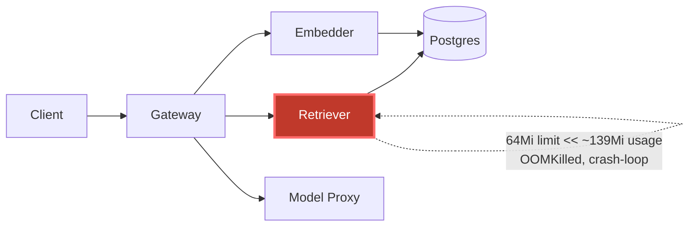

# Postmortem: gateway p95 latency above 2s

- **Status:** open
- **Severity:** sev1
- **Verified:** no
- **Opened:** 2026-08-04 12:32:41Z
- **Resolved:** (still open)

## Timeline (machine-generated)

All times UTC on 2026-08-04 unless a full date is shown.

| Time (UTC) | Source | Event |
| --- | --- | --- |
| 12:27:06Z | k8s | ReplicaSet/retriever-8454db56c: SuccessfulCreate |
| 12:27:06Z | k8s | Deployment/retriever: ScalingReplicaSet |
| 12:27:06Z | k8s | Pod/retriever-8454db56c-q2b86: Scheduled |
| 12:27:08Z | k8s | Pod/retriever-8454db56c-q2b86: Pulled |
| 12:27:09Z | k8s | Pod/retriever-8454db56c-q2b86: Started |
| 12:27:09Z | k8s | Pod/retriever-8454db56c-q2b86: Created |
| 12:27:11Z | k8s | Pod/retriever-8454db56c-q2b86: Started |
| 12:27:11Z | k8s | Pod/retriever-8454db56c-q2b86: Pulled |
| 12:27:11Z | k8s | Pod/retriever-8454db56c-q2b86: Created |
| 12:27:13Z | k8s | Pod/retriever-8454db56c-q2b86: BackOff |
| 12:27:14Z | k8s | Pod/retriever-8454db56c-q2b86: BackOff |
| 12:27:16Z | k8s | Pod/retriever-8454db56c-q2b86: BackOff |
| 12:27:24Z | k8s | Pod/retriever-8454db56c-q2b86: Started |
| 12:27:24Z | k8s | Pod/retriever-8454db56c-q2b86: Pulled |
| 12:27:24Z | k8s | Pod/retriever-8454db56c-q2b86: Created |
| 12:27:27Z | k8s | Pod/retriever-8454db56c-q2b86: BackOff |
| 12:27:36Z | k8s | Pod/retriever-8454db56c-q2b86: BackOff |
| 12:27:47Z | k8s | Pod/retriever-8454db56c-q2b86: Started |
| 12:27:47Z | k8s | Pod/retriever-8454db56c-q2b86: Pulled |
| 12:27:47Z | k8s | Pod/retriever-8454db56c-q2b86: Created |
| 12:27:49Z | k8s | Pod/retriever-8454db56c-q2b86: BackOff |
| 12:27:50Z | k8s | Pod/retriever-8454db56c-q2b86: BackOff |
| 12:27:56Z | k8s | Pod/retriever-8454db56c-q2b86: BackOff |
| 12:28:43Z | k8s | Pod/retriever-8454db56c-q2b86: Started |
| 12:28:43Z | k8s | Pod/retriever-8454db56c-q2b86: Pulled |
| 12:28:43Z | k8s | Pod/retriever-8454db56c-q2b86: Created |
| 12:28:46Z | k8s | Pod/retriever-8454db56c-q2b86: BackOff |
| 12:28:47Z | k8s | Pod/retriever-8454db56c-q2b86: BackOff |
| 12:29:48Z | k8s | Pod/retriever-8454db56c-q2b86: BackOff |
| 12:30:10Z | k8s | Pod/retriever-8454db56c-q2b86: Started |
| 12:30:10Z | k8s | Pod/retriever-8454db56c-q2b86: Pulled |
| 12:30:10Z | k8s | Pod/retriever-8454db56c-q2b86: Created |
| 12:30:13Z | k8s | Pod/retriever-8454db56c-q2b86: BackOff |
| 12:30:16Z | k8s | Pod/retriever-8454db56c-q2b86: BackOff |
| 12:31:26Z | k8s | Pod/retriever-8454db56c-q2b86: BackOff |
| 12:31:42Z | log-spike | log-spike onset: {"level":"warn","service":"embedder","message":"lineage emit failed","trace_id":"dfd0b098743191f35a92d4faeb42554d","span_id":"8f664d7a1db17bcb","time":"2026-08-04T12:31:42.742Z","reason":"The operation timed out.","job":"r… |
| 12:32:10Z | alert | alert firing: Gateway p95 latency > 2s |
| 12:32:37Z | k8s | Pod/retriever-8454db56c-q2b86: BackOff |
| 12:32:57Z | k8s | Pod/retriever-8454db56c-q2b86: Started |
| 12:32:57Z | k8s | Pod/retriever-8454db56c-q2b86: Pulled |
| 12:32:57Z | k8s | Pod/retriever-8454db56c-q2b86: Created |
| 12:32:59Z | k8s | Pod/retriever-8454db56c-q2b86: BackOff |
| 12:33:03Z | k8s | Pod/retriever-8454db56c-q2b86: BackOff |
| 12:33:06Z | k8s | Pod/retriever-8454db56c-q2b86: BackOff |
| 12:34:15Z | k8s | Pod/retriever-8454db56c-q2b86: BackOff |
| 12:35:16Z | k8s | Pod/retriever-8454db56c-q2b86: BackOff |
| 12:36:08Z | k8s | ReplicaSet/retriever-8454db56c: SuccessfulDelete |
| 12:36:08Z | k8s | Deployment/retriever: ScalingReplicaSet |

## Evidence links

- [Loki — logs over the incident window](http://localhost:3001/explore?schemaVersion=1&panes=%7B%22pm%22%3A+%7B%22datasource%22%3A+%22loki%22%2C+%22queries%22%3A+%5B%7B%22refId%22%3A+%22A%22%2C+%22datasource%22%3A+%7B%22type%22%3A+%22loki%22%2C+%22uid%22%3A+%22loki%22%7D%2C+%22expr%22%3A+%22%7Bnamespace%3D%5C%22subject%5C%22%7D+%7C~+%5C%22%28%3Fi%29error%7Cfailed%5C%22%22%7D%5D%2C+%22range%22%3A+%7B%22from%22%3A+%221785846761640%22%2C+%22to%22%3A+%221785847026770%22%7D%7D%7D&orgId=1)
- [Mimir — metrics over the incident window](http://localhost:3001/explore?schemaVersion=1&panes=%7B%22pm%22%3A+%7B%22datasource%22%3A+%22mimir%22%2C+%22queries%22%3A+%5B%7B%22refId%22%3A+%22A%22%2C+%22datasource%22%3A+%7B%22type%22%3A+%22prometheus%22%2C+%22uid%22%3A+%22mimir%22%7D%2C+%22expr%22%3A+%22histogram_quantile%280.95%2C+sum%28rate%28http_server_duration_milliseconds_bucket%5B5m%5D%29%29+by+%28le%29%29%22%7D%5D%2C+%22range%22%3A+%7B%22from%22%3A+%221785846761640%22%2C+%22to%22%3A+%221785847026770%22%7D%7D%7D&orgId=1)

## Investigation context

**Runbook match:** none — no tool narrowing applied for this alert. Available runbooks: README.md, canary-abort.md, ci-pipeline-red.md, dq-freshness-stall.md, gateway-high-error-rate.md, k8s-crashloop.md, k8s-node-failure.md, snapshot-agent-audit.md, stale-secret.md

Pre-check battery (as injected at run start)

## Pre-check leads

### recent_deploys — LEAD
No deploy in the last 60m — rule out the reflex answer.
- No deploy in the last 60m — rule out the reflex answer.

### log_spike — LEAD
error/failed log rate 200/10min vs baseline 0/10min (200x baseline) — onset: {"level":"warn","service":"embedder","message":"lineage emit failed","trace_id":"dfd0b098743191f35a92d4faeb42554d","span_id":"8f664d7a1db17bcb","time":"2026-08-04T12:31:42.742Z","reason":"The operation timed out.","job":"rag.embed","eventType":"START"} at 2026-08-04T12:31:42.742734+00:00
- error/failed log rate 200/10min vs baseline 0/10min (200x baseline) — onset: {"level":"warn","service":"embedder","message":"lineage emit failed","trace_id":"dfd0b098743191f35a92d4faeb425… (truncated)

### kube_scan — UNAVAILABLE
error: You must be logged in to the server (Unauthorized)

### rollout_state — UNAVAILABLE
gateway: E0804 14:32:42.607787   26244 memcache.go:265] "Unhandled Error" err="couldn't get current server API group list: the server has asked for the client to provide credentials"
E0804 14:32:42.740659   26244 memcache.go:265] "Unhandled Error" err="couldn't get current server API group list: the server has asked for the client to provide credentials"
E0804 14:32:42.823679   26244 memcache.go:265] "Unhandled Error" err="couldn't get current server API group list: the server has asked for the client to; gateway analysis: E0804 14:32:42.613794   48012 memcache.go:265] "Unhandled Error" err="couldn't get current server API group list: the server has asked for the client to provide credentials"
E0804 14:32:42.727999   48012 memcache.go:265] "Unhandled Error"
… (section truncated)

### secret_age — UNAVAILABLE
error: You must be logged in to the server (Unauthorized)

## Narrative

## Summary
Gateway p95 latency alert fired. Root cause traced to the `retriever` service, a synchronous dependency in the `/v1/chat` request path, crash-looping on OOMKill. Remediation (raise the memory limit) was proposed, dry-run, and approved, but could not be executed because the cluster write path was unauthorized — the incident remains open.

## Impact
`POST /v1/chat` traces during the window show gateway spans blocking 6–12s (vs a healthy sub-second baseline) while waiting on retriever/model-proxy calls, well over the 2s p95 SLO that paged this alert. Every request routed to the crash-looping retriever replica incurred the connection-refused/timeout + retry cost.

## Root cause
`deploy_history` showed no deploy in the 180-minute window, ruling out the reflex "bad deploy" answer. `k8s_events` showed pod `retriever-8454db56c-q2b86` in a sustained `BackOff` crashloop (15+ restarts in ~5 minutes), confirmed by `kube_pod_container_status_last_terminated_reason{pod="retriever-8454db56c-q2b86"} = OOMKilled` (uid `ccfd4803-...`). Cross-checking `kube_pod_container_resource_limits` for the same uid showed this replica's container memory limit was **67108864 bytes = 64Mi** — while a second, healthy retriever pod (`retriever-dc7ddd494-jv9j7`, uid `7d666a05-...`) on the same Deployment was measured at **536870912 bytes = 512Mi**. Actual measured working-set for the workload (`container_memory_working_set_bytes`) sits steadily around ~139Mi — comfortably inside 512Mi, but more than double the 64Mi limit on the crashing replica. That mismatch, not the (log-spike-lead) embedder "lineage emit failed" warning — which did not reproduce on re-query and is a red herring/unrelated signal — is what's OOM-killing the pod on every startup and keeping it crash-looping, starving gateway of a working retriever backend and driving p95 over 2s. The restart-rate series (flat at 0 for ~55 minutes, then spiking in the final minutes of the window) lines up with the alert's firing time.

Neither `argo_app`/`rollout_status` (the delivery-side sources) nor a direct `kubectl describe` of the pod were reachable — both failed with the same `Unauthorized` error the pre-check leads already flagged (`kube_scan`, `rollout_state`), so this looks like a cluster-auth outage on top of the resource-limit issue rather than a confirmable bad rollout. Given the corroborating restart-count and OOM-reason metrics, the memory-limit mismatch is the well-evidenced proximate cause regardless.

## What fixed it
Proposed raising the retriever container's memory limit to 512Mi (matching the healthy replica) to stop the OOM kills. Dry-run returned action_id `5b85b48dc23ea7d5`; operator approved (`apr_19fccc46be9dc`). Execution (`patch_memory_limit`, dry_run=false) was attempted twice and failed both times with `Unauthorized` — the same cluster-write-auth outage affecting the read-only diagnostics above. **The remediation was not applied.** Re-querying `alert_status` afterward confirms the alert is still firing (`active: true`) — recovery was not observed, and no further remediation attempts were made once the failure mode was confirmed to be systemic rather than transient.

## Lessons
- The cluster API credential used by this on-call session lost write (and much of its read) access sometime before/during the incident — that needs its own fix before any k8s-mutating remediation can land. Escalate to restore `agent-ro`/`agent-remediate` cluster auth.
- The retriever Deployment has two ReplicaSets alive with drastically different memory limits (64Mi vs 512Mi) for the same pod template's real footprint (~139Mi) — worth a follow-up runbook entry ("k8s-crashloop" doesn't currently call out checking `kube_pod_container_resource_limits` across replicas of the same Deployment; it should).
- Once cluster auth is restored, re-run `patch_memory_limit(retriever, 512Mi)` with a fresh dry-run/approval (the existing approval is single-use and was already spent on the failed attempt) and verify `alert_status` clears.

