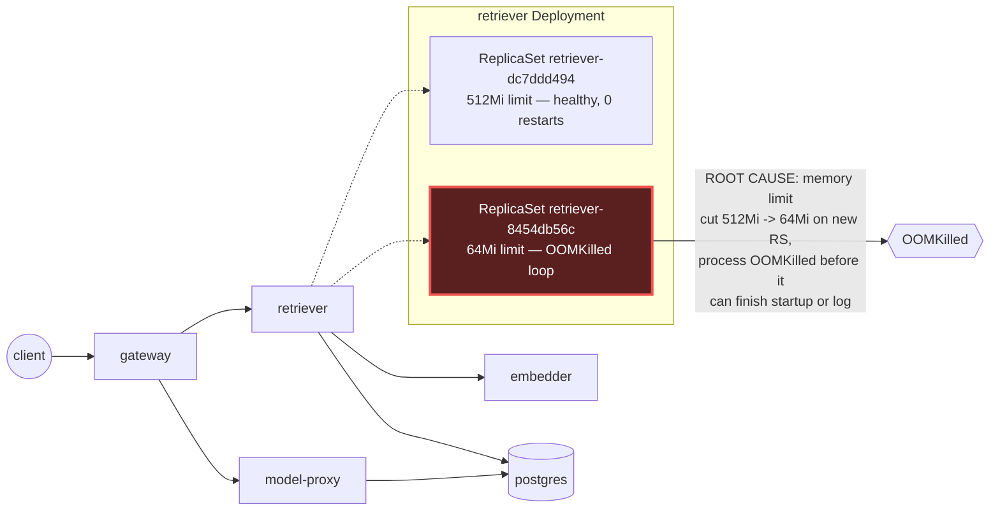

# Postmortem: subject/retriever-8454db56c-q2b86 has been not-ready for 4 minutes (readiness probe or startup trouble)

- **Status:** open
- **Severity:** sev1
- **Verified:** no
- **Opened:** 2026-08-04 12:33:57Z
- **Resolved:** (still open)

## Timeline (machine-generated)

All times UTC on 2026-08-04 unless a full date is shown.

| Time (UTC) | Source | Event |
| --- | --- | --- |
| 12:27:06Z | k8s | ReplicaSet/retriever-8454db56c: SuccessfulCreate |
| 12:27:06Z | k8s | Deployment/retriever: ScalingReplicaSet |
| 12:27:06Z | k8s | Pod/retriever-8454db56c-q2b86: Scheduled |
| 12:27:08Z | k8s | Pod/retriever-8454db56c-q2b86: Pulled |
| 12:27:09Z | k8s | Pod/retriever-8454db56c-q2b86: Started |
| 12:27:09Z | k8s | Pod/retriever-8454db56c-q2b86: Created |
| 12:27:11Z | k8s | Pod/retriever-8454db56c-q2b86: Started |
| 12:27:11Z | k8s | Pod/retriever-8454db56c-q2b86: Pulled |
| 12:27:11Z | k8s | Pod/retriever-8454db56c-q2b86: Created |
| 12:27:13Z | k8s | Pod/retriever-8454db56c-q2b86: BackOff |
| 12:27:14Z | k8s | Pod/retriever-8454db56c-q2b86: BackOff |
| 12:27:16Z | k8s | Pod/retriever-8454db56c-q2b86: BackOff |
| 12:27:24Z | k8s | Pod/retriever-8454db56c-q2b86: Started |
| 12:27:24Z | k8s | Pod/retriever-8454db56c-q2b86: Pulled |
| 12:27:24Z | k8s | Pod/retriever-8454db56c-q2b86: Created |
| 12:27:27Z | k8s | Pod/retriever-8454db56c-q2b86: BackOff |
| 12:27:36Z | k8s | Pod/retriever-8454db56c-q2b86: BackOff |
| 12:27:47Z | k8s | Pod/retriever-8454db56c-q2b86: Started |
| 12:27:47Z | k8s | Pod/retriever-8454db56c-q2b86: Pulled |
| 12:27:47Z | k8s | Pod/retriever-8454db56c-q2b86: Created |
| 12:27:49Z | k8s | Pod/retriever-8454db56c-q2b86: BackOff |
| 12:27:50Z | k8s | Pod/retriever-8454db56c-q2b86: BackOff |
| 12:27:56Z | k8s | Pod/retriever-8454db56c-q2b86: BackOff |
| 12:28:43Z | k8s | Pod/retriever-8454db56c-q2b86: Started |
| 12:28:43Z | k8s | Pod/retriever-8454db56c-q2b86: Pulled |
| 12:28:43Z | k8s | Pod/retriever-8454db56c-q2b86: Created |
| 12:28:46Z | k8s | Pod/retriever-8454db56c-q2b86: BackOff |
| 12:28:47Z | k8s | Pod/retriever-8454db56c-q2b86: BackOff |
| 12:29:48Z | k8s | Pod/retriever-8454db56c-q2b86: BackOff |
| 12:30:10Z | k8s | Pod/retriever-8454db56c-q2b86: Started |
| 12:30:10Z | k8s | Pod/retriever-8454db56c-q2b86: Pulled |
| 12:30:10Z | k8s | Pod/retriever-8454db56c-q2b86: Created |
| 12:30:13Z | k8s | Pod/retriever-8454db56c-q2b86: BackOff |
| 12:30:16Z | k8s | Pod/retriever-8454db56c-q2b86: BackOff |
| 12:31:26Z | k8s | Pod/retriever-8454db56c-q2b86: BackOff |
| 12:32:18Z | log-spike | log-spike onset: error: Malformed JSON in request body |
| 12:32:37Z | k8s | Pod/retriever-8454db56c-q2b86: BackOff |
| 12:32:57Z | k8s | Pod/retriever-8454db56c-q2b86: Started |
| 12:32:57Z | k8s | Pod/retriever-8454db56c-q2b86: Pulled |
| 12:32:57Z | k8s | Pod/retriever-8454db56c-q2b86: Created |
| 12:32:59Z | k8s | Pod/retriever-8454db56c-q2b86: BackOff |
| 12:33:03Z | k8s | Pod/retriever-8454db56c-q2b86: BackOff |
| 12:33:06Z | k8s | Pod/retriever-8454db56c-q2b86: BackOff |
| 12:33:20Z | alert | alert firing: KubePodNotReady |
| 12:34:15Z | k8s | Pod/retriever-8454db56c-q2b86: BackOff |
| 12:35:16Z | k8s | Pod/retriever-8454db56c-q2b86: BackOff |
| 12:36:08Z | k8s | ReplicaSet/retriever-8454db56c: SuccessfulDelete |
| 12:36:08Z | k8s | Deployment/retriever: ScalingReplicaSet |

## Evidence links

- [Loki — logs over the incident window](http://localhost:3001/explore?schemaVersion=1&panes=%7B%22pm%22%3A+%7B%22datasource%22%3A+%22loki%22%2C+%22queries%22%3A+%5B%7B%22refId%22%3A+%22A%22%2C+%22datasource%22%3A+%7B%22type%22%3A+%22loki%22%2C+%22uid%22%3A+%22loki%22%7D%2C+%22expr%22%3A+%22%7Bnamespace%3D%5C%22subject%5C%22%7D+%7C~+%5C%22%28%3Fi%29error%7Cfailed%5C%22%22%7D%5D%2C+%22range%22%3A+%7B%22from%22%3A+%221785846837097%22%2C+%22to%22%3A+%221785847060793%22%7D%7D%7D&orgId=1)
- [Mimir — metrics over the incident window](http://localhost:3001/explore?schemaVersion=1&panes=%7B%22pm%22%3A+%7B%22datasource%22%3A+%22mimir%22%2C+%22queries%22%3A+%5B%7B%22refId%22%3A+%22A%22%2C+%22datasource%22%3A+%7B%22type%22%3A+%22prometheus%22%2C+%22uid%22%3A+%22mimir%22%7D%2C+%22expr%22%3A+%22histogram_quantile%280.95%2C+sum%28rate%28http_server_duration_milliseconds_bucket%5B5m%5D%29%29+by+%28le%29%29%22%7D%5D%2C+%22range%22%3A+%7B%22from%22%3A+%221785846837097%22%2C+%22to%22%3A+%221785847060793%22%7D%7D%7D&orgId=1)

## Investigation context

**Runbook match:** none — no tool narrowing applied for this alert. Available runbooks: README.md, canary-abort.md, ci-pipeline-red.md, dq-freshness-stall.md, gateway-high-error-rate.md, k8s-crashloop.md, k8s-node-failure.md, snapshot-agent-audit.md, stale-secret.md

Pre-check battery (as injected at run start)

## Pre-check leads

### recent_deploys — LEAD
No deploy in the last 60m — rule out the reflex answer.
- No deploy in the last 60m — rule out the reflex answer.

### log_spike — LEAD
error/failed log rate 200/10min vs baseline 0/10min (200x baseline) — onset: error: Malformed JSON in request body at 2026-08-04T12:32:18.786747+00:00
- error/failed log rate 200/10min vs baseline 0/10min (200x baseline) — onset: error: Malformed JSON in request body at 2026-08-04T12:32:18.786747+00:00

### kube_scan — UNAVAILABLE
error: You must be logged in to the server (Unauthorized)

### rollout_state — UNAVAILABLE
gateway: E0804 14:33:58.152400   53000 memcache.go:265] "Unhandled Error" err="couldn't get current server API group list: the server has asked for the client to provide credentials"
E0804 14:33:58.261168   53000 memcache.go:265] "Unhandled Error" err="couldn't get current server API group list: the server has asked for the client to provide credentials"
E0804 14:33:58.342036   53000 memcache.go:265] "Unhandled Error" err="couldn't get current server API group list: the server has asked for the client to; gateway analysis: E0804 14:33:58.152400   41852 memcache.go:265] "Unhandled Error" err="couldn't get current server API group list: the server has asked for the client to provide credentials"
E0804 14:33:58.254018   41852 memcache.go:265] "Unhandled Error"
… (section truncated)

### secret_age — UNAVAILABLE
error: You must be logged in to the server (Unauthorized)

## Narrative

## Summary
`KubePodNotReady` fired for `subject/retriever-8454db56c-q2b86`. The pod was never actually "slow to ready" — it was stuck in a hard CrashLoopBackOff, restarting continuously with zero application log lines ever emitted (the process is killed before it can log anything).

## Impact
The retriever deployment had two ReplicaSets coexisting: the old `retriever-dc7ddd494` (1 healthy pod, 0 restarts, actively serving `rag.retrieve` traffic) and the new `retriever-8454db56c` (1 pod, climbing restart count — 2→6 restarts inside the alert window and still climbing at last check), stuck not-ready. Because the old pod was still up, the retriever service itself kept serving, but the rollout was wedged and the paged pod never became ready.

## Root cause
`kube_pod_container_status_last_terminated_reason` for `retriever-8454db56c-q2b86` reports **OOMKilled**. `kube_pod_container_resource_limits` shows the new ReplicaSet's container memory limit at **67108864 bytes (64Mi)**, versus **536870912 bytes (512Mi)** on the healthy sibling ReplicaSet `retriever-dc7ddd494` — an 8x reduction. 64Mi is not enough for the retriever process to even complete startup, so it OOMKills immediately on every attempt (confirmed by zero log lines ever reaching Loki for that pod, and repeated `BackOff`/"Back-off restarting failed container retriever" k8s events every restart cycle from 14:27:13 through 14:35:16 local, 20 occurrences and counting). The container image itself was unchanged (same tag/digest as the healthy pod), ruling out a bad image push — this was a resource-limit regression on the new ReplicaSet, not a code/image regression. `deploy_history`/`argo_app`/`kubectl describe` could not name the exact gitops commit because the cluster API rejected all agent-ro credentials (`Unauthorized`) for the whole investigation — a pre-existing environment auth outage, not something this incident caused.

## What fixed it
Root cause and fix were correctly identified — `patch_memory_limit(retriever, 512Mi)` was dry-run, approved by the operator, and then re-issued for real — but **both live-apply attempts failed** with the same `Unauthorized` error blocking every other cluster-write/read path in this session (kube_scan, rollout_state, secret_age, kubectl describe, argo_app all failed identically). This is a systemic credential outage on the agent-ro/kubectl side, not a flaky retry. Re-querying `alert_status` afterward confirms the alert is **still active** — remediation did NOT take effect. **The incident is not resolved.** Once cluster API credentials are restored, re-run `patch_memory_limit(workload="retriever", memory_mi=512)` (dry-run then approved apply) to restore the previous 512Mi limit; that should let the new ReplicaSet's pod start cleanly and go Ready.

## Lessons
- A memory-limit-only change (no image change) can still produce a full CrashLoopBackOff/OOMKilled cycle — don't assume "same image = safe rollout."
- The retriever workload should have a `PodDisruptionBudget`/rollout guard that fails a canary automatically when the new ReplicaSet's pods hit OOMKilled restarts, instead of leaving a wedged rollout for a human to notice via paging.
- This session's cluster-API credentials were unauthorized for the *entire* investigation (pre-check leads `kube_scan`, `rollout_state`, `secret_age` were already `UNAVAILABLE` before I started) — that blocked naming the exact gitops commit and, more seriously, blocked applying the approved fix. Restoring/rotating the agent-ro kubeconfig should be treated as its own incident, since it silently disables both diagnosis and remediation for on-call.
- No runbook currently matches `KubePodNotReady` directly; `k8s-crashloop.md` was the closest fit and its diagnostic steps (describe pod, k8s_events, pod logs, deploy_history) applied cleanly. Worth adding `KubePodNotReady` as an explicit trigger alias on that runbook, or a short runbook noting "not-ready is often actually crash-looping — check restart count and last-terminated-reason before assuming a slow readiness probe."

