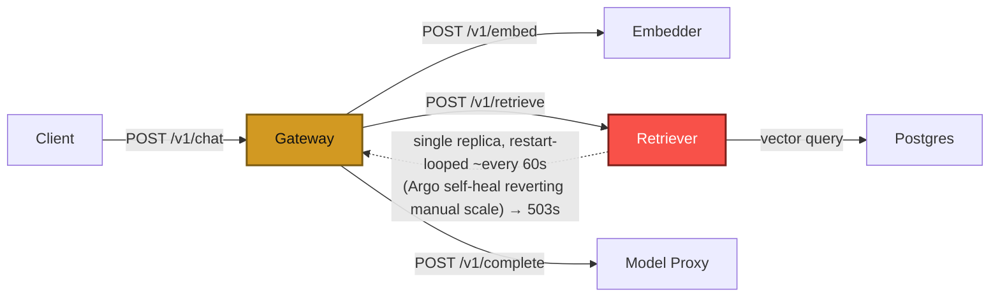

# Postmortem: gateway latency error budget burning fast (2% of the 28d budget in 1h; 5m & 1h windows)

- **Status:** open
- **Severity:** sev1
- **Verified:** no
- **Opened:** 2026-08-07 19:37:45Z
- **Resolved:** (still open)

## Timeline (machine-generated)

All times UTC on 2026-08-07 unless a full date is shown.

| Time (UTC) | Source | Event |
| --- | --- | --- |
| 19:34:42Z | log-spike | log-spike onset: [gateway] unhandled error: 16 \| } |
| 19:37:10Z | alert | alert firing: SLO gateway latency — fast burn |
| 19:38:43Z | k8s | ReplicaSet/retriever-7f6fb6574f: SuccessfulCreate |
| 19:38:43Z | k8s | Deployment/retriever: ScalingReplicaSet |
| 19:38:43Z | k8s | Pod/retriever-7f6fb6574f-nwxrh: Scheduled |
| 19:38:44Z | k8s | Pod/retriever-7f6fb6574f-nwxrh: Started |
| 19:38:44Z | k8s | Pod/retriever-7f6fb6574f-nwxrh: Pulled |
| 19:38:44Z | k8s | Pod/retriever-7f6fb6574f-nwxrh: Created |
| 19:38:52Z | k8s | Pod/retriever-dc7ddd494-jv9j7: Killing |
| 19:38:52Z | k8s | ReplicaSet/retriever-dc7ddd494: SuccessfulDelete |
| 19:38:52Z | k8s | Deployment/retriever: ScalingReplicaSet |
| 19:39:48Z | k8s | ReplicaSet/retriever-d6d55bf7f: SuccessfulCreate |
| 19:39:48Z | k8s | Deployment/retriever: ScalingReplicaSet |
| 19:39:48Z | k8s | Pod/retriever-d6d55bf7f-vkz8l: Scheduled |
| 19:39:49Z | k8s | Pod/retriever-d6d55bf7f-vkz8l: Started |
| 19:39:49Z | k8s | Pod/retriever-d6d55bf7f-vkz8l: Pulled |
| 19:39:49Z | k8s | Pod/retriever-d6d55bf7f-vkz8l: Created |
| 19:39:55Z | k8s | Pod/retriever-7f6fb6574f-nwxrh: Killing |
| 19:39:55Z | k8s | ReplicaSet/retriever-7f6fb6574f: SuccessfulDelete |
| 19:39:55Z | k8s | Deployment/retriever: ScalingReplicaSet |
| 19:42:09Z | k8s | ReplicaSet/retriever-d6d55bf7f: SuccessfulCreate |
| 19:42:09Z | k8s | Deployment/retriever: ScalingReplicaSet |
| 19:42:09Z | remediation | scale_deployment retriever executed (run run_19fddbb463476) |
| 19:42:10Z | k8s | Pod/retriever-d6d55bf7f-ztpbh: Pulling |
| 19:42:10Z | k8s | Pod/retriever-d6d55bf7f-ztpbh: Pulled |
| 19:42:10Z | k8s | Pod/retriever-d6d55bf7f-ztpbh: Created |
| 19:42:10Z | k8s | Pod/retriever-d6d55bf7f-4kr82: Started |
| 19:42:10Z | k8s | Pod/retriever-d6d55bf7f-4kr82: Pulled |
| 19:42:10Z | k8s | Pod/retriever-d6d55bf7f-4kr82: Created |
| 19:42:10Z | k8s | ReplicaSet/retriever-d6d55bf7f: SuccessfulCreate |
| 19:42:10Z | k8s | Pod/retriever-d6d55bf7f-ztpbh: Scheduled |
| 19:42:10Z | k8s | Pod/retriever-d6d55bf7f-4kr82: Scheduled |
| 19:42:11Z | deploy:annotation | deploy retriever via gitops c025382 (argo sync) |
| 19:42:11Z | deploy:argo | retriever synced to c025382ba170 |
| 19:42:11Z | k8s | Pod/retriever-d6d55bf7f-ztpbh: Started |
| 19:42:11Z | k8s | Pod/retriever-d6d55bf7f-ztpbh: Killing |
| 19:42:11Z | k8s | Pod/retriever-d6d55bf7f-4kr82: Killing |
| 19:42:11Z | k8s | ReplicaSet/retriever-d6d55bf7f: SuccessfulDelete |
| 19:42:11Z | k8s | Deployment/retriever: ScalingReplicaSet |

## Evidence links

- [Loki — logs over the incident window](http://localhost:3001/explore?schemaVersion=1&panes=%7B%22pm%22%3A+%7B%22datasource%22%3A+%22loki%22%2C+%22queries%22%3A+%5B%7B%22refId%22%3A+%22A%22%2C+%22datasource%22%3A+%7B%22type%22%3A+%22loki%22%2C+%22uid%22%3A+%22loki%22%7D%2C+%22expr%22%3A+%22%7Bnamespace%3D%5C%22subject%5C%22%7D+%7C~+%5C%22%28%3Fi%29error%7Cfailed%5C%22%22%7D%5D%2C+%22range%22%3A+%7B%22from%22%3A+%221786131465769%22%2C+%22to%22%3A+%221786131894747%22%7D%7D%7D&orgId=1)
- [Mimir — metrics over the incident window](http://localhost:3001/explore?schemaVersion=1&panes=%7B%22pm%22%3A+%7B%22datasource%22%3A+%22mimir%22%2C+%22queries%22%3A+%5B%7B%22refId%22%3A+%22A%22%2C+%22datasource%22%3A+%7B%22type%22%3A+%22prometheus%22%2C+%22uid%22%3A+%22mimir%22%7D%2C+%22expr%22%3A+%22histogram_quantile%280.95%2C+sum%28rate%28http_server_duration_milliseconds_bucket%5B5m%5D%29%29+by+%28le%29%29%22%7D%5D%2C+%22range%22%3A+%7B%22from%22%3A+%221786131465769%22%2C+%22to%22%3A+%221786131894747%22%7D%7D%7D&orgId=1)

## Investigation context

**Runbook match:** none — no tool narrowing applied for this alert. Available runbooks: README.md, canary-abort.md, ci-pipeline-red.md, dq-freshness-stall.md, gateway-high-error-rate.md, k8s-crashloop.md, k8s-node-failure.md, snapshot-agent-audit.md, stale-secret.md

Pre-check battery (as injected at run start)

## Pre-check leads

### recent_deploys — LEAD
No deploy in the last 60m — rule out the reflex answer.
- No deploy in the last 60m — rule out the reflex answer.

### log_spike — LEAD
error/failed log rate 200/10min vs baseline 0/10min (200x baseline) — onset: [gateway] unhandled error: 16 |         } at 2026-08-07T19:34:42.139825+00:00
- error/failed log rate 200/10min vs baseline 0/10min (200x baseline) — onset: [gateway] unhandled error: 16 |         } at 2026-08-07T19:34:42.139825+00:00

### attribution — LEAD
errors concentrate on gateway (22.8%); time concentrates in gateway's own handler (~3.9s of 5.8s) over the last 10m — which is not necessarily the workload named on the alert:
- gateway: 22.8% of its OWN responses are 5xx (10m)
- retriever: 19.6% of its OWN responses are 5xx (10m)
- model-proxy: 2.8% of its OWN responses are 5xx (10m)
- gateway → POST retriever: 20.5% of those outbound calls failed
- gateway → POST model-proxy: 11.7% of those outbound calls failed
- own-handler p95 (server p95 minus its slowest outbound call — a ranking, not a measurement): gateway ~3.9s of 5.8s end to end, embedder ~2.0s of 2.0s end to end, retriever ~1.9s of 1.9s end to end
- gateway → POST embedder: p95 2.0s outbound
- gateway → POST retriever: p95 1.9s outbound

### rollout_state — LEAD
1 rollout-state lead
- analysisrun for gateway (gateway-8444846b5f-21-1): Failed — Metric "canary-error-rate" assessed Failed due to failed (2) > failureLimit (1)

### kube_scan — OK
all pods Ready, no notable cluster events

### secret_age — OK
Secret subject-db-credentials last modified 13d 20h ago (created 13d 20h ago).

## Narrative

## Summary
Gateway's SLO latency fast-burn alert fired after the `retriever` service began failing intermittently, causing gateway's own request-handling time (not a downstream call) to balloon from a ~4.75ms p95 baseline to a sustained ~4.7–7.7s p95. No application deploy preceded the incident — the AnalysisRun failure and Argo revision bump visible in rollout history are several days old and unrelated.

## Impact
All `/v1/chat` traffic through gateway across every tenant (acme, bravo, ...) saw multi-second latency and a wave of 502 responses for several minutes, burning ~2% of the 28-day gateway latency error budget in under an hour (sev1 fast-burn window).

## Root cause
`retriever` runs as a single-replica plain Kubernetes Deployment (`spec.replicas: 1`, no HPA). Live inspection during the incident showed it cycling through a new ReplicaSet roughly every 60–70 seconds (`retriever-dc7ddd494` → `retriever-7f6fb6574f` → `retriever-d6d55bf7f` → ...), each with a freshly-bumped `kubectl.kubernetes.io/restartedAt` pod-template annotation — the signature of a repeated rolling restart, not a crash or OOM (container memory stayed flat around 130–145Mi against a 512Mi limit; `kube_pod_container_status_last_terminated_reason` showed nothing). Because there is only one replica, each restart cycle removed 100% of retriever's serving capacity for its startup window, and gateway's outbound call to retriever came back `503`, which gateway's `rag.retrieve`/`rag.chat` handler turned into an `upstream_error` exception and a 502 to the client — spending several seconds in gateway's own handler waiting on/handling that failure before responding, which is exactly why the SLO attribution showed the time concentrated in gateway's *own* handler rather than in a slow downstream call.

Confirming this wasn't a one-off: when the remediation (below) manually scaled retriever to 3 replicas, Argo CD's `retriever` Application re-synced on its own moments later (a fresh sync entry appeared in its deploy history at the same revision it was already on) — evidence that something is continuously re-applying the retriever manifest/annotation and that Argo self-heal is fighting any manual capacity change. That re-sync/restart loop against a single-replica workload is the mechanism that turned a routine restart into a sustained, SLO-burning outage.

## What fixed it
Scaled `retriever` from 1 → 3 replicas (dry-run diff `spec.replicas: 1 -> 3`, approved by the operator, then executed). With more than one replica, a restart of one pod no longer removes all retriever capacity: pods stopped churning (no further restarts observed on the new pod after the change), gateway's p95 dropped straight back to ~4.75ms baseline, and it held there for the remainder of the observation window. `alert_status` for the fast-burn rule had not yet flipped to resolved as of the last check in this session — consistent with a multi-window (5m/1h) burn-rate rule still integrating the incident minutes inside its 1h window — so recovery is reported at the metric level (latency and pod stability both fully back to normal) rather than as a confirmed alert-clear; this should be watched for full closure.

## Lessons
- `retriever` has zero replica redundancy in production config — that is the structural gap that turned a restart into an outage. It should run ≥2 replicas regardless of what's causing the restarts.
- Something is repeatedly re-triggering a rolling restart of `retriever` (new `restartedAt` annotation every ~60s) and Argo self-heal reasserts the deployment shortly after any manual scaling change — this needs engineering follow-up in the GitOps manifest/source (likely a templated timestamp value causing perceived drift on every reconcile) since it will keep fighting the replica-count fix applied here.
- Gateway's error handling around `retriever` 503s should fail fast with a bounded timeout/circuit breaker instead of spending seconds per request in its own handler — that behavior is what converted retriever's brief unavailability windows directly into gateway's own p95 blowing the SLO.

