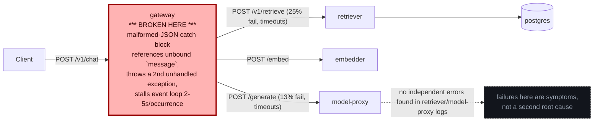

# Postmortem: gateway p95 latency above 2s

- **Status:** open
- **Severity:** sev1
- **Verified:** no
- **Opened:** 2026-08-07 19:35:41Z
- **Resolved:** (still open)

## Timeline (machine-generated)

All times UTC on 2026-08-07 unless a full date is shown.

| Time (UTC) | Source | Event |
| --- | --- | --- |
| 19:32:55Z | log-spike | log-spike onset: [gateway] unhandled error: 16 \| } |
| 19:35:10Z | alert | alert firing: Gateway p95 latency > 2s |
| 19:38:43Z | k8s | ReplicaSet/retriever-7f6fb6574f: SuccessfulCreate |
| 19:38:43Z | k8s | Deployment/retriever: ScalingReplicaSet |
| 19:38:43Z | k8s | Pod/retriever-7f6fb6574f-nwxrh: Scheduled |
| 19:38:44Z | k8s | Pod/retriever-7f6fb6574f-nwxrh: Started |
| 19:38:44Z | k8s | Pod/retriever-7f6fb6574f-nwxrh: Pulled |
| 19:38:44Z | k8s | Pod/retriever-7f6fb6574f-nwxrh: Created |
| 19:38:52Z | k8s | Pod/retriever-dc7ddd494-jv9j7: Killing |
| 19:38:52Z | k8s | ReplicaSet/retriever-dc7ddd494: SuccessfulDelete |
| 19:38:52Z | k8s | Deployment/retriever: ScalingReplicaSet |
| 19:39:48Z | k8s | ReplicaSet/retriever-d6d55bf7f: SuccessfulCreate |
| 19:39:48Z | k8s | Deployment/retriever: ScalingReplicaSet |
| 19:39:48Z | k8s | Pod/retriever-d6d55bf7f-vkz8l: Scheduled |
| 19:39:49Z | k8s | Pod/retriever-d6d55bf7f-vkz8l: Started |
| 19:39:49Z | k8s | Pod/retriever-d6d55bf7f-vkz8l: Pulled |
| 19:39:49Z | k8s | Pod/retriever-d6d55bf7f-vkz8l: Created |
| 19:39:55Z | k8s | Pod/retriever-7f6fb6574f-nwxrh: Killing |
| 19:39:55Z | k8s | ReplicaSet/retriever-7f6fb6574f: SuccessfulDelete |
| 19:39:55Z | k8s | Deployment/retriever: ScalingReplicaSet |
| 19:42:09Z | k8s | ReplicaSet/retriever-d6d55bf7f: SuccessfulCreate |
| 19:42:09Z | k8s | Deployment/retriever: ScalingReplicaSet |
| 19:42:10Z | k8s | Pod/retriever-d6d55bf7f-ztpbh: Pulling |
| 19:42:10Z | k8s | Pod/retriever-d6d55bf7f-ztpbh: Pulled |
| 19:42:10Z | k8s | Pod/retriever-d6d55bf7f-ztpbh: Created |
| 19:42:10Z | k8s | Pod/retriever-d6d55bf7f-4kr82: Started |
| 19:42:10Z | k8s | Pod/retriever-d6d55bf7f-4kr82: Pulled |
| 19:42:10Z | k8s | Pod/retriever-d6d55bf7f-4kr82: Created |
| 19:42:10Z | k8s | ReplicaSet/retriever-d6d55bf7f: SuccessfulCreate |
| 19:42:10Z | k8s | Pod/retriever-d6d55bf7f-ztpbh: Scheduled |
| 19:42:10Z | k8s | Pod/retriever-d6d55bf7f-4kr82: Scheduled |
| 19:42:11Z | deploy:annotation | deploy retriever via gitops c025382 (argo sync) |
| 19:42:11Z | deploy:argo | retriever synced to c025382ba170 |
| 19:42:11Z | k8s | Pod/retriever-d6d55bf7f-ztpbh: Started |
| 19:42:11Z | k8s | Pod/retriever-d6d55bf7f-ztpbh: Killing |
| 19:42:11Z | k8s | Pod/retriever-d6d55bf7f-4kr82: Killing |
| 19:42:11Z | k8s | ReplicaSet/retriever-d6d55bf7f: SuccessfulDelete |
| 19:42:11Z | k8s | Deployment/retriever: ScalingReplicaSet |

## Evidence links

- [Loki — logs over the incident window](http://localhost:3001/explore?schemaVersion=1&panes=%7B%22pm%22%3A+%7B%22datasource%22%3A+%22loki%22%2C+%22queries%22%3A+%5B%7B%22refId%22%3A+%22A%22%2C+%22datasource%22%3A+%7B%22type%22%3A+%22loki%22%2C+%22uid%22%3A+%22loki%22%7D%2C+%22expr%22%3A+%22%7Bnamespace%3D%5C%22subject%5C%22%7D+%7C~+%5C%22%28%3Fi%29error%7Cfailed%5C%22%22%7D%5D%2C+%22range%22%3A+%7B%22from%22%3A+%221786131341499%22%2C+%22to%22%3A+%221786131897563%22%7D%7D%7D&orgId=1)
- [Mimir — metrics over the incident window](http://localhost:3001/explore?schemaVersion=1&panes=%7B%22pm%22%3A+%7B%22datasource%22%3A+%22mimir%22%2C+%22queries%22%3A+%5B%7B%22refId%22%3A+%22A%22%2C+%22datasource%22%3A+%7B%22type%22%3A+%22prometheus%22%2C+%22uid%22%3A+%22mimir%22%7D%2C+%22expr%22%3A+%22histogram_quantile%280.95%2C+sum%28rate%28http_server_duration_milliseconds_bucket%5B5m%5D%29%29+by+%28le%29%29%22%7D%5D%2C+%22range%22%3A+%7B%22from%22%3A+%221786131341499%22%2C+%22to%22%3A+%221786131897563%22%7D%7D%7D&orgId=1)

## Investigation context

**Runbook match:** none — no tool narrowing applied for this alert. Available runbooks: README.md, canary-abort.md, ci-pipeline-red.md, dq-freshness-stall.md, gateway-high-error-rate.md, k8s-crashloop.md, k8s-node-failure.md, snapshot-agent-audit.md, stale-secret.md

<details>
<summary>Pre-check battery (as injected at run start)</summary>

## Pre-check leads

### recent_deploys — LEAD
No deploy in the last 60m — rule out the reflex answer.
- No deploy in the last 60m — rule out the reflex answer.

### log_spike — LEAD
error/failed log rate 200/10min vs baseline 0/10min (200x baseline) — onset: [gateway] unhandled error: 16 |         } at 2026-08-07T19:32:55.267344+00:00
- error/failed log rate 200/10min vs baseline 0/10min (200x baseline) — onset: [gateway] unhandled error: 16 |         } at 2026-08-07T19:32:55.267344+00:00

### attribution — LEAD
errors concentrate on gateway (26.8%); time concentrates in gateway's own handler (~3.7s of 5.6s) over the last 10m — which is not necessarily the workload named on the alert:
- gateway: 26.8% of its OWN responses are 5xx (10m)
- retriever: 24.3% of its OWN responses are 5xx (10m)
- model-proxy: 3.1% of its OWN responses are 5xx (10m)
- gateway → POST retriever: 25.0% of those outbound calls failed
- gateway → POST model-proxy: 13.1% of those outbound calls failed
- own-handler p95 (server p95 minus its slowest outbound call — a ranking, not a measurement): gateway ~3.7s of 5.6s end to end, embedder ~2.0s of 2.0s end to end, retriever ~1.9s of 1.9s end to end
- gateway → POST embedder: p95 2.0s outbound
- gateway → POST retriever: p95 1.9s outbound

### rollout_state — LEAD
1 rollout-state lead
- analysisrun for gateway (gateway-8444846b5f-21-1): Failed — Metric "canary-error-rate" assessed Failed due to failed (2) > failureLimit (1)

### kube_scan — OK
all pods Ready, no notable cluster events

### secret_age — OK
Secret subject-db-credentials last modified 13d 20h ago (created 13d 20h ago).

</details>

## Narrative

## Summary
gateway's p95 latency on `/v1/chat` jumped from a ~4.75ms baseline to ~4.8–4.97s, tripping "Gateway p95 latency > 2s" (sev1, tenant acme). The alert is still active at time of writing; no automated remediation was executed because none of the available infra levers actually reach the workload that's serving traffic (details below) — this is an application-code defect, not an infra/deploy/capacity issue.

## Impact
~27% of `/v1/chat` requests across all 4 gateway pods return 5xx (400/422/429/500/502/504 mix), and — critically — **p95 for successful 200 responses (4.91s) is statistically the same as p95 for failing responses (4.91s)**. That equality is the key signal: the stall isn't confined to the bad requests, it's dragging down *all* traffic sharing the same pod.

## Root cause
Evidence chain:
- `deploy_history` / `gitea_ci_runs`: no CI run and no deploy in the last several days (latest CI run predates the incident by days); Argo app `gateway` synced at revision `c025382ba170` since 2026-08-04T19:01:47Z, unchanged. **Rules out a bad deploy.**
- `rollout_status` / `analysisrun_get`: rollout is `Healthy`, step 4/4, stableHash == canaryHash (`dd85945b4`). The one failed AnalysisRun in the pre-check leads (`gateway-8444846b5f-21-1`) is from 2026-08-04T18:57 — three days old, against a since-superseded revision. **Rules out an in-flight bad canary.**
- `kubectl top pods`: gateway pods at ~120Mi/384Mi memory, ~200m CPU — nowhere near limits. **Rules out OOM/resource starvation as the trigger.**
- Pre-check `secret_age`: DB secret untouched for 13d20h. **Rules out credential rotation.**
- `loki_query` on `{namespace="subject", container="gateway"}`: a continuous, sustained stream (every ~0.3–3s, on every gateway pod) of:
  ```
  error: Malformed JSON in request body
  21 |           throw new HTTPException(400, { message });
  19 |         } catch {
  [gateway] unhandled error: 16 |         }
  ```
  The `catch { ... }` block does not bind the caught error, yet the throw on line 21 references a `message` identifier that only exists if the error was bound — so building the intended fast `400` response itself throws, and that secondary exception is what's logged as `[gateway] unhandled error`, escaping to a handler that does not return quickly.
- `mimir_query` on `request_duration_seconds_bucket{service="gateway"}`: p95 for `/v1/chat` jumped from 0.00475s to ~4.8–4.97s starting at the sample timestamped 19:30:45 UTC (five samples ahead of the alert's own onset at 19:35:10, and roughly two minutes before the pre-check's logged onset of 19:32:55 — consistent with the 5m rate() window smoothing the true step change in). Splitting by status code showed **200-only p95 (4.91s) ≈ non-200 p95 (4.91s)** — proof the delay is shared/blocking, not a per-malformed-request-only cost.
- `tempo_query` traces confirm: error-tagged `POST /v1/chat` root spans run 2.2s–5.16s end to end, with almost all of that time attributed to gateway's own span (embedder/retriever/model-proxy child spans are ~1 span each, sub-second) — the delay originates in gateway itself.
- retriever shows 24.3% of its own responses as 5xx and 25% of gateway→retriever calls fail, but `loki_query` found **zero** retriever-side error log lines in the window — consistent with these being aborted/timed-out connections from a gateway that's stuck on its own event loop, not an independent retriever fault.

**Root cause: an unhandled-exception defect in gateway's malformed-JSON body-parsing error path (source lines ~16–21) that, instead of returning a fast 400, throws a second, unbound exception and stalls gateway's single-threaded request handling for 2–5s per occurrence — and because that stall is shared per-pod, it inflates the *whole* pod's request latency, including unrelated healthy requests, past the 2s p95 SLO.**

## What fixed it
**Nothing — the incident remains open.** I deliberately did not execute any of the available remediation tools because dry-runs proved they don't reach the pods actually serving traffic:
- `scale_deployment(gateway, 6)` dry-run diff: `spec.replicas: 0 -> 6`. The live traffic is served by an Argo Rollout (`kubectl get rollouts`: gateway 4/4/4/4) using a `workloadRef` to `apps/v1 Deployment/gateway` with `scaleDown: onsuccess` — Argo Rollouts owns replica count directly via its own ReplicaSet (`gateway-dd85945b4`, 4/4/4) and has deliberately scaled the referenced Deployment to 0/0 by design. Patching `deployment/gateway` touches a decommissioned shell object, not the running pods (and Argo's reconciler would likely scale it back to 0 immediately after).
- `rollout_undo(gateway)` dry-run diff: `revision 22 (10f24bc) -> revision 21 (10f24bc)` — same image both sides, and again targets the same 0-replica Deployment. No code change, no effect.
- `rollout_abort` / `rollout_promote`: not applicable — Rollout phase is already `Healthy`, step 4/4, nothing in progress to abort or promote.
- `patch_memory_limit` / `restart_workload`: same `deployment/<workload>` targeting issue, and memory isn't the bottleneck anyway (pods sit well under their 384Mi limit).
- `update_db_secret`: unrelated — this isn't a DB-auth failure.

This is a pure application bug in gateway's error-handling code path. It needs a code fix (bind the caught error before referencing it, and return the 400 immediately without a secondary throw) shipped through the normal CI → gitops → Argo → Rollout pipeline, then a real canary promotion — none of which is achievable from on-call infra tooling alone. Re-queried `alert_status` after investigation: still `active: true`.

## Lessons
1. **gateway's request-body error handler needs a hotfix**: bind the caught error (`catch (err)`) before building the `HTTPException(400, { message: err.message })` response, and make sure malformed-input handling can never block the event loop for seconds.
2. **The Argo Rollouts `workloadRef` + `scaleDown: onsuccess` pattern silently defeats `deployment/<workload>`-shaped remediation tooling.** Any future on-call action against a Rollout-managed workload must be verified against `rollout_status`/`kubectl get rollouts` first — a dry-run diff that doesn't match the live replica count (as `scale_deployment` didn't here) is a hard stop, not a detail to shrug off.
3. Add an alert/runbook specifically for this alertname (`Gateway p95 latency > 2s`) — none existed (`runbook_lookup` returned no match), which cost investigation time. It should point straight at "check whether p95 for 2xx alone is elevated too (shared blocking) vs. only for non-2xx (isolated slow path)" as the fastest way to localize a stall like this.
4. retriever/model-proxy own error-rate metrics moved in sympathy with gateway's stall with zero corroborating error logs on their side — a reminder to always check whether "downstream" errors are actually downstream, or just timeouts/aborts caused by an upstream caller that's stuck.


