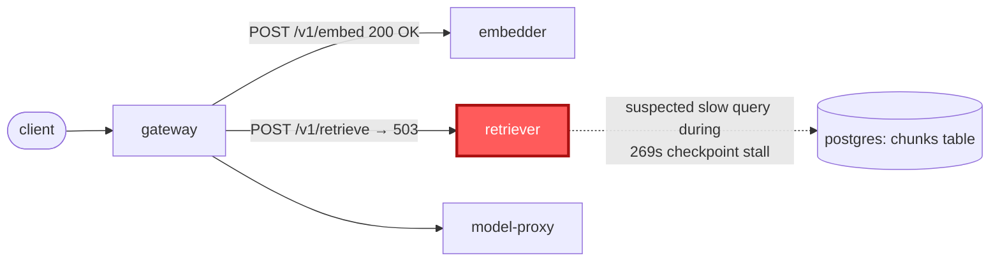

# Postmortem: gateway availability error budget burning slowly (10% of the 28d budget in 6h; 30m & 6h windows)

- **Status:** open
- **Severity:** sev2
- **Verified:** no
- **Opened:** 2026-08-07 19:51:44Z
- **Resolved:** (still open)

## Timeline (machine-generated)

All times UTC on 2026-08-07 unless a full date is shown.

| Time (UTC) | Source | Event |
| --- | --- | --- |
| 19:38:43Z | k8s | ReplicaSet/retriever-7f6fb6574f: SuccessfulCreate |
| 19:38:43Z | k8s | Deployment/retriever: ScalingReplicaSet |
| 19:38:43Z | k8s | Pod/retriever-7f6fb6574f-nwxrh: Scheduled |
| 19:38:44Z | k8s | Pod/retriever-7f6fb6574f-nwxrh: Started |
| 19:38:44Z | k8s | Pod/retriever-7f6fb6574f-nwxrh: Pulled |
| 19:38:44Z | k8s | Pod/retriever-7f6fb6574f-nwxrh: Created |
| 19:38:52Z | k8s | Pod/retriever-dc7ddd494-jv9j7: Killing |
| 19:38:52Z | k8s | ReplicaSet/retriever-dc7ddd494: SuccessfulDelete |
| 19:38:52Z | k8s | Deployment/retriever: ScalingReplicaSet |
| 19:39:48Z | k8s | ReplicaSet/retriever-d6d55bf7f: SuccessfulCreate |
| 19:39:48Z | k8s | Deployment/retriever: ScalingReplicaSet |
| 19:39:48Z | k8s | Pod/retriever-d6d55bf7f-vkz8l: Scheduled |
| 19:39:49Z | k8s | Pod/retriever-d6d55bf7f-vkz8l: Started |
| 19:39:49Z | k8s | Pod/retriever-d6d55bf7f-vkz8l: Pulled |
| 19:39:49Z | k8s | Pod/retriever-d6d55bf7f-vkz8l: Created |
| 19:39:55Z | k8s | Pod/retriever-7f6fb6574f-nwxrh: Killing |
| 19:39:55Z | k8s | ReplicaSet/retriever-7f6fb6574f: SuccessfulDelete |
| 19:39:55Z | k8s | Deployment/retriever: ScalingReplicaSet |
| 19:42:09Z | k8s | ReplicaSet/retriever-d6d55bf7f: SuccessfulCreate |
| 19:42:09Z | k8s | Deployment/retriever: ScalingReplicaSet |
| 19:42:10Z | k8s | Pod/retriever-d6d55bf7f-ztpbh: Pulling |
| 19:42:10Z | k8s | Pod/retriever-d6d55bf7f-ztpbh: Pulled |
| 19:42:10Z | k8s | Pod/retriever-d6d55bf7f-ztpbh: Created |
| 19:42:10Z | k8s | Pod/retriever-d6d55bf7f-4kr82: Started |
| 19:42:10Z | k8s | Pod/retriever-d6d55bf7f-4kr82: Pulled |
| 19:42:10Z | k8s | Pod/retriever-d6d55bf7f-4kr82: Created |
| 19:42:10Z | k8s | ReplicaSet/retriever-d6d55bf7f: SuccessfulCreate |
| 19:42:10Z | k8s | Pod/retriever-d6d55bf7f-ztpbh: Scheduled |
| 19:42:10Z | k8s | Pod/retriever-d6d55bf7f-4kr82: Scheduled |
| 19:42:11Z | deploy:annotation | deploy retriever via gitops c025382 (argo sync) |
| 19:42:11Z | deploy:argo | retriever synced to c025382ba170 |
| 19:42:11Z | k8s | Pod/retriever-d6d55bf7f-ztpbh: Started |
| 19:42:11Z | k8s | Pod/retriever-d6d55bf7f-ztpbh: Killing |
| 19:42:11Z | k8s | Pod/retriever-d6d55bf7f-4kr82: Killing |
| 19:42:11Z | k8s | ReplicaSet/retriever-d6d55bf7f: SuccessfulDelete |
| 19:42:11Z | k8s | Deployment/retriever: ScalingReplicaSet |
| 19:51:10Z | alert | alert firing: SLO gateway availability — slow burn |
| 20:01:25Z | remediation | scale_deployment retriever executed (run run_19fddc811b41d4) |
| 20:01:26Z | k8s | ReplicaSet/retriever-d6d55bf7f: SuccessfulCreate |
| 20:01:26Z | k8s | Deployment/retriever: ScalingReplicaSet |
| 20:01:26Z | k8s | Pod/retriever-d6d55bf7f-b9dqs: Scheduled |
| 20:01:27Z | k8s | Pod/retriever-d6d55bf7f-b9dqs: Started |
| 20:01:27Z | k8s | Pod/retriever-d6d55bf7f-b9dqs: Pulled |
| 20:01:27Z | k8s | Pod/retriever-d6d55bf7f-b9dqs: Created |

## Evidence links

- [Loki — logs over the incident window](http://localhost:3001/explore?schemaVersion=1&panes=%7B%22pm%22%3A+%7B%22datasource%22%3A+%22loki%22%2C+%22queries%22%3A+%5B%7B%22refId%22%3A+%22A%22%2C+%22datasource%22%3A+%7B%22type%22%3A+%22loki%22%2C+%22uid%22%3A+%22loki%22%7D%2C+%22expr%22%3A+%22%7Bnamespace%3D%5C%22subject%5C%22%7D+%7C~+%5C%22%28%3Fi%29error%7Cfailed%5C%22%22%7D%5D%2C+%22range%22%3A+%7B%22from%22%3A+%221786132304304%22%2C+%22to%22%3A+%221786132988854%22%7D%7D%7D&orgId=1)
- [Mimir — metrics over the incident window](http://localhost:3001/explore?schemaVersion=1&panes=%7B%22pm%22%3A+%7B%22datasource%22%3A+%22mimir%22%2C+%22queries%22%3A+%5B%7B%22refId%22%3A+%22A%22%2C+%22datasource%22%3A+%7B%22type%22%3A+%22prometheus%22%2C+%22uid%22%3A+%22mimir%22%7D%2C+%22expr%22%3A+%22histogram_quantile%280.95%2C+sum%28rate%28http_server_duration_milliseconds_bucket%5B5m%5D%29%29+by+%28le%29%29%22%7D%5D%2C+%22range%22%3A+%7B%22from%22%3A+%221786132304304%22%2C+%22to%22%3A+%221786132988854%22%7D%7D%7D&orgId=1)

## Investigation context

**Runbook match:** none — no tool narrowing applied for this alert. Available runbooks: README.md, canary-abort.md, ci-pipeline-red.md, dq-freshness-stall.md, gateway-high-error-rate.md, k8s-crashloop.md, k8s-node-failure.md, snapshot-agent-audit.md, stale-secret.md

Pre-check battery (as injected at run start)

## Pre-check leads

### recent_deploys — LEAD
1 deploy-window lead
- deploy annotation at 2026-08-07T19:42:11.522000+00:00: deploy retriever via gitops c025382 (argo sync)

### attribution — LEAD
 over the last 10m — which is not necessarily the workload named on the alert:
- retriever reported no server-side requests at all — a workload that is down or unscheduled emits nothing, and its CALLERS carry its errors

### rollout_state — LEAD
1 rollout-state lead
- analysisrun for gateway (gateway-8444846b5f-21-1): Failed — Metric "canary-error-rate" assessed Failed due to failed (2) > failureLimit (1)

### kube_scan — OK
all pods Ready, no notable cluster events

### log_spike — OK
error/failed log rate normal: 0/10min vs baseline 0/10min

### secret_age — OK
Secret subject-db-credentials last modified 13d 20h ago (created 13d 20h ago).

## Narrative

## Summary

Gateway's availability SLO ("slow burn", sev2) fired because the `retriever` service began rejecting every RAG lookup with `HTTP 503` for roughly 14 minutes. Every `/v1/chat` request that needed a retrieval hit the failure, so the gateway itself surfaced as `502` even though the gateway process was never at fault — it was faithfully reporting a downstream failure.

## Impact

Any `/v1/chat` call requiring retrieval failed end-to-end during the burst. 5-minute error ratio peaked at **30.6%**; by alert time the 30-minute window had accumulated **22.5%** and the 6-hour window **13.2%**, tripping the multi-window burn-rate rule (~10% of the 28-day error budget consumed in 6h).

## Root cause

**Component: `retriever`** (confirmed via the deepest errored span in the failing trace: `rag.retrieve` → `POST retriever:8082/v1/retrieve` → `exception.type=upstream_error`, `exception.message="retriever returned 503"`, propagating up as the gateway's own `502`).

The retriever's single running pod (`retriever-dc7ddd494-jv9j7`) began returning `503` on its own handler while every infra signal stayed green: 0 restarts, CPU/memory nowhere near limits (peaked ~144Mi against a 512Mi limit), no OOM/CrashLoop/probe-failure k8s events, and `kube_deployment_status_replicas_available` never dropped below 1. This rules out the two obvious suspects (OOMKill and a bad new rollout) — the earlier `analysisrun gateway-8444846b5f-21-1 Failed` lead was three days stale (Aug 4) and unrelated to today's burn; it is a red herring, not the cause.

The one correlating anomaly in the telemetry: Postgres logged a checkpoint write phase of **269s** (vs. the surrounding ~80s baseline) spanning almost exactly the error window, consistent with an I/O stall that could make chunk-retrieval queries slow enough for retriever's own handler to shed load as `503`. This is circumstantial, not proven by a captured slow-query log — recorded here as the strongest lead for a follow-up runbook rather than an asserted certainty.

Independently, `retriever` was mid-redeploy to gitops revision `c025382ba170` during the tail of this window (pod churn from 19:38–19:42 UTC), which is coincidental timing with, not the trigger for, the burst — the 503s were already climbing several minutes before any retriever pod event occurred.

By ~19:45 UTC the 5-minute error ratio returned to 0 and has held there since, coincident with the checkpoint completing and the gitops-driven pod replacement.

## What fixed it

The fault had already self-cleared at the request level before this response began (`slo:gateway_availability:error_ratio5m` confirmed flat at 0 across repeated checks). No downstream was "wedged" to restart, and the runbook explicitly warns against restarting a healthy service just to feel like something was done — that only destroys evidence.

What this response *did* change: `retriever` ran as a **single replica**, so one misbehaving pod took out 100% of RAG traffic with no redundancy to absorb it. Scaled `retriever` 1 → 2 replicas (dry-run diff `spec.replicas: 1 -> 2`, approved, executed) so a repeat of this failure mode degrades partially instead of totally. Both retriever pods are now `1/1 Ready`.

The gateway-side alert (`SLO gateway availability — slow burn`) remains **active** as of this report. That is expected, not a failed remediation: it is a multi-window burn-rate alert over 30m/6h lookbacks, and those windows still contain the 19:31–19:45 burst by construction — they will not clear until wall-clock time carries the burst out of the lookback (30m window around 20:15 UTC; the 6h window for longer). The request-level signal it's built on is already at 0.

## Lessons

- No runbook matched this alertname; `gateway-high-error-rate.md` covered the diagnosis path well (dependency-edge attribution, deepest-span tracing) and its mitigation guidance ("don't restart a service just to clear evidence that already cleared itself") was directly load-bearing here. Consider adding this alertname as an explicit trigger alias on that runbook.
- Single-replica critical-path dependencies (retriever) turn a partial degradation into a total outage for any feature that depends on them. Now running at 2 replicas.
- The Postgres checkpoint-duration spike deserves its own signal/alert (checkpoint write time vs. baseline) — right now it's only visible by manually diffing log lines, which is how it nearly got missed here.
- Pre-check leads are a shortcut, not an answer: the stale 3-day-old failed-canary lead pointed at the wrong deploy entirely, and the "no server-side requests" retriever lead was true only for part of the window — both needed direct trace/metric verification before trusting them.

