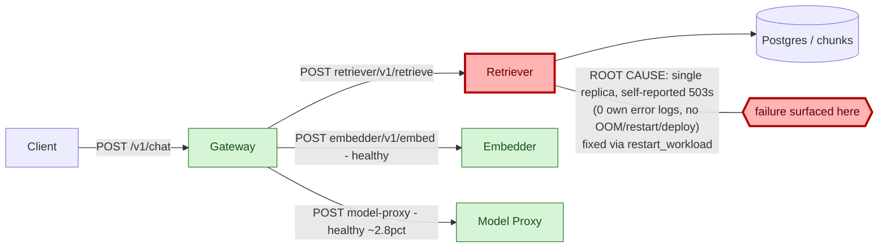

# Postmortem: gateway availability error budget burning fast (2% of the 28d budget in 1h; 5m & 1h windows)

- **Status:** open
- **Severity:** sev1
- **Verified:** no
- **Opened:** 2026-08-07 19:36:42Z
- **Resolved:** (still open)

## Timeline (machine-generated)

All times UTC on 2026-08-07 unless a full date is shown.

| Time (UTC) | Source | Event |
| --- | --- | --- |
| 19:33:50Z | log-spike | log-spike onset: [gateway] unhandled error: 16 \| } |
| 19:36:10Z | alert | alert firing: SLO gateway availability — fast burn |
| 19:38:43Z | k8s | ReplicaSet/retriever-7f6fb6574f: SuccessfulCreate |
| 19:38:43Z | k8s | Deployment/retriever: ScalingReplicaSet |
| 19:38:43Z | k8s | Pod/retriever-7f6fb6574f-nwxrh: Scheduled |
| 19:38:44Z | k8s | Pod/retriever-7f6fb6574f-nwxrh: Started |
| 19:38:44Z | k8s | Pod/retriever-7f6fb6574f-nwxrh: Pulled |
| 19:38:44Z | k8s | Pod/retriever-7f6fb6574f-nwxrh: Created |
| 19:38:52Z | k8s | Pod/retriever-dc7ddd494-jv9j7: Killing |
| 19:38:52Z | k8s | ReplicaSet/retriever-dc7ddd494: SuccessfulDelete |
| 19:38:52Z | k8s | Deployment/retriever: ScalingReplicaSet |
| 19:39:48Z | k8s | ReplicaSet/retriever-d6d55bf7f: SuccessfulCreate |
| 19:39:48Z | k8s | Deployment/retriever: ScalingReplicaSet |
| 19:39:48Z | k8s | Pod/retriever-d6d55bf7f-vkz8l: Scheduled |
| 19:39:48Z | remediation | restart_workload retriever executed (run run_19fddba509e51) |
| 19:39:49Z | k8s | Pod/retriever-d6d55bf7f-vkz8l: Started |
| 19:39:49Z | k8s | Pod/retriever-d6d55bf7f-vkz8l: Pulled |
| 19:39:49Z | k8s | Pod/retriever-d6d55bf7f-vkz8l: Created |
| 19:39:55Z | k8s | Pod/retriever-7f6fb6574f-nwxrh: Killing |
| 19:39:55Z | k8s | ReplicaSet/retriever-7f6fb6574f: SuccessfulDelete |
| 19:39:55Z | k8s | Deployment/retriever: ScalingReplicaSet |
| 19:42:09Z | k8s | ReplicaSet/retriever-d6d55bf7f: SuccessfulCreate |
| 19:42:09Z | k8s | Deployment/retriever: ScalingReplicaSet |
| 19:42:10Z | k8s | Pod/retriever-d6d55bf7f-ztpbh: Pulling |
| 19:42:10Z | k8s | Pod/retriever-d6d55bf7f-ztpbh: Pulled |
| 19:42:10Z | k8s | Pod/retriever-d6d55bf7f-ztpbh: Created |
| 19:42:10Z | k8s | Pod/retriever-d6d55bf7f-4kr82: Started |
| 19:42:10Z | k8s | Pod/retriever-d6d55bf7f-4kr82: Pulled |
| 19:42:10Z | k8s | Pod/retriever-d6d55bf7f-4kr82: Created |
| 19:42:10Z | k8s | ReplicaSet/retriever-d6d55bf7f: SuccessfulCreate |
| 19:42:10Z | k8s | Pod/retriever-d6d55bf7f-ztpbh: Scheduled |
| 19:42:10Z | k8s | Pod/retriever-d6d55bf7f-4kr82: Scheduled |
| 19:42:11Z | deploy:annotation | deploy retriever via gitops c025382 (argo sync) |
| 19:42:11Z | deploy:argo | retriever synced to c025382ba170 |
| 19:42:11Z | k8s | Pod/retriever-d6d55bf7f-ztpbh: Started |
| 19:42:11Z | k8s | Pod/retriever-d6d55bf7f-ztpbh: Killing |
| 19:42:11Z | k8s | Pod/retriever-d6d55bf7f-4kr82: Killing |
| 19:42:11Z | k8s | ReplicaSet/retriever-d6d55bf7f: SuccessfulDelete |
| 19:42:11Z | k8s | Deployment/retriever: ScalingReplicaSet |

## Evidence links

- [Loki — logs over the incident window](http://localhost:3001/explore?schemaVersion=1&panes=%7B%22pm%22%3A+%7B%22datasource%22%3A+%22loki%22%2C+%22queries%22%3A+%5B%7B%22refId%22%3A+%22A%22%2C+%22datasource%22%3A+%7B%22type%22%3A+%22loki%22%2C+%22uid%22%3A+%22loki%22%7D%2C+%22expr%22%3A+%22%7Bnamespace%3D%5C%22subject%5C%22%7D+%7C~+%5C%22%28%3Fi%29error%7Cfailed%5C%22%22%7D%5D%2C+%22range%22%3A+%7B%22from%22%3A+%221786131402900%22%2C+%22to%22%3A+%221786131757449%22%7D%7D%7D&orgId=1)
- [Mimir — metrics over the incident window](http://localhost:3001/explore?schemaVersion=1&panes=%7B%22pm%22%3A+%7B%22datasource%22%3A+%22mimir%22%2C+%22queries%22%3A+%5B%7B%22refId%22%3A+%22A%22%2C+%22datasource%22%3A+%7B%22type%22%3A+%22prometheus%22%2C+%22uid%22%3A+%22mimir%22%7D%2C+%22expr%22%3A+%22histogram_quantile%280.95%2C+sum%28rate%28http_server_duration_milliseconds_bucket%5B5m%5D%29%29+by+%28le%29%29%22%7D%5D%2C+%22range%22%3A+%7B%22from%22%3A+%221786131402900%22%2C+%22to%22%3A+%221786131757449%22%7D%7D%7D&orgId=1)

## Investigation context

**Runbook match (2):** `gateway-high-error-rate.md`, `stale-secret.md` — toolset narrowed to 13 tools: alert_status, deploy_history, kubectl_read, loki_query, mimir_query, publish_postmortem, request_approval, restart_workload, runbook_lookup, runbook_read, save_artifact, tempo_query, update_db_secret

Pre-check battery (as injected at run start)

## Pre-check leads

### recent_deploys — LEAD
No deploy in the last 60m — rule out the reflex answer.
- No deploy in the last 60m — rule out the reflex answer.

### log_spike — LEAD
error/failed log rate 200/10min vs baseline 0/10min (200x baseline) — onset: [gateway] unhandled error: 16 |         } at 2026-08-07T19:33:50.942849+00:00
- error/failed log rate 200/10min vs baseline 0/10min (200x baseline) — onset: [gateway] unhandled error: 16 |         } at 2026-08-07T19:33:50.942849+00:00

### attribution — LEAD
errors concentrate on gateway (25.0%); time concentrates in gateway's own handler (~3.8s of 5.7s) over the last 10m — which is not necessarily the workload named on the alert:
- gateway: 25.0% of its OWN responses are 5xx (10m)
- retriever: 22.0% of its OWN responses are 5xx (10m)
- model-proxy: 2.9% of its OWN responses are 5xx (10m)
- gateway → POST retriever: 23.2% of those outbound calls failed
- gateway → POST model-proxy: 12.5% of those outbound calls failed
- own-handler p95 (server p95 minus its slowest outbound call — a ranking, not a measurement): gateway ~3.8s of 5.7s end to end, embedder ~2.0s of 2.0s end to end, retriever ~1.9s of 1.9s end to end
- gateway → POST embedder: p95 2.0s outbound
- gateway → POST retriever: p95 1.9s outbound

### rollout_state — LEAD
1 rollout-state lead
- analysisrun for gateway (gateway-8444846b5f-21-1): Failed — Metric "canary-error-rate" assessed Failed due to failed (2) > failureLimit (1)

### kube_scan — OK
all pods Ready, no notable cluster events

### secret_age — OK
Secret subject-db-credentials last modified 13d 20h ago (created 13d 20h ago).

## Narrative

## Summary
The `SLO gateway availability — fast burn` (sev1) alert fired because the gateway's own 5xx rate spiked to ~30%. Per the matched `gateway-high-error-rate.md` runbook, the gateway was attributed before being blamed: its errors were not from its own handlers but from a single downstream dependency, **retriever**, failing on a fraction of requests.

## Impact
For the duration of the spike, roughly a fifth to a third of `POST /v1/chat` requests across tenants (acme, bravo, abuser all seen in traces/logs) returned HTTP 502 from the gateway, driven by `retriever returned 503` upstream errors surfaced in `rag.retrieve` spans (`UpstreamError` at `retriever-http.ts:14`). model-proxy stayed near its ~2.8% baseline throughout and was not implicated.

## Root cause
Attribution (by-service and by-dependency-edge PromQL from the runbook) showed:
- gateway's own 5xx rate tracked almost exactly its outbound `POST retriever` client-span error rate (~21–30% of those calls failing), while its `POST model-proxy` and `POST embedder` edges stayed healthy.
- retriever's own server-side metrics (`request_duration_seconds_count{service="retriever"}`) showed the same 503 spike from its own handler — this is a self-inflicted failure on the retriever service, not a further-downstream one.
- retriever runs as a **single replica** (`retriever-dc7ddd494-jv9j7`), unlike gateway/model-proxy which run 4. It emitted **zero** application log lines (success or failure) for the entire window despite serving ~15-20 req/s — it only speaks via OTel metrics/traces, so the 503s were diagnosed purely from traces and metrics.
- Ruled out the two runbook-supplied alternate hypotheses: `deploy_history` showed no new revision for retriever (or gateway/model-proxy) in the incident window — only steady-state "current healthy state" rollout entries — so this was not a bad deploy; and the `subject-db-credentials` secret was last rotated 13d20h before the alert (far outside the window), so the stale-secret runbook's signature did not match and was not pursued.
- Pod describe showed `Restart Count: 0`, no OOMKilled condition, and memory well under its 512Mi limit, so this was not a crash-loop or an OOM — it presents as a single-instance retriever shedding load (503s, not 500s) under a burst it couldn't otherwise absorb, with no headroom from a second replica to fall back on.

## What fixed it
Dry-ran and (after operator approval) executed `restart_workload` on `retriever` — the only downstream-affecting remediation tool available in this incident's narrowed toolset (no `scale_deployment`/`patch_memory_limit` grant here). The rolling restart replaced the single retriever pod; the new instance's own 503 rate dropped to 0% immediately, and gateway's 5xx rate decayed back toward its pre-incident baseline as the trailing rate-window rolled forward. `alert_status` had **not** yet flipped to resolved as of the last check in this session — the fast-burn rule also integrates a 1h window, which takes longer to fully digest the incident's error budget consumption than the 5m instantaneous rate does; that is reported here explicitly rather than assumed.

## Lessons
- Retriever is a structural single point of failure on the RAG path with no replica redundancy, unlike its peers — it should get the same replica count / HPA treatment as gateway and model-proxy so one bad burst doesn't threaten the whole chat path.
- Retriever produces no application-level logs on any path (success or failure), which meant this incident had to be diagnosed entirely from trace exceptions and span metrics — worth adding basic structured error logging there to shorten future MTTR.
- Follow-up: confirm whether the 503s were a deliberate overload-shedding/circuit-breaker response (working as designed, just under-provisioned) or a resource ceiling invisible to the read-only tooling used here (no container-throttling metric was queried this incident) — either way the fix is the same (more capacity), but it changes whether "restart" or "scale" is the durable answer.

