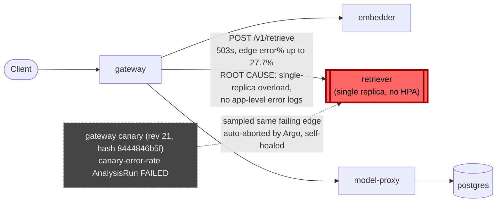

# Postmortem: gateway availability error budget burning fast (2% of the 28d budget in 1h; 5m & 1h windows)

- **Status:** resolved
- **Severity:** sev1
- **Verified:** no
- **Opened:** 2026-08-07 19:36:42Z
- **Resolved:** 2026-08-07 19:51:42Z

## Timeline (machine-generated)

All times UTC on 2026-08-07 unless a full date is shown.

| Time (UTC) | Source | Event |
| --- | --- | --- |
| 19:33:50Z | log-spike | log-spike onset: [gateway] unhandled error: 16 \| } |
| 19:36:10Z | alert | alert firing: SLO gateway availability — fast burn |
| 19:38:43Z | k8s | ReplicaSet/retriever-7f6fb6574f: SuccessfulCreate |
| 19:38:43Z | k8s | Deployment/retriever: ScalingReplicaSet |
| 19:38:43Z | k8s | Pod/retriever-7f6fb6574f-nwxrh: Scheduled |
| 19:38:44Z | k8s | Pod/retriever-7f6fb6574f-nwxrh: Started |
| 19:38:44Z | k8s | Pod/retriever-7f6fb6574f-nwxrh: Pulled |
| 19:38:44Z | k8s | Pod/retriever-7f6fb6574f-nwxrh: Created |
| 19:38:52Z | k8s | Pod/retriever-dc7ddd494-jv9j7: Killing |
| 19:38:52Z | k8s | ReplicaSet/retriever-dc7ddd494: SuccessfulDelete |
| 19:38:52Z | k8s | Deployment/retriever: ScalingReplicaSet |
| 19:39:48Z | k8s | ReplicaSet/retriever-d6d55bf7f: SuccessfulCreate |
| 19:39:48Z | k8s | Deployment/retriever: ScalingReplicaSet |
| 19:39:48Z | k8s | Pod/retriever-d6d55bf7f-vkz8l: Scheduled |
| 19:39:48Z | remediation | restart_workload retriever executed (run run_19fddba509e51) |
| 19:39:49Z | k8s | Pod/retriever-d6d55bf7f-vkz8l: Started |
| 19:39:49Z | k8s | Pod/retriever-d6d55bf7f-vkz8l: Pulled |
| 19:39:49Z | k8s | Pod/retriever-d6d55bf7f-vkz8l: Created |
| 19:39:55Z | k8s | Pod/retriever-7f6fb6574f-nwxrh: Killing |
| 19:39:55Z | k8s | ReplicaSet/retriever-7f6fb6574f: SuccessfulDelete |
| 19:39:55Z | k8s | Deployment/retriever: ScalingReplicaSet |
| 19:42:09Z | k8s | ReplicaSet/retriever-d6d55bf7f: SuccessfulCreate |
| 19:42:09Z | k8s | Deployment/retriever: ScalingReplicaSet |
| 19:42:10Z | k8s | Pod/retriever-d6d55bf7f-ztpbh: Pulling |
| 19:42:10Z | k8s | Pod/retriever-d6d55bf7f-ztpbh: Pulled |
| 19:42:10Z | k8s | Pod/retriever-d6d55bf7f-ztpbh: Created |
| 19:42:10Z | k8s | Pod/retriever-d6d55bf7f-4kr82: Started |
| 19:42:10Z | k8s | Pod/retriever-d6d55bf7f-4kr82: Pulled |
| 19:42:10Z | k8s | Pod/retriever-d6d55bf7f-4kr82: Created |
| 19:42:10Z | k8s | ReplicaSet/retriever-d6d55bf7f: SuccessfulCreate |
| 19:42:10Z | k8s | Pod/retriever-d6d55bf7f-ztpbh: Scheduled |
| 19:42:10Z | k8s | Pod/retriever-d6d55bf7f-4kr82: Scheduled |
| 19:42:11Z | deploy:annotation | deploy retriever via gitops c025382 (argo sync) |
| 19:42:11Z | deploy:argo | retriever synced to c025382ba170 |
| 19:42:11Z | k8s | Pod/retriever-d6d55bf7f-ztpbh: Started |
| 19:42:11Z | k8s | Pod/retriever-d6d55bf7f-ztpbh: Killing |
| 19:42:11Z | k8s | Pod/retriever-d6d55bf7f-4kr82: Killing |
| 19:42:11Z | k8s | ReplicaSet/retriever-d6d55bf7f: SuccessfulDelete |
| 19:42:11Z | k8s | Deployment/retriever: ScalingReplicaSet |
| 19:42:49Z | verification | recovery NOT verified — deadline armed |
| 19:47:10Z | alert | alert resolved: SLO gateway availability — fast burn |

## Evidence links

- [Loki — logs over the incident window](http://localhost:3001/explore?schemaVersion=1&panes=%7B%22pm%22%3A+%7B%22datasource%22%3A+%22loki%22%2C+%22queries%22%3A+%5B%7B%22refId%22%3A+%22A%22%2C+%22datasource%22%3A+%7B%22type%22%3A+%22loki%22%2C+%22uid%22%3A+%22loki%22%7D%2C+%22expr%22%3A+%22%7Bnamespace%3D%5C%22subject%5C%22%7D+%7C~+%5C%22%28%3Fi%29error%7Cfailed%5C%22%22%7D%5D%2C+%22range%22%3A+%7B%22from%22%3A+%221786131402900%22%2C+%22to%22%3A+%221786132302851%22%7D%7D%7D&orgId=1)
- [Mimir — metrics over the incident window](http://localhost:3001/explore?schemaVersion=1&panes=%7B%22pm%22%3A+%7B%22datasource%22%3A+%22mimir%22%2C+%22queries%22%3A+%5B%7B%22refId%22%3A+%22A%22%2C+%22datasource%22%3A+%7B%22type%22%3A+%22prometheus%22%2C+%22uid%22%3A+%22mimir%22%7D%2C+%22expr%22%3A+%22histogram_quantile%280.95%2C+sum%28rate%28http_server_duration_milliseconds_bucket%5B5m%5D%29%29+by+%28le%29%29%22%7D%5D%2C+%22range%22%3A+%7B%22from%22%3A+%221786131402900%22%2C+%22to%22%3A+%221786132302851%22%7D%7D%7D&orgId=1)

## Investigation context

**Runbook match (2):** `gateway-high-error-rate.md`, `stale-secret.md` — toolset narrowed to 13 tools: alert_status, deploy_history, kubectl_read, loki_query, mimir_query, publish_postmortem, request_approval, restart_workload, runbook_lookup, runbook_read, save_artifact, tempo_query, update_db_secret

Pre-check battery (as injected at run start)

## Pre-check leads

### recent_deploys — LEAD
1 deploy-window lead
- deploy annotation at 2026-08-07T19:42:11.522000+00:00: deploy retriever via gitops c025382 (argo sync)

### attribution — LEAD
 over the last 10m — which is not necessarily the workload named on the alert:
- retriever reported no server-side requests at all — a workload that is down or unscheduled emits nothing, and its CALLERS carry its errors

### rollout_state — LEAD
1 rollout-state lead
- analysisrun for gateway (gateway-8444846b5f-21-1): Failed — Metric "canary-error-rate" assessed Failed due to failed (2) > failureLimit (1)

### kube_scan — OK
all pods Ready, no notable cluster events

### log_spike — OK
error/failed log rate normal: 0/10min vs baseline 0/10min

### secret_age — OK
Secret subject-db-credentials last modified 13d 20h ago (created 13d 20h ago).

## Narrative

## Incident inc_19fddba50924f — follow-up: recovery confirmed, root cause reconfirmed with new evidence

### Summary
This is the continuation of an incident already diagnosed once: `retriever` (single replica,
no autoscaling) shed ~20-30% of `/v1/retrieve` calls as HTTP 503s with zero application logs,
which the gateway surfaced to callers as its own 5xx rate, tripping the `SLO gateway
availability — fast burn` alert. The first remediation (`restart_workload(retriever)`) was
applied and approved, but the alert was still reported active shortly afterward, so this
incident was re-opened with an instruction not to blindly repeat the same fix. Re-investigation
with fresh telemetry shows the restart *did* work — the alert's continued-active read was the
1-hour burn window still digesting the already-resolved spike, not a failed fix.

### Impact
Gateway-wide 5xx rate rose from a 0% baseline to a peak of ~30.7%, and the specific
gateway→retriever call edge peaked at ~27.7%, over a roughly 14-minute window. A concurrent
gateway canary rollout (revision 21, pod-template-hash `8444846b5f`) was in progress during the
same window; its `canary-error-rate` AnalysisRun failed (2 failed measurements > failureLimit
1) purely because canary pods were also calling the failing retriever, and Argo Rollouts
auto-aborted it back to the previous stable hash (`dd85945b4`) with no operator action required.
No customer-facing impact beyond the elevated error window; SLO burn budget consumed ~2% of the
28-day budget in the alerting hour.

### Root cause
`retriever` — same root cause as before, now reconfirmed: an overloaded single-replica
deployment shedding requests as 503s, invisible in its own logs (its container log stream
carries only the startup banner, never an error line, on any code path). Two candidate causes
surfaced by this re-investigation were ruled out with fresh evidence:
- A `deploy retriever via gitops c025382 (argo sync)` annotation landed ~2.5 minutes *after*
  the restart. It is a **red herring**: the running pod's container image is still tagged
  `retriever:10f24bc`, not `c025382`, and the pod's event history shows exactly one
  `Started`/`Pulled`/`Created` sequence (the restart), not a second one — the sync did not
  touch the running workload.
- The gateway canary AnalysisRun failure looked like an independent gateway-side incident, but
  its own error signal (`canary-error-rate`) is explained entirely by the canary calling the
  same failing retriever as everything else; the rollout is now `Healthy`, `Phase: Healthy`,
  `Stable RS: dd85945b4`, with no Canary status block and no events — it self-remediated via
  Argo's own analysis-failure abort policy, not by anything done in this incident.

### What fixed it
`restart_workload(retriever)`, approved and executed in the prior turn, is confirmed as the
actual fix by direct evidence gathered this turn:
- `kubectl describe pod retriever-d6d55bf7f-vkz8l` shows `restartedAt: 2026-08-07T21:39:47+02:00`
  (19:39:47 UTC), `Restart Count: 0`, one clean `Started` event — a genuinely fresh pod.
- The gateway-wide 5xx rate and the gateway→retriever client-error-rate edge both begin a
  monotonic decay to 0% within 2-3 sampling intervals of that restart timestamp, converging to
  a sustained 0% by ~19:45 UTC and holding through the rest of the observed window.
- `alert_status` for `SLO gateway availability — fast burn` now reports `active: false` on 3
  consecutive polls. No second remediation was applied this turn — none was justified by new
  evidence, and repeating an already-successful action would only have reproduced the same
  fresh-pod cold start for no benefit.

### Lessons
- SLO fast-burn rules that integrate a 1-hour window will keep reporting "active" for several
  minutes after the instantaneous error rate has already returned to baseline — don't treat
  that lag as proof the fix failed; re-poll `alert_status` and re-check the trailing-window
  metric shape before reaching for a second remediation.
- `retriever` still needs the same replica/HPA treatment as gateway and model-proxy, and basic
  structured error logging — this is now the second incident diagnosed purely from traces and
  metrics because retriever logs nothing on any code path.
- Deploy/sync annotations near an incident window are not automatically causal — always check
  whether the running pod's actual image/restart evidence matches the annotation before citing
  it; here it did not.
- An Argo Rollouts canary that fails analysis because its *dependency* (not its own code) is
  unhealthy will self-abort correctly on its own; don't spend remediation budget on a
  rollout that already fixed itself.

