# Postmortem: gateway latency error budget burning fast (2% of the 28d budget in 1h; 5m & 1h windows)

- **Status:** open
- **Severity:** sev1
- **Verified:** no
- **Opened:** 2026-08-12 18:57:45Z
- **Resolved:** (still open)

## Timeline (machine-generated)

All times UTC on 2026-08-12 unless a full date is shown.

| Time (UTC) | Source | Event |
| --- | --- | --- |
| 18:54:41Z | log-spike | log-spike onset: error: Malformed JSON in request body |
| 18:57:10Z | alert | alert firing: SLO gateway latency — fast burn |
| 19:01:21Z | k8s | Pod/retriever-7b8cbbdbf5-pkjmd: BackOff |
| 19:01:21Z | k8s | Pod/retriever-7b8cbbdbf5-6ptpg: Started |
| 19:01:21Z | k8s | Pod/retriever-7b8cbbdbf5-6ptpg: Pulled |
| 19:01:21Z | k8s | Pod/retriever-7b8cbbdbf5-6ptpg: Created |
| 19:01:21Z | k8s | Pod/model-proxy-77457658bc-5q9ts: Started |
| 19:01:21Z | k8s | Pod/model-proxy-77457658bc-5q9ts: Pulled |
| 19:01:21Z | k8s | Pod/model-proxy-77457658bc-5q9ts: Created |
| 19:01:23Z | k8s | Pod/retriever-7b8cbbdbf5-pkjmd: BackOff |
| 19:01:23Z | k8s | Pod/retriever-7b8cbbdbf5-6ptpg: BackOff |
| 19:01:24Z | k8s | Pod/retriever-7b8cbbdbf5-6ptpg: BackOff |
| 19:01:28Z | k8s | Rollout/model-proxy: RolloutStepCompleted |
| 19:01:30Z | k8s | Rollout/model-proxy: AnalysisRunRunning |
| 19:01:33Z | k8s | Pod/retriever-7b8cbbdbf5-6ptpg: BackOff |
| 19:01:44Z | k8s | Pod/retriever-7b8cbbdbf5-pkjmd: Started |
| 19:01:44Z | k8s | Pod/retriever-7b8cbbdbf5-pkjmd: Pulled |
| 19:01:44Z | k8s | Pod/retriever-7b8cbbdbf5-pkjmd: Created |
| 19:01:45Z | k8s | Pod/retriever-7b8cbbdbf5-pkjmd: BackOff |
| 19:01:46Z | k8s | Pod/retriever-7b8cbbdbf5-pkjmd: BackOff |
| 19:01:46Z | k8s | Pod/retriever-7b8cbbdbf5-6ptpg: Started |
| 19:01:46Z | k8s | Pod/retriever-7b8cbbdbf5-6ptpg: Pulled |
| 19:01:46Z | k8s | Pod/retriever-7b8cbbdbf5-6ptpg: Created |
| 19:01:48Z | k8s | Pod/retriever-7b8cbbdbf5-6ptpg: BackOff |
| 19:01:53Z | k8s | Pod/retriever-7b8cbbdbf5-pkjmd: BackOff |
| 19:01:53Z | k8s | Pod/retriever-7b8cbbdbf5-6ptpg: BackOff |
| 19:02:07Z | remediation | scale_deployment gateway executed (run run_19ff7567328d9) |
| 19:02:08Z | k8s | ReplicaSet/gateway-8fd65cbf: SuccessfulCreate |
| 19:02:08Z | k8s | Deployment/gateway: ScalingReplicaSet |
| 19:02:08Z | k8s | Pod/gateway-8fd65cbf-x6qqb: Scheduled |
| 19:02:09Z | k8s | Pod/gateway-8fd65cbf-x6qqb: Started |
| 19:02:09Z | k8s | Pod/gateway-8fd65cbf-x6qqb: Pulled |
| 19:02:09Z | k8s | Pod/gateway-8fd65cbf-x6qqb: Created |
| 19:02:09Z | k8s | Pod/gateway-8fd65cbf-c6kl5: Pulled |
| 19:02:09Z | k8s | Pod/gateway-8fd65cbf-c6kl5: Created |
| 19:02:09Z | k8s | Pod/gateway-8fd65cbf-9nk88: Started |
| 19:02:09Z | k8s | Pod/gateway-8fd65cbf-9nk88: Pulled |
| 19:02:09Z | k8s | Pod/gateway-8fd65cbf-9nk88: Created |
| 19:02:09Z | k8s | ReplicaSet/gateway-8fd65cbf: SuccessfulCreate |
| 19:02:09Z | k8s | Pod/gateway-8fd65cbf-c6kl5: Scheduled |
| 19:02:09Z | k8s | Pod/gateway-8fd65cbf-kxqbn: FailedScheduling |
| 19:02:09Z | k8s | Pod/gateway-8fd65cbf-n7m2x: FailedScheduling |
| 19:02:09Z | k8s | Pod/gateway-8fd65cbf-9nk88: Scheduled |
| 19:02:09Z | k8s | Pod/gateway-8fd65cbf-ztnzx: FailedScheduling |
| 19:02:10Z | k8s | Pod/gateway-8fd65cbf-c6kl5: Started |
| 19:02:30Z | k8s | Pod/retriever-7b8cbbdbf5-pkjmd: Started |
| 19:02:30Z | k8s | Pod/retriever-7b8cbbdbf5-pkjmd: Pulled |
| 19:02:30Z | k8s | Pod/retriever-7b8cbbdbf5-pkjmd: Created |
| 19:02:32Z | k8s | Pod/retriever-7b8cbbdbf5-pkjmd: BackOff |
| 19:02:33Z | k8s | Pod/retriever-7b8cbbdbf5-pkjmd: BackOff |
| 19:02:34Z | k8s | Pod/retriever-7b8cbbdbf5-pkjmd: BackOff |
| 19:02:36Z | k8s | Pod/retriever-7b8cbbdbf5-6ptpg: Started |
| 19:02:36Z | k8s | Pod/retriever-7b8cbbdbf5-6ptpg: Pulled |
| 19:02:36Z | k8s | Pod/retriever-7b8cbbdbf5-6ptpg: Created |
| 19:02:37Z | k8s | Pod/retriever-7b8cbbdbf5-6ptpg: BackOff |
| 19:02:38Z | k8s | Pod/retriever-7b8cbbdbf5-6ptpg: BackOff |
| 19:02:43Z | k8s | Pod/retriever-7b8cbbdbf5-6ptpg: BackOff |
| 19:03:15Z | remediation | scale_deployment gateway executed (run run_19ff7567328d9) |
| 19:03:16Z | k8s | Pod/gateway-8fd65cbf-x6qqb: Killing |
| 19:03:16Z | k8s | Pod/gateway-8fd65cbf-c6kl5: Killing |
| 19:03:16Z | k8s | Pod/gateway-8fd65cbf-9nk88: Killing |
| 19:03:16Z | k8s | ReplicaSet/gateway-8fd65cbf: SuccessfulDelete |
| 19:03:16Z | k8s | Deployment/gateway: ScalingReplicaSet |
| 19:03:39Z | k8s | Pod/retriever-7b8cbbdbf5-pkjmd: BackOff |
| 19:03:54Z | k8s | Pod/retriever-7b8cbbdbf5-6ptpg: BackOff |
| 19:03:54Z | k8s | Pod/retriever-7b8cbbdbf5-pkjmd: Started |
| 19:03:54Z | k8s | Pod/retriever-7b8cbbdbf5-pkjmd: Pulled |
| 19:03:54Z | k8s | Pod/retriever-7b8cbbdbf5-pkjmd: Created |
| 19:03:56Z | k8s | Pod/retriever-7b8cbbdbf5-pkjmd: BackOff |
| 19:03:57Z | k8s | Pod/retriever-7b8cbbdbf5-pkjmd: BackOff |
| 19:03:59Z | k8s | Pod/retriever-7b8cbbdbf5-6ptpg: Started |
| 19:03:59Z | k8s | Pod/retriever-7b8cbbdbf5-6ptpg: Pulled |
| 19:03:59Z | k8s | Pod/retriever-7b8cbbdbf5-6ptpg: Created |
| 19:04:01Z | k8s | Pod/retriever-7b8cbbdbf5-6ptpg: BackOff |
| 19:04:02Z | k8s | Pod/retriever-7b8cbbdbf5-6ptpg: BackOff |
| 19:04:03Z | k8s | Pod/retriever-7b8cbbdbf5-pkjmd: BackOff |
| 19:04:03Z | k8s | Pod/retriever-7b8cbbdbf5-6ptpg: BackOff |
| 19:04:59Z | k8s | AnalysisRun/model-proxy-77457658bc-3-1: MetricSuccessful |
| 19:04:59Z | k8s | AnalysisRun/model-proxy-77457658bc-3-1: AnalysisRunSuccessful |
| 19:04:59Z | k8s | Rollout/model-proxy: RolloutStepCompleted |
| 19:04:59Z | k8s | Rollout/model-proxy: AnalysisRunSuccessful |
| 19:05:00Z | k8s | Pod/model-proxy-554d76745d-kpkdb: Killing |
| 19:05:00Z | k8s | ReplicaSet/model-proxy-554d76745d: SuccessfulDelete |
| 19:05:00Z | k8s | Rollout/model-proxy: ScalingReplicaSet |
| 19:05:01Z | k8s | ReplicaSet/model-proxy-77457658bc: SuccessfulCreate |
| 19:05:01Z | k8s | Rollout/model-proxy: ScalingReplicaSet |
| 19:05:01Z | k8s | Pod/model-proxy-77457658bc-c2jm7: Scheduled |
| 19:05:02Z | k8s | Pod/model-proxy-77457658bc-c2jm7: Started |
| 19:05:02Z | k8s | Pod/model-proxy-77457658bc-c2jm7: Pulled |
| 19:05:02Z | k8s | Pod/model-proxy-77457658bc-c2jm7: Created |
| 19:05:09Z | k8s | Pod/retriever-7b8cbbdbf5-6ptpg: BackOff |
| 19:05:09Z | k8s | Rollout/model-proxy: RolloutStepCompleted |
| 19:05:11Z | k8s | Rollout/model-proxy: AnalysisRunRunning |
| 19:05:16Z | k8s | Pod/retriever-7b8cbbdbf5-pkjmd: BackOff |

## Evidence links

- [Loki — logs over the incident window](http://localhost:3001/explore?schemaVersion=1&panes=%7B%22pm%22%3A+%7B%22datasource%22%3A+%22loki%22%2C+%22queries%22%3A+%5B%7B%22refId%22%3A+%22A%22%2C+%22datasource%22%3A+%7B%22type%22%3A+%22loki%22%2C+%22uid%22%3A+%22loki%22%7D%2C+%22expr%22%3A+%22%7Bnamespace%3D%5C%22subject%5C%22%7D+%7C~+%5C%22%28%3Fi%29error%7Cfailed%5C%22%22%7D%5D%2C+%22range%22%3A+%7B%22from%22%3A+%221786561065755%22%2C+%22to%22%3A+%221786561518920%22%7D%7D%7D&orgId=1)
- [Mimir — metrics over the incident window](http://localhost:3001/explore?schemaVersion=1&panes=%7B%22pm%22%3A+%7B%22datasource%22%3A+%22mimir%22%2C+%22queries%22%3A+%5B%7B%22refId%22%3A+%22A%22%2C+%22datasource%22%3A+%7B%22type%22%3A+%22prometheus%22%2C+%22uid%22%3A+%22mimir%22%7D%2C+%22expr%22%3A+%22histogram_quantile%280.95%2C+sum%28rate%28http_server_duration_milliseconds_bucket%5B5m%5D%29%29+by+%28le%29%29%22%7D%5D%2C+%22range%22%3A+%7B%22from%22%3A+%221786561065755%22%2C+%22to%22%3A+%221786561518920%22%7D%7D%7D&orgId=1)

## Investigation context

**Runbook match:** none — no tool narrowing applied for this alert. Available runbooks: README.md, canary-abort.md, ci-pipeline-red.md, dq-freshness-stall.md, gateway-high-error-rate.md, k8s-crashloop.md, k8s-node-failure.md, snapshot-agent-audit.md, stale-secret.md

Pre-check battery (as injected at run start)

## Pre-check leads

### recent_deploys — LEAD
2 deploy-window leads
- argo app platform: sync=OutOfSync health=Healthy (revision c025382ba170)
- argo app retriever: sync=OutOfSync health=Progressing (revision c025382ba170)

### kube_scan — LEAD
12 kube-scan leads
- pod retriever-78b9dd9fd6-5dr47: CrashLoopBackOff
- pod retriever-78b9dd9fd6-mwnwt: CrashLoopBackOff
- event Pod/retriever-78b9dd9fd6-5dr47: BackOff — Back-off restarting failed container retriever in pod retriever-78b9dd9fd6-5dr47_subject(14db5924-37eb-4d9d-b057-0df07044a050) (at 20:57:14)
- event Pod/retriever-78b9dd9fd6-5dr47: BackOff — Back-off restarting failed container retriever in pod retriever-78b9dd9fd6-5dr47_subject(14db5924-37eb-4d9d-b057-0df07044a050) (at 20:57:15)
- event Pod/retriever-78b9dd9fd6-mwnwt: BackOff — Back-off restarting failed container retriever in pod retriever-78b9dd9fd6-mwnwt_subject(15ca5633-b4c6-4e3e-b5b9-eb41fb96911e) (at 20:57:17)
- event Pod/retriever-78b9dd9fd6-mwnwt: BackOff — Back-off restarting failed containe
… (section truncated)

### log_spike — LEAD
error/failed log rate 200/10min vs baseline 0/10min (200x baseline) — onset: error: Malformed JSON in request body at 2026-08-12T18:54:41.047891+00:00
- error/failed log rate 200/10min vs baseline 0/10min (200x baseline) — onset: error: Malformed JSON in request body at 2026-08-12T18:54:41.047891+00:00

### attribution — LEAD
errors concentrate on gateway → POST model-proxy (13.4%); time concentrates in gateway's own handler (~4.8s of 7.7s) over the last 10m — which is not necessarily the workload named on the alert:
- gateway: 6.2% of its OWN responses are 5xx (10m)
- model-proxy: 3.2% of its OWN responses are 5xx (10m)
- gateway → POST model-proxy: 13.4% of those outbound calls failed
- own-handler p95 (server p95 minus its slowest outbound call — a ranking, not a measurement): gateway ~4.8s of 7.7s end to end, retriever ~2.9s of 2.9s end to end, embedder ~2.8s of 2.8s end to end
- gateway → POST retriever: p95 2.9s outbound
- gateway → POST embedder: p95 2.8s outbound

### rollout_state — OK
gateway and model-proxy rollouts stable, no failed analysis

### secret_age — OK
Secret subject-db-credentials last modified 18d 19h ago (created 18d 19h ago).

## Narrative

## Summary

Sev1 "SLO gateway latency — fast burn" fired for tenant `test-bench`. gateway's own p95 request latency jumped from a ~5ms baseline to 6-8.5s, driven by a ~15x surge in total request rate (1.2 req/s → ~19.8 req/s) carrying a burst of malformed-JSON request bodies from a tenant labeled `abuser`. No runbook auto-matched this alertname; `gateway-high-error-rate.md` was used manually and its self-5xx attribution query correctly pointed at gateway.

## Impact

- gateway p95 latency: ~0.00475s → 6.1-8.57s, sustained for the full investigation window.
- gateway self-5xx rate: 6.2% — the highest of any service in the chain (model-proxy 3.2% self, retriever 0% self), confirming gateway indicts *itself*, not a downstream dependency.
- ~17-18% of all gateway responses were non-2xx: 422 (malformed JSON), 429 (tenant rate-limiting — **working as intended** per runbook), 500/502/504.
- Burning ~2% of the 28-day latency error budget within the first hour (sev1 fast-burn threshold).
- Alert did not reach recovery by the end of the investigation, though total request rate was observed receding (peak 19.8 req/s → 12.3 req/s) as the check concluded.

## Root cause

A sudden ~15x request-rate surge, coincident with a burst of `error: Malformed JSON in request body` on gateway from tenant `abuser`, overwhelmed gateway's own request-handling — not a downstream call. The pre-check attribution lead already showed gateway's own handler absorbing ~4.8s of the ~7.7s end-to-end request time before this investigation began; the runbook's own-service 5xx query (`100 * sum by (service) (rate(...5xx.../rate(...)))`) confirmed gateway as the highest self-5xx service at the moment of the page. The existing per-tenant rate limiter is correctly rejecting part of the abusive load (429s), but gateway's fixed replica capacity could not absorb the remaining surge, so p95 blew through the SLO.

Two pre-check leads were investigated and **ruled out**:
- **retriever CrashLoopBackOff / argo app OutOfSync (revision c025382ba170)** — a stale deploy from 2026-08-07 that Kubernetes was already self-healing live (old ReplicaSet `78b9dd9fd6` scaling to 0 while `d6d55bf7f` scaled up) during this very investigation; retriever's own 5xx rate measured 0%, and its request volume tracked normally with the other downstream services. Unrelated to gateway latency.
- **A bad gateway deploy** — no gateway CI run or Argo sync landed in the incident window (last CI run was hours earlier, `a939e49c5c`); the gateway Argo Rollout was Healthy at step 4/4 both before and after onset. No commit is guilty here; this is a live traffic/capacity event, not a delivery regression.

## What fixed it

Attempted `scale_deployment gateway 4→6`, sanctioned by the runbook ("the gateway itself: only if step 1 blamed its own responses" — it did). **Diagnostic finding:** the tool patched a *stale, orphaned* `apps/v1 Deployment/gateway` object (deployment.kubernetes.io/revision: 25, 0 baseline replicas, many dead OldReplicaSets) left over from before gateway was migrated to an Argo Rollout. It created 6 new, disconnected, non-serving pods under ReplicaSet `gateway-8fd65cbf` while the real, live Rollout (18 days old, `DESIRED 4 / CURRENT 4 / AVAILABLE 4`, unrelated hash `77cfb95667`) never changed. Confirmed via `rollout_status` (desired/ready stayed at 4 throughout) and via p95 latency being unchanged (8.04s) after the "fix" landed. The wasted scale-up was rolled back to 0 with a second approved action to avoid leaving dead pods on the cluster.

No tool in the on-call kit (`scale_deployment`, `patch_memory_limit`, `restart_workload`) can change the replica count of a Rollout-managed workload when a same-named legacy Deployment object still exists — this is a genuine remediation gap, not a misuse of the tools. The incident was **not resolved** by infrastructure remediation; `alert_status` was re-queried multiple times after both actions and remained active throughout.

## Lessons

1. **Tooling gap:** gateway is Rollout-managed but still has a stale, same-named `apps/v1 Deployment` (revision 25, 0 replicas) sitting alongside the live Rollout. `scale_deployment`/`restart_workload`/`patch_memory_limit` silently target that decoy instead of the Rollout. Either delete the orphaned Deployment or repoint the remediation tools at the Rollout resource.
2. **Missing runbook:** no runbook matched `SLO gateway latency — fast burn`. `gateway-high-error-rate.md`'s attribution queries (self-5xx by service, client span-error by edge) worked well here even though the alert name differs — worth adding a dedicated latency-burn runbook that references the same queries plus a p95-by-route breakdown.
3. Per-tenant rate limiting is present and correctly rejecting abuse (429, confirmed "working as intended" per the runbook) but is not sufficient alone to protect shared p95 latency from a bursty tenant; a tenant-aware queue/circuit-breaker inside gateway, or an autoscaler actually wired to the Rollout, would close this gap.
4. The retriever CrashLoopBackOff pre-check lead was a stale, self-resolving decoy from a five-day-old deploy running concurrently with this incident — don't let unrelated live k8s churn derail attribution; the runbook's own-service self-5xx query cut through the noise quickly and correctly.

```mermaid
flowchart LR
    client(["Client"]) --> gw{{"gateway"}}
    gw -->|"POST /retrieve (p95 2.9s, retriever self-5xx 0%)"| retriever["retriever"]
    gw -->|"POST /embed"| embedder["embedder"]
    gw -->|"POST /complete (13.4% outbound fail, model-proxy self-5xx 3.2%)"| modelproxy["model-proxy"]
    modelproxy --> pg[("postgres")]
    retriever --> pg
    gw --- note["ROOT CAUSE: tenant=abuser traffic surge (~15x, 1.2&#8594;19.8 req/s)\n+ burst of malformed-JSON bodies blocked gateway's OWN request handling.\np95 5ms&#8594;8.5s, self-5xx 6.2% (highest of any service in the chain).\nRemediation attempt (scale_deployment) hit a stale orphaned Deployment,\nnot the live Argo Rollout &#8594; no real capacity added, alert did not recover."]
    style gw fill:#ffcccc,stroke:#cc0000,stroke-width:3px
    style note fill:#fff3cd,stroke:#997404,stroke-dasharray: 5 5
    classDef ok fill:#e9f7ef,stroke:#2e7d32
    class retriever,embedder,modelproxy,pg ok
```

