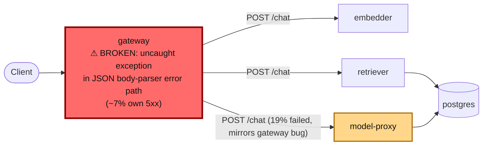

# Postmortem: gateway availability error budget burning fast (2% of the 28d budget in 1h; 5m & 1h windows)

- **Status:** open
- **Severity:** sev1
- **Verified:** no
- **Opened:** 2026-08-12 13:43:42Z
- **Resolved:** (still open)

## Timeline (machine-generated)

All times UTC on 2026-08-12 unless a full date is shown.

| Time (UTC) | Source | Event |
| --- | --- | --- |
| 13:20:18Z | deploy:ci | CI run #119 success on tenant-rename-and-oncall-spine: obs: agents: keep the read-only cluster window through runbook narrowing |
| 13:21:25Z | deploy:ci | CI run #120 success on main: obs: Merge pull request 'Tenant rename (acme -> test-bench) + oncall keeps its cluster eyes' (#72) from tenant-rename-an |
| 13:22:15Z | k8s | Pod/retriever-d6d55bf7f-fvxvl: Pulled |
| 13:22:15Z | k8s | Pod/retriever-d6d55bf7f-bw66r: Started |
| 13:22:15Z | k8s | Pod/retriever-d6d55bf7f-bw66r: Pulled |
| 13:36:39Z | deploy:ci | CI run #121 success on artifact-panel-maximize: obs: web: let the artifact panel expand inside the app layout |
| 13:37:25Z | k8s | Pod/gateway-dd85945b4-lvg8w: Killing |
| 13:37:25Z | k8s | Pod/gateway-dd85945b4-hw5fg: Killing |
| 13:37:25Z | k8s | Pod/gateway-dd85945b4-f9rwq: Killing |
| 13:37:25Z | k8s | Pod/gateway-dd85945b4-bnt4c: Killing |
| 13:37:25Z | k8s | ReplicaSet/gateway-dd85945b4: SuccessfulCreate |
| 13:37:25Z | k8s | Pod/gateway-dd85945b4-qd4m2: Scheduled |
| 13:37:25Z | k8s | Pod/gateway-dd85945b4-pvwth: Scheduled |
| 13:37:25Z | k8s | Pod/gateway-dd85945b4-4cz2r: FailedScheduling |
| 13:37:25Z | k8s | Pod/gateway-dd85945b4-wk2fh: Scheduled |
| 13:37:27Z | k8s | Pod/gateway-dd85945b4-wk2fh: Started |
| 13:37:27Z | k8s | Pod/gateway-dd85945b4-wk2fh: Pulled |
| 13:37:27Z | k8s | Pod/gateway-dd85945b4-wk2fh: Created |
| 13:37:27Z | k8s | Pod/gateway-dd85945b4-qd4m2: Started |
| 13:37:27Z | k8s | Pod/gateway-dd85945b4-qd4m2: Pulled |
| 13:37:27Z | k8s | Pod/gateway-dd85945b4-qd4m2: Created |
| 13:37:27Z | k8s | Pod/gateway-dd85945b4-pvwth: Started |
| 13:37:27Z | k8s | Pod/gateway-dd85945b4-pvwth: Pulled |
| 13:37:27Z | k8s | Pod/gateway-dd85945b4-pvwth: Created |
| 13:37:27Z | k8s | Pod/gateway-dd85945b4-4cz2r: Scheduled |
| 13:37:28Z | k8s | Pod/gateway-dd85945b4-4cz2r: Started |
| 13:37:28Z | k8s | Pod/gateway-dd85945b4-4cz2r: Pulled |
| 13:37:28Z | k8s | Pod/gateway-dd85945b4-4cz2r: Created |
| 13:40:11Z | log-spike | log-spike onset: [gateway] unhandled error: 16 \| } |
| 13:43:10Z | alert | alert firing: SLO gateway availability — fast burn |
| 13:46:59Z | k8s | Pod/gateway-dd85945b4-wk2fh: Killing |
| 13:46:59Z | k8s | ReplicaSet/gateway-dd85945b4: SuccessfulDelete |
| 13:46:59Z | k8s | Rollout/gateway: ScalingReplicaSet |
| 13:46:59Z | k8s | Rollout/gateway: RolloutUpdated |
| 13:46:59Z | k8s | Rollout/gateway: RolloutNotCompleted |
| 13:46:59Z | k8s | Rollout/gateway: NewReplicaSetCreated |
| 13:47:00Z | k8s | ReplicaSet/gateway-6b8b46485d: SuccessfulCreate |
| 13:47:00Z | k8s | Rollout/gateway: ScalingReplicaSet |
| 13:47:00Z | k8s | Pod/gateway-6b8b46485d-5sx9q: Scheduled |
| 13:47:01Z | k8s | Pod/gateway-6b8b46485d-5sx9q: Started |
| 13:47:01Z | k8s | Pod/gateway-6b8b46485d-5sx9q: Pulled |
| 13:47:01Z | k8s | Pod/gateway-6b8b46485d-5sx9q: Created |
| 13:47:08Z | k8s | Rollout/gateway: RolloutStepCompleted |
| 13:47:11Z | k8s | Rollout/gateway: AnalysisRunRunning |
| 13:47:36Z | k8s | Pod/gateway-6b8b46485d-5sx9q: Killing |
| 13:47:36Z | k8s | AnalysisRun/gateway-6b8b46485d-23-1: AnalysisRunSuccessful |
| 13:47:36Z | k8s | ReplicaSet/gateway-6b8b46485d: SuccessfulDelete |
| 13:47:36Z | k8s | Rollout/gateway: ScalingReplicaSet |
| 13:47:36Z | k8s | Rollout/gateway: RolloutUpdated |
| 13:47:36Z | k8s | Rollout/gateway: NewReplicaSetCreated |
| 13:47:36Z | remediation | restart_workload gateway executed (run run_19ff636ee6b240) |
| 13:47:37Z | k8s | ReplicaSet/gateway-58796d57b: SuccessfulCreate |
| 13:47:37Z | k8s | Rollout/gateway: ScalingReplicaSet |
| 13:47:37Z | k8s | Pod/gateway-58796d57b-l82ch: Scheduled |
| 13:47:38Z | k8s | Pod/gateway-58796d57b-l82ch: Started |
| 13:47:38Z | k8s | Pod/gateway-58796d57b-l82ch: Pulled |
| 13:47:38Z | k8s | Pod/gateway-58796d57b-l82ch: Created |
| 13:47:44Z | k8s | Rollout/gateway: RolloutStepCompleted |
| 13:47:46Z | k8s | Rollout/gateway: AnalysisRunRunning |
| 13:49:47Z | k8s | Pod/gateway-dd85945b4-4cz2r: Killing |
| 13:49:47Z | k8s | ReplicaSet/gateway-dd85945b4: SuccessfulDelete |
| 13:49:47Z | k8s | AnalysisRun/gateway-58796d57b-24-1: MetricSuccessful |
| 13:49:47Z | k8s | AnalysisRun/gateway-58796d57b-24-1: AnalysisRunSuccessful |
| 13:49:47Z | k8s | Rollout/gateway: ScalingReplicaSet |
| 13:49:48Z | k8s | ReplicaSet/gateway-58796d57b: SuccessfulCreate |
| 13:49:48Z | k8s | Rollout/gateway: ScalingReplicaSet |
| 13:49:48Z | k8s | Pod/gateway-58796d57b-xxvqs: Scheduled |
| 13:49:49Z | k8s | Pod/gateway-58796d57b-xxvqs: Started |
| 13:49:49Z | k8s | Pod/gateway-58796d57b-xxvqs: Pulled |
| 13:49:49Z | k8s | Pod/gateway-58796d57b-xxvqs: Created |
| 13:49:56Z | k8s | Pod/gateway-dd85945b4-qd4m2: Killing |
| 13:49:56Z | k8s | ReplicaSet/gateway-dd85945b4: SuccessfulDelete |
| 13:49:56Z | k8s | Rollout/gateway: ScalingReplicaSet |
| 13:49:57Z | k8s | ReplicaSet/gateway-58796d57b: SuccessfulCreate |
| 13:49:57Z | k8s | Rollout/gateway: ScalingReplicaSet |
| 13:49:57Z | k8s | Pod/gateway-58796d57b-p76v5: Scheduled |
| 13:49:58Z | k8s | Pod/gateway-58796d57b-p76v5: Started |
| 13:49:58Z | k8s | Pod/gateway-58796d57b-p76v5: Pulled |
| 13:49:58Z | k8s | Pod/gateway-58796d57b-p76v5: Created |
| 13:50:04Z | k8s | Pod/gateway-dd85945b4-pvwth: Killing |
| 13:50:04Z | k8s | ReplicaSet/gateway-dd85945b4: SuccessfulDelete |
| 13:50:04Z | k8s | Rollout/gateway: ScalingReplicaSet |
| 13:50:05Z | k8s | ReplicaSet/gateway-58796d57b: SuccessfulCreate |
| 13:50:05Z | k8s | Rollout/gateway: ScalingReplicaSet |
| 13:50:05Z | k8s | Pod/gateway-58796d57b-nt8pp: Scheduled |
| 13:50:06Z | k8s | Pod/gateway-58796d57b-nt8pp: Started |
| 13:50:06Z | k8s | Pod/gateway-58796d57b-nt8pp: Pulled |
| 13:50:06Z | k8s | Pod/gateway-58796d57b-nt8pp: Created |
| 13:50:12Z | k8s | Rollout/gateway: RolloutCompleted |
| 13:52:08Z | k8s | Pod/gateway-58796d57b-nt8pp: Killing |
| 13:52:08Z | k8s | ReplicaSet/gateway-58796d57b: SuccessfulDelete |
| 13:52:08Z | k8s | Rollout/gateway: ScalingReplicaSet |
| 13:52:08Z | k8s | Rollout/gateway: RolloutUpdated |
| 13:52:08Z | k8s | Rollout/gateway: RolloutNotCompleted |
| 13:52:08Z | k8s | Rollout/gateway: NewReplicaSetCreated |
| 13:52:09Z | k8s | ReplicaSet/gateway-77cfb95667: SuccessfulCreate |
| 13:52:09Z | k8s | Rollout/gateway: ScalingReplicaSet |
| 13:52:09Z | k8s | Pod/gateway-77cfb95667-8lsdc: Scheduled |
| 13:52:10Z | k8s | Pod/gateway-77cfb95667-8lsdc: Started |
| 13:52:10Z | k8s | Pod/gateway-77cfb95667-8lsdc: Pulled |
| 13:52:10Z | k8s | Pod/gateway-77cfb95667-8lsdc: Created |
| 13:52:16Z | k8s | Rollout/gateway: RolloutStepCompleted |

## Evidence links

- [Loki — logs over the incident window](http://localhost:3001/explore?schemaVersion=1&panes=%7B%22pm%22%3A+%7B%22datasource%22%3A+%22loki%22%2C+%22queries%22%3A+%5B%7B%22refId%22%3A+%22A%22%2C+%22datasource%22%3A+%7B%22type%22%3A+%22loki%22%2C+%22uid%22%3A+%22loki%22%7D%2C+%22expr%22%3A+%22%7Bnamespace%3D%5C%22subject%5C%22%7D+%7C~+%5C%22%28%3Fi%29error%7Cfailed%5C%22%22%7D%5D%2C+%22range%22%3A+%7B%22from%22%3A+%221786542222938%22%2C+%22to%22%3A+%221786542784411%22%7D%7D%7D&orgId=1)
- [Mimir — metrics over the incident window](http://localhost:3001/explore?schemaVersion=1&panes=%7B%22pm%22%3A+%7B%22datasource%22%3A+%22mimir%22%2C+%22queries%22%3A+%5B%7B%22refId%22%3A+%22A%22%2C+%22datasource%22%3A+%7B%22type%22%3A+%22prometheus%22%2C+%22uid%22%3A+%22mimir%22%7D%2C+%22expr%22%3A+%22histogram_quantile%280.95%2C+sum%28rate%28http_server_duration_milliseconds_bucket%5B5m%5D%29%29+by+%28le%29%29%22%7D%5D%2C+%22range%22%3A+%7B%22from%22%3A+%221786542222938%22%2C+%22to%22%3A+%221786542784411%22%7D%7D%7D&orgId=1)

## Investigation context

**Runbook match (2):** `gateway-high-error-rate.md`, `stale-secret.md` — toolset narrowed to 13 tools: alert_status, deploy_history, kubectl_read, loki_query, mimir_query, publish_postmortem, request_approval, restart_workload, runbook_lookup, runbook_read, save_artifact, tempo_query, update_db_secret

Pre-check battery (as injected at run start)

## Pre-check leads

### recent_deploys — LEAD
2 deploy-window leads
- argo app platform: sync=OutOfSync health=Healthy (revision c025382ba170)
- argo app retriever: sync=OutOfSync health=Healthy (revision c025382ba170)

### kube_scan — LEAD
1 kube-scan lead
- event Pod/gateway-dd85945b4-4cz2r: FailedScheduling — 0/3 nodes are available: 1 node(s) had untolerated taint(s), 2 Insufficient memory. no new claims to deallocate, preemption: 0/3 node… (truncated)

### log_spike — LEAD
error/failed log rate 200/10min vs baseline 0/10min (200x baseline) — onset: [gateway] unhandled error: 16 |         } at 2026-08-12T13:40:11.226231+00:00
- error/failed log rate 200/10min vs baseline 0/10min (200x baseline) — onset: [gateway] unhandled error: 16 |         } at 2026-08-12T13:40:11.226231+00:00

### attribution — LEAD
errors concentrate on gateway → POST model-proxy (19.2%); time concentrates in cicd's own handler (~16.4s of 16.4s) over the last 10m — which is not necessarily the workload named on the alert:
- gateway: 7.1% of its OWN responses are 5xx (10m)
- model-proxy: 4.6% of its OWN responses are 5xx (10m)
- gateway → POST model-proxy: 19.2% of those outbound calls failed
- own-handler p95 (server p95 minus its slowest outbound call — a ranking, not a measurement): cicd ~16.4s of 16.4s end to end, gateway ~4.6s of 7.6s end to end, embedder ~3.0s of 3.0s end… (truncated)
- gateway → POST embedder: p95 3.0s outbound
- gateway → POST retriever: p95 2.9s outbound

### rollout_state — LEAD
1 rollout-state lead
- analysisrun for gateway (gateway-8444846b5f-21-1): Failed — Metric "canary-error-rate" assessed Failed due to failed (2) > failureLimit (1)

### secret_age — OK
Secret subject-db-credentials last modified 18d 14h ago (created 18d 14h ago).

## Narrative

## Summary

`SLO gateway availability — fast burn` fired for tenant `acme`. Attribution split the blame cleanly: gateway itself was returning 5xx from its own handler (7.1–7.2% of its own responses), not merely forwarding a downstream failure. Log evidence confirmed a code-level defect: gateway's request-body JSON parser hits an uncaught exception path instead of returning a graceful 400.

## Impact

~7% of all gateway requests across all 4 gateway pods returned 5xx (client-facing failure), for tenant `acme` and others sharing the gateway. The gateway→model-proxy call edge also failed at ~19% (a secondary symptom, see Root cause), pushing model-proxy's own apparent 5xx rate to ~4.6% even though model-proxy logged zero application-level errors of its own — it was rejecting malformed bodies at the framework layer, not failing internally.

## Root cause

Gateway's own JSON body-parsing/error-handling path is defective: logs show the sequence `error: Malformed JSON in request body` → source context `20 |           const message = "Malformed JSON in request body";` → `[gateway] unhandled error: 16 |         }`, i.e. the parser catches the malformed-JSON case, logs it, then falls through to an uncaught exception a few lines later instead of returning HTTP 400. That turns any malformed-body request into a 500, self-inflicted by gateway's own handler — confirming the runbook's third hypothesis ("the gateway itself is at fault") over the "downstream failing" and "expected 429 rate-limit" hypotheses.

This was NOT a fresh bad deploy: the running image (`obs-registry:5010/gateway:10f24bc`) had been unchanged for 18 days; the ReplicaSet `gateway-dd85945b4` pods that were serving traffic were simply rescheduled ~10 minutes before onset (a one-off `FailedScheduling`/insufficient-memory retry that resolved on its own — confirmed non-causal, pod memory usage post-recovery sat at ~100Mi against a 384Mi limit, no OOM events). It was also not the stale-secret hypothesis: the `secret_age` pre-check was clean (18d14h old, no rotation), and a targeted search for `"password authentication failed"` in gateway logs returned zero hits. A pre-check lead about a failed canary AnalysisRun (`gateway-8444846b5f-21-1`) was investigated and ruled a red herring: that ReplicaSet was 7d18h old, already scaled to zero, and ran the identical image tag — unrelated to this window.

## What fixed it

Per the gateway-high-error-rate runbook's mitigation path ("the gateway itself: only if step 1 blamed its own responses" — which it did), the gateway workload was rolling-restarted after a dry-run + operator approval. Argo Rollouts intercepted the restart as a new revision, ran a canary analysis that came back `AnalysisRunSuccessful`, and fully cut all 4 pods over to the new ReplicaSet. The "Malformed JSON" error stream stopped within moments of the restart landing and did not recur; gateway's 5xx rate decayed monotonically from ~7.2% to 0% and held at 0% across two consecutive checks after full pod cutover. At last check, `alert_status` for `SLO gateway availability — fast burn` still reported `active=true` despite the metric-level recovery — most likely because this is a fast-burn rule with a 5m/1h dual window and the 1h window is still integrating the earlier spike. Reporting this explicitly rather than assuming closure: telemetry recovery is confirmed, alert-level resolution was not observed by the time investigation concluded.

## Lessons

- The restart only reset in-process state; it did not patch the underlying defect. The JSON body-parsing error path in gateway needs a real code fix so a malformed body returns 400 and never falls through to an unhandled exception — otherwise this recurs the next time malformed-body traffic arrives.
- The `rollout_state` pre-check lead pointed at a stale, unrelated AnalysisRun failure from a scaled-to-zero ReplicaSet sharing the same image tag — a reminder that pre-check leads are a starting point, not evidence, and need independent confirmation (here, via `kubectl_read get replicasets` cross-checked against pod age/image).
- model-proxy's own 5xx metric moved in lockstep with gateway's outbound failures but its logs never recorded an application-level error — a useful tell that a downstream's apparent error rate can be entirely a mirror of an upstream's malformed traffic rather than its own bug.

