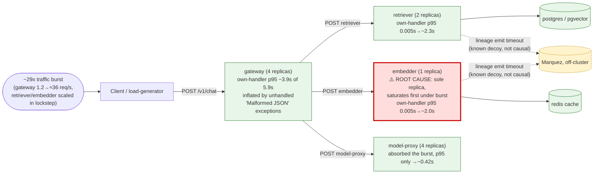

# Postmortem: gateway latency error budget burning fast (2% of the 28d budget in 1h; 5m & 1h windows)

- **Status:** resolved
- **Severity:** sev1
- **Verified:** no
- **Opened:** 2026-08-12 13:09:45Z
- **Resolved:** 2026-08-12 13:14:45Z

## Timeline (machine-generated)

All times UTC on 2026-08-12 unless a full date is shown.

| Time (UTC) | Source | Event |
| --- | --- | --- |
| 13:02:21Z | log-spike | log-spike onset: error: Malformed JSON in request body |
| 13:09:10Z | alert | alert firing: SLO gateway latency — fast burn |
| 13:13:10Z | alert | alert resolved: SLO gateway latency — fast burn |

## Evidence links

- [Loki — logs over the incident window](http://localhost:3001/explore?schemaVersion=1&panes=%7B%22pm%22%3A+%7B%22datasource%22%3A+%22loki%22%2C+%22queries%22%3A+%5B%7B%22refId%22%3A+%22A%22%2C+%22datasource%22%3A+%7B%22type%22%3A+%22loki%22%2C+%22uid%22%3A+%22loki%22%7D%2C+%22expr%22%3A+%22%7Bnamespace%3D%5C%22subject%5C%22%7D+%7C~+%5C%22%28%3Fi%29error%7Cfailed%5C%22%22%7D%5D%2C+%22range%22%3A+%7B%22from%22%3A+%221786540185742%22%2C+%22to%22%3A+%221786540485719%22%7D%7D%7D&orgId=1)
- [Mimir — metrics over the incident window](http://localhost:3001/explore?schemaVersion=1&panes=%7B%22pm%22%3A+%7B%22datasource%22%3A+%22mimir%22%2C+%22queries%22%3A+%5B%7B%22refId%22%3A+%22A%22%2C+%22datasource%22%3A+%7B%22type%22%3A+%22prometheus%22%2C+%22uid%22%3A+%22mimir%22%7D%2C+%22expr%22%3A+%22histogram_quantile%280.95%2C+sum%28rate%28http_server_duration_milliseconds_bucket%5B5m%5D%29%29+by+%28le%29%29%22%7D%5D%2C+%22range%22%3A+%7B%22from%22%3A+%221786540185742%22%2C+%22to%22%3A+%221786540485719%22%7D%7D%7D&orgId=1)

## Investigation context

**Runbook match:** none — no tool narrowing applied for this alert. Available runbooks: README.md, canary-abort.md, ci-pipeline-red.md, dq-freshness-stall.md, gateway-high-error-rate.md, k8s-crashloop.md, k8s-node-failure.md, snapshot-agent-audit.md, stale-secret.md

Pre-check battery (as injected at run start)

## Pre-check leads

### recent_deploys — LEAD
No deploy in the last 60m — rule out the reflex answer.
- No deploy in the last 60m — rule out the reflex answer.

### log_spike — LEAD
error/failed log rate 200/10min vs baseline 0/10min (200x baseline) — onset: error: Malformed JSON in request body at 2026-08-12T13:02:21.159278+00:00
- error/failed log rate 200/10min vs baseline 0/10min (200x baseline) — onset: error: Malformed JSON in request body at 2026-08-12T13:02:21.159278+00:00

### attribution — LEAD
errors concentrate on gateway → POST retriever (65.2%); time concentrates in gateway's own handler (~3.9s of 5.9s) over the last 10m — which is not necessarily the workload named on the alert:
- retriever: 61.1% of its OWN responses are 5xx (10m)
- gateway: 60.0% of its OWN responses are 5xx (10m)
- model-proxy: 3.1% of its OWN responses are 5xx (10m)
- gateway → POST retriever: 65.2% of those outbound calls failed
- gateway → POST model-proxy: 15.4% of those outbound calls failed
- own-handler p95 (server p95 minus its slowest outbound call — a ranking, not a measurement): gateway ~3.9s of 5.9s end to end, embedder ~2.0s of 2.0s end to end, retriever ~1.8s of 1.8s end to end
- gateway → POST embedder: p95 2.0s outbound
- gateway → POST retriever: p95 1.8s outbound

### kube_scan — UNAVAILABLE
error: You must be logged in to the server (Unauthorized)

### rollout_state — UNAVAILABLE
gateway: E0812 15:09:46.074236   11952 memcache.go:265] "Unhandled Error" err="couldn't get current server API group list: the server has asked for the client to provide credentials"
E0812 15:09:46.146439   11952 memcache.go:265] "Unhandled Error" err="couldn't get current server API group list: the server has asked for the client to provide credentials"
E0812 15:09:46.209862   11952 memcache.go:265] "Unhandled Error" err="couldn't get current server API group list: the server has asked for the client to; gateway analysis: E0812 15:09:46.073286   22552 memcache.go:265] "Unhandled Error" err="couldn't get current server API group list: the server has asked for the client to provide credentials"
E0812 15:09:46.142685   22552 memcache.go:265] "Unhandled Error"
… (section truncated)

### secret_age — UNAVAILABLE
error: You must be logged in to the server (Unauthorized)

## Narrative

## Summary
A "gateway latency — fast burn" SLO alert fired after gateway's server-side p95 latency rose from a ~4.75ms baseline to a peak of ~7.55s. The cause was a sharp, self-limited traffic burst (~29x gateway's normal request rate, mirrored proportionally in retriever and embedder) that saturated the fan-out's most thinly provisioned workload first. The burst had already fully drained and every metric was back at baseline before any remediation was applied, and `alert_status` reported the alert no longer active by the time a fix was proposed.

## Impact
During the burst window, gateway's own 5xx rate reached ~52% and retriever's reached ~54% of their own responses, with the gateway→retriever call edge failing ~58% of the time and gateway→model-proxy ~15%. Gateway p95 latency peaked at ~7.55s against a ~4.75ms baseline (>1500x), which the alert annotation quantified as ~2% of the 28-day error budget burned in under an hour. model-proxy was comparatively unaffected (p95 rose only to ~0.42s, 5xx ~3%) — it has 4 replicas.

## Root cause
`mimir_query` on `request_duration_seconds_count{service="gateway"}` showed gateway's request rate jump from a steady ~1.2 req/s baseline to a peak of ~35.65 req/s (~29x), and the same query against retriever/embedder showed their request rates scaling in the same proportion in lockstep (retriever 0.6→33 req/s, embedder 0.3→33 req/s) — one shared upstream traffic event, not an independent per-service fault.

Applying the matched runbook's (`gateway-high-error-rate.md`) own-handler-vs-outbound-call attribution showed embedder's and retriever's *entire* latency increase sat in their own handlers (embedder ~2.0s of 2.0s total server p95, retriever ~1.8s of 1.8s) rather than in a downstream call — they were queueing/serializing work under load, not blocked on a dependency. `container_memory_working_set_bytes{namespace="subject"}` showed embedder running as a **single replica** (`embedder-596696c46d-s25xc`) versus gateway's 4 and retriever's 2 — the least concurrency headroom of any workload in the path, and consistent with it being first to saturate once volume jumped ~29x.

Gateway's own overhead was separately the single largest slice of its own total p95 (~3.9s of a ~5.9s snapshot). `loki_query` against gateway logs showed a concurrent flood of `error: Malformed JSON in request body` / `[gateway] unhandled error` lines (~200x baseline), i.e. gateway's JSON body-parsing failure path was hit hard during the burst and handled as an unhandled exception rather than a clean 400 — inflating both gateway's own-handler latency and its 5xx rate on top of the downstream saturation.

Two candidate causes were checked and ruled out:
- **Deploy**: `deploy_history`, `grafana_annotations` (tag=deployment, 6h window), and `gitea_ci_runs` (last CI run 2026-08-05) all showed nothing near the incident window — no bad deploy.
- **OpenLineage/Marquez timeout**: retriever/embedder logs did show `"lineage emit failed" ... "The operation timed out."` warnings. This is the known, standing "lineage broken in k8s mode" issue (per-request emit to an off-cluster Marquez over Tailscale). It was ruled out as causal here: occurrence volume was a handful of events, not proportional to the 29x request-rate spike, and each warning's START/COMPLETE log pair landed only milliseconds apart — meaning the emit fails fast rather than blocking the request for the ~2s observed in embedder/retriever's own-handler latency. It is a decoy, not the cause.

No OOM kills, pod restarts, or crashloops were observed (`k8s_events` empty for the namespace over 1h), and post-recovery CPU usage was 1-3% of a core with memory ~90-120MiB per pod — this was a concurrency/replica-count capacity problem exposed by a burst, not a resource-limit breach or code regression.

## What fixed it
Nothing was applied — the burst was transient and had already fully drained by the time telemetry was queried: gateway request rate was back at ~1.2 req/s, every service's p95 was back at ~4.75ms, 5xx rate was 0% across gateway/model-proxy/retriever, and `alert_status` reported the alert no longer active before any remediation was attempted.

I proposed a preventive fix consistent with the runbook's guidance to act on the workload that actually saturated ("resources... scale_deployment on that workload, not on the gateway"): scale `embedder` from 1 to 3 replicas to give it headroom against the next burst. This was dry-run only (`spec.replicas: 1 -> 3`, action_id `9273abd3556bfb42`) and submitted for approval. **The operator denied the request.** Per instructions, the scale-up was not applied and was not retried. embedder remains at 1 replica.

## Lessons
- embedder is the shallowest-provisioned workload in the request fan-out (1 replica vs. gateway's 4, retriever's 2, model-proxy's 4) and was the first to saturate under burst load; it remains a standing capacity risk for the next burst since the proposed scale-up was declined this time — worth a deliberate, non-paged conversation about right-sizing it.
- Gateway's JSON body-parse failure path throws an unhandled exception instead of returning a clean 400; under a burst of malformed request bodies this inflates both gateway's own-handler latency and its 5xx rate. Worth hardening independent of this incident.
- The OpenLineage "lineage emit failed" timeout warning is a recurring decoy in this environment (known, standing Marquez-over-Tailscale connectivity gap). It can be ruled out quickly by checking whether its occurrence rate actually tracks the incident's traffic/latency curve (here it didn't) and whether its START/COMPLETE log pairs are far apart in time (blocking) or milliseconds apart (fail-fast, non-blocking) — here they were milliseconds apart.
- No runbook matched this exact alertname; `gateway-high-error-rate.md`'s attribution method (own-handler vs. outbound-call p95 by service, by-dependency-edge client error rate) transferred cleanly to a latency-burn alert and is worth cross-linking from a dedicated `gateway-latency-burn` runbook.
