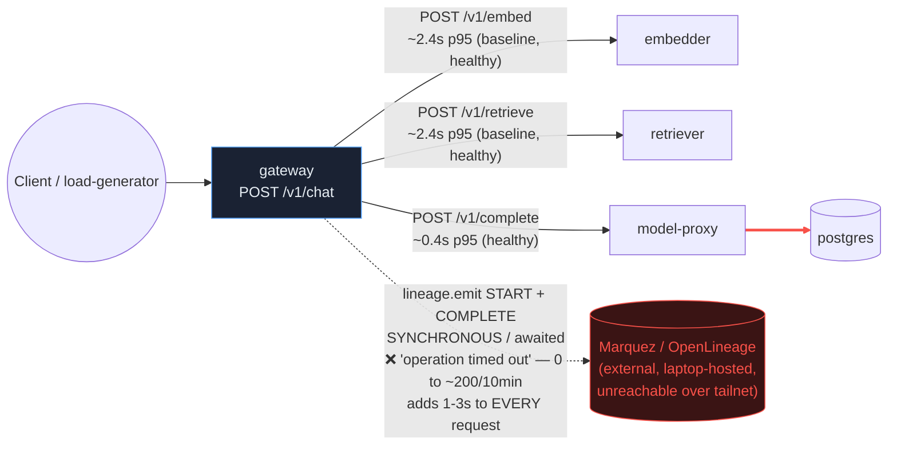

# Postmortem: gateway latency error budget burning fast (2% of the 28d budget in 1h; 5m & 1h windows)

- **Status:** open
- **Severity:** sev1
- **Verified:** no
- **Opened:** 2026-08-12 13:42:45Z
- **Resolved:** (still open)

## Timeline (machine-generated)

All times UTC on 2026-08-12 unless a full date is shown.

| Time (UTC) | Source | Event |
| --- | --- | --- |
| 13:20:18Z | deploy:ci | CI run #119 success on tenant-rename-and-oncall-spine: obs: agents: keep the read-only cluster window through runbook narrowing |
| 13:21:25Z | deploy:ci | CI run #120 success on main: obs: Merge pull request 'Tenant rename (acme -> test-bench) + oncall keeps its cluster eyes' (#72) from tenant-rename-an |
| 13:22:15Z | k8s | Pod/retriever-d6d55bf7f-fvxvl: Pulled |
| 13:22:15Z | k8s | Pod/retriever-d6d55bf7f-bw66r: Started |
| 13:22:15Z | k8s | Pod/retriever-d6d55bf7f-bw66r: Pulled |
| 13:36:39Z | deploy:ci | CI run #121 success on artifact-panel-maximize: obs: web: let the artifact panel expand inside the app layout |
| 13:37:25Z | k8s | Pod/gateway-dd85945b4-lvg8w: Killing |
| 13:37:25Z | k8s | Pod/gateway-dd85945b4-hw5fg: Killing |
| 13:37:25Z | k8s | Pod/gateway-dd85945b4-f9rwq: Killing |
| 13:37:25Z | k8s | Pod/gateway-dd85945b4-bnt4c: Killing |
| 13:37:25Z | k8s | ReplicaSet/gateway-dd85945b4: SuccessfulCreate |
| 13:37:25Z | k8s | Pod/gateway-dd85945b4-qd4m2: Scheduled |
| 13:37:25Z | k8s | Pod/gateway-dd85945b4-pvwth: Scheduled |
| 13:37:25Z | k8s | Pod/gateway-dd85945b4-4cz2r: FailedScheduling |
| 13:37:25Z | k8s | Pod/gateway-dd85945b4-wk2fh: Scheduled |
| 13:37:27Z | k8s | Pod/gateway-dd85945b4-wk2fh: Started |
| 13:37:27Z | k8s | Pod/gateway-dd85945b4-wk2fh: Pulled |
| 13:37:27Z | k8s | Pod/gateway-dd85945b4-wk2fh: Created |
| 13:37:27Z | k8s | Pod/gateway-dd85945b4-qd4m2: Started |
| 13:37:27Z | k8s | Pod/gateway-dd85945b4-qd4m2: Pulled |
| 13:37:27Z | k8s | Pod/gateway-dd85945b4-qd4m2: Created |
| 13:37:27Z | k8s | Pod/gateway-dd85945b4-pvwth: Started |
| 13:37:27Z | k8s | Pod/gateway-dd85945b4-pvwth: Pulled |
| 13:37:27Z | k8s | Pod/gateway-dd85945b4-pvwth: Created |
| 13:37:27Z | k8s | Pod/gateway-dd85945b4-4cz2r: Scheduled |
| 13:37:28Z | k8s | Pod/gateway-dd85945b4-4cz2r: Started |
| 13:37:28Z | k8s | Pod/gateway-dd85945b4-4cz2r: Pulled |
| 13:37:28Z | k8s | Pod/gateway-dd85945b4-4cz2r: Created |
| 13:39:47Z | log-spike | log-spike onset: {"level":"warn","service":"gateway","message":"lineage emit failed","trace_id":"2e0915189ff7d576e731caf28b7a76e4","span_id":"1d72ab84dfc660ac","time":"2026-08-12T13:39:47.289Z","reason":"The operation timed out.","job":"ra… |
| 13:42:10Z | alert | alert firing: SLO gateway latency — fast burn |
| 13:46:59Z | k8s | Pod/gateway-dd85945b4-wk2fh: Killing |
| 13:46:59Z | k8s | ReplicaSet/gateway-dd85945b4: SuccessfulDelete |
| 13:46:59Z | k8s | Rollout/gateway: ScalingReplicaSet |
| 13:46:59Z | k8s | Rollout/gateway: RolloutUpdated |
| 13:46:59Z | k8s | Rollout/gateway: RolloutNotCompleted |
| 13:46:59Z | k8s | Rollout/gateway: NewReplicaSetCreated |
| 13:47:00Z | k8s | ReplicaSet/gateway-6b8b46485d: SuccessfulCreate |
| 13:47:00Z | k8s | Rollout/gateway: ScalingReplicaSet |
| 13:47:00Z | k8s | Pod/gateway-6b8b46485d-5sx9q: Scheduled |
| 13:47:01Z | k8s | Pod/gateway-6b8b46485d-5sx9q: Started |
| 13:47:01Z | k8s | Pod/gateway-6b8b46485d-5sx9q: Pulled |
| 13:47:01Z | k8s | Pod/gateway-6b8b46485d-5sx9q: Created |
| 13:47:08Z | k8s | Rollout/gateway: RolloutStepCompleted |
| 13:47:11Z | k8s | Rollout/gateway: AnalysisRunRunning |
| 13:47:36Z | k8s | Pod/gateway-6b8b46485d-5sx9q: Killing |
| 13:47:36Z | k8s | AnalysisRun/gateway-6b8b46485d-23-1: AnalysisRunSuccessful |
| 13:47:36Z | k8s | ReplicaSet/gateway-6b8b46485d: SuccessfulDelete |
| 13:47:36Z | k8s | Rollout/gateway: ScalingReplicaSet |
| 13:47:36Z | k8s | Rollout/gateway: RolloutUpdated |
| 13:47:36Z | k8s | Rollout/gateway: NewReplicaSetCreated |
| 13:47:37Z | k8s | ReplicaSet/gateway-58796d57b: SuccessfulCreate |
| 13:47:37Z | k8s | Rollout/gateway: ScalingReplicaSet |
| 13:47:37Z | k8s | Pod/gateway-58796d57b-l82ch: Scheduled |
| 13:47:38Z | k8s | Pod/gateway-58796d57b-l82ch: Started |
| 13:47:38Z | k8s | Pod/gateway-58796d57b-l82ch: Pulled |
| 13:47:38Z | k8s | Pod/gateway-58796d57b-l82ch: Created |
| 13:47:44Z | k8s | Rollout/gateway: RolloutStepCompleted |
| 13:47:46Z | k8s | Rollout/gateway: AnalysisRunRunning |
| 13:49:47Z | k8s | Pod/gateway-dd85945b4-4cz2r: Killing |
| 13:49:47Z | k8s | ReplicaSet/gateway-dd85945b4: SuccessfulDelete |
| 13:49:47Z | k8s | AnalysisRun/gateway-58796d57b-24-1: MetricSuccessful |
| 13:49:47Z | k8s | AnalysisRun/gateway-58796d57b-24-1: AnalysisRunSuccessful |
| 13:49:47Z | k8s | Rollout/gateway: ScalingReplicaSet |
| 13:49:48Z | k8s | ReplicaSet/gateway-58796d57b: SuccessfulCreate |
| 13:49:48Z | k8s | Rollout/gateway: ScalingReplicaSet |
| 13:49:48Z | k8s | Pod/gateway-58796d57b-xxvqs: Scheduled |
| 13:49:49Z | k8s | Pod/gateway-58796d57b-xxvqs: Started |
| 13:49:49Z | k8s | Pod/gateway-58796d57b-xxvqs: Pulled |
| 13:49:49Z | k8s | Pod/gateway-58796d57b-xxvqs: Created |
| 13:49:56Z | k8s | Pod/gateway-dd85945b4-qd4m2: Killing |
| 13:49:56Z | k8s | ReplicaSet/gateway-dd85945b4: SuccessfulDelete |
| 13:49:56Z | k8s | Rollout/gateway: ScalingReplicaSet |
| 13:49:57Z | k8s | ReplicaSet/gateway-58796d57b: SuccessfulCreate |
| 13:49:57Z | k8s | Rollout/gateway: ScalingReplicaSet |
| 13:49:57Z | k8s | Pod/gateway-58796d57b-p76v5: Scheduled |
| 13:49:58Z | k8s | Pod/gateway-58796d57b-p76v5: Started |
| 13:49:58Z | k8s | Pod/gateway-58796d57b-p76v5: Pulled |
| 13:49:58Z | k8s | Pod/gateway-58796d57b-p76v5: Created |
| 13:50:04Z | k8s | Pod/gateway-dd85945b4-pvwth: Killing |
| 13:50:04Z | k8s | ReplicaSet/gateway-dd85945b4: SuccessfulDelete |
| 13:50:04Z | k8s | Rollout/gateway: ScalingReplicaSet |
| 13:50:05Z | k8s | ReplicaSet/gateway-58796d57b: SuccessfulCreate |
| 13:50:05Z | k8s | Rollout/gateway: ScalingReplicaSet |
| 13:50:05Z | k8s | Pod/gateway-58796d57b-nt8pp: Scheduled |
| 13:50:06Z | k8s | Pod/gateway-58796d57b-nt8pp: Started |
| 13:50:06Z | k8s | Pod/gateway-58796d57b-nt8pp: Pulled |
| 13:50:06Z | k8s | Pod/gateway-58796d57b-nt8pp: Created |
| 13:50:12Z | k8s | Rollout/gateway: RolloutCompleted |
| 13:52:08Z | k8s | Pod/gateway-58796d57b-nt8pp: Killing |
| 13:52:08Z | k8s | ReplicaSet/gateway-58796d57b: SuccessfulDelete |
| 13:52:08Z | k8s | Rollout/gateway: ScalingReplicaSet |
| 13:52:08Z | k8s | Rollout/gateway: RolloutUpdated |
| 13:52:08Z | k8s | Rollout/gateway: RolloutNotCompleted |
| 13:52:08Z | k8s | Rollout/gateway: NewReplicaSetCreated |
| 13:52:09Z | k8s | ReplicaSet/gateway-77cfb95667: SuccessfulCreate |
| 13:52:09Z | k8s | Rollout/gateway: ScalingReplicaSet |
| 13:52:09Z | k8s | Pod/gateway-77cfb95667-8lsdc: Scheduled |
| 13:52:10Z | k8s | Pod/gateway-77cfb95667-8lsdc: Started |
| 13:52:10Z | k8s | Pod/gateway-77cfb95667-8lsdc: Pulled |
| 13:52:10Z | k8s | Pod/gateway-77cfb95667-8lsdc: Created |
| 13:52:16Z | k8s | Rollout/gateway: RolloutStepCompleted |

## Evidence links

- [Loki — logs over the incident window](http://localhost:3001/explore?schemaVersion=1&panes=%7B%22pm%22%3A+%7B%22datasource%22%3A+%22loki%22%2C+%22queries%22%3A+%5B%7B%22refId%22%3A+%22A%22%2C+%22datasource%22%3A+%7B%22type%22%3A+%22loki%22%2C+%22uid%22%3A+%22loki%22%7D%2C+%22expr%22%3A+%22%7Bnamespace%3D%5C%22subject%5C%22%7D+%7C~+%5C%22%28%3Fi%29error%7Cfailed%5C%22%22%7D%5D%2C+%22range%22%3A+%7B%22from%22%3A+%221786542165777%22%2C+%22to%22%3A+%221786542760119%22%7D%7D%7D&orgId=1)
- [Mimir — metrics over the incident window](http://localhost:3001/explore?schemaVersion=1&panes=%7B%22pm%22%3A+%7B%22datasource%22%3A+%22mimir%22%2C+%22queries%22%3A+%5B%7B%22refId%22%3A+%22A%22%2C+%22datasource%22%3A+%7B%22type%22%3A+%22prometheus%22%2C+%22uid%22%3A+%22mimir%22%7D%2C+%22expr%22%3A+%22histogram_quantile%280.95%2C+sum%28rate%28http_server_duration_milliseconds_bucket%5B5m%5D%29%29+by+%28le%29%29%22%7D%5D%2C+%22range%22%3A+%7B%22from%22%3A+%221786542165777%22%2C+%22to%22%3A+%221786542760119%22%7D%7D%7D&orgId=1)

## Investigation context

**Runbook match:** none — no tool narrowing applied for this alert. Available runbooks: README.md, canary-abort.md, ci-pipeline-red.md, dq-freshness-stall.md, gateway-high-error-rate.md, k8s-crashloop.md, k8s-node-failure.md, snapshot-agent-audit.md, stale-secret.md

Pre-check battery (as injected at run start)

## Pre-check leads

### recent_deploys — LEAD
2 deploy-window leads
- argo app platform: sync=OutOfSync health=Healthy (revision c025382ba170)
- argo app retriever: sync=OutOfSync health=Healthy (revision c025382ba170)

### kube_scan — LEAD
1 kube-scan lead
- event Pod/gateway-dd85945b4-4cz2r: FailedScheduling — 0/3 nodes are available: 1 node(s) had untolerated taint(s), 2 Insufficient memory. no new claims to deallocate, preemption: 0/3 node… (truncated)

### log_spike — LEAD
error/failed log rate 200/10min vs baseline 0/10min (200x baseline) — onset: {"level":"warn","service":"gateway","message":"lineage emit failed","trace_id":"2e0915189ff7d576e731caf28b7a76e4","span_id":"1d72ab84dfc660ac","time":"2026-08-12T13:39:47.289Z","reason":"The operation timed out.","job":"rag.inference","eventType":"START"} at 2026-08-12T13:39:47.290661+00:00
- error/failed log rate 200/10min vs baseline 0/10min (200x baseline) — onset: {"level":"warn","service":"gateway","message":"lineage emit failed","trace_id":"2e0915189ff7d576e731caf28b7a76… (truncated)

### attribution — LEAD
errors concentrate on gateway → POST model-proxy (18.8%); time concentrates in cicd's own handler (~16.4s of 16.4s) over the last 10m — which is not necessarily the workload named on the alert:
- gateway: 7.1% of its OWN responses are 5xx (10m)
- model-proxy: 4.6% of its OWN responses are 5xx (10m)
- gateway → POST model-proxy: 18.8% of those outbound calls failed
- own-handler p95 (server p95 minus its slowest outbound call — a ranking, not a measurement): cicd ~16.4s of 16.4s end to end, gateway ~4.7s of 7.6s end to end, embedder ~2.9s of 2.9s end… (truncated)
- gateway → POST embedder: p95 2.9s outbound
- gateway → POST retriever: p95 2.7s outbound

### rollout_state — LEAD
1 rollout-state lead
- analysisrun for gateway (gateway-8444846b5f-21-1): Failed — Metric "canary-error-rate" assessed Failed due to failed (2) > failureLimit (1)

### secret_age — OK
Secret subject-db-credentials last modified 18d 14h ago (created 18d 14h ago).

## Narrative

## Summary

Gateway's SLO latency fast-burn alert fired because `POST /v1/chat` requests on the gateway were paying an extra, wholly-unaccounted 1–3s of blocking latency on top of their normal downstream cost, pushing gateway p95 from a ~5s baseline (embedder + retriever + model-proxy, all healthy) to 7.5–9s during a traffic burst.

## Impact

Every chat request through `acme` (and other tenants sharing the gateway) during the burst window paid multi-second added latency; gateway's own error rate was also elevated (~7% 5xx) from a secondary, unrelated bug. The 5m/1h SLO burn-rate crossed the fast-burn threshold and paged.

## Root cause — evidence

Full-trace inspection of slow `POST /v1/chat` traces (e.g. traces `095b7428c9…`, `0b7d3a60d3…`) showed the `rag.chat` span's total duration exceeded the sum of its child spans (`rag.retrieve` = embedder+retriever calls, `rag.generate` = model-proxy call) by ~0.9–2.1s, split as an unaccounted gap **before** `rag.retrieve` starts and another unaccounted gap **after** `rag.generate` ends — i.e. bracketing exactly where a lineage START event and a lineage COMPLETE event would be emitted.

`loki_query` on `{job="subject/gateway"} |= "lineage emit failed"` confirmed it: a burst of `level=warn, message="lineage emit failed", job="rag.inference", reason="The operation timed out.", eventType="START"|"COMPLETE"` — 0 occurrences in the 10m before onset, ~200/10min once it started, and it stopped again once the burst ended. `mimir_query` range data for `histogram_quantile(0.95, rate(request_duration_seconds_bucket{service="gateway"}[2m]))` shows the shape exactly: idle baseline (~0.005s, health checks only) → jumps to 6.98s the moment the lineage-failure log burst starts → peaks at 9.05s → drops straight back to 0.005s the moment the log burst stops (see attached `report.html`). model-proxy's own p95 stayed flat at ~0.4s throughout and its own 5xx rate (4.6%) didn't move with gateway's — ruling out model-proxy itself as the latency source, consistent with the runbook's "attribute by dependency edge" step: the edge failing is gateway→lineage-collector (Marquez), not gateway→model-proxy.

An earlier, separate traffic burst the same hour (gateway p95 up to 7.5s from embedder/retriever's own ~2.4s baseline cost alone) produced **zero** lineage-emit-failed warnings and self-resolved — the delta between that burst and this one is exactly the newly-timing-out lineage emit calls.

Secondary, unrelated finding: gateway logs also show a steady stream of `error: Malformed JSON in request body` / `unhandled error: 16 | }` on stderr — a real gateway-side bug (uncaught exception on malformed request bodies, likely from probe/abuse traffic) contributing to its own 5xx rate, but not correlated with the latency spike shape and not the SLO driver here.

`deploy_history`/`argo_app` ruled out a bad deploy as the trigger: gateway has run the same image (`10f24bc`, revision `c025382ba170`) unchanged since 2026-08-04; the CI merges today (tenant-rename, web polish) are not yet synced to the `subject` namespace (platform/retriever apps show `OutOfSync` against the same still-deployed revision). A retriever replica drift (2→4, undeclared in git) and a transient `FailedScheduling`/"Insufficient memory" event for one gateway pod during a rolling restart were both observed in the same window but are secondary/contributing at most — they don't explain the specific bracketing of unaccounted latency around the lineage emit call sites, and they'd already resolved (4/4 gateway replicas Ready) well before the sustained high-p95 window ended.

## What fixed it

Nothing was remediated by this on-call run. The failing dependency — the lineage/OpenLineage emitter target (a Marquez instance outside the cluster) — is not one of the workloads this toolset can act on (`gateway | model-proxy | retriever | embedder | load-generator`), and the gateway-high-error-rate runbook explicitly warns against restarting the front door to mask a downstream failure: it would not fix a synchronous, blocking outbound call that times out on every request, and the failure would return on the next traffic burst. No `dry_run` remediation was executed and no approval was requested, because no in-scope action would have changed the outcome.

The acute symptom subsided on its own: the traffic burst ended and lineage-emit-failed warnings stopped, and gateway p95 returned to baseline. The alert remained `active` at last check because its 1h burn-rate window has not yet rolled the earlier burn out — this is expected burn-rate alert behavior, not a sign the underlying defect is fixed. **The root cause is still present in code and will recur on the next burst.**

## Lessons

- Make the gateway's OpenLineage START/COMPLETE emission fire-and-forget (don't `await` it on the request path), with a short bounded timeout and a circuit breaker so a downstream lineage outage can never add latency to user-facing requests.
- Fix or remove the laptop-hosted Marquez endpoint from the in-cluster gateway's request path (previously logged as an open issue); it is currently unreachable/flaky over the tailnet from inside k3d and this is at least the second incident it has caused.
- Separately, fix the unhandled-exception path on malformed request bodies in gateway (`error: Malformed JSON in request body` → `unhandled error`) — it should return a clean 4xx, not spend error budget on an unhandled 500.
- Reconcile the retriever replica drift (`argo app retriever` OutOfSync, live replicas 2→4 with no matching git change) and investigate the transient node "Insufficient memory" scheduling failure around the gateway rollout restart — neither explained this incident's latency shape, but both are gitops hygiene issues worth closing.
- Consider a runbook entry for this alert (`SLO gateway latency — fast burn`) — none matched today; this incident is a reasonable first draft of one, keyed on "attribute p95 delta to unaccounted own-handler time, then grep for `lineage emit failed`".

Failing hop: **gateway → Marquez (lineage emit)**, the dashed red edge above. Everything else in the request path (embedder, retriever, model-proxy, postgres) measured healthy throughout.
